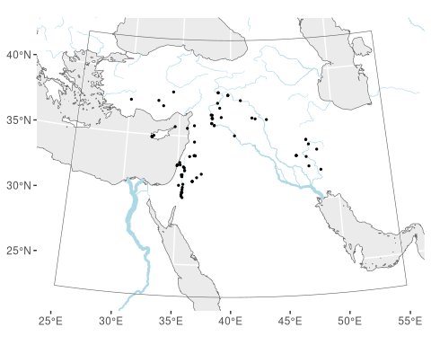
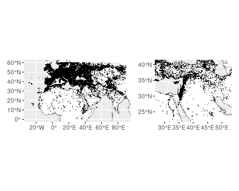
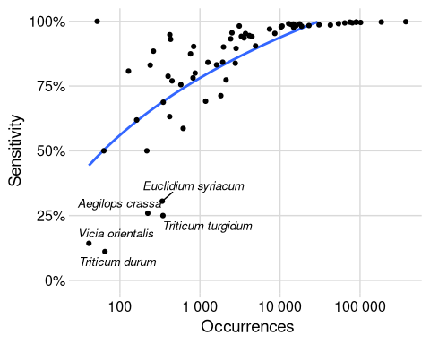
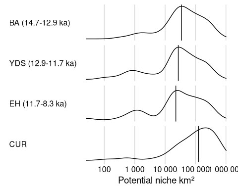
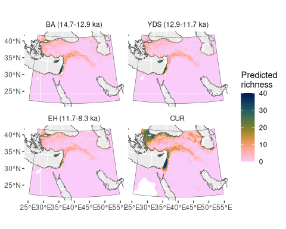
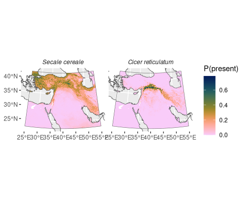
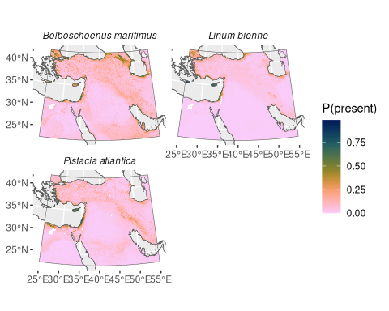
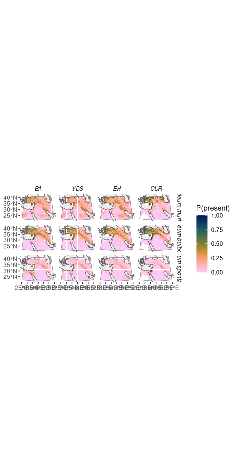
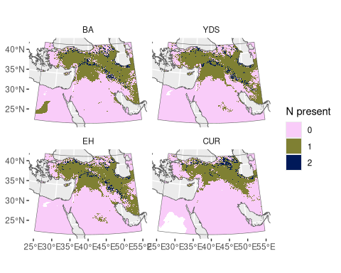
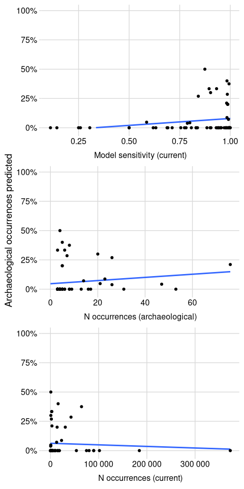

<!--
TODO before publication:
- [ ] Zenodo release
- [ ] Clean up package code
-->


::: {.cell}

:::


::: {.cell}

:::


::: {.cell}

:::


::: {.cell}

:::


::: {.cell}

:::


# Introduction

The Pleistocene–Holocene transition in West Asia marked a turning point in global environmental history, as humans brought the first plants under cultivation and began modifying surrounding ecosystems to support their own subsistence.
West Asia is part of the native range of a remarkable number of domesticable plant species, including wild relatives of wheat, barley, peas, lentils, and other crops of global importance [@HarlanZohary1966; @Diamond2002; @ZoharyEtAl2012].
These species supported uniquely dense and complex Late Epipalaeolithic (15–11.7 ka) societies [@BarYosef1998; @MaherEtAl2012] based on foraging [@HarrisHillman1989; @Colledge2001; @WeissEtAl2004] and eventually plant management and pre-domestication cultivation [@Colledge2001; @WeissEtAl2006; @Harris2007; @WillcoxEtAl2008].
The first agro-ecosystems emerged as these plants were domesticated in the Pre-Pottery Neolithic period (11.7–8.5 ka) and were shaped by the broader ecosystem in which it was embedded.

Decades of research in archaeobotany and zooarchaeology have reconstructed the subsistence economies of Late Epipalaeolithic and Neolithic sites in great detail.
Together with studies of other environmental archaeological records and a variety of palaeoclimate archives [@JonesEtAl2019], they also tell us much about the environments surrounding these settlements.
However, each of these sources of evidence is subject to the wide variety of taphonomic and recovery biases that are inherent in any direct record of the past.
They are also, by definition, records of the (human) environment at particular times and places.
Interpolating these snapshots to give a holistic picture of the regional ecologies is not straightforward – to date, it has tended to rely on non-explicit, inductive modelling.
The majority are also filtered through human action, producing a mixed single that makes it difficult to disentangle anthropic effects from the background of environmental change in this period of rapid climatic alteration.

In this paper we present a complementary, deductive approach based on ecological niche modelling.
Rather than inferring environmental conditions from preserved physical evidence, 
we predict the potential niche of individual species relevant to human subsistence based on a model of their current environmental niche and simulations of past palaeoclimate. 
Though hypothetical, this gives us an independent line of evidence on past ecologies that is independent of the environmental archaeological and palaeoclimatic records.
This means that the ancient data can be reserved for assessing the model's ability to 'hindcast' past conditions.
In this sense, discrepencies between the two records are perhaps the most interesting result, as they indicate processes affecting one or both records that are not fully accounted for and therefore generate new questions.
Our computational approach is also readily scaled up, allowing us to model spatially-explicit palaeodistributions for a large number of species, for the whole region, under multiple reconstructed climate scenarios.

# Background {#sec-bg}

The transition to agriculture represents one of the most fundamental changes in human history.
West Asia is one of the regions where this process has been studied in the most detail:
decades of research have traced the gradual development of a Neolithic way of life and the changes that occurred in the plant species and their geographical distribution as a result.
Although archaeobotanical assemblages can be biased due to issues of preservation, sampling, recovery techniques, and lab procedures [@Dennel1976; @HastorfPopper1988]—and although they include not just food remains but plant resources that were used for other purposes or arrived at the site accidentally [@HastorfPopper1988]—large-scale studies have still revealed coherent patterns in the exploitation of plants over time [@ColledgeEtAl2004; @ArranzOtaeguiEtAl2016].

The possibility of an abrupt, geographically-constrained process of plant domestication was proposed in the 1990s [@HillmanDavies1990; @HillmanDavies1992; @HeunEtAl1997; @OzkanEtAl2002] and developed as an explanatory model in the 2000s [@LevYadunEtAl2000; @GopherEtAl2001; @AbboEtAl2005].
As part of this model, some authors [@LevYadunEtAl2000; @GopherEtAl2001; @AbboEtAl2010; @AbboEtAl2012] argued that eight plant species, collectively referred to as 'founder crops' or the 'Neolithic crop package' [@ZoharyHopf1988] were selected and domesticated once, without any phase of pre-domestication cultivation [@AbboEtAl2011, p. 177].
This process could have been rapid under strong artificial selection [@HillmanDavies1990; @HillmanDavies1992] and may have occurred in a single region or 'core area' – generally located in southeast Turkey [@LadizinskyAdler1976; @HeunEtAl1997; @OzkanEtAl2002; @OzkanEtAl2005; @MoriEtAl2003; @LuoEtAl2007]. 
From this single point of origin, it was supposed that domesticated or semi-domesticated plants radiated outwards to other regions [@AbboEtAl2006; @KilianEtAl2007; @OzkanEtAl2011].

The 'short gestation' paradigm was challenged by others [@Helbaek1969; @Harris1989; @Kislev1989; @Colledge2001; @WeissEtAl2004; @WillcoxEtAl2008; @FullerEtAl2018]. 
Helbæk [in @Kirkbride1966] argued that before the appearance of domesticated plants, a phase of cultivation of wild seeds must have taken place. 
The existence of a phase of cultivation of morphologically wild cereals or 'pre-domestication cultivation' was identified in the archaeological record through the study of plant domestication traits such as grain size, shattering v. non-shattering rachises. 
The archaeobotanical evidence shows that during the Pre-Pottery Neolithic A (PPNA) cereals exhibited sizes similar to those recorded in domestic species, but their dispersal mechanism was still the same as the one present in morphologically-wild species [i.e. shattering, see @Kirkbride1966; @Kislev1989; @HillmanEtAl2001; @Colledge2001; @WillcoxEtAl2008].
This evidence suggested that wild cereal stands could have been cultivated for as much as a thousand years before non-shattering domestic forms became prevalent in the archaeological record [@TannoWillcox2006; @TannoWillcox2012; @ArranzOtaeguiEtAl2016].
Additional archaeobotanical [@Colledge2001; @WillcoxEtAl2008; @WillcoxEtAl2009; @RiehlEtAl2013; @ArranzOtaeguiEtAl2016; @WeideEtAl2018; @DoucheWillcox2018; @WhitlamEtAl2018] and genetic data [@BadrEtAl2000; @MolinaCanoEtAl2005; @KilianEtAl2007; @OzkanEtAl2011; @IobBotigue2023] in recent years has further challenged the short-gestation model to explain the origins of plant domestication and agriculture in West Asia. 

Similarly, the concept of a limited set of eight 'founder crops' [@ZoharyHopf1988] that were the first species cultivated, domesticated and then spread as the basis of Neolithic agricultural systems, is not supported by the latest evidence.
Our previous analyses of the composition of available archaeobotanical datasets shows that these crops were of marginal importance during the Epipalaeolithic period [@ArranzOtaeguiEtAl2018] and that Neolithic subsistence did not rely either solely or primarily on the exploitation of these species [@ArranzOtaeguiRoe2023]. 
Instead, multiple species of grasses, legumes, fruits, nuts, and other plants were exploited over the Late Pleistocene-Early Holocene transition in southwest Asia. 

## Biogeography and agricultural origins

The study of the natural distribution of the progenitors of domesticated crops has been a central part of discussions on the origins of agriculture and plant domestication from the beginning.
@Humboldt1807 acknowledged the importance of the natural distribution of wild species to explain the origin and domestication of crops like spelt and rye.
@Candolle1886 integrated the study of plant ecology and biogeography and influenced @Darwin1859, who later reflected in detail about the geographical distribution of plants and species diversity. 
At that time, there was intense debate about whether there were single or multiple "centres of creation" of species. 
Researchers aimed to evaluate whether plant and animal species emerged in the same locations where they were currently distributed. 

After Darwin, this early interest in crop origins evolved into more specific discussions about the "centres of plant domestication".
@Vavilov1926 was among the first to seek to determine the number of regions in which plants had been independently domesticated [@Harris1990].
His main method was 'differential phytogeography':
he classified the variation within a crop and established the regions of maximum diversity, to locate the geographic regions in which crops originated. 
Using this method, Vavilov suggested that there were at least eight centres of origin. 
His work was later criticised by @Harlan1971, who argued that 'centres of origin' and 'centres of diversity' had to be separated. 
For Harlan, a 'centre' was as an "area in which things originate and out of which things are dispersed" [@Harlan1971, p. 468], and he suggested that three main centres of origin of domesticated crops existed.
He further indicated that Vavilov's approach to the question was simplistic and that more data proxies had to be considered (e.g. archaeology, history, geology), an approach more in the tradition of @Candolle1886. 
Indeed, the inclusion of archaeobotany and genetics in the last decades, together with the study of wild relative distributions has been fundamental in characterising the origins of agriculture [@FullerColledge2008]. 
As a result of modern interdisciplinary studies, the number of recognised centres of plant domestication has increased considerably, from the three centres suggested by Harlan in 1971 to the six to eight centres argued for in the 1990s [@Smith1995] and up to as much as 24 potential centres reported in 2009 [@PuruggananFuller2009; see also @Fuller2010].

Biogeographic research into the centres of origin and/or domestication of crops has also long informed broader understanding of the process of agricultural origins.
In *Man Makes Himself*, @Childe1936 correctly located the centre of origin of European agriculture in the 'Fertile Crescent' of West Asia (unlike for example @Pumpelly1908 before him).
This was not based on the region's prehistoric archaeological record, which at the time had only been cursorily explored.
Instead he was guided to the region by biogeographic work by Vavilov and @PeakeFleure1927;
only later was this prediction validated by archaeological work on the Epipalaeolithic and Neolithic of Palestine [@Boyd2018].
In subsequent decades, the search for more precise origin zones of specific domestic plants relied on the assumption that "the locus of domestication of a wild plant would presumably be within its area of original distribution in the wild state" [@Butzer1971; paraphrasing @Helbaek1959] – and that this "natural habitat" has not changed significantly over the last 12,000 years [@Butzer1971].

Contemporary research on crop origins was pioneered by Harlan and Zohary, who compared the current distribution of the wild progenitors of domesticated plants in southwest Asia [@HarlanZohary1966; @Zohary1969; @Zohary1973; @ZoharyHopf1973] to the rapidly-expanding archaeobotanical record [@Harlan1971; @Harlan1977; see also @ZoharyHopf1988; @HarlanZohary1966].
They both were interested in evaluating which were the wild ancestors of domesticated crops and studying their natural distribution to understand their domestication process [@Zohary1969; @Zohary1973; @ZoharySpiegelRoy1975]. 
Indeed, the natural distribution of the wild relatives of domestic plant species was later used as a criterion to infer 'pre-domestic cultivation' in the archaeological record. 
For example, the presence of seeds of chickpea at Jericho led @Hopf1986 to interpret the remains as cultivars, as the natural distribution of the wild form of chickpea was located further to the north. 
The same rationale was applied to the einkorn remains found at several Pre-Pottery Neolithic sites in the southern Levant [@Hopf1969; @Colledge2001], as the wild progenitors of this species was thought to be restricted to the northern Levantine area [@HeunEtAl1997; @ZoharyEtAl2012]. 
The same idea—presence of plants outside their natural range—has been repeated in the literature more recently by several other authors [@TannoWillcox2006; @WillcoxEtAl2008; @HillmanEtAl2001]. 

Despite the importance of biogeography in the development and validation of hypotheses regarding the origins of agriculture, there have been few studies of the wild range of specific crop progenitors or other relevant plant species [cf. for domestic animals, e.g. @YeomansEtAl2017].
Observations regarding translocation or range expansion must therefore rely on a relatively rough and ahistoric notion of a species' 'natural distribution' – that is, one based primarily on contemporary or recent-historic occurrences.
Yet we know there has been considerable climatic and environmental change in West Asia since the terminal Pleistocene [@JonesEtAl2019], so it is very unlikely that these ranges were in fact static.
Reconstructions of broader environments have attempted to trace their fluctuations through time, either for the entire region [e.g. @VanZeistBottema1991; Hillman in @MooreEtAl2000] or parts of it [e.g. @Cordova2007], but these are at the level of the vegetation zone rather than individual species.
They also invariably rely on what might be called 'expert interpolation' (where the author composes a map based on his or her own knowledge of the relevant data) rather than an explicit modelling process.
This makes it difficult, if not impossible, for users of such reconstructions to understand exactly how they were derived or what could explain, for example, the significant discrepencies between the predictions of different experts.

## Ecological niche modelling in archaeology

Ecological niche modelling or species distribution modelling is widely used by ecologists to mathematically predict the geographic distribution of a species from a sample of occurrences [@FranklinMiller2009; @SilleroEtAl2021].
Essentially, it involves combining records of where an organism has been observed with environmental data (climate, topography, etc.) for those locations to model the range of environmental values at which that species  – its environmental niche.
This model can then be used to predict the potential niche of the organism in question either in the same or a different environment.
@TownsendPetersonSoberon2012 suggests reserving the term 'species distribution modelling' for when the method is used to recover the verifiable range of a species in a real and existing environment, and using 'ecological niche modelling' as the broader term covering hypothetical or predictive applications – a convention we follow here when referring to predictive or 'hindcast' models of past niches.
Within this overarching framework, ecological niche modelling encompasses a wide range of applications and a variety of potential environmental predictors, modelling approaches, and methodologies, which we will not attempt to review here.

Ecological niche modelling has long been of interest to archaeologists as both a means of exploring the biological niche of humans and for reconstructing the past environments they inhabited [@DavidPollyEronen2011; @FranklinEtAl2015].
In the first sense, it has been used most extensively to model the niche of humans and other hominin species [e.g. @BenitoEtAl2017; @YousefiEtAl2020; @BanksEtAl2021; @YaworskyEtAl2024a; @YaworskyEtAl2024b; @GuranEtAl2024], especially in the Palaeolithic.
This overlaps with what archaeologists usually call generically 'predictive modelling' [@VerhagenWhitley2020]—or more precisely 'site distribution modelling'—which is essentially the same approach as (and often borrows methodologies from) ecological niche modelling but applied to the occurrence of archaeological sites.
Here what is modelled is not strictly a biological niche alone, but also aspects of human geography, taphonomy, and archaeological visibility.
These applications can be distinguished from 'palaeoecological niche modelling', where the object of model remains, as in ecology, a non-human biological niche.

@FranklinEtAl2015 review palaeoecological niche modelling and advocate for its greater adoption in environmental archaeology.
In an early application to West Asia, @ConollyEtAl2012 used the occurrence of wild and domestic *Bos* remains at prehistoric archaeological sites to map the evolving niche of cattle over the Pleistocene–Holocene transition.
It has been used to model the availability of fauna exploited by humans at wider scales [e.g. @deAndresHerreroEtAl2018; @YaworskyEtAl2023] and, in a West Asian context, of foraged plant resources in the landscape around the Neolithic sites on the Konya Plain [@CollinsEtAl2018].
Modelling the spread of crops has been another significant archaeological application [e.g. @KrzyzanskaEtAl2022; @Krzyzanska2023], though not as yet applied to West Asia.

In the majority of studies to date (palaeo)ecological niche modelling has been applied to archaeological data in an 'inductive' fashion, i.e. faunal and botanical remains from ancient sites are used as the occurrence dataset for training a model using either past or present environmental data.
However, both the zooarchaeological and archaeobotanical records are sparse and subject to a complex array of depositional, taphonomic and recovery biases factors that , many of which are not fully understood and/or cannot be corrected for.
This means that while the archaeological attestation of the presence of a species might generally be relied upon, it is highly unlikely that its absence is representative of true past distributions.

The alternative approach is to train the model using contemporary occurrence and environmental data and then use palaeoenvironmental data to 'hindcast' its predictions backwards in time.
Like @FranklinEtAl2015, we view the hindcasting approach as more promising, because training datasets for both occurrences and environment are far more readily available, complete and reliable for the present than the past.
There is some scepticism in the ecological niche modelling literature about the ability of such models to make accurate predictions in unknown environments [like the past, @FranklinEtAl2015], 
but here the hindcasting approach also presents an opportunity:
it reserves archaeological occurrence data as an independent dataset that can be used to assess the retrodictive performance of the model.
This possibily was suggested by @FranklinEtAl2015 but to our knowledge our study represents the first attempt to actually do so.

The major practical limitation of the hindcasting approach is that it relies on spatially explicit, high resolution palaeoenvironmental surfaces with continuous coverage of the region and periods of interest.
Until recently, this has not been widely available for most applications, which is perhaps why only a minority of studies use it [cf. @KrzyzanskaEtAl2022; @YaworskyEtAl2023].
In this study, we are able to take advantage of the increasing availability of high resolution, global palaeoclimate data derived from simulation experiments with general circulation models of climate [@BrownEtAl2018; @BrownEtAl2020; @KargerEtAl2023].

# Data and model


::: {.cell}

:::


::: {.cell}

:::


::: {.cell}

:::


::: {.cell}
::: {.cell-output-display}
{#fig-region}
:::
:::


The aim of our study was to model the biogeography of species relevant to human subsistence economies in West Asia (excluding the Southern Arabian peninsula, see @fig-region) during the archaeological Late Epipalaeolithic (15–11.7 ka) and Pre-Pottery Neolithic (11.7–8.3 ka) periods.
Based on current understandings, we assume that plant-based subsistence during this period was broad, geographically- and temporally-varied, and reflects a gradual, geographically decentred, and nonlinear tranistion to greater reliance on cultivars (i.e. agriculture, see @sec-bg).
Our starting point was a list of 68 taxa (@tbl-results-summary) comprising the identified species observed at at least 3 Late Epipalaeolithic/Pre-Pottery Neolithic sites, according to our previous study of the regional archaeobotanical data [@ArranzOtaeguiRoe2023].
This was based on dataset collated from three previously published regional archaeobotanical databases: ADEMNES [@ADEMNES], ORIGINS [@ORIGINS], and COMPAG [@LucasFuller2018; @FullerEtAl2018; based on @ColledgeEtAl2004; @ShennanConolly2007].
We did not attempt to distinguish between the source of the remains [cf. @WallaceEtAl2018];
archaeobotanical assemblages are subject to a variety of preservational and recovery biases, so by no means were all the species on our list consumed or even deliberately collected by people.
However, we assume that there presence at a site of human settlement at least implies that they were part of the wider ecosystem that supported habitation there.

The taxonomic identifications of archaeobotanical material given in our source databases were previously controlled to ensure consistency between sources and to remove taxa that cannot be reliably distinguished [for details see @ArranzOtaeguiRoe2023].
Taxonomic names were then matched to the canonical form specified in the GBIF Backbone Taxonomy [@GBIFSecretariat2023] so they could be related to modern occurrences.
Archaeologically-attested domestic species meeting our inclusion criteria were substituted for their wild progenitors (where different) when gathering occurrence data, since the domestic forms are now widespread and presumably uninformative of the species original niche.

## Occurrence data {#sec-occ-data}


::: {.cell}

:::


Georeferenced occurrence data for West Eurasia between 0 and 60° of latitude was obtained from the Global Biodiversity Information Facility (GBIF) using via and the R package 'rgbif' [@ChamberlainBoettiger2017; @rgbif].
The GBIF dataset [@GBIFDataDownload] excluded fossil occurrences, recorded absences, and records with missing or dubious coordinates.
Although niche models have reasonable predictive power even with small training samples [@StockwellPeterson2002; @HernandezEtAl2006; @WiszEtAl2008], we did not attempt to model 3 taxa with less than 40 usable occurrences, following recommendations for niche models generally and Random Forest-based models specifically [@StockwellPeterson2002; @LuanEtAl2020].
Multiple records of the same taxon at the same coordinate were discarded because they do not impart information to the model.
The resulting cleaned dataset used to train our niche models comprises 3392920 occurrences from 4769 constituent datasets.


::: {.cell}
::: {.cell-output-display}
{#fig-occ-map}
:::
:::


GBIF is currently the best available general-purpose occurrence dataset for the West Asia region, its coverage is uneven both geographically and from species to species.
The Southern Levant, and Israel specifically, is significantly more densely sampled than other parts of West Asia (@fig-occ-map).


::: {.cell}

:::


Random Forest is a presence–absence approach to niche modelling and therefore requires not just data on where a species is present, but where it is definitely not present.
However 'absence' data is rarely available because it requires exhaustive survey.
In practice, most applications of niche modelling are 'presence-only' and, where absence data is required (as for Random Forest), it is supplied as a random background sample of points.^[We use a background sample that is representative of the entire study area, as opposed to attempting to construct a 'pseudo-absence' sample. See @SilleroEtAl2021 for the distinction.]
The purpose of this sample is to inform the model about the nature of the underlying environment. 
The stochastic generation process means that some of these points will overlap or fall close to presences, so ensuring the model is not overly influenced by background samples is critical to its predictive importance [@ValaviEtAl2022].
Here we follow the advice of @BarbetMassinEtAl2012 for regression-based species distribution models and use a large (≈10000) uniform sample of points from across the land area of the study region.
These points are then weighted equally against the presences in the regression to produce a 'balanced Random Forest' [@ValaviEtAl2022].

## Predictor data {#sec-predictors}

We modelled the occurrence of species as a function of 24 geospatial predictor variables.
These included:


::: {.cell}

:::


* Sixteen 'bioclimatic' variables derived from monthly temperature and precipitation values, following standard practice for species distribution models [@HijmansEtAl2005]. Contemporary bioclimatic predictor data for West Asia was extracted from the global CHELSA dataset [@KargerEtAl2017], which predicts temperature and precipitation from downscaled general circulation model output at 1 km resolution.


::: {.cell}

:::


* Terrain aspect and slope, which at high resolution perform well as proxies for solar radiation when modelling plant occurrence [@AustinVanNiel2011; @LeempoelEtAl2015]; and the topographic wetness index (TWI), which serves as a proxy for soil moisture and is particularly important in modelling arid environments [@KopeckyCizkova2010; @CamposEtAl2016; @DiVirgilioEtAl2018]. All three were derived from the SRTM30+ digital elevation model using algorithms from WhiteboxTools [@Lindsay2016].


::: {.cell}

:::


* Edaphic data from SoilGrids [@HenglEtAl2014; @HenglEtAl2017], which improves model performance for plants [@DubuisEtAl2013; @ModEtAl2016; @VelazcoEtAl2017]. Based on a recent assessment of the reliability of SoilGrids data for species distribution modelling [@MillerEtAl2024], we used a subset of four variables relating to soil texture (clay, silt, sand) and pH at the surface (0-5 cm depth).


::: {.cell}

:::


For hindcasting, we used reconstructed bioclimatic data for three key climatologies generated from downscaled paleoclimate simulations from the HadCM3 general circulation model [@FordhamEtAl2017; @BrownEtAl2018]:
the Bølling–Allerød (c. 14.7–12.9 ka), the Younger Dryas (c. 12.9–11.7 ka), and the Early Holocene (11.7–8.3 ka).
Terrain and soil predictors were held constant, since reconstructions of these variables in the past are not available at sufficient scale.
It is unlikely that either macroscale topography or soil characteristics have altered significantly over the period of time considered here, so we assume that this does not degrade model performance, and may in fact benefit it by providing 'anchoring' predictors that are independent of climate change.

For training, test predictions, and archaeological predictions predictor data was left in its native projection and resolution.
For hindcast palaeodistributions, it was transformed to common equal-area projection and resolution of 5 km.


::: {.cell}

:::


## Random Forest


::: {.cell}

:::


Ecological niche modelling is a classification problem that can be approached with a wide range of statistical methods.
A substantial literature exists on the relatively performance of these approaches and their respective parameterisations [reviewed in @ValaviEtAl2022].
Random Forest, a widely-used machine learning algorithm, is amongst the best performing methods for presence-only species distribution models, providing it is appropriately parameterised to account for the class imbalance between presence and background samples [@ValaviEtAl2021; @ValaviEtAl2022].
For our application, it also has the advantage of requiring little to no manual parameter tuning to achieve good predictive results, which makes it easier to model a larger numbers of taxa.


::: {.cell}

:::


For each taxon we trained a classification model to predict occurrence (presence or absence/background) based on up to 24 predictor variables (@sec-predictors).
Highly correlated (Pearson's *r*>0.7) predictors were removed on a taxon-by-taxon basis, to mitigate issues of overfitting due to colinearity [@DormannEtAl2013], as were redundant predictors with zero variance.
We used the Random Forest algorithm implemented in the R package 'ranger' [@WrightZiegler2017] and the 'tidymodels' [@tidymodels] framework for data preprocessing and model selection.
To avoid overfitting, we follow @ValaviEtAl2021 in their recommended hyperparameters and use of down-sampling to balance presence and background samples.
Models for each taxon were fit independently, with redundant zero-variance predictors excluded, and assessed based on balanced training (¾) and test (¼) partitions.


::: {.cell}

:::


::: {.cell}

:::


# Model assessment

We trained Random Forest models for 65 taxa using contemporary occurrence data from GBIF, a random sample of background points, and the predictor variables described in @sec-predictors.
Substituting the "current" climate predictors for those derived from palaeoclimatic simulations [@BrownEtAl2018], we could then generate hindcast predictions for reconstructed past environments in 4 key climate periods – a total of 260 modelled palaeodistributions.
Predicted distributions for individual taxa are presented in the appendix and accompanying material.


::: {.cell}

:::


::: {.cell}
::: {.cell-output-display}
{#fig-model-sensitivity-vs-n_occ}
:::
:::


We assessed the predictive performance of the fitted niche models in the contemporary environment based on the reserved test partition (@tbl-results-summary).
Model accuracy (proportion of correctly classified presence and background samples) ranged between 93% and 100%, with an average of 98%.
Sensitivity (proportion of correctly classified presence samples) ranged between 11% and 100%, with an average of 83%.
The area under the models' receiver operating characteristic curves (ROC-AUC) was on average 0.986±0.017.
Model sensitivity is loosely correlated with the number of occurrences available for training (@fig-model-sensitivity-vs-n_occ), with the worst-performing models all having less than 1000 recorded occurrences: *Triticum durum*, *Euclidium syriacum*, *Triticum turgidum*, *Aegilops crassa*, and *Vicia orientalis*.
Test metrics and ROC curves for the individual models are included in the appendix.


::: {.cell}

:::


The ability of the hindcast models to predict the occurrence of specific species at archaeological sites is worse, with just 8% of presences in archaeobotanical assemblages successfully predicted at a threshold of 0.5.
Model sensitivity (proportion of corrected predicted presenses) in relation to the archaeological data is on average 0.06±0.12 (@tbl-results-summary).
A full assessment of the hindcasting performance of the individual models can be found in the appendix.

In summary, the majority of our models perform poorly as simple binary classifiers with a threshold of `P(present)>0.5`.
However, this is an arbitrary threshold; lowering it can improve sensitivity (proportion of occurrences correctly predicted) at the cost of specificity (proportion of non-occurrences incorrectly predicted).
There are several approaches to selecting informative thresholds for binary classification in the ENM literature [@LiuEtAl2005; @LiuEtAl2013; @LiuEtAl2015], with most aiming for an optimum compromise between sensitivity and specificity.
We were unable to find a thresholding technique that significantly improved the hindcast models' performance as binary classifiers.
By definition, binarizing model output also discards information from the underlying probabilistic prediction, so we have opted to present results probabilistically as far as possible.
In principle the archaeological occurrences themselves could be used to 'calibrate' the hindcast models and select an optimum threshold, but there aren't enough archaeological attestations of most of the modelled species for this to be practicable at this time.


::: {.cell}

:::


::: {#tbl-results-summary .cell tbl-cap='Summary of species modelled'}
::: {.cell-output-display}
```{=openxml}
<w:tbl xmlns:w="http://schemas.openxmlformats.org/wordprocessingml/2006/main" xmlns:wp="http://schemas.openxmlformats.org/drawingml/2006/wordprocessingDrawing" xmlns:r="http://schemas.openxmlformats.org/officeDocument/2006/relationships" xmlns:w14="http://schemas.microsoft.com/office/word/2010/wordml"><w:tblPr><w:tblCellMar><w:top w:w="0" w:type="dxa"></w:top><w:bottom w:w="0" w:type="dxa"></w:bottom><w:start w:w="60" w:type="dxa"></w:start><w:end w:w="60" w:type="dxa"></w:end></w:tblCellMar><w:tblW w:type="auto" w:w="0"></w:tblW><w:tblLook w:firstRow="0" w:lastRow="0" w:firstColumn="0" w:lastColumn="0" w:noHBand="0" w:noVBand="0"></w:tblLook><w:jc w:val="center"></w:jc></w:tblPr><w:tr><w:trPr><w:cantSplit></w:cantSplit><w:tblHeader></w:tblHeader></w:trPr><w:tc><w:tcPr><w:tcBorders><w:top w:val="single" w:sz="16" w:space="0" w:color="D3D3D3"></w:top><w:start w:val="single" w:space="0" w:color="D3D3D3"></w:start></w:tcBorders></w:tcPr><w:p>
  <w:pPr>
    <w:spacing w:before="0" w:after="60"/>
    <w:keepNext/>
  </w:pPr>
  <w:r>
    <w:rPr>
      <w:rFonts w:ascii="Calibri" w:hAnsi="Calibri"/>
      <w:sz w:val="20"/>
    </w:rPr>
    <w:t xml:space="default"/>
  </w:r>
</w:p></w:tc><w:tc><w:tcPr><w:tcBorders><w:top w:val="single" w:sz="16" w:space="0" w:color="D3D3D3"></w:top><w:bottom w:val="single" w:sz="16" w:space="0" w:color="D3D3D3"></w:bottom></w:tcBorders><w:gridSpan w:val="2"/></w:tcPr><w:p>
  <w:pPr>
    <w:spacing w:before="0" w:after="60"/>
    <w:keepNext/>
    <w:jc w:val="center"/>
  </w:pPr>
  <w:r>
    <w:rPr>
      <w:rFonts w:ascii="Calibri" w:hAnsi="Calibri"/>
      <w:sz w:val="20"/>
    </w:rPr>
    <w:t xml:space="default">Occurrences</w:t>
  </w:r>
</w:p></w:tc><w:tc><w:tcPr><w:tcBorders><w:top w:val="single" w:sz="16" w:space="0" w:color="D3D3D3"></w:top><w:bottom w:val="single" w:sz="16" w:space="0" w:color="D3D3D3"></w:bottom><w:end w:val="single" w:space="0" w:color="D3D3D3"></w:end></w:tcBorders><w:gridSpan w:val="4"/></w:tcPr><w:p>
  <w:pPr>
    <w:spacing w:before="0" w:after="60"/>
    <w:keepNext/>
    <w:jc w:val="center"/>
  </w:pPr>
  <w:r>
    <w:rPr>
      <w:rFonts w:ascii="Calibri" w:hAnsi="Calibri"/>
      <w:sz w:val="20"/>
    </w:rPr>
    <w:t xml:space="default">Model</w:t>
  </w:r>
</w:p></w:tc></w:tr>
<w:tr><w:trPr><w:cantSplit></w:cantSplit><w:tblHeader></w:tblHeader></w:trPr><w:tc><w:tcPr><w:tcBorders><w:bottom w:val="single" w:sz="16" w:space="0" w:color="D3D3D3"></w:bottom><w:start w:val="single" w:space="0" w:color="D3D3D3"></w:start></w:tcBorders></w:tcPr><w:p>
  <w:pPr>
    <w:spacing w:before="0" w:after="60"/>
    <w:keepNext/>
    <w:jc w:val="start"/>
  </w:pPr>
  <w:r>
    <w:rPr>
      <w:rFonts w:ascii="Calibri" w:hAnsi="Calibri"/>
      <w:sz w:val="20"/>
    </w:rPr>
    <w:t xml:space="default">Taxon</w:t>
  </w:r>
</w:p></w:tc><w:tc><w:tcPr><w:tcBorders><w:bottom w:val="single" w:sz="16" w:space="0" w:color="D3D3D3"></w:bottom></w:tcBorders></w:tcPr><w:p>
  <w:pPr>
    <w:spacing w:before="0" w:after="60"/>
    <w:keepNext/>
    <w:jc w:val="end"/>
  </w:pPr>
  <w:r>
    <w:rPr>
      <w:rFonts w:ascii="Calibri" w:hAnsi="Calibri"/>
      <w:sz w:val="20"/>
    </w:rPr>
    <w:t xml:space="default">Arch.</w:t>
  </w:r>
</w:p></w:tc><w:tc><w:tcPr><w:tcBorders><w:bottom w:val="single" w:sz="16" w:space="0" w:color="D3D3D3"></w:bottom></w:tcBorders></w:tcPr><w:p>
  <w:pPr>
    <w:spacing w:before="0" w:after="60"/>
    <w:keepNext/>
    <w:jc w:val="end"/>
  </w:pPr>
  <w:r>
    <w:rPr>
      <w:rFonts w:ascii="Calibri" w:hAnsi="Calibri"/>
      <w:sz w:val="20"/>
    </w:rPr>
    <w:t xml:space="default">Cur.</w:t>
  </w:r>
</w:p></w:tc><w:tc><w:tcPr><w:tcBorders><w:bottom w:val="single" w:sz="16" w:space="0" w:color="D3D3D3"></w:bottom></w:tcBorders></w:tcPr><w:p>
  <w:pPr>
    <w:spacing w:before="0" w:after="60"/>
    <w:keepNext/>
    <w:jc w:val="end"/>
  </w:pPr>
  <w:r>
    <w:rPr>
      <w:rFonts w:ascii="Calibri" w:hAnsi="Calibri"/>
      <w:sz w:val="20"/>
    </w:rPr>
    <w:t xml:space="default">Acc.</w:t>
  </w:r>
</w:p></w:tc><w:tc><w:tcPr><w:tcBorders><w:bottom w:val="single" w:sz="16" w:space="0" w:color="D3D3D3"></w:bottom></w:tcBorders></w:tcPr><w:p>
  <w:pPr>
    <w:spacing w:before="0" w:after="60"/>
    <w:keepNext/>
    <w:jc w:val="end"/>
  </w:pPr>
  <w:r>
    <w:rPr>
      <w:rFonts w:ascii="Calibri" w:hAnsi="Calibri"/>
      <w:sz w:val="20"/>
    </w:rPr>
    <w:t xml:space="default">ROC-AUC</w:t>
  </w:r>
</w:p></w:tc><w:tc><w:tcPr><w:tcBorders><w:bottom w:val="single" w:sz="16" w:space="0" w:color="D3D3D3"></w:bottom></w:tcBorders></w:tcPr><w:p>
  <w:pPr>
    <w:spacing w:before="0" w:after="60"/>
    <w:keepNext/>
    <w:jc w:val="end"/>
  </w:pPr>
  <w:r>
    <w:rPr>
      <w:rFonts w:ascii="Calibri" w:hAnsi="Calibri"/>
      <w:sz w:val="20"/>
    </w:rPr>
    <w:t xml:space="default">Sens. cur.</w:t>
  </w:r>
</w:p></w:tc><w:tc><w:tcPr><w:tcBorders><w:bottom w:val="single" w:sz="16" w:space="0" w:color="D3D3D3"></w:bottom><w:end w:val="single" w:space="0" w:color="D3D3D3"></w:end></w:tcBorders></w:tcPr><w:p>
  <w:pPr>
    <w:spacing w:before="0" w:after="60"/>
    <w:keepNext/>
    <w:jc w:val="end"/>
  </w:pPr>
  <w:r>
    <w:rPr>
      <w:rFonts w:ascii="Calibri" w:hAnsi="Calibri"/>
      <w:sz w:val="20"/>
    </w:rPr>
    <w:t xml:space="default">Sens. arch.</w:t>
  </w:r>
</w:p></w:tc></w:tr><w:tr><w:trPr><w:cantSplit></w:cantSplit></w:trPr><w:tc><w:tcPr><w:tcBorders><w:top w:val="single" w:space="0" w:color="D3D3D3"></w:top><w:bottom w:val="single" w:space="0" w:color="D3D3D3"></w:bottom><w:start w:val="single" w:space="0" w:color="D3D3D3"></w:start><w:end w:val="single" w:space="0" w:color="D3D3D3"></w:end></w:tcBorders></w:tcPr><w:p>
  <w:pPr>
    <w:spacing w:before="0" w:after="60"/>
    <w:keepNext/>
    <w:jc w:val="start"/>
  </w:pPr>
  <w:r>
    <w:rPr>
      <w:rFonts w:ascii="Calibri" w:hAnsi="Calibri"/>
      <w:sz w:val="20"/>
      <w:i/>
    </w:rPr>
    <w:t xml:space="default">Aegilops crassa</w:t>
  </w:r>
</w:p></w:tc><w:tc><w:tcPr><w:tcBorders><w:top w:val="single" w:space="0" w:color="D3D3D3"></w:top><w:bottom w:val="single" w:space="0" w:color="D3D3D3"></w:bottom><w:start w:val="single" w:space="0" w:color="D3D3D3"></w:start><w:end w:val="single" w:space="0" w:color="D3D3D3"></w:end></w:tcBorders></w:tcPr><w:p>
  <w:pPr>
    <w:spacing w:before="0" w:after="60"/>
    <w:keepNext/>
    <w:jc w:val="end"/>
  </w:pPr>
  <w:r>
    <w:rPr>
      <w:rFonts w:ascii="Calibri" w:hAnsi="Calibri"/>
      <w:sz w:val="20"/>
    </w:rPr>
    <w:t xml:space="default">4</w:t>
  </w:r>
</w:p></w:tc><w:tc><w:tcPr><w:tcBorders><w:top w:val="single" w:space="0" w:color="D3D3D3"></w:top><w:bottom w:val="single" w:space="0" w:color="D3D3D3"></w:bottom><w:start w:val="single" w:space="0" w:color="D3D3D3"></w:start><w:end w:val="single" w:space="0" w:color="D3D3D3"></w:end></w:tcBorders></w:tcPr><w:p>
  <w:pPr>
    <w:spacing w:before="0" w:after="60"/>
    <w:keepNext/>
    <w:jc w:val="end"/>
  </w:pPr>
  <w:r>
    <w:rPr>
      <w:rFonts w:ascii="Calibri" w:hAnsi="Calibri"/>
      <w:sz w:val="20"/>
    </w:rPr>
    <w:t xml:space="default">223</w:t>
  </w:r>
</w:p></w:tc><w:tc><w:tcPr><w:tcBorders><w:top w:val="single" w:space="0" w:color="D3D3D3"></w:top><w:bottom w:val="single" w:space="0" w:color="D3D3D3"></w:bottom><w:start w:val="single" w:space="0" w:color="D3D3D3"></w:start><w:end w:val="single" w:space="0" w:color="D3D3D3"></w:end></w:tcBorders></w:tcPr><w:p>
  <w:pPr>
    <w:spacing w:before="0" w:after="60"/>
    <w:keepNext/>
    <w:jc w:val="end"/>
  </w:pPr>
  <w:r>
    <w:rPr>
      <w:rFonts w:ascii="Calibri" w:hAnsi="Calibri"/>
      <w:sz w:val="20"/>
    </w:rPr>
    <w:t xml:space="default">0.98</w:t>
  </w:r>
</w:p></w:tc><w:tc><w:tcPr><w:tcBorders><w:top w:val="single" w:space="0" w:color="D3D3D3"></w:top><w:bottom w:val="single" w:space="0" w:color="D3D3D3"></w:bottom><w:start w:val="single" w:space="0" w:color="D3D3D3"></w:start><w:end w:val="single" w:space="0" w:color="D3D3D3"></w:end></w:tcBorders></w:tcPr><w:p>
  <w:pPr>
    <w:spacing w:before="0" w:after="60"/>
    <w:keepNext/>
    <w:jc w:val="end"/>
  </w:pPr>
  <w:r>
    <w:rPr>
      <w:rFonts w:ascii="Calibri" w:hAnsi="Calibri"/>
      <w:sz w:val="20"/>
    </w:rPr>
    <w:t xml:space="default">0.98</w:t>
  </w:r>
</w:p></w:tc><w:tc><w:tcPr><w:tcBorders><w:top w:val="single" w:space="0" w:color="D3D3D3"></w:top><w:bottom w:val="single" w:space="0" w:color="D3D3D3"></w:bottom><w:start w:val="single" w:space="0" w:color="D3D3D3"></w:start><w:end w:val="single" w:space="0" w:color="D3D3D3"></w:end></w:tcBorders></w:tcPr><w:p>
  <w:pPr>
    <w:spacing w:before="0" w:after="60"/>
    <w:keepNext/>
    <w:jc w:val="end"/>
  </w:pPr>
  <w:r>
    <w:rPr>
      <w:rFonts w:ascii="Calibri" w:hAnsi="Calibri"/>
      <w:sz w:val="20"/>
    </w:rPr>
    <w:t xml:space="default">0.26</w:t>
  </w:r>
</w:p></w:tc><w:tc><w:tcPr><w:tcBorders><w:top w:val="single" w:space="0" w:color="D3D3D3"></w:top><w:bottom w:val="single" w:space="0" w:color="D3D3D3"></w:bottom><w:start w:val="single" w:space="0" w:color="D3D3D3"></w:start><w:end w:val="single" w:space="0" w:color="D3D3D3"></w:end></w:tcBorders></w:tcPr><w:p>
  <w:pPr>
    <w:spacing w:before="0" w:after="60"/>
    <w:keepNext/>
    <w:jc w:val="end"/>
  </w:pPr>
  <w:r>
    <w:rPr>
      <w:rFonts w:ascii="Calibri" w:hAnsi="Calibri"/>
      <w:sz w:val="20"/>
    </w:rPr>
    <w:t xml:space="default">0.00</w:t>
  </w:r>
</w:p></w:tc></w:tr>
<w:tr><w:trPr><w:cantSplit></w:cantSplit></w:trPr><w:tc><w:tcPr><w:tcBorders><w:top w:val="single" w:space="0" w:color="D3D3D3"></w:top><w:bottom w:val="single" w:space="0" w:color="D3D3D3"></w:bottom><w:start w:val="single" w:space="0" w:color="D3D3D3"></w:start><w:end w:val="single" w:space="0" w:color="D3D3D3"></w:end></w:tcBorders></w:tcPr><w:p>
  <w:pPr>
    <w:spacing w:before="0" w:after="60"/>
    <w:keepNext/>
    <w:jc w:val="start"/>
  </w:pPr>
  <w:r>
    <w:rPr>
      <w:rFonts w:ascii="Calibri" w:hAnsi="Calibri"/>
      <w:sz w:val="20"/>
      <w:i/>
    </w:rPr>
    <w:t xml:space="default">Aegilops speltoides</w:t>
  </w:r>
</w:p></w:tc><w:tc><w:tcPr><w:tcBorders><w:top w:val="single" w:space="0" w:color="D3D3D3"></w:top><w:bottom w:val="single" w:space="0" w:color="D3D3D3"></w:bottom><w:start w:val="single" w:space="0" w:color="D3D3D3"></w:start><w:end w:val="single" w:space="0" w:color="D3D3D3"></w:end></w:tcBorders></w:tcPr><w:p>
  <w:pPr>
    <w:spacing w:before="0" w:after="60"/>
    <w:keepNext/>
    <w:jc w:val="end"/>
  </w:pPr>
  <w:r>
    <w:rPr>
      <w:rFonts w:ascii="Calibri" w:hAnsi="Calibri"/>
      <w:sz w:val="20"/>
    </w:rPr>
    <w:t xml:space="default">0</w:t>
  </w:r>
</w:p></w:tc><w:tc><w:tcPr><w:tcBorders><w:top w:val="single" w:space="0" w:color="D3D3D3"></w:top><w:bottom w:val="single" w:space="0" w:color="D3D3D3"></w:bottom><w:start w:val="single" w:space="0" w:color="D3D3D3"></w:start><w:end w:val="single" w:space="0" w:color="D3D3D3"></w:end></w:tcBorders></w:tcPr><w:p>
  <w:pPr>
    <w:spacing w:before="0" w:after="60"/>
    <w:keepNext/>
    <w:jc w:val="end"/>
  </w:pPr>
  <w:r>
    <w:rPr>
      <w:rFonts w:ascii="Calibri" w:hAnsi="Calibri"/>
      <w:sz w:val="20"/>
    </w:rPr>
    <w:t xml:space="default">448</w:t>
  </w:r>
</w:p></w:tc><w:tc><w:tcPr><w:tcBorders><w:top w:val="single" w:space="0" w:color="D3D3D3"></w:top><w:bottom w:val="single" w:space="0" w:color="D3D3D3"></w:bottom><w:start w:val="single" w:space="0" w:color="D3D3D3"></w:start><w:end w:val="single" w:space="0" w:color="D3D3D3"></w:end></w:tcBorders></w:tcPr><w:p>
  <w:pPr>
    <w:spacing w:before="0" w:after="60"/>
    <w:keepNext/>
    <w:jc w:val="end"/>
  </w:pPr>
  <w:r>
    <w:rPr>
      <w:rFonts w:ascii="Calibri" w:hAnsi="Calibri"/>
      <w:sz w:val="20"/>
    </w:rPr>
    <w:t xml:space="default">0.99</w:t>
  </w:r>
</w:p></w:tc><w:tc><w:tcPr><w:tcBorders><w:top w:val="single" w:space="0" w:color="D3D3D3"></w:top><w:bottom w:val="single" w:space="0" w:color="D3D3D3"></w:bottom><w:start w:val="single" w:space="0" w:color="D3D3D3"></w:start><w:end w:val="single" w:space="0" w:color="D3D3D3"></w:end></w:tcBorders></w:tcPr><w:p>
  <w:pPr>
    <w:spacing w:before="0" w:after="60"/>
    <w:keepNext/>
    <w:jc w:val="end"/>
  </w:pPr>
  <w:r>
    <w:rPr>
      <w:rFonts w:ascii="Calibri" w:hAnsi="Calibri"/>
      <w:sz w:val="20"/>
    </w:rPr>
    <w:t xml:space="default">0.99</w:t>
  </w:r>
</w:p></w:tc><w:tc><w:tcPr><w:tcBorders><w:top w:val="single" w:space="0" w:color="D3D3D3"></w:top><w:bottom w:val="single" w:space="0" w:color="D3D3D3"></w:bottom><w:start w:val="single" w:space="0" w:color="D3D3D3"></w:start><w:end w:val="single" w:space="0" w:color="D3D3D3"></w:end></w:tcBorders></w:tcPr><w:p>
  <w:pPr>
    <w:spacing w:before="0" w:after="60"/>
    <w:keepNext/>
    <w:jc w:val="end"/>
  </w:pPr>
  <w:r>
    <w:rPr>
      <w:rFonts w:ascii="Calibri" w:hAnsi="Calibri"/>
      <w:sz w:val="20"/>
    </w:rPr>
    <w:t xml:space="default">0.77</w:t>
  </w:r>
</w:p></w:tc><w:tc><w:tcPr><w:tcBorders><w:top w:val="single" w:space="0" w:color="D3D3D3"></w:top><w:bottom w:val="single" w:space="0" w:color="D3D3D3"></w:bottom><w:start w:val="single" w:space="0" w:color="D3D3D3"></w:start><w:end w:val="single" w:space="0" w:color="D3D3D3"></w:end></w:tcBorders></w:tcPr><w:p>
  <w:pPr>
    <w:spacing w:before="0" w:after="60"/>
    <w:keepNext/>
    <w:jc w:val="end"/>
  </w:pPr>
  <w:r>
    <w:rPr>
      <w:rFonts w:ascii="Calibri" w:hAnsi="Calibri"/>
      <w:sz w:val="20"/>
    </w:rPr>
    <w:t xml:space="default">---</w:t>
  </w:r>
</w:p></w:tc></w:tr>
<w:tr><w:trPr><w:cantSplit></w:cantSplit></w:trPr><w:tc><w:tcPr><w:tcBorders><w:top w:val="single" w:space="0" w:color="D3D3D3"></w:top><w:bottom w:val="single" w:space="0" w:color="D3D3D3"></w:bottom><w:start w:val="single" w:space="0" w:color="D3D3D3"></w:start><w:end w:val="single" w:space="0" w:color="D3D3D3"></w:end></w:tcBorders></w:tcPr><w:p>
  <w:pPr>
    <w:spacing w:before="0" w:after="60"/>
    <w:keepNext/>
    <w:jc w:val="start"/>
  </w:pPr>
  <w:r>
    <w:rPr>
      <w:rFonts w:ascii="Calibri" w:hAnsi="Calibri"/>
      <w:sz w:val="20"/>
      <w:i/>
    </w:rPr>
    <w:t xml:space="default">Aegilops tauschii</w:t>
  </w:r>
</w:p></w:tc><w:tc><w:tcPr><w:tcBorders><w:top w:val="single" w:space="0" w:color="D3D3D3"></w:top><w:bottom w:val="single" w:space="0" w:color="D3D3D3"></w:bottom><w:start w:val="single" w:space="0" w:color="D3D3D3"></w:start><w:end w:val="single" w:space="0" w:color="D3D3D3"></w:end></w:tcBorders></w:tcPr><w:p>
  <w:pPr>
    <w:spacing w:before="0" w:after="60"/>
    <w:keepNext/>
    <w:jc w:val="end"/>
  </w:pPr>
  <w:r>
    <w:rPr>
      <w:rFonts w:ascii="Calibri" w:hAnsi="Calibri"/>
      <w:sz w:val="20"/>
    </w:rPr>
    <w:t xml:space="default">0</w:t>
  </w:r>
</w:p></w:tc><w:tc><w:tcPr><w:tcBorders><w:top w:val="single" w:space="0" w:color="D3D3D3"></w:top><w:bottom w:val="single" w:space="0" w:color="D3D3D3"></w:bottom><w:start w:val="single" w:space="0" w:color="D3D3D3"></w:start><w:end w:val="single" w:space="0" w:color="D3D3D3"></w:end></w:tcBorders></w:tcPr><w:p>
  <w:pPr>
    <w:spacing w:before="0" w:after="60"/>
    <w:keepNext/>
    <w:jc w:val="end"/>
  </w:pPr>
  <w:r>
    <w:rPr>
      <w:rFonts w:ascii="Calibri" w:hAnsi="Calibri"/>
      <w:sz w:val="20"/>
    </w:rPr>
    <w:t xml:space="default">1257</w:t>
  </w:r>
</w:p></w:tc><w:tc><w:tcPr><w:tcBorders><w:top w:val="single" w:space="0" w:color="D3D3D3"></w:top><w:bottom w:val="single" w:space="0" w:color="D3D3D3"></w:bottom><w:start w:val="single" w:space="0" w:color="D3D3D3"></w:start><w:end w:val="single" w:space="0" w:color="D3D3D3"></w:end></w:tcBorders></w:tcPr><w:p>
  <w:pPr>
    <w:spacing w:before="0" w:after="60"/>
    <w:keepNext/>
    <w:jc w:val="end"/>
  </w:pPr>
  <w:r>
    <w:rPr>
      <w:rFonts w:ascii="Calibri" w:hAnsi="Calibri"/>
      <w:sz w:val="20"/>
    </w:rPr>
    <w:t xml:space="default">0.97</w:t>
  </w:r>
</w:p></w:tc><w:tc><w:tcPr><w:tcBorders><w:top w:val="single" w:space="0" w:color="D3D3D3"></w:top><w:bottom w:val="single" w:space="0" w:color="D3D3D3"></w:bottom><w:start w:val="single" w:space="0" w:color="D3D3D3"></w:start><w:end w:val="single" w:space="0" w:color="D3D3D3"></w:end></w:tcBorders></w:tcPr><w:p>
  <w:pPr>
    <w:spacing w:before="0" w:after="60"/>
    <w:keepNext/>
    <w:jc w:val="end"/>
  </w:pPr>
  <w:r>
    <w:rPr>
      <w:rFonts w:ascii="Calibri" w:hAnsi="Calibri"/>
      <w:sz w:val="20"/>
    </w:rPr>
    <w:t xml:space="default">0.99</w:t>
  </w:r>
</w:p></w:tc><w:tc><w:tcPr><w:tcBorders><w:top w:val="single" w:space="0" w:color="D3D3D3"></w:top><w:bottom w:val="single" w:space="0" w:color="D3D3D3"></w:bottom><w:start w:val="single" w:space="0" w:color="D3D3D3"></w:start><w:end w:val="single" w:space="0" w:color="D3D3D3"></w:end></w:tcBorders></w:tcPr><w:p>
  <w:pPr>
    <w:spacing w:before="0" w:after="60"/>
    <w:keepNext/>
    <w:jc w:val="end"/>
  </w:pPr>
  <w:r>
    <w:rPr>
      <w:rFonts w:ascii="Calibri" w:hAnsi="Calibri"/>
      <w:sz w:val="20"/>
    </w:rPr>
    <w:t xml:space="default">0.84</w:t>
  </w:r>
</w:p></w:tc><w:tc><w:tcPr><w:tcBorders><w:top w:val="single" w:space="0" w:color="D3D3D3"></w:top><w:bottom w:val="single" w:space="0" w:color="D3D3D3"></w:bottom><w:start w:val="single" w:space="0" w:color="D3D3D3"></w:start><w:end w:val="single" w:space="0" w:color="D3D3D3"></w:end></w:tcBorders></w:tcPr><w:p>
  <w:pPr>
    <w:spacing w:before="0" w:after="60"/>
    <w:keepNext/>
    <w:jc w:val="end"/>
  </w:pPr>
  <w:r>
    <w:rPr>
      <w:rFonts w:ascii="Calibri" w:hAnsi="Calibri"/>
      <w:sz w:val="20"/>
    </w:rPr>
    <w:t xml:space="default">---</w:t>
  </w:r>
</w:p></w:tc></w:tr>
<w:tr><w:trPr><w:cantSplit></w:cantSplit></w:trPr><w:tc><w:tcPr><w:tcBorders><w:top w:val="single" w:space="0" w:color="D3D3D3"></w:top><w:bottom w:val="single" w:space="0" w:color="D3D3D3"></w:bottom><w:start w:val="single" w:space="0" w:color="D3D3D3"></w:start><w:end w:val="single" w:space="0" w:color="D3D3D3"></w:end></w:tcBorders></w:tcPr><w:p>
  <w:pPr>
    <w:spacing w:before="0" w:after="60"/>
    <w:keepNext/>
    <w:jc w:val="start"/>
  </w:pPr>
  <w:r>
    <w:rPr>
      <w:rFonts w:ascii="Calibri" w:hAnsi="Calibri"/>
      <w:sz w:val="20"/>
      <w:i/>
    </w:rPr>
    <w:t xml:space="default">Aizoanthemopsis hispanica</w:t>
  </w:r>
  <w:r>
    <w:rPr>
      <w:vertAlign w:val="superscript"/>
      <w:i/>
      <w:rFonts w:ascii="Calibri" w:hAnsi="Calibri"/>
      <w:sz w:val="20"/>
    </w:rPr>
    <w:t xml:space="default">1</w:t>
  </w:r>
</w:p></w:tc><w:tc><w:tcPr><w:tcBorders><w:top w:val="single" w:space="0" w:color="D3D3D3"></w:top><w:bottom w:val="single" w:space="0" w:color="D3D3D3"></w:bottom><w:start w:val="single" w:space="0" w:color="D3D3D3"></w:start><w:end w:val="single" w:space="0" w:color="D3D3D3"></w:end></w:tcBorders></w:tcPr><w:p>
  <w:pPr>
    <w:spacing w:before="0" w:after="60"/>
    <w:keepNext/>
    <w:jc w:val="end"/>
  </w:pPr>
  <w:r>
    <w:rPr>
      <w:rFonts w:ascii="Calibri" w:hAnsi="Calibri"/>
      <w:sz w:val="20"/>
    </w:rPr>
    <w:t xml:space="default">4</w:t>
  </w:r>
</w:p></w:tc><w:tc><w:tcPr><w:tcBorders><w:top w:val="single" w:space="0" w:color="D3D3D3"></w:top><w:bottom w:val="single" w:space="0" w:color="D3D3D3"></w:bottom><w:start w:val="single" w:space="0" w:color="D3D3D3"></w:start><w:end w:val="single" w:space="0" w:color="D3D3D3"></w:end></w:tcBorders></w:tcPr><w:p>
  <w:pPr>
    <w:spacing w:before="0" w:after="60"/>
    <w:keepNext/>
    <w:jc w:val="end"/>
  </w:pPr>
  <w:r>
    <w:rPr>
      <w:rFonts w:ascii="Calibri" w:hAnsi="Calibri"/>
      <w:sz w:val="20"/>
    </w:rPr>
    <w:t xml:space="default">762</w:t>
  </w:r>
</w:p></w:tc><w:tc><w:tcPr><w:tcBorders><w:top w:val="single" w:space="0" w:color="D3D3D3"></w:top><w:bottom w:val="single" w:space="0" w:color="D3D3D3"></w:bottom><w:start w:val="single" w:space="0" w:color="D3D3D3"></w:start><w:end w:val="single" w:space="0" w:color="D3D3D3"></w:end></w:tcBorders></w:tcPr><w:p>
  <w:pPr>
    <w:spacing w:before="0" w:after="60"/>
    <w:keepNext/>
    <w:jc w:val="end"/>
  </w:pPr>
  <w:r>
    <w:rPr>
      <w:rFonts w:ascii="Calibri" w:hAnsi="Calibri"/>
      <w:sz w:val="20"/>
    </w:rPr>
    <w:t xml:space="default">0.99</w:t>
  </w:r>
</w:p></w:tc><w:tc><w:tcPr><w:tcBorders><w:top w:val="single" w:space="0" w:color="D3D3D3"></w:top><w:bottom w:val="single" w:space="0" w:color="D3D3D3"></w:bottom><w:start w:val="single" w:space="0" w:color="D3D3D3"></w:start><w:end w:val="single" w:space="0" w:color="D3D3D3"></w:end></w:tcBorders></w:tcPr><w:p>
  <w:pPr>
    <w:spacing w:before="0" w:after="60"/>
    <w:keepNext/>
    <w:jc w:val="end"/>
  </w:pPr>
  <w:r>
    <w:rPr>
      <w:rFonts w:ascii="Calibri" w:hAnsi="Calibri"/>
      <w:sz w:val="20"/>
    </w:rPr>
    <w:t xml:space="default">1.00</w:t>
  </w:r>
</w:p></w:tc><w:tc><w:tcPr><w:tcBorders><w:top w:val="single" w:space="0" w:color="D3D3D3"></w:top><w:bottom w:val="single" w:space="0" w:color="D3D3D3"></w:bottom><w:start w:val="single" w:space="0" w:color="D3D3D3"></w:start><w:end w:val="single" w:space="0" w:color="D3D3D3"></w:end></w:tcBorders></w:tcPr><w:p>
  <w:pPr>
    <w:spacing w:before="0" w:after="60"/>
    <w:keepNext/>
    <w:jc w:val="end"/>
  </w:pPr>
  <w:r>
    <w:rPr>
      <w:rFonts w:ascii="Calibri" w:hAnsi="Calibri"/>
      <w:sz w:val="20"/>
    </w:rPr>
    <w:t xml:space="default">0.87</w:t>
  </w:r>
</w:p></w:tc><w:tc><w:tcPr><w:tcBorders><w:top w:val="single" w:space="0" w:color="D3D3D3"></w:top><w:bottom w:val="single" w:space="0" w:color="D3D3D3"></w:bottom><w:start w:val="single" w:space="0" w:color="D3D3D3"></w:start><w:end w:val="single" w:space="0" w:color="D3D3D3"></w:end></w:tcBorders></w:tcPr><w:p>
  <w:pPr>
    <w:spacing w:before="0" w:after="60"/>
    <w:keepNext/>
    <w:jc w:val="end"/>
  </w:pPr>
  <w:r>
    <w:rPr>
      <w:rFonts w:ascii="Calibri" w:hAnsi="Calibri"/>
      <w:sz w:val="20"/>
    </w:rPr>
    <w:t xml:space="default">0.50</w:t>
  </w:r>
</w:p></w:tc></w:tr>
<w:tr><w:trPr><w:cantSplit></w:cantSplit></w:trPr><w:tc><w:tcPr><w:tcBorders><w:top w:val="single" w:space="0" w:color="D3D3D3"></w:top><w:bottom w:val="single" w:space="0" w:color="D3D3D3"></w:bottom><w:start w:val="single" w:space="0" w:color="D3D3D3"></w:start><w:end w:val="single" w:space="0" w:color="D3D3D3"></w:end></w:tcBorders></w:tcPr><w:p>
  <w:pPr>
    <w:spacing w:before="0" w:after="60"/>
    <w:keepNext/>
    <w:jc w:val="start"/>
  </w:pPr>
  <w:r>
    <w:rPr>
      <w:rFonts w:ascii="Calibri" w:hAnsi="Calibri"/>
      <w:sz w:val="20"/>
      <w:i/>
    </w:rPr>
    <w:t xml:space="default">Ammi majus</w:t>
  </w:r>
</w:p></w:tc><w:tc><w:tcPr><w:tcBorders><w:top w:val="single" w:space="0" w:color="D3D3D3"></w:top><w:bottom w:val="single" w:space="0" w:color="D3D3D3"></w:bottom><w:start w:val="single" w:space="0" w:color="D3D3D3"></w:start><w:end w:val="single" w:space="0" w:color="D3D3D3"></w:end></w:tcBorders></w:tcPr><w:p>
  <w:pPr>
    <w:spacing w:before="0" w:after="60"/>
    <w:keepNext/>
    <w:jc w:val="end"/>
  </w:pPr>
  <w:r>
    <w:rPr>
      <w:rFonts w:ascii="Calibri" w:hAnsi="Calibri"/>
      <w:sz w:val="20"/>
    </w:rPr>
    <w:t xml:space="default">4</w:t>
  </w:r>
</w:p></w:tc><w:tc><w:tcPr><w:tcBorders><w:top w:val="single" w:space="0" w:color="D3D3D3"></w:top><w:bottom w:val="single" w:space="0" w:color="D3D3D3"></w:bottom><w:start w:val="single" w:space="0" w:color="D3D3D3"></w:start><w:end w:val="single" w:space="0" w:color="D3D3D3"></w:end></w:tcBorders></w:tcPr><w:p>
  <w:pPr>
    <w:spacing w:before="0" w:after="60"/>
    <w:keepNext/>
    <w:jc w:val="end"/>
  </w:pPr>
  <w:r>
    <w:rPr>
      <w:rFonts w:ascii="Calibri" w:hAnsi="Calibri"/>
      <w:sz w:val="20"/>
    </w:rPr>
    <w:t xml:space="default">10337</w:t>
  </w:r>
</w:p></w:tc><w:tc><w:tcPr><w:tcBorders><w:top w:val="single" w:space="0" w:color="D3D3D3"></w:top><w:bottom w:val="single" w:space="0" w:color="D3D3D3"></w:bottom><w:start w:val="single" w:space="0" w:color="D3D3D3"></w:start><w:end w:val="single" w:space="0" w:color="D3D3D3"></w:end></w:tcBorders></w:tcPr><w:p>
  <w:pPr>
    <w:spacing w:before="0" w:after="60"/>
    <w:keepNext/>
    <w:jc w:val="end"/>
  </w:pPr>
  <w:r>
    <w:rPr>
      <w:rFonts w:ascii="Calibri" w:hAnsi="Calibri"/>
      <w:sz w:val="20"/>
    </w:rPr>
    <w:t xml:space="default">0.97</w:t>
  </w:r>
</w:p></w:tc><w:tc><w:tcPr><w:tcBorders><w:top w:val="single" w:space="0" w:color="D3D3D3"></w:top><w:bottom w:val="single" w:space="0" w:color="D3D3D3"></w:bottom><w:start w:val="single" w:space="0" w:color="D3D3D3"></w:start><w:end w:val="single" w:space="0" w:color="D3D3D3"></w:end></w:tcBorders></w:tcPr><w:p>
  <w:pPr>
    <w:spacing w:before="0" w:after="60"/>
    <w:keepNext/>
    <w:jc w:val="end"/>
  </w:pPr>
  <w:r>
    <w:rPr>
      <w:rFonts w:ascii="Calibri" w:hAnsi="Calibri"/>
      <w:sz w:val="20"/>
    </w:rPr>
    <w:t xml:space="default">0.99</w:t>
  </w:r>
</w:p></w:tc><w:tc><w:tcPr><w:tcBorders><w:top w:val="single" w:space="0" w:color="D3D3D3"></w:top><w:bottom w:val="single" w:space="0" w:color="D3D3D3"></w:bottom><w:start w:val="single" w:space="0" w:color="D3D3D3"></w:start><w:end w:val="single" w:space="0" w:color="D3D3D3"></w:end></w:tcBorders></w:tcPr><w:p>
  <w:pPr>
    <w:spacing w:before="0" w:after="60"/>
    <w:keepNext/>
    <w:jc w:val="end"/>
  </w:pPr>
  <w:r>
    <w:rPr>
      <w:rFonts w:ascii="Calibri" w:hAnsi="Calibri"/>
      <w:sz w:val="20"/>
    </w:rPr>
    <w:t xml:space="default">0.98</w:t>
  </w:r>
</w:p></w:tc><w:tc><w:tcPr><w:tcBorders><w:top w:val="single" w:space="0" w:color="D3D3D3"></w:top><w:bottom w:val="single" w:space="0" w:color="D3D3D3"></w:bottom><w:start w:val="single" w:space="0" w:color="D3D3D3"></w:start><w:end w:val="single" w:space="0" w:color="D3D3D3"></w:end></w:tcBorders></w:tcPr><w:p>
  <w:pPr>
    <w:spacing w:before="0" w:after="60"/>
    <w:keepNext/>
    <w:jc w:val="end"/>
  </w:pPr>
  <w:r>
    <w:rPr>
      <w:rFonts w:ascii="Calibri" w:hAnsi="Calibri"/>
      <w:sz w:val="20"/>
    </w:rPr>
    <w:t xml:space="default">0.00</w:t>
  </w:r>
</w:p></w:tc></w:tr>
<w:tr><w:trPr><w:cantSplit></w:cantSplit></w:trPr><w:tc><w:tcPr><w:tcBorders><w:top w:val="single" w:space="0" w:color="D3D3D3"></w:top><w:bottom w:val="single" w:space="0" w:color="D3D3D3"></w:bottom><w:start w:val="single" w:space="0" w:color="D3D3D3"></w:start><w:end w:val="single" w:space="0" w:color="D3D3D3"></w:end></w:tcBorders></w:tcPr><w:p>
  <w:pPr>
    <w:spacing w:before="0" w:after="60"/>
    <w:keepNext/>
    <w:jc w:val="start"/>
  </w:pPr>
  <w:r>
    <w:rPr>
      <w:rFonts w:ascii="Calibri" w:hAnsi="Calibri"/>
      <w:sz w:val="20"/>
      <w:i/>
    </w:rPr>
    <w:t xml:space="default">Androsace maxima</w:t>
  </w:r>
</w:p></w:tc><w:tc><w:tcPr><w:tcBorders><w:top w:val="single" w:space="0" w:color="D3D3D3"></w:top><w:bottom w:val="single" w:space="0" w:color="D3D3D3"></w:bottom><w:start w:val="single" w:space="0" w:color="D3D3D3"></w:start><w:end w:val="single" w:space="0" w:color="D3D3D3"></w:end></w:tcBorders></w:tcPr><w:p>
  <w:pPr>
    <w:spacing w:before="0" w:after="60"/>
    <w:keepNext/>
    <w:jc w:val="end"/>
  </w:pPr>
  <w:r>
    <w:rPr>
      <w:rFonts w:ascii="Calibri" w:hAnsi="Calibri"/>
      <w:sz w:val="20"/>
    </w:rPr>
    <w:t xml:space="default">17</w:t>
  </w:r>
</w:p></w:tc><w:tc><w:tcPr><w:tcBorders><w:top w:val="single" w:space="0" w:color="D3D3D3"></w:top><w:bottom w:val="single" w:space="0" w:color="D3D3D3"></w:bottom><w:start w:val="single" w:space="0" w:color="D3D3D3"></w:start><w:end w:val="single" w:space="0" w:color="D3D3D3"></w:end></w:tcBorders></w:tcPr><w:p>
  <w:pPr>
    <w:spacing w:before="0" w:after="60"/>
    <w:keepNext/>
    <w:jc w:val="end"/>
  </w:pPr>
  <w:r>
    <w:rPr>
      <w:rFonts w:ascii="Calibri" w:hAnsi="Calibri"/>
      <w:sz w:val="20"/>
    </w:rPr>
    <w:t xml:space="default">4946</w:t>
  </w:r>
</w:p></w:tc><w:tc><w:tcPr><w:tcBorders><w:top w:val="single" w:space="0" w:color="D3D3D3"></w:top><w:bottom w:val="single" w:space="0" w:color="D3D3D3"></w:bottom><w:start w:val="single" w:space="0" w:color="D3D3D3"></w:start><w:end w:val="single" w:space="0" w:color="D3D3D3"></w:end></w:tcBorders></w:tcPr><w:p>
  <w:pPr>
    <w:spacing w:before="0" w:after="60"/>
    <w:keepNext/>
    <w:jc w:val="end"/>
  </w:pPr>
  <w:r>
    <w:rPr>
      <w:rFonts w:ascii="Calibri" w:hAnsi="Calibri"/>
      <w:sz w:val="20"/>
    </w:rPr>
    <w:t xml:space="default">0.94</w:t>
  </w:r>
</w:p></w:tc><w:tc><w:tcPr><w:tcBorders><w:top w:val="single" w:space="0" w:color="D3D3D3"></w:top><w:bottom w:val="single" w:space="0" w:color="D3D3D3"></w:bottom><w:start w:val="single" w:space="0" w:color="D3D3D3"></w:start><w:end w:val="single" w:space="0" w:color="D3D3D3"></w:end></w:tcBorders></w:tcPr><w:p>
  <w:pPr>
    <w:spacing w:before="0" w:after="60"/>
    <w:keepNext/>
    <w:jc w:val="end"/>
  </w:pPr>
  <w:r>
    <w:rPr>
      <w:rFonts w:ascii="Calibri" w:hAnsi="Calibri"/>
      <w:sz w:val="20"/>
    </w:rPr>
    <w:t xml:space="default">0.98</w:t>
  </w:r>
</w:p></w:tc><w:tc><w:tcPr><w:tcBorders><w:top w:val="single" w:space="0" w:color="D3D3D3"></w:top><w:bottom w:val="single" w:space="0" w:color="D3D3D3"></w:bottom><w:start w:val="single" w:space="0" w:color="D3D3D3"></w:start><w:end w:val="single" w:space="0" w:color="D3D3D3"></w:end></w:tcBorders></w:tcPr><w:p>
  <w:pPr>
    <w:spacing w:before="0" w:after="60"/>
    <w:keepNext/>
    <w:jc w:val="end"/>
  </w:pPr>
  <w:r>
    <w:rPr>
      <w:rFonts w:ascii="Calibri" w:hAnsi="Calibri"/>
      <w:sz w:val="20"/>
    </w:rPr>
    <w:t xml:space="default">0.90</w:t>
  </w:r>
</w:p></w:tc><w:tc><w:tcPr><w:tcBorders><w:top w:val="single" w:space="0" w:color="D3D3D3"></w:top><w:bottom w:val="single" w:space="0" w:color="D3D3D3"></w:bottom><w:start w:val="single" w:space="0" w:color="D3D3D3"></w:start><w:end w:val="single" w:space="0" w:color="D3D3D3"></w:end></w:tcBorders></w:tcPr><w:p>
  <w:pPr>
    <w:spacing w:before="0" w:after="60"/>
    <w:keepNext/>
    <w:jc w:val="end"/>
  </w:pPr>
  <w:r>
    <w:rPr>
      <w:rFonts w:ascii="Calibri" w:hAnsi="Calibri"/>
      <w:sz w:val="20"/>
    </w:rPr>
    <w:t xml:space="default">0.00</w:t>
  </w:r>
</w:p></w:tc></w:tr>
<w:tr><w:trPr><w:cantSplit></w:cantSplit></w:trPr><w:tc><w:tcPr><w:tcBorders><w:top w:val="single" w:space="0" w:color="D3D3D3"></w:top><w:bottom w:val="single" w:space="0" w:color="D3D3D3"></w:bottom><w:start w:val="single" w:space="0" w:color="D3D3D3"></w:start><w:end w:val="single" w:space="0" w:color="D3D3D3"></w:end></w:tcBorders></w:tcPr><w:p>
  <w:pPr>
    <w:spacing w:before="0" w:after="60"/>
    <w:keepNext/>
    <w:jc w:val="start"/>
  </w:pPr>
  <w:r>
    <w:rPr>
      <w:rFonts w:ascii="Calibri" w:hAnsi="Calibri"/>
      <w:sz w:val="20"/>
      <w:i/>
    </w:rPr>
    <w:t xml:space="default">Arenaria serpyllifolia</w:t>
  </w:r>
</w:p></w:tc><w:tc><w:tcPr><w:tcBorders><w:top w:val="single" w:space="0" w:color="D3D3D3"></w:top><w:bottom w:val="single" w:space="0" w:color="D3D3D3"></w:bottom><w:start w:val="single" w:space="0" w:color="D3D3D3"></w:start><w:end w:val="single" w:space="0" w:color="D3D3D3"></w:end></w:tcBorders></w:tcPr><w:p>
  <w:pPr>
    <w:spacing w:before="0" w:after="60"/>
    <w:keepNext/>
    <w:jc w:val="end"/>
  </w:pPr>
  <w:r>
    <w:rPr>
      <w:rFonts w:ascii="Calibri" w:hAnsi="Calibri"/>
      <w:sz w:val="20"/>
    </w:rPr>
    <w:t xml:space="default">3</w:t>
  </w:r>
</w:p></w:tc><w:tc><w:tcPr><w:tcBorders><w:top w:val="single" w:space="0" w:color="D3D3D3"></w:top><w:bottom w:val="single" w:space="0" w:color="D3D3D3"></w:bottom><w:start w:val="single" w:space="0" w:color="D3D3D3"></w:start><w:end w:val="single" w:space="0" w:color="D3D3D3"></w:end></w:tcBorders></w:tcPr><w:p>
  <w:pPr>
    <w:spacing w:before="0" w:after="60"/>
    <w:keepNext/>
    <w:jc w:val="end"/>
  </w:pPr>
  <w:r>
    <w:rPr>
      <w:rFonts w:ascii="Calibri" w:hAnsi="Calibri"/>
      <w:sz w:val="20"/>
    </w:rPr>
    <w:t xml:space="default">101617</w:t>
  </w:r>
</w:p></w:tc><w:tc><w:tcPr><w:tcBorders><w:top w:val="single" w:space="0" w:color="D3D3D3"></w:top><w:bottom w:val="single" w:space="0" w:color="D3D3D3"></w:bottom><w:start w:val="single" w:space="0" w:color="D3D3D3"></w:start><w:end w:val="single" w:space="0" w:color="D3D3D3"></w:end></w:tcBorders></w:tcPr><w:p>
  <w:pPr>
    <w:spacing w:before="0" w:after="60"/>
    <w:keepNext/>
    <w:jc w:val="end"/>
  </w:pPr>
  <w:r>
    <w:rPr>
      <w:rFonts w:ascii="Calibri" w:hAnsi="Calibri"/>
      <w:sz w:val="20"/>
    </w:rPr>
    <w:t xml:space="default">0.98</w:t>
  </w:r>
</w:p></w:tc><w:tc><w:tcPr><w:tcBorders><w:top w:val="single" w:space="0" w:color="D3D3D3"></w:top><w:bottom w:val="single" w:space="0" w:color="D3D3D3"></w:bottom><w:start w:val="single" w:space="0" w:color="D3D3D3"></w:start><w:end w:val="single" w:space="0" w:color="D3D3D3"></w:end></w:tcBorders></w:tcPr><w:p>
  <w:pPr>
    <w:spacing w:before="0" w:after="60"/>
    <w:keepNext/>
    <w:jc w:val="end"/>
  </w:pPr>
  <w:r>
    <w:rPr>
      <w:rFonts w:ascii="Calibri" w:hAnsi="Calibri"/>
      <w:sz w:val="20"/>
    </w:rPr>
    <w:t xml:space="default">0.99</w:t>
  </w:r>
</w:p></w:tc><w:tc><w:tcPr><w:tcBorders><w:top w:val="single" w:space="0" w:color="D3D3D3"></w:top><w:bottom w:val="single" w:space="0" w:color="D3D3D3"></w:bottom><w:start w:val="single" w:space="0" w:color="D3D3D3"></w:start><w:end w:val="single" w:space="0" w:color="D3D3D3"></w:end></w:tcBorders></w:tcPr><w:p>
  <w:pPr>
    <w:spacing w:before="0" w:after="60"/>
    <w:keepNext/>
    <w:jc w:val="end"/>
  </w:pPr>
  <w:r>
    <w:rPr>
      <w:rFonts w:ascii="Calibri" w:hAnsi="Calibri"/>
      <w:sz w:val="20"/>
    </w:rPr>
    <w:t xml:space="default">1.00</w:t>
  </w:r>
</w:p></w:tc><w:tc><w:tcPr><w:tcBorders><w:top w:val="single" w:space="0" w:color="D3D3D3"></w:top><w:bottom w:val="single" w:space="0" w:color="D3D3D3"></w:bottom><w:start w:val="single" w:space="0" w:color="D3D3D3"></w:start><w:end w:val="single" w:space="0" w:color="D3D3D3"></w:end></w:tcBorders></w:tcPr><w:p>
  <w:pPr>
    <w:spacing w:before="0" w:after="60"/>
    <w:keepNext/>
    <w:jc w:val="end"/>
  </w:pPr>
  <w:r>
    <w:rPr>
      <w:rFonts w:ascii="Calibri" w:hAnsi="Calibri"/>
      <w:sz w:val="20"/>
    </w:rPr>
    <w:t xml:space="default">0.00</w:t>
  </w:r>
</w:p></w:tc></w:tr>
<w:tr><w:trPr><w:cantSplit></w:cantSplit></w:trPr><w:tc><w:tcPr><w:tcBorders><w:top w:val="single" w:space="0" w:color="D3D3D3"></w:top><w:bottom w:val="single" w:space="0" w:color="D3D3D3"></w:bottom><w:start w:val="single" w:space="0" w:color="D3D3D3"></w:start><w:end w:val="single" w:space="0" w:color="D3D3D3"></w:end></w:tcBorders></w:tcPr><w:p>
  <w:pPr>
    <w:spacing w:before="0" w:after="60"/>
    <w:keepNext/>
    <w:jc w:val="start"/>
  </w:pPr>
  <w:r>
    <w:rPr>
      <w:rFonts w:ascii="Calibri" w:hAnsi="Calibri"/>
      <w:sz w:val="20"/>
      <w:i/>
    </w:rPr>
    <w:t xml:space="default">Arnebia decumbens</w:t>
  </w:r>
</w:p></w:tc><w:tc><w:tcPr><w:tcBorders><w:top w:val="single" w:space="0" w:color="D3D3D3"></w:top><w:bottom w:val="single" w:space="0" w:color="D3D3D3"></w:bottom><w:start w:val="single" w:space="0" w:color="D3D3D3"></w:start><w:end w:val="single" w:space="0" w:color="D3D3D3"></w:end></w:tcBorders></w:tcPr><w:p>
  <w:pPr>
    <w:spacing w:before="0" w:after="60"/>
    <w:keepNext/>
    <w:jc w:val="end"/>
  </w:pPr>
  <w:r>
    <w:rPr>
      <w:rFonts w:ascii="Calibri" w:hAnsi="Calibri"/>
      <w:sz w:val="20"/>
    </w:rPr>
    <w:t xml:space="default">21</w:t>
  </w:r>
</w:p></w:tc><w:tc><w:tcPr><w:tcBorders><w:top w:val="single" w:space="0" w:color="D3D3D3"></w:top><w:bottom w:val="single" w:space="0" w:color="D3D3D3"></w:bottom><w:start w:val="single" w:space="0" w:color="D3D3D3"></w:start><w:end w:val="single" w:space="0" w:color="D3D3D3"></w:end></w:tcBorders></w:tcPr><w:p>
  <w:pPr>
    <w:spacing w:before="0" w:after="60"/>
    <w:keepNext/>
    <w:jc w:val="end"/>
  </w:pPr>
  <w:r>
    <w:rPr>
      <w:rFonts w:ascii="Calibri" w:hAnsi="Calibri"/>
      <w:sz w:val="20"/>
    </w:rPr>
    <w:t xml:space="default">617</w:t>
  </w:r>
</w:p></w:tc><w:tc><w:tcPr><w:tcBorders><w:top w:val="single" w:space="0" w:color="D3D3D3"></w:top><w:bottom w:val="single" w:space="0" w:color="D3D3D3"></w:bottom><w:start w:val="single" w:space="0" w:color="D3D3D3"></w:start><w:end w:val="single" w:space="0" w:color="D3D3D3"></w:end></w:tcBorders></w:tcPr><w:p>
  <w:pPr>
    <w:spacing w:before="0" w:after="60"/>
    <w:keepNext/>
    <w:jc w:val="end"/>
  </w:pPr>
  <w:r>
    <w:rPr>
      <w:rFonts w:ascii="Calibri" w:hAnsi="Calibri"/>
      <w:sz w:val="20"/>
    </w:rPr>
    <w:t xml:space="default">0.97</w:t>
  </w:r>
</w:p></w:tc><w:tc><w:tcPr><w:tcBorders><w:top w:val="single" w:space="0" w:color="D3D3D3"></w:top><w:bottom w:val="single" w:space="0" w:color="D3D3D3"></w:bottom><w:start w:val="single" w:space="0" w:color="D3D3D3"></w:start><w:end w:val="single" w:space="0" w:color="D3D3D3"></w:end></w:tcBorders></w:tcPr><w:p>
  <w:pPr>
    <w:spacing w:before="0" w:after="60"/>
    <w:keepNext/>
    <w:jc w:val="end"/>
  </w:pPr>
  <w:r>
    <w:rPr>
      <w:rFonts w:ascii="Calibri" w:hAnsi="Calibri"/>
      <w:sz w:val="20"/>
    </w:rPr>
    <w:t xml:space="default">0.97</w:t>
  </w:r>
</w:p></w:tc><w:tc><w:tcPr><w:tcBorders><w:top w:val="single" w:space="0" w:color="D3D3D3"></w:top><w:bottom w:val="single" w:space="0" w:color="D3D3D3"></w:bottom><w:start w:val="single" w:space="0" w:color="D3D3D3"></w:start><w:end w:val="single" w:space="0" w:color="D3D3D3"></w:end></w:tcBorders></w:tcPr><w:p>
  <w:pPr>
    <w:spacing w:before="0" w:after="60"/>
    <w:keepNext/>
    <w:jc w:val="end"/>
  </w:pPr>
  <w:r>
    <w:rPr>
      <w:rFonts w:ascii="Calibri" w:hAnsi="Calibri"/>
      <w:sz w:val="20"/>
    </w:rPr>
    <w:t xml:space="default">0.59</w:t>
  </w:r>
</w:p></w:tc><w:tc><w:tcPr><w:tcBorders><w:top w:val="single" w:space="0" w:color="D3D3D3"></w:top><w:bottom w:val="single" w:space="0" w:color="D3D3D3"></w:bottom><w:start w:val="single" w:space="0" w:color="D3D3D3"></w:start><w:end w:val="single" w:space="0" w:color="D3D3D3"></w:end></w:tcBorders></w:tcPr><w:p>
  <w:pPr>
    <w:spacing w:before="0" w:after="60"/>
    <w:keepNext/>
    <w:jc w:val="end"/>
  </w:pPr>
  <w:r>
    <w:rPr>
      <w:rFonts w:ascii="Calibri" w:hAnsi="Calibri"/>
      <w:sz w:val="20"/>
    </w:rPr>
    <w:t xml:space="default">0.05</w:t>
  </w:r>
</w:p></w:tc></w:tr>
<w:tr><w:trPr><w:cantSplit></w:cantSplit></w:trPr><w:tc><w:tcPr><w:tcBorders><w:top w:val="single" w:space="0" w:color="D3D3D3"></w:top><w:bottom w:val="single" w:space="0" w:color="D3D3D3"></w:bottom><w:start w:val="single" w:space="0" w:color="D3D3D3"></w:start><w:end w:val="single" w:space="0" w:color="D3D3D3"></w:end></w:tcBorders></w:tcPr><w:p>
  <w:pPr>
    <w:spacing w:before="0" w:after="60"/>
    <w:keepNext/>
    <w:jc w:val="start"/>
  </w:pPr>
  <w:r>
    <w:rPr>
      <w:rFonts w:ascii="Calibri" w:hAnsi="Calibri"/>
      <w:sz w:val="20"/>
      <w:i/>
    </w:rPr>
    <w:t xml:space="default">Arnebia linearifolia</w:t>
  </w:r>
</w:p></w:tc><w:tc><w:tcPr><w:tcBorders><w:top w:val="single" w:space="0" w:color="D3D3D3"></w:top><w:bottom w:val="single" w:space="0" w:color="D3D3D3"></w:bottom><w:start w:val="single" w:space="0" w:color="D3D3D3"></w:start><w:end w:val="single" w:space="0" w:color="D3D3D3"></w:end></w:tcBorders></w:tcPr><w:p>
  <w:pPr>
    <w:spacing w:before="0" w:after="60"/>
    <w:keepNext/>
    <w:jc w:val="end"/>
  </w:pPr>
  <w:r>
    <w:rPr>
      <w:rFonts w:ascii="Calibri" w:hAnsi="Calibri"/>
      <w:sz w:val="20"/>
    </w:rPr>
    <w:t xml:space="default">13</w:t>
  </w:r>
</w:p></w:tc><w:tc><w:tcPr><w:tcBorders><w:top w:val="single" w:space="0" w:color="D3D3D3"></w:top><w:bottom w:val="single" w:space="0" w:color="D3D3D3"></w:bottom><w:start w:val="single" w:space="0" w:color="D3D3D3"></w:start><w:end w:val="single" w:space="0" w:color="D3D3D3"></w:end></w:tcBorders></w:tcPr><w:p>
  <w:pPr>
    <w:spacing w:before="0" w:after="60"/>
    <w:keepNext/>
    <w:jc w:val="end"/>
  </w:pPr>
  <w:r>
    <w:rPr>
      <w:rFonts w:ascii="Calibri" w:hAnsi="Calibri"/>
      <w:sz w:val="20"/>
    </w:rPr>
    <w:t xml:space="default">239</w:t>
  </w:r>
</w:p></w:tc><w:tc><w:tcPr><w:tcBorders><w:top w:val="single" w:space="0" w:color="D3D3D3"></w:top><w:bottom w:val="single" w:space="0" w:color="D3D3D3"></w:bottom><w:start w:val="single" w:space="0" w:color="D3D3D3"></w:start><w:end w:val="single" w:space="0" w:color="D3D3D3"></w:end></w:tcBorders></w:tcPr><w:p>
  <w:pPr>
    <w:spacing w:before="0" w:after="60"/>
    <w:keepNext/>
    <w:jc w:val="end"/>
  </w:pPr>
  <w:r>
    <w:rPr>
      <w:rFonts w:ascii="Calibri" w:hAnsi="Calibri"/>
      <w:sz w:val="20"/>
    </w:rPr>
    <w:t xml:space="default">1.00</w:t>
  </w:r>
</w:p></w:tc><w:tc><w:tcPr><w:tcBorders><w:top w:val="single" w:space="0" w:color="D3D3D3"></w:top><w:bottom w:val="single" w:space="0" w:color="D3D3D3"></w:bottom><w:start w:val="single" w:space="0" w:color="D3D3D3"></w:start><w:end w:val="single" w:space="0" w:color="D3D3D3"></w:end></w:tcBorders></w:tcPr><w:p>
  <w:pPr>
    <w:spacing w:before="0" w:after="60"/>
    <w:keepNext/>
    <w:jc w:val="end"/>
  </w:pPr>
  <w:r>
    <w:rPr>
      <w:rFonts w:ascii="Calibri" w:hAnsi="Calibri"/>
      <w:sz w:val="20"/>
    </w:rPr>
    <w:t xml:space="default">1.00</w:t>
  </w:r>
</w:p></w:tc><w:tc><w:tcPr><w:tcBorders><w:top w:val="single" w:space="0" w:color="D3D3D3"></w:top><w:bottom w:val="single" w:space="0" w:color="D3D3D3"></w:bottom><w:start w:val="single" w:space="0" w:color="D3D3D3"></w:start><w:end w:val="single" w:space="0" w:color="D3D3D3"></w:end></w:tcBorders></w:tcPr><w:p>
  <w:pPr>
    <w:spacing w:before="0" w:after="60"/>
    <w:keepNext/>
    <w:jc w:val="end"/>
  </w:pPr>
  <w:r>
    <w:rPr>
      <w:rFonts w:ascii="Calibri" w:hAnsi="Calibri"/>
      <w:sz w:val="20"/>
    </w:rPr>
    <w:t xml:space="default">0.83</w:t>
  </w:r>
</w:p></w:tc><w:tc><w:tcPr><w:tcBorders><w:top w:val="single" w:space="0" w:color="D3D3D3"></w:top><w:bottom w:val="single" w:space="0" w:color="D3D3D3"></w:bottom><w:start w:val="single" w:space="0" w:color="D3D3D3"></w:start><w:end w:val="single" w:space="0" w:color="D3D3D3"></w:end></w:tcBorders></w:tcPr><w:p>
  <w:pPr>
    <w:spacing w:before="0" w:after="60"/>
    <w:keepNext/>
    <w:jc w:val="end"/>
  </w:pPr>
  <w:r>
    <w:rPr>
      <w:rFonts w:ascii="Calibri" w:hAnsi="Calibri"/>
      <w:sz w:val="20"/>
    </w:rPr>
    <w:t xml:space="default">0.00</w:t>
  </w:r>
</w:p></w:tc></w:tr>
<w:tr><w:trPr><w:cantSplit></w:cantSplit></w:trPr><w:tc><w:tcPr><w:tcBorders><w:top w:val="single" w:space="0" w:color="D3D3D3"></w:top><w:bottom w:val="single" w:space="0" w:color="D3D3D3"></w:bottom><w:start w:val="single" w:space="0" w:color="D3D3D3"></w:start><w:end w:val="single" w:space="0" w:color="D3D3D3"></w:end></w:tcBorders></w:tcPr><w:p>
  <w:pPr>
    <w:spacing w:before="0" w:after="60"/>
    <w:keepNext/>
    <w:jc w:val="start"/>
  </w:pPr>
  <w:r>
    <w:rPr>
      <w:rFonts w:ascii="Calibri" w:hAnsi="Calibri"/>
      <w:sz w:val="20"/>
      <w:i/>
    </w:rPr>
    <w:t xml:space="default">Atriplex prostrata</w:t>
  </w:r>
</w:p></w:tc><w:tc><w:tcPr><w:tcBorders><w:top w:val="single" w:space="0" w:color="D3D3D3"></w:top><w:bottom w:val="single" w:space="0" w:color="D3D3D3"></w:bottom><w:start w:val="single" w:space="0" w:color="D3D3D3"></w:start><w:end w:val="single" w:space="0" w:color="D3D3D3"></w:end></w:tcBorders></w:tcPr><w:p>
  <w:pPr>
    <w:spacing w:before="0" w:after="60"/>
    <w:keepNext/>
    <w:jc w:val="end"/>
  </w:pPr>
  <w:r>
    <w:rPr>
      <w:rFonts w:ascii="Calibri" w:hAnsi="Calibri"/>
      <w:sz w:val="20"/>
    </w:rPr>
    <w:t xml:space="default">4</w:t>
  </w:r>
</w:p></w:tc><w:tc><w:tcPr><w:tcBorders><w:top w:val="single" w:space="0" w:color="D3D3D3"></w:top><w:bottom w:val="single" w:space="0" w:color="D3D3D3"></w:bottom><w:start w:val="single" w:space="0" w:color="D3D3D3"></w:start><w:end w:val="single" w:space="0" w:color="D3D3D3"></w:end></w:tcBorders></w:tcPr><w:p>
  <w:pPr>
    <w:spacing w:before="0" w:after="60"/>
    <w:keepNext/>
    <w:jc w:val="end"/>
  </w:pPr>
  <w:r>
    <w:rPr>
      <w:rFonts w:ascii="Calibri" w:hAnsi="Calibri"/>
      <w:sz w:val="20"/>
    </w:rPr>
    <w:t xml:space="default">80186</w:t>
  </w:r>
</w:p></w:tc><w:tc><w:tcPr><w:tcBorders><w:top w:val="single" w:space="0" w:color="D3D3D3"></w:top><w:bottom w:val="single" w:space="0" w:color="D3D3D3"></w:bottom><w:start w:val="single" w:space="0" w:color="D3D3D3"></w:start><w:end w:val="single" w:space="0" w:color="D3D3D3"></w:end></w:tcBorders></w:tcPr><w:p>
  <w:pPr>
    <w:spacing w:before="0" w:after="60"/>
    <w:keepNext/>
    <w:jc w:val="end"/>
  </w:pPr>
  <w:r>
    <w:rPr>
      <w:rFonts w:ascii="Calibri" w:hAnsi="Calibri"/>
      <w:sz w:val="20"/>
    </w:rPr>
    <w:t xml:space="default">0.99</w:t>
  </w:r>
</w:p></w:tc><w:tc><w:tcPr><w:tcBorders><w:top w:val="single" w:space="0" w:color="D3D3D3"></w:top><w:bottom w:val="single" w:space="0" w:color="D3D3D3"></w:bottom><w:start w:val="single" w:space="0" w:color="D3D3D3"></w:start><w:end w:val="single" w:space="0" w:color="D3D3D3"></w:end></w:tcBorders></w:tcPr><w:p>
  <w:pPr>
    <w:spacing w:before="0" w:after="60"/>
    <w:keepNext/>
    <w:jc w:val="end"/>
  </w:pPr>
  <w:r>
    <w:rPr>
      <w:rFonts w:ascii="Calibri" w:hAnsi="Calibri"/>
      <w:sz w:val="20"/>
    </w:rPr>
    <w:t xml:space="default">0.99</w:t>
  </w:r>
</w:p></w:tc><w:tc><w:tcPr><w:tcBorders><w:top w:val="single" w:space="0" w:color="D3D3D3"></w:top><w:bottom w:val="single" w:space="0" w:color="D3D3D3"></w:bottom><w:start w:val="single" w:space="0" w:color="D3D3D3"></w:start><w:end w:val="single" w:space="0" w:color="D3D3D3"></w:end></w:tcBorders></w:tcPr><w:p>
  <w:pPr>
    <w:spacing w:before="0" w:after="60"/>
    <w:keepNext/>
    <w:jc w:val="end"/>
  </w:pPr>
  <w:r>
    <w:rPr>
      <w:rFonts w:ascii="Calibri" w:hAnsi="Calibri"/>
      <w:sz w:val="20"/>
    </w:rPr>
    <w:t xml:space="default">0.99</w:t>
  </w:r>
</w:p></w:tc><w:tc><w:tcPr><w:tcBorders><w:top w:val="single" w:space="0" w:color="D3D3D3"></w:top><w:bottom w:val="single" w:space="0" w:color="D3D3D3"></w:bottom><w:start w:val="single" w:space="0" w:color="D3D3D3"></w:start><w:end w:val="single" w:space="0" w:color="D3D3D3"></w:end></w:tcBorders></w:tcPr><w:p>
  <w:pPr>
    <w:spacing w:before="0" w:after="60"/>
    <w:keepNext/>
    <w:jc w:val="end"/>
  </w:pPr>
  <w:r>
    <w:rPr>
      <w:rFonts w:ascii="Calibri" w:hAnsi="Calibri"/>
      <w:sz w:val="20"/>
    </w:rPr>
    <w:t xml:space="default">0.00</w:t>
  </w:r>
</w:p></w:tc></w:tr>
<w:tr><w:trPr><w:cantSplit></w:cantSplit></w:trPr><w:tc><w:tcPr><w:tcBorders><w:top w:val="single" w:space="0" w:color="D3D3D3"></w:top><w:bottom w:val="single" w:space="0" w:color="D3D3D3"></w:bottom><w:start w:val="single" w:space="0" w:color="D3D3D3"></w:start><w:end w:val="single" w:space="0" w:color="D3D3D3"></w:end></w:tcBorders></w:tcPr><w:p>
  <w:pPr>
    <w:spacing w:before="0" w:after="60"/>
    <w:keepNext/>
    <w:jc w:val="start"/>
  </w:pPr>
  <w:r>
    <w:rPr>
      <w:rFonts w:ascii="Calibri" w:hAnsi="Calibri"/>
      <w:sz w:val="20"/>
      <w:i/>
    </w:rPr>
    <w:t xml:space="default">Avena sterilis</w:t>
  </w:r>
</w:p></w:tc><w:tc><w:tcPr><w:tcBorders><w:top w:val="single" w:space="0" w:color="D3D3D3"></w:top><w:bottom w:val="single" w:space="0" w:color="D3D3D3"></w:bottom><w:start w:val="single" w:space="0" w:color="D3D3D3"></w:start><w:end w:val="single" w:space="0" w:color="D3D3D3"></w:end></w:tcBorders></w:tcPr><w:p>
  <w:pPr>
    <w:spacing w:before="0" w:after="60"/>
    <w:keepNext/>
    <w:jc w:val="end"/>
  </w:pPr>
  <w:r>
    <w:rPr>
      <w:rFonts w:ascii="Calibri" w:hAnsi="Calibri"/>
      <w:sz w:val="20"/>
    </w:rPr>
    <w:t xml:space="default">5</w:t>
  </w:r>
</w:p></w:tc><w:tc><w:tcPr><w:tcBorders><w:top w:val="single" w:space="0" w:color="D3D3D3"></w:top><w:bottom w:val="single" w:space="0" w:color="D3D3D3"></w:bottom><w:start w:val="single" w:space="0" w:color="D3D3D3"></w:start><w:end w:val="single" w:space="0" w:color="D3D3D3"></w:end></w:tcBorders></w:tcPr><w:p>
  <w:pPr>
    <w:spacing w:before="0" w:after="60"/>
    <w:keepNext/>
    <w:jc w:val="end"/>
  </w:pPr>
  <w:r>
    <w:rPr>
      <w:rFonts w:ascii="Calibri" w:hAnsi="Calibri"/>
      <w:sz w:val="20"/>
    </w:rPr>
    <w:t xml:space="default">15906</w:t>
  </w:r>
</w:p></w:tc><w:tc><w:tcPr><w:tcBorders><w:top w:val="single" w:space="0" w:color="D3D3D3"></w:top><w:bottom w:val="single" w:space="0" w:color="D3D3D3"></w:bottom><w:start w:val="single" w:space="0" w:color="D3D3D3"></w:start><w:end w:val="single" w:space="0" w:color="D3D3D3"></w:end></w:tcBorders></w:tcPr><w:p>
  <w:pPr>
    <w:spacing w:before="0" w:after="60"/>
    <w:keepNext/>
    <w:jc w:val="end"/>
  </w:pPr>
  <w:r>
    <w:rPr>
      <w:rFonts w:ascii="Calibri" w:hAnsi="Calibri"/>
      <w:sz w:val="20"/>
    </w:rPr>
    <w:t xml:space="default">0.96</w:t>
  </w:r>
</w:p></w:tc><w:tc><w:tcPr><w:tcBorders><w:top w:val="single" w:space="0" w:color="D3D3D3"></w:top><w:bottom w:val="single" w:space="0" w:color="D3D3D3"></w:bottom><w:start w:val="single" w:space="0" w:color="D3D3D3"></w:start><w:end w:val="single" w:space="0" w:color="D3D3D3"></w:end></w:tcBorders></w:tcPr><w:p>
  <w:pPr>
    <w:spacing w:before="0" w:after="60"/>
    <w:keepNext/>
    <w:jc w:val="end"/>
  </w:pPr>
  <w:r>
    <w:rPr>
      <w:rFonts w:ascii="Calibri" w:hAnsi="Calibri"/>
      <w:sz w:val="20"/>
    </w:rPr>
    <w:t xml:space="default">0.99</w:t>
  </w:r>
</w:p></w:tc><w:tc><w:tcPr><w:tcBorders><w:top w:val="single" w:space="0" w:color="D3D3D3"></w:top><w:bottom w:val="single" w:space="0" w:color="D3D3D3"></w:bottom><w:start w:val="single" w:space="0" w:color="D3D3D3"></w:start><w:end w:val="single" w:space="0" w:color="D3D3D3"></w:end></w:tcBorders></w:tcPr><w:p>
  <w:pPr>
    <w:spacing w:before="0" w:after="60"/>
    <w:keepNext/>
    <w:jc w:val="end"/>
  </w:pPr>
  <w:r>
    <w:rPr>
      <w:rFonts w:ascii="Calibri" w:hAnsi="Calibri"/>
      <w:sz w:val="20"/>
    </w:rPr>
    <w:t xml:space="default">0.98</w:t>
  </w:r>
</w:p></w:tc><w:tc><w:tcPr><w:tcBorders><w:top w:val="single" w:space="0" w:color="D3D3D3"></w:top><w:bottom w:val="single" w:space="0" w:color="D3D3D3"></w:bottom><w:start w:val="single" w:space="0" w:color="D3D3D3"></w:start><w:end w:val="single" w:space="0" w:color="D3D3D3"></w:end></w:tcBorders></w:tcPr><w:p>
  <w:pPr>
    <w:spacing w:before="0" w:after="60"/>
    <w:keepNext/>
    <w:jc w:val="end"/>
  </w:pPr>
  <w:r>
    <w:rPr>
      <w:rFonts w:ascii="Calibri" w:hAnsi="Calibri"/>
      <w:sz w:val="20"/>
    </w:rPr>
    <w:t xml:space="default">0.40</w:t>
  </w:r>
</w:p></w:tc></w:tr>
<w:tr><w:trPr><w:cantSplit></w:cantSplit></w:trPr><w:tc><w:tcPr><w:tcBorders><w:top w:val="single" w:space="0" w:color="D3D3D3"></w:top><w:bottom w:val="single" w:space="0" w:color="D3D3D3"></w:bottom><w:start w:val="single" w:space="0" w:color="D3D3D3"></w:start><w:end w:val="single" w:space="0" w:color="D3D3D3"></w:end></w:tcBorders></w:tcPr><w:p>
  <w:pPr>
    <w:spacing w:before="0" w:after="60"/>
    <w:keepNext/>
    <w:jc w:val="start"/>
  </w:pPr>
  <w:r>
    <w:rPr>
      <w:rFonts w:ascii="Calibri" w:hAnsi="Calibri"/>
      <w:sz w:val="20"/>
      <w:i/>
    </w:rPr>
    <w:t xml:space="default">Bassia arabica</w:t>
  </w:r>
</w:p></w:tc><w:tc><w:tcPr><w:tcBorders><w:top w:val="single" w:space="0" w:color="D3D3D3"></w:top><w:bottom w:val="single" w:space="0" w:color="D3D3D3"></w:bottom><w:start w:val="single" w:space="0" w:color="D3D3D3"></w:start><w:end w:val="single" w:space="0" w:color="D3D3D3"></w:end></w:tcBorders></w:tcPr><w:p>
  <w:pPr>
    <w:spacing w:before="0" w:after="60"/>
    <w:keepNext/>
    <w:jc w:val="end"/>
  </w:pPr>
  <w:r>
    <w:rPr>
      <w:rFonts w:ascii="Calibri" w:hAnsi="Calibri"/>
      <w:sz w:val="20"/>
    </w:rPr>
    <w:t xml:space="default">4</w:t>
  </w:r>
</w:p></w:tc><w:tc><w:tcPr><w:tcBorders><w:top w:val="single" w:space="0" w:color="D3D3D3"></w:top><w:bottom w:val="single" w:space="0" w:color="D3D3D3"></w:bottom><w:start w:val="single" w:space="0" w:color="D3D3D3"></w:start><w:end w:val="single" w:space="0" w:color="D3D3D3"></w:end></w:tcBorders></w:tcPr><w:p>
  <w:pPr>
    <w:spacing w:before="0" w:after="60"/>
    <w:keepNext/>
    <w:jc w:val="end"/>
  </w:pPr>
  <w:r>
    <w:rPr>
      <w:rFonts w:ascii="Calibri" w:hAnsi="Calibri"/>
      <w:sz w:val="20"/>
    </w:rPr>
    <w:t xml:space="default">262</w:t>
  </w:r>
</w:p></w:tc><w:tc><w:tcPr><w:tcBorders><w:top w:val="single" w:space="0" w:color="D3D3D3"></w:top><w:bottom w:val="single" w:space="0" w:color="D3D3D3"></w:bottom><w:start w:val="single" w:space="0" w:color="D3D3D3"></w:start><w:end w:val="single" w:space="0" w:color="D3D3D3"></w:end></w:tcBorders></w:tcPr><w:p>
  <w:pPr>
    <w:spacing w:before="0" w:after="60"/>
    <w:keepNext/>
    <w:jc w:val="end"/>
  </w:pPr>
  <w:r>
    <w:rPr>
      <w:rFonts w:ascii="Calibri" w:hAnsi="Calibri"/>
      <w:sz w:val="20"/>
    </w:rPr>
    <w:t xml:space="default">1.00</w:t>
  </w:r>
</w:p></w:tc><w:tc><w:tcPr><w:tcBorders><w:top w:val="single" w:space="0" w:color="D3D3D3"></w:top><w:bottom w:val="single" w:space="0" w:color="D3D3D3"></w:bottom><w:start w:val="single" w:space="0" w:color="D3D3D3"></w:start><w:end w:val="single" w:space="0" w:color="D3D3D3"></w:end></w:tcBorders></w:tcPr><w:p>
  <w:pPr>
    <w:spacing w:before="0" w:after="60"/>
    <w:keepNext/>
    <w:jc w:val="end"/>
  </w:pPr>
  <w:r>
    <w:rPr>
      <w:rFonts w:ascii="Calibri" w:hAnsi="Calibri"/>
      <w:sz w:val="20"/>
    </w:rPr>
    <w:t xml:space="default">0.99</w:t>
  </w:r>
</w:p></w:tc><w:tc><w:tcPr><w:tcBorders><w:top w:val="single" w:space="0" w:color="D3D3D3"></w:top><w:bottom w:val="single" w:space="0" w:color="D3D3D3"></w:bottom><w:start w:val="single" w:space="0" w:color="D3D3D3"></w:start><w:end w:val="single" w:space="0" w:color="D3D3D3"></w:end></w:tcBorders></w:tcPr><w:p>
  <w:pPr>
    <w:spacing w:before="0" w:after="60"/>
    <w:keepNext/>
    <w:jc w:val="end"/>
  </w:pPr>
  <w:r>
    <w:rPr>
      <w:rFonts w:ascii="Calibri" w:hAnsi="Calibri"/>
      <w:sz w:val="20"/>
    </w:rPr>
    <w:t xml:space="default">0.88</w:t>
  </w:r>
</w:p></w:tc><w:tc><w:tcPr><w:tcBorders><w:top w:val="single" w:space="0" w:color="D3D3D3"></w:top><w:bottom w:val="single" w:space="0" w:color="D3D3D3"></w:bottom><w:start w:val="single" w:space="0" w:color="D3D3D3"></w:start><w:end w:val="single" w:space="0" w:color="D3D3D3"></w:end></w:tcBorders></w:tcPr><w:p>
  <w:pPr>
    <w:spacing w:before="0" w:after="60"/>
    <w:keepNext/>
    <w:jc w:val="end"/>
  </w:pPr>
  <w:r>
    <w:rPr>
      <w:rFonts w:ascii="Calibri" w:hAnsi="Calibri"/>
      <w:sz w:val="20"/>
    </w:rPr>
    <w:t xml:space="default">0.00</w:t>
  </w:r>
</w:p></w:tc></w:tr>
<w:tr><w:trPr><w:cantSplit></w:cantSplit></w:trPr><w:tc><w:tcPr><w:tcBorders><w:top w:val="single" w:space="0" w:color="D3D3D3"></w:top><w:bottom w:val="single" w:space="0" w:color="D3D3D3"></w:bottom><w:start w:val="single" w:space="0" w:color="D3D3D3"></w:start><w:end w:val="single" w:space="0" w:color="D3D3D3"></w:end></w:tcBorders></w:tcPr><w:p>
  <w:pPr>
    <w:spacing w:before="0" w:after="60"/>
    <w:keepNext/>
    <w:jc w:val="start"/>
  </w:pPr>
  <w:r>
    <w:rPr>
      <w:rFonts w:ascii="Calibri" w:hAnsi="Calibri"/>
      <w:sz w:val="20"/>
      <w:i/>
    </w:rPr>
    <w:t xml:space="default">Bolboschoenus glaucus</w:t>
  </w:r>
</w:p></w:tc><w:tc><w:tcPr><w:tcBorders><w:top w:val="single" w:space="0" w:color="D3D3D3"></w:top><w:bottom w:val="single" w:space="0" w:color="D3D3D3"></w:bottom><w:start w:val="single" w:space="0" w:color="D3D3D3"></w:start><w:end w:val="single" w:space="0" w:color="D3D3D3"></w:end></w:tcBorders></w:tcPr><w:p>
  <w:pPr>
    <w:spacing w:before="0" w:after="60"/>
    <w:keepNext/>
    <w:jc w:val="end"/>
  </w:pPr>
  <w:r>
    <w:rPr>
      <w:rFonts w:ascii="Calibri" w:hAnsi="Calibri"/>
      <w:sz w:val="20"/>
    </w:rPr>
    <w:t xml:space="default">5</w:t>
  </w:r>
</w:p></w:tc><w:tc><w:tcPr><w:tcBorders><w:top w:val="single" w:space="0" w:color="D3D3D3"></w:top><w:bottom w:val="single" w:space="0" w:color="D3D3D3"></w:bottom><w:start w:val="single" w:space="0" w:color="D3D3D3"></w:start><w:end w:val="single" w:space="0" w:color="D3D3D3"></w:end></w:tcBorders></w:tcPr><w:p>
  <w:pPr>
    <w:spacing w:before="0" w:after="60"/>
    <w:keepNext/>
    <w:jc w:val="end"/>
  </w:pPr>
  <w:r>
    <w:rPr>
      <w:rFonts w:ascii="Calibri" w:hAnsi="Calibri"/>
      <w:sz w:val="20"/>
    </w:rPr>
    <w:t xml:space="default">418</w:t>
  </w:r>
</w:p></w:tc><w:tc><w:tcPr><w:tcBorders><w:top w:val="single" w:space="0" w:color="D3D3D3"></w:top><w:bottom w:val="single" w:space="0" w:color="D3D3D3"></w:bottom><w:start w:val="single" w:space="0" w:color="D3D3D3"></w:start><w:end w:val="single" w:space="0" w:color="D3D3D3"></w:end></w:tcBorders></w:tcPr><w:p>
  <w:pPr>
    <w:spacing w:before="0" w:after="60"/>
    <w:keepNext/>
    <w:jc w:val="end"/>
  </w:pPr>
  <w:r>
    <w:rPr>
      <w:rFonts w:ascii="Calibri" w:hAnsi="Calibri"/>
      <w:sz w:val="20"/>
    </w:rPr>
    <w:t xml:space="default">0.98</w:t>
  </w:r>
</w:p></w:tc><w:tc><w:tcPr><w:tcBorders><w:top w:val="single" w:space="0" w:color="D3D3D3"></w:top><w:bottom w:val="single" w:space="0" w:color="D3D3D3"></w:bottom><w:start w:val="single" w:space="0" w:color="D3D3D3"></w:start><w:end w:val="single" w:space="0" w:color="D3D3D3"></w:end></w:tcBorders></w:tcPr><w:p>
  <w:pPr>
    <w:spacing w:before="0" w:after="60"/>
    <w:keepNext/>
    <w:jc w:val="end"/>
  </w:pPr>
  <w:r>
    <w:rPr>
      <w:rFonts w:ascii="Calibri" w:hAnsi="Calibri"/>
      <w:sz w:val="20"/>
    </w:rPr>
    <w:t xml:space="default">0.97</w:t>
  </w:r>
</w:p></w:tc><w:tc><w:tcPr><w:tcBorders><w:top w:val="single" w:space="0" w:color="D3D3D3"></w:top><w:bottom w:val="single" w:space="0" w:color="D3D3D3"></w:bottom><w:start w:val="single" w:space="0" w:color="D3D3D3"></w:start><w:end w:val="single" w:space="0" w:color="D3D3D3"></w:end></w:tcBorders></w:tcPr><w:p>
  <w:pPr>
    <w:spacing w:before="0" w:after="60"/>
    <w:keepNext/>
    <w:jc w:val="end"/>
  </w:pPr>
  <w:r>
    <w:rPr>
      <w:rFonts w:ascii="Calibri" w:hAnsi="Calibri"/>
      <w:sz w:val="20"/>
    </w:rPr>
    <w:t xml:space="default">0.63</w:t>
  </w:r>
</w:p></w:tc><w:tc><w:tcPr><w:tcBorders><w:top w:val="single" w:space="0" w:color="D3D3D3"></w:top><w:bottom w:val="single" w:space="0" w:color="D3D3D3"></w:bottom><w:start w:val="single" w:space="0" w:color="D3D3D3"></w:start><w:end w:val="single" w:space="0" w:color="D3D3D3"></w:end></w:tcBorders></w:tcPr><w:p>
  <w:pPr>
    <w:spacing w:before="0" w:after="60"/>
    <w:keepNext/>
    <w:jc w:val="end"/>
  </w:pPr>
  <w:r>
    <w:rPr>
      <w:rFonts w:ascii="Calibri" w:hAnsi="Calibri"/>
      <w:sz w:val="20"/>
    </w:rPr>
    <w:t xml:space="default">0.00</w:t>
  </w:r>
</w:p></w:tc></w:tr>
<w:tr><w:trPr><w:cantSplit></w:cantSplit></w:trPr><w:tc><w:tcPr><w:tcBorders><w:top w:val="single" w:space="0" w:color="D3D3D3"></w:top><w:bottom w:val="single" w:space="0" w:color="D3D3D3"></w:bottom><w:start w:val="single" w:space="0" w:color="D3D3D3"></w:start><w:end w:val="single" w:space="0" w:color="D3D3D3"></w:end></w:tcBorders></w:tcPr><w:p>
  <w:pPr>
    <w:spacing w:before="0" w:after="60"/>
    <w:keepNext/>
    <w:jc w:val="start"/>
  </w:pPr>
  <w:r>
    <w:rPr>
      <w:rFonts w:ascii="Calibri" w:hAnsi="Calibri"/>
      <w:sz w:val="20"/>
      <w:i/>
    </w:rPr>
    <w:t xml:space="default">Bolboschoenus maritimus</w:t>
  </w:r>
  <w:r>
    <w:rPr>
      <w:vertAlign w:val="superscript"/>
      <w:i/>
      <w:rFonts w:ascii="Calibri" w:hAnsi="Calibri"/>
      <w:sz w:val="20"/>
    </w:rPr>
    <w:t xml:space="default">2</w:t>
  </w:r>
</w:p></w:tc><w:tc><w:tcPr><w:tcBorders><w:top w:val="single" w:space="0" w:color="D3D3D3"></w:top><w:bottom w:val="single" w:space="0" w:color="D3D3D3"></w:bottom><w:start w:val="single" w:space="0" w:color="D3D3D3"></w:start><w:end w:val="single" w:space="0" w:color="D3D3D3"></w:end></w:tcBorders></w:tcPr><w:p>
  <w:pPr>
    <w:spacing w:before="0" w:after="60"/>
    <w:keepNext/>
    <w:jc w:val="end"/>
  </w:pPr>
  <w:r>
    <w:rPr>
      <w:rFonts w:ascii="Calibri" w:hAnsi="Calibri"/>
      <w:sz w:val="20"/>
    </w:rPr>
    <w:t xml:space="default">31</w:t>
  </w:r>
</w:p></w:tc><w:tc><w:tcPr><w:tcBorders><w:top w:val="single" w:space="0" w:color="D3D3D3"></w:top><w:bottom w:val="single" w:space="0" w:color="D3D3D3"></w:bottom><w:start w:val="single" w:space="0" w:color="D3D3D3"></w:start><w:end w:val="single" w:space="0" w:color="D3D3D3"></w:end></w:tcBorders></w:tcPr><w:p>
  <w:pPr>
    <w:spacing w:before="0" w:after="60"/>
    <w:keepNext/>
    <w:jc w:val="end"/>
  </w:pPr>
  <w:r>
    <w:rPr>
      <w:rFonts w:ascii="Calibri" w:hAnsi="Calibri"/>
      <w:sz w:val="20"/>
    </w:rPr>
    <w:t xml:space="default">53813</w:t>
  </w:r>
</w:p></w:tc><w:tc><w:tcPr><w:tcBorders><w:top w:val="single" w:space="0" w:color="D3D3D3"></w:top><w:bottom w:val="single" w:space="0" w:color="D3D3D3"></w:bottom><w:start w:val="single" w:space="0" w:color="D3D3D3"></w:start><w:end w:val="single" w:space="0" w:color="D3D3D3"></w:end></w:tcBorders></w:tcPr><w:p>
  <w:pPr>
    <w:spacing w:before="0" w:after="60"/>
    <w:keepNext/>
    <w:jc w:val="end"/>
  </w:pPr>
  <w:r>
    <w:rPr>
      <w:rFonts w:ascii="Calibri" w:hAnsi="Calibri"/>
      <w:sz w:val="20"/>
    </w:rPr>
    <w:t xml:space="default">0.98</w:t>
  </w:r>
</w:p></w:tc><w:tc><w:tcPr><w:tcBorders><w:top w:val="single" w:space="0" w:color="D3D3D3"></w:top><w:bottom w:val="single" w:space="0" w:color="D3D3D3"></w:bottom><w:start w:val="single" w:space="0" w:color="D3D3D3"></w:start><w:end w:val="single" w:space="0" w:color="D3D3D3"></w:end></w:tcBorders></w:tcPr><w:p>
  <w:pPr>
    <w:spacing w:before="0" w:after="60"/>
    <w:keepNext/>
    <w:jc w:val="end"/>
  </w:pPr>
  <w:r>
    <w:rPr>
      <w:rFonts w:ascii="Calibri" w:hAnsi="Calibri"/>
      <w:sz w:val="20"/>
    </w:rPr>
    <w:t xml:space="default">1.00</w:t>
  </w:r>
</w:p></w:tc><w:tc><w:tcPr><w:tcBorders><w:top w:val="single" w:space="0" w:color="D3D3D3"></w:top><w:bottom w:val="single" w:space="0" w:color="D3D3D3"></w:bottom><w:start w:val="single" w:space="0" w:color="D3D3D3"></w:start><w:end w:val="single" w:space="0" w:color="D3D3D3"></w:end></w:tcBorders></w:tcPr><w:p>
  <w:pPr>
    <w:spacing w:before="0" w:after="60"/>
    <w:keepNext/>
    <w:jc w:val="end"/>
  </w:pPr>
  <w:r>
    <w:rPr>
      <w:rFonts w:ascii="Calibri" w:hAnsi="Calibri"/>
      <w:sz w:val="20"/>
    </w:rPr>
    <w:t xml:space="default">0.99</w:t>
  </w:r>
</w:p></w:tc><w:tc><w:tcPr><w:tcBorders><w:top w:val="single" w:space="0" w:color="D3D3D3"></w:top><w:bottom w:val="single" w:space="0" w:color="D3D3D3"></w:bottom><w:start w:val="single" w:space="0" w:color="D3D3D3"></w:start><w:end w:val="single" w:space="0" w:color="D3D3D3"></w:end></w:tcBorders></w:tcPr><w:p>
  <w:pPr>
    <w:spacing w:before="0" w:after="60"/>
    <w:keepNext/>
    <w:jc w:val="end"/>
  </w:pPr>
  <w:r>
    <w:rPr>
      <w:rFonts w:ascii="Calibri" w:hAnsi="Calibri"/>
      <w:sz w:val="20"/>
    </w:rPr>
    <w:t xml:space="default">0.00</w:t>
  </w:r>
</w:p></w:tc></w:tr>
<w:tr><w:trPr><w:cantSplit></w:cantSplit></w:trPr><w:tc><w:tcPr><w:tcBorders><w:top w:val="single" w:space="0" w:color="D3D3D3"></w:top><w:bottom w:val="single" w:space="0" w:color="D3D3D3"></w:bottom><w:start w:val="single" w:space="0" w:color="D3D3D3"></w:start><w:end w:val="single" w:space="0" w:color="D3D3D3"></w:end></w:tcBorders></w:tcPr><w:p>
  <w:pPr>
    <w:spacing w:before="0" w:after="60"/>
    <w:keepNext/>
    <w:jc w:val="start"/>
  </w:pPr>
  <w:r>
    <w:rPr>
      <w:rFonts w:ascii="Calibri" w:hAnsi="Calibri"/>
      <w:sz w:val="20"/>
      <w:i/>
    </w:rPr>
    <w:t xml:space="default">Brachypodium distachyon</w:t>
  </w:r>
</w:p></w:tc><w:tc><w:tcPr><w:tcBorders><w:top w:val="single" w:space="0" w:color="D3D3D3"></w:top><w:bottom w:val="single" w:space="0" w:color="D3D3D3"></w:bottom><w:start w:val="single" w:space="0" w:color="D3D3D3"></w:start><w:end w:val="single" w:space="0" w:color="D3D3D3"></w:end></w:tcBorders></w:tcPr><w:p>
  <w:pPr>
    <w:spacing w:before="0" w:after="60"/>
    <w:keepNext/>
    <w:jc w:val="end"/>
  </w:pPr>
  <w:r>
    <w:rPr>
      <w:rFonts w:ascii="Calibri" w:hAnsi="Calibri"/>
      <w:sz w:val="20"/>
    </w:rPr>
    <w:t xml:space="default">5</w:t>
  </w:r>
</w:p></w:tc><w:tc><w:tcPr><w:tcBorders><w:top w:val="single" w:space="0" w:color="D3D3D3"></w:top><w:bottom w:val="single" w:space="0" w:color="D3D3D3"></w:bottom><w:start w:val="single" w:space="0" w:color="D3D3D3"></w:start><w:end w:val="single" w:space="0" w:color="D3D3D3"></w:end></w:tcBorders></w:tcPr><w:p>
  <w:pPr>
    <w:spacing w:before="0" w:after="60"/>
    <w:keepNext/>
    <w:jc w:val="end"/>
  </w:pPr>
  <w:r>
    <w:rPr>
      <w:rFonts w:ascii="Calibri" w:hAnsi="Calibri"/>
      <w:sz w:val="20"/>
    </w:rPr>
    <w:t xml:space="default">13800</w:t>
  </w:r>
</w:p></w:tc><w:tc><w:tcPr><w:tcBorders><w:top w:val="single" w:space="0" w:color="D3D3D3"></w:top><w:bottom w:val="single" w:space="0" w:color="D3D3D3"></w:bottom><w:start w:val="single" w:space="0" w:color="D3D3D3"></w:start><w:end w:val="single" w:space="0" w:color="D3D3D3"></w:end></w:tcBorders></w:tcPr><w:p>
  <w:pPr>
    <w:spacing w:before="0" w:after="60"/>
    <w:keepNext/>
    <w:jc w:val="end"/>
  </w:pPr>
  <w:r>
    <w:rPr>
      <w:rFonts w:ascii="Calibri" w:hAnsi="Calibri"/>
      <w:sz w:val="20"/>
    </w:rPr>
    <w:t xml:space="default">0.98</w:t>
  </w:r>
</w:p></w:tc><w:tc><w:tcPr><w:tcBorders><w:top w:val="single" w:space="0" w:color="D3D3D3"></w:top><w:bottom w:val="single" w:space="0" w:color="D3D3D3"></w:bottom><w:start w:val="single" w:space="0" w:color="D3D3D3"></w:start><w:end w:val="single" w:space="0" w:color="D3D3D3"></w:end></w:tcBorders></w:tcPr><w:p>
  <w:pPr>
    <w:spacing w:before="0" w:after="60"/>
    <w:keepNext/>
    <w:jc w:val="end"/>
  </w:pPr>
  <w:r>
    <w:rPr>
      <w:rFonts w:ascii="Calibri" w:hAnsi="Calibri"/>
      <w:sz w:val="20"/>
    </w:rPr>
    <w:t xml:space="default">0.99</w:t>
  </w:r>
</w:p></w:tc><w:tc><w:tcPr><w:tcBorders><w:top w:val="single" w:space="0" w:color="D3D3D3"></w:top><w:bottom w:val="single" w:space="0" w:color="D3D3D3"></w:bottom><w:start w:val="single" w:space="0" w:color="D3D3D3"></w:start><w:end w:val="single" w:space="0" w:color="D3D3D3"></w:end></w:tcBorders></w:tcPr><w:p>
  <w:pPr>
    <w:spacing w:before="0" w:after="60"/>
    <w:keepNext/>
    <w:jc w:val="end"/>
  </w:pPr>
  <w:r>
    <w:rPr>
      <w:rFonts w:ascii="Calibri" w:hAnsi="Calibri"/>
      <w:sz w:val="20"/>
    </w:rPr>
    <w:t xml:space="default">0.99</w:t>
  </w:r>
</w:p></w:tc><w:tc><w:tcPr><w:tcBorders><w:top w:val="single" w:space="0" w:color="D3D3D3"></w:top><w:bottom w:val="single" w:space="0" w:color="D3D3D3"></w:bottom><w:start w:val="single" w:space="0" w:color="D3D3D3"></w:start><w:end w:val="single" w:space="0" w:color="D3D3D3"></w:end></w:tcBorders></w:tcPr><w:p>
  <w:pPr>
    <w:spacing w:before="0" w:after="60"/>
    <w:keepNext/>
    <w:jc w:val="end"/>
  </w:pPr>
  <w:r>
    <w:rPr>
      <w:rFonts w:ascii="Calibri" w:hAnsi="Calibri"/>
      <w:sz w:val="20"/>
    </w:rPr>
    <w:t xml:space="default">0.20</w:t>
  </w:r>
</w:p></w:tc></w:tr>
<w:tr><w:trPr><w:cantSplit></w:cantSplit></w:trPr><w:tc><w:tcPr><w:tcBorders><w:top w:val="single" w:space="0" w:color="D3D3D3"></w:top><w:bottom w:val="single" w:space="0" w:color="D3D3D3"></w:bottom><w:start w:val="single" w:space="0" w:color="D3D3D3"></w:start><w:end w:val="single" w:space="0" w:color="D3D3D3"></w:end></w:tcBorders></w:tcPr><w:p>
  <w:pPr>
    <w:spacing w:before="0" w:after="60"/>
    <w:keepNext/>
    <w:jc w:val="start"/>
  </w:pPr>
  <w:r>
    <w:rPr>
      <w:rFonts w:ascii="Calibri" w:hAnsi="Calibri"/>
      <w:sz w:val="20"/>
      <w:i/>
    </w:rPr>
    <w:t xml:space="default">Bromus sterilis</w:t>
  </w:r>
</w:p></w:tc><w:tc><w:tcPr><w:tcBorders><w:top w:val="single" w:space="0" w:color="D3D3D3"></w:top><w:bottom w:val="single" w:space="0" w:color="D3D3D3"></w:bottom><w:start w:val="single" w:space="0" w:color="D3D3D3"></w:start><w:end w:val="single" w:space="0" w:color="D3D3D3"></w:end></w:tcBorders></w:tcPr><w:p>
  <w:pPr>
    <w:spacing w:before="0" w:after="60"/>
    <w:keepNext/>
    <w:jc w:val="end"/>
  </w:pPr>
  <w:r>
    <w:rPr>
      <w:rFonts w:ascii="Calibri" w:hAnsi="Calibri"/>
      <w:sz w:val="20"/>
    </w:rPr>
    <w:t xml:space="default">3</w:t>
  </w:r>
</w:p></w:tc><w:tc><w:tcPr><w:tcBorders><w:top w:val="single" w:space="0" w:color="D3D3D3"></w:top><w:bottom w:val="single" w:space="0" w:color="D3D3D3"></w:bottom><w:start w:val="single" w:space="0" w:color="D3D3D3"></w:start><w:end w:val="single" w:space="0" w:color="D3D3D3"></w:end></w:tcBorders></w:tcPr><w:p>
  <w:pPr>
    <w:spacing w:before="0" w:after="60"/>
    <w:keepNext/>
    <w:jc w:val="end"/>
  </w:pPr>
  <w:r>
    <w:rPr>
      <w:rFonts w:ascii="Calibri" w:hAnsi="Calibri"/>
      <w:sz w:val="20"/>
    </w:rPr>
    <w:t xml:space="default">89764</w:t>
  </w:r>
</w:p></w:tc><w:tc><w:tcPr><w:tcBorders><w:top w:val="single" w:space="0" w:color="D3D3D3"></w:top><w:bottom w:val="single" w:space="0" w:color="D3D3D3"></w:bottom><w:start w:val="single" w:space="0" w:color="D3D3D3"></w:start><w:end w:val="single" w:space="0" w:color="D3D3D3"></w:end></w:tcBorders></w:tcPr><w:p>
  <w:pPr>
    <w:spacing w:before="0" w:after="60"/>
    <w:keepNext/>
    <w:jc w:val="end"/>
  </w:pPr>
  <w:r>
    <w:rPr>
      <w:rFonts w:ascii="Calibri" w:hAnsi="Calibri"/>
      <w:sz w:val="20"/>
    </w:rPr>
    <w:t xml:space="default">0.99</w:t>
  </w:r>
</w:p></w:tc><w:tc><w:tcPr><w:tcBorders><w:top w:val="single" w:space="0" w:color="D3D3D3"></w:top><w:bottom w:val="single" w:space="0" w:color="D3D3D3"></w:bottom><w:start w:val="single" w:space="0" w:color="D3D3D3"></w:start><w:end w:val="single" w:space="0" w:color="D3D3D3"></w:end></w:tcBorders></w:tcPr><w:p>
  <w:pPr>
    <w:spacing w:before="0" w:after="60"/>
    <w:keepNext/>
    <w:jc w:val="end"/>
  </w:pPr>
  <w:r>
    <w:rPr>
      <w:rFonts w:ascii="Calibri" w:hAnsi="Calibri"/>
      <w:sz w:val="20"/>
    </w:rPr>
    <w:t xml:space="default">0.99</w:t>
  </w:r>
</w:p></w:tc><w:tc><w:tcPr><w:tcBorders><w:top w:val="single" w:space="0" w:color="D3D3D3"></w:top><w:bottom w:val="single" w:space="0" w:color="D3D3D3"></w:bottom><w:start w:val="single" w:space="0" w:color="D3D3D3"></w:start><w:end w:val="single" w:space="0" w:color="D3D3D3"></w:end></w:tcBorders></w:tcPr><w:p>
  <w:pPr>
    <w:spacing w:before="0" w:after="60"/>
    <w:keepNext/>
    <w:jc w:val="end"/>
  </w:pPr>
  <w:r>
    <w:rPr>
      <w:rFonts w:ascii="Calibri" w:hAnsi="Calibri"/>
      <w:sz w:val="20"/>
    </w:rPr>
    <w:t xml:space="default">1.00</w:t>
  </w:r>
</w:p></w:tc><w:tc><w:tcPr><w:tcBorders><w:top w:val="single" w:space="0" w:color="D3D3D3"></w:top><w:bottom w:val="single" w:space="0" w:color="D3D3D3"></w:bottom><w:start w:val="single" w:space="0" w:color="D3D3D3"></w:start><w:end w:val="single" w:space="0" w:color="D3D3D3"></w:end></w:tcBorders></w:tcPr><w:p>
  <w:pPr>
    <w:spacing w:before="0" w:after="60"/>
    <w:keepNext/>
    <w:jc w:val="end"/>
  </w:pPr>
  <w:r>
    <w:rPr>
      <w:rFonts w:ascii="Calibri" w:hAnsi="Calibri"/>
      <w:sz w:val="20"/>
    </w:rPr>
    <w:t xml:space="default">0.00</w:t>
  </w:r>
</w:p></w:tc></w:tr>
<w:tr><w:trPr><w:cantSplit></w:cantSplit></w:trPr><w:tc><w:tcPr><w:tcBorders><w:top w:val="single" w:space="0" w:color="D3D3D3"></w:top><w:bottom w:val="single" w:space="0" w:color="D3D3D3"></w:bottom><w:start w:val="single" w:space="0" w:color="D3D3D3"></w:start><w:end w:val="single" w:space="0" w:color="D3D3D3"></w:end></w:tcBorders></w:tcPr><w:p>
  <w:pPr>
    <w:spacing w:before="0" w:after="60"/>
    <w:keepNext/>
    <w:jc w:val="start"/>
  </w:pPr>
  <w:r>
    <w:rPr>
      <w:rFonts w:ascii="Calibri" w:hAnsi="Calibri"/>
      <w:sz w:val="20"/>
      <w:i/>
    </w:rPr>
    <w:t xml:space="default">Buglossoides arvensis</w:t>
  </w:r>
</w:p></w:tc><w:tc><w:tcPr><w:tcBorders><w:top w:val="single" w:space="0" w:color="D3D3D3"></w:top><w:bottom w:val="single" w:space="0" w:color="D3D3D3"></w:bottom><w:start w:val="single" w:space="0" w:color="D3D3D3"></w:start><w:end w:val="single" w:space="0" w:color="D3D3D3"></w:end></w:tcBorders></w:tcPr><w:p>
  <w:pPr>
    <w:spacing w:before="0" w:after="60"/>
    <w:keepNext/>
    <w:jc w:val="end"/>
  </w:pPr>
  <w:r>
    <w:rPr>
      <w:rFonts w:ascii="Calibri" w:hAnsi="Calibri"/>
      <w:sz w:val="20"/>
    </w:rPr>
    <w:t xml:space="default">23</w:t>
  </w:r>
</w:p></w:tc><w:tc><w:tcPr><w:tcBorders><w:top w:val="single" w:space="0" w:color="D3D3D3"></w:top><w:bottom w:val="single" w:space="0" w:color="D3D3D3"></w:bottom><w:start w:val="single" w:space="0" w:color="D3D3D3"></w:start><w:end w:val="single" w:space="0" w:color="D3D3D3"></w:end></w:tcBorders></w:tcPr><w:p>
  <w:pPr>
    <w:spacing w:before="0" w:after="60"/>
    <w:keepNext/>
    <w:jc w:val="end"/>
  </w:pPr>
  <w:r>
    <w:rPr>
      <w:rFonts w:ascii="Calibri" w:hAnsi="Calibri"/>
      <w:sz w:val="20"/>
    </w:rPr>
    <w:t xml:space="default">23004</w:t>
  </w:r>
</w:p></w:tc><w:tc><w:tcPr><w:tcBorders><w:top w:val="single" w:space="0" w:color="D3D3D3"></w:top><w:bottom w:val="single" w:space="0" w:color="D3D3D3"></w:bottom><w:start w:val="single" w:space="0" w:color="D3D3D3"></w:start><w:end w:val="single" w:space="0" w:color="D3D3D3"></w:end></w:tcBorders></w:tcPr><w:p>
  <w:pPr>
    <w:spacing w:before="0" w:after="60"/>
    <w:keepNext/>
    <w:jc w:val="end"/>
  </w:pPr>
  <w:r>
    <w:rPr>
      <w:rFonts w:ascii="Calibri" w:hAnsi="Calibri"/>
      <w:sz w:val="20"/>
    </w:rPr>
    <w:t xml:space="default">0.95</w:t>
  </w:r>
</w:p></w:tc><w:tc><w:tcPr><w:tcBorders><w:top w:val="single" w:space="0" w:color="D3D3D3"></w:top><w:bottom w:val="single" w:space="0" w:color="D3D3D3"></w:bottom><w:start w:val="single" w:space="0" w:color="D3D3D3"></w:start><w:end w:val="single" w:space="0" w:color="D3D3D3"></w:end></w:tcBorders></w:tcPr><w:p>
  <w:pPr>
    <w:spacing w:before="0" w:after="60"/>
    <w:keepNext/>
    <w:jc w:val="end"/>
  </w:pPr>
  <w:r>
    <w:rPr>
      <w:rFonts w:ascii="Calibri" w:hAnsi="Calibri"/>
      <w:sz w:val="20"/>
    </w:rPr>
    <w:t xml:space="default">0.98</w:t>
  </w:r>
</w:p></w:tc><w:tc><w:tcPr><w:tcBorders><w:top w:val="single" w:space="0" w:color="D3D3D3"></w:top><w:bottom w:val="single" w:space="0" w:color="D3D3D3"></w:bottom><w:start w:val="single" w:space="0" w:color="D3D3D3"></w:start><w:end w:val="single" w:space="0" w:color="D3D3D3"></w:end></w:tcBorders></w:tcPr><w:p>
  <w:pPr>
    <w:spacing w:before="0" w:after="60"/>
    <w:keepNext/>
    <w:jc w:val="end"/>
  </w:pPr>
  <w:r>
    <w:rPr>
      <w:rFonts w:ascii="Calibri" w:hAnsi="Calibri"/>
      <w:sz w:val="20"/>
    </w:rPr>
    <w:t xml:space="default">0.98</w:t>
  </w:r>
</w:p></w:tc><w:tc><w:tcPr><w:tcBorders><w:top w:val="single" w:space="0" w:color="D3D3D3"></w:top><w:bottom w:val="single" w:space="0" w:color="D3D3D3"></w:bottom><w:start w:val="single" w:space="0" w:color="D3D3D3"></w:start><w:end w:val="single" w:space="0" w:color="D3D3D3"></w:end></w:tcBorders></w:tcPr><w:p>
  <w:pPr>
    <w:spacing w:before="0" w:after="60"/>
    <w:keepNext/>
    <w:jc w:val="end"/>
  </w:pPr>
  <w:r>
    <w:rPr>
      <w:rFonts w:ascii="Calibri" w:hAnsi="Calibri"/>
      <w:sz w:val="20"/>
    </w:rPr>
    <w:t xml:space="default">0.09</w:t>
  </w:r>
</w:p></w:tc></w:tr>
<w:tr><w:trPr><w:cantSplit></w:cantSplit></w:trPr><w:tc><w:tcPr><w:tcBorders><w:top w:val="single" w:space="0" w:color="D3D3D3"></w:top><w:bottom w:val="single" w:space="0" w:color="D3D3D3"></w:bottom><w:start w:val="single" w:space="0" w:color="D3D3D3"></w:start><w:end w:val="single" w:space="0" w:color="D3D3D3"></w:end></w:tcBorders></w:tcPr><w:p>
  <w:pPr>
    <w:spacing w:before="0" w:after="60"/>
    <w:keepNext/>
    <w:jc w:val="start"/>
  </w:pPr>
  <w:r>
    <w:rPr>
      <w:rFonts w:ascii="Calibri" w:hAnsi="Calibri"/>
      <w:sz w:val="20"/>
      <w:i/>
    </w:rPr>
    <w:t xml:space="default">Buglossoides tenuiflora</w:t>
  </w:r>
</w:p></w:tc><w:tc><w:tcPr><w:tcBorders><w:top w:val="single" w:space="0" w:color="D3D3D3"></w:top><w:bottom w:val="single" w:space="0" w:color="D3D3D3"></w:bottom><w:start w:val="single" w:space="0" w:color="D3D3D3"></w:start><w:end w:val="single" w:space="0" w:color="D3D3D3"></w:end></w:tcBorders></w:tcPr><w:p>
  <w:pPr>
    <w:spacing w:before="0" w:after="60"/>
    <w:keepNext/>
    <w:jc w:val="end"/>
  </w:pPr>
  <w:r>
    <w:rPr>
      <w:rFonts w:ascii="Calibri" w:hAnsi="Calibri"/>
      <w:sz w:val="20"/>
    </w:rPr>
    <w:t xml:space="default">26</w:t>
  </w:r>
</w:p></w:tc><w:tc><w:tcPr><w:tcBorders><w:top w:val="single" w:space="0" w:color="D3D3D3"></w:top><w:bottom w:val="single" w:space="0" w:color="D3D3D3"></w:bottom><w:start w:val="single" w:space="0" w:color="D3D3D3"></w:start><w:end w:val="single" w:space="0" w:color="D3D3D3"></w:end></w:tcBorders></w:tcPr><w:p>
  <w:pPr>
    <w:spacing w:before="0" w:after="60"/>
    <w:keepNext/>
    <w:jc w:val="end"/>
  </w:pPr>
  <w:r>
    <w:rPr>
      <w:rFonts w:ascii="Calibri" w:hAnsi="Calibri"/>
      <w:sz w:val="20"/>
    </w:rPr>
    <w:t xml:space="default">399</w:t>
  </w:r>
</w:p></w:tc><w:tc><w:tcPr><w:tcBorders><w:top w:val="single" w:space="0" w:color="D3D3D3"></w:top><w:bottom w:val="single" w:space="0" w:color="D3D3D3"></w:bottom><w:start w:val="single" w:space="0" w:color="D3D3D3"></w:start><w:end w:val="single" w:space="0" w:color="D3D3D3"></w:end></w:tcBorders></w:tcPr><w:p>
  <w:pPr>
    <w:spacing w:before="0" w:after="60"/>
    <w:keepNext/>
    <w:jc w:val="end"/>
  </w:pPr>
  <w:r>
    <w:rPr>
      <w:rFonts w:ascii="Calibri" w:hAnsi="Calibri"/>
      <w:sz w:val="20"/>
    </w:rPr>
    <w:t xml:space="default">0.99</w:t>
  </w:r>
</w:p></w:tc><w:tc><w:tcPr><w:tcBorders><w:top w:val="single" w:space="0" w:color="D3D3D3"></w:top><w:bottom w:val="single" w:space="0" w:color="D3D3D3"></w:bottom><w:start w:val="single" w:space="0" w:color="D3D3D3"></w:start><w:end w:val="single" w:space="0" w:color="D3D3D3"></w:end></w:tcBorders></w:tcPr><w:p>
  <w:pPr>
    <w:spacing w:before="0" w:after="60"/>
    <w:keepNext/>
    <w:jc w:val="end"/>
  </w:pPr>
  <w:r>
    <w:rPr>
      <w:rFonts w:ascii="Calibri" w:hAnsi="Calibri"/>
      <w:sz w:val="20"/>
    </w:rPr>
    <w:t xml:space="default">0.98</w:t>
  </w:r>
</w:p></w:tc><w:tc><w:tcPr><w:tcBorders><w:top w:val="single" w:space="0" w:color="D3D3D3"></w:top><w:bottom w:val="single" w:space="0" w:color="D3D3D3"></w:bottom><w:start w:val="single" w:space="0" w:color="D3D3D3"></w:start><w:end w:val="single" w:space="0" w:color="D3D3D3"></w:end></w:tcBorders></w:tcPr><w:p>
  <w:pPr>
    <w:spacing w:before="0" w:after="60"/>
    <w:keepNext/>
    <w:jc w:val="end"/>
  </w:pPr>
  <w:r>
    <w:rPr>
      <w:rFonts w:ascii="Calibri" w:hAnsi="Calibri"/>
      <w:sz w:val="20"/>
    </w:rPr>
    <w:t xml:space="default">0.79</w:t>
  </w:r>
</w:p></w:tc><w:tc><w:tcPr><w:tcBorders><w:top w:val="single" w:space="0" w:color="D3D3D3"></w:top><w:bottom w:val="single" w:space="0" w:color="D3D3D3"></w:bottom><w:start w:val="single" w:space="0" w:color="D3D3D3"></w:start><w:end w:val="single" w:space="0" w:color="D3D3D3"></w:end></w:tcBorders></w:tcPr><w:p>
  <w:pPr>
    <w:spacing w:before="0" w:after="60"/>
    <w:keepNext/>
    <w:jc w:val="end"/>
  </w:pPr>
  <w:r>
    <w:rPr>
      <w:rFonts w:ascii="Calibri" w:hAnsi="Calibri"/>
      <w:sz w:val="20"/>
    </w:rPr>
    <w:t xml:space="default">0.04</w:t>
  </w:r>
</w:p></w:tc></w:tr>
<w:tr><w:trPr><w:cantSplit></w:cantSplit></w:trPr><w:tc><w:tcPr><w:tcBorders><w:top w:val="single" w:space="0" w:color="D3D3D3"></w:top><w:bottom w:val="single" w:space="0" w:color="D3D3D3"></w:bottom><w:start w:val="single" w:space="0" w:color="D3D3D3"></w:start><w:end w:val="single" w:space="0" w:color="D3D3D3"></w:end></w:tcBorders></w:tcPr><w:p>
  <w:pPr>
    <w:spacing w:before="0" w:after="60"/>
    <w:keepNext/>
    <w:jc w:val="start"/>
  </w:pPr>
  <w:r>
    <w:rPr>
      <w:rFonts w:ascii="Calibri" w:hAnsi="Calibri"/>
      <w:sz w:val="20"/>
      <w:i/>
    </w:rPr>
    <w:t xml:space="default">Capparis spinosa</w:t>
  </w:r>
</w:p></w:tc><w:tc><w:tcPr><w:tcBorders><w:top w:val="single" w:space="0" w:color="D3D3D3"></w:top><w:bottom w:val="single" w:space="0" w:color="D3D3D3"></w:bottom><w:start w:val="single" w:space="0" w:color="D3D3D3"></w:start><w:end w:val="single" w:space="0" w:color="D3D3D3"></w:end></w:tcBorders></w:tcPr><w:p>
  <w:pPr>
    <w:spacing w:before="0" w:after="60"/>
    <w:keepNext/>
    <w:jc w:val="end"/>
  </w:pPr>
  <w:r>
    <w:rPr>
      <w:rFonts w:ascii="Calibri" w:hAnsi="Calibri"/>
      <w:sz w:val="20"/>
    </w:rPr>
    <w:t xml:space="default">4</w:t>
  </w:r>
</w:p></w:tc><w:tc><w:tcPr><w:tcBorders><w:top w:val="single" w:space="0" w:color="D3D3D3"></w:top><w:bottom w:val="single" w:space="0" w:color="D3D3D3"></w:bottom><w:start w:val="single" w:space="0" w:color="D3D3D3"></w:start><w:end w:val="single" w:space="0" w:color="D3D3D3"></w:end></w:tcBorders></w:tcPr><w:p>
  <w:pPr>
    <w:spacing w:before="0" w:after="60"/>
    <w:keepNext/>
    <w:jc w:val="end"/>
  </w:pPr>
  <w:r>
    <w:rPr>
      <w:rFonts w:ascii="Calibri" w:hAnsi="Calibri"/>
      <w:sz w:val="20"/>
    </w:rPr>
    <w:t xml:space="default">8617</w:t>
  </w:r>
</w:p></w:tc><w:tc><w:tcPr><w:tcBorders><w:top w:val="single" w:space="0" w:color="D3D3D3"></w:top><w:bottom w:val="single" w:space="0" w:color="D3D3D3"></w:bottom><w:start w:val="single" w:space="0" w:color="D3D3D3"></w:start><w:end w:val="single" w:space="0" w:color="D3D3D3"></w:end></w:tcBorders></w:tcPr><w:p>
  <w:pPr>
    <w:spacing w:before="0" w:after="60"/>
    <w:keepNext/>
    <w:jc w:val="end"/>
  </w:pPr>
  <w:r>
    <w:rPr>
      <w:rFonts w:ascii="Calibri" w:hAnsi="Calibri"/>
      <w:sz w:val="20"/>
    </w:rPr>
    <w:t xml:space="default">0.96</w:t>
  </w:r>
</w:p></w:tc><w:tc><w:tcPr><w:tcBorders><w:top w:val="single" w:space="0" w:color="D3D3D3"></w:top><w:bottom w:val="single" w:space="0" w:color="D3D3D3"></w:bottom><w:start w:val="single" w:space="0" w:color="D3D3D3"></w:start><w:end w:val="single" w:space="0" w:color="D3D3D3"></w:end></w:tcBorders></w:tcPr><w:p>
  <w:pPr>
    <w:spacing w:before="0" w:after="60"/>
    <w:keepNext/>
    <w:jc w:val="end"/>
  </w:pPr>
  <w:r>
    <w:rPr>
      <w:rFonts w:ascii="Calibri" w:hAnsi="Calibri"/>
      <w:sz w:val="20"/>
    </w:rPr>
    <w:t xml:space="default">0.99</w:t>
  </w:r>
</w:p></w:tc><w:tc><w:tcPr><w:tcBorders><w:top w:val="single" w:space="0" w:color="D3D3D3"></w:top><w:bottom w:val="single" w:space="0" w:color="D3D3D3"></w:bottom><w:start w:val="single" w:space="0" w:color="D3D3D3"></w:start><w:end w:val="single" w:space="0" w:color="D3D3D3"></w:end></w:tcBorders></w:tcPr><w:p>
  <w:pPr>
    <w:spacing w:before="0" w:after="60"/>
    <w:keepNext/>
    <w:jc w:val="end"/>
  </w:pPr>
  <w:r>
    <w:rPr>
      <w:rFonts w:ascii="Calibri" w:hAnsi="Calibri"/>
      <w:sz w:val="20"/>
    </w:rPr>
    <w:t xml:space="default">0.95</w:t>
  </w:r>
</w:p></w:tc><w:tc><w:tcPr><w:tcBorders><w:top w:val="single" w:space="0" w:color="D3D3D3"></w:top><w:bottom w:val="single" w:space="0" w:color="D3D3D3"></w:bottom><w:start w:val="single" w:space="0" w:color="D3D3D3"></w:start><w:end w:val="single" w:space="0" w:color="D3D3D3"></w:end></w:tcBorders></w:tcPr><w:p>
  <w:pPr>
    <w:spacing w:before="0" w:after="60"/>
    <w:keepNext/>
    <w:jc w:val="end"/>
  </w:pPr>
  <w:r>
    <w:rPr>
      <w:rFonts w:ascii="Calibri" w:hAnsi="Calibri"/>
      <w:sz w:val="20"/>
    </w:rPr>
    <w:t xml:space="default">0.00</w:t>
  </w:r>
</w:p></w:tc></w:tr>
<w:tr><w:trPr><w:cantSplit></w:cantSplit></w:trPr><w:tc><w:tcPr><w:tcBorders><w:top w:val="single" w:space="0" w:color="D3D3D3"></w:top><w:bottom w:val="single" w:space="0" w:color="D3D3D3"></w:bottom><w:start w:val="single" w:space="0" w:color="D3D3D3"></w:start><w:end w:val="single" w:space="0" w:color="D3D3D3"></w:end></w:tcBorders></w:tcPr><w:p>
  <w:pPr>
    <w:spacing w:before="0" w:after="60"/>
    <w:keepNext/>
    <w:jc w:val="start"/>
  </w:pPr>
  <w:r>
    <w:rPr>
      <w:rFonts w:ascii="Calibri" w:hAnsi="Calibri"/>
      <w:sz w:val="20"/>
      <w:i/>
    </w:rPr>
    <w:t xml:space="default">Carex divisa</w:t>
  </w:r>
</w:p></w:tc><w:tc><w:tcPr><w:tcBorders><w:top w:val="single" w:space="0" w:color="D3D3D3"></w:top><w:bottom w:val="single" w:space="0" w:color="D3D3D3"></w:bottom><w:start w:val="single" w:space="0" w:color="D3D3D3"></w:start><w:end w:val="single" w:space="0" w:color="D3D3D3"></w:end></w:tcBorders></w:tcPr><w:p>
  <w:pPr>
    <w:spacing w:before="0" w:after="60"/>
    <w:keepNext/>
    <w:jc w:val="end"/>
  </w:pPr>
  <w:r>
    <w:rPr>
      <w:rFonts w:ascii="Calibri" w:hAnsi="Calibri"/>
      <w:sz w:val="20"/>
    </w:rPr>
    <w:t xml:space="default">9</w:t>
  </w:r>
</w:p></w:tc><w:tc><w:tcPr><w:tcBorders><w:top w:val="single" w:space="0" w:color="D3D3D3"></w:top><w:bottom w:val="single" w:space="0" w:color="D3D3D3"></w:bottom><w:start w:val="single" w:space="0" w:color="D3D3D3"></w:start><w:end w:val="single" w:space="0" w:color="D3D3D3"></w:end></w:tcBorders></w:tcPr><w:p>
  <w:pPr>
    <w:spacing w:before="0" w:after="60"/>
    <w:keepNext/>
    <w:jc w:val="end"/>
  </w:pPr>
  <w:r>
    <w:rPr>
      <w:rFonts w:ascii="Calibri" w:hAnsi="Calibri"/>
      <w:sz w:val="20"/>
    </w:rPr>
    <w:t xml:space="default">7400</w:t>
  </w:r>
</w:p></w:tc><w:tc><w:tcPr><w:tcBorders><w:top w:val="single" w:space="0" w:color="D3D3D3"></w:top><w:bottom w:val="single" w:space="0" w:color="D3D3D3"></w:bottom><w:start w:val="single" w:space="0" w:color="D3D3D3"></w:start><w:end w:val="single" w:space="0" w:color="D3D3D3"></w:end></w:tcBorders></w:tcPr><w:p>
  <w:pPr>
    <w:spacing w:before="0" w:after="60"/>
    <w:keepNext/>
    <w:jc w:val="end"/>
  </w:pPr>
  <w:r>
    <w:rPr>
      <w:rFonts w:ascii="Calibri" w:hAnsi="Calibri"/>
      <w:sz w:val="20"/>
    </w:rPr>
    <w:t xml:space="default">0.96</w:t>
  </w:r>
</w:p></w:tc><w:tc><w:tcPr><w:tcBorders><w:top w:val="single" w:space="0" w:color="D3D3D3"></w:top><w:bottom w:val="single" w:space="0" w:color="D3D3D3"></w:bottom><w:start w:val="single" w:space="0" w:color="D3D3D3"></w:start><w:end w:val="single" w:space="0" w:color="D3D3D3"></w:end></w:tcBorders></w:tcPr><w:p>
  <w:pPr>
    <w:spacing w:before="0" w:after="60"/>
    <w:keepNext/>
    <w:jc w:val="end"/>
  </w:pPr>
  <w:r>
    <w:rPr>
      <w:rFonts w:ascii="Calibri" w:hAnsi="Calibri"/>
      <w:sz w:val="20"/>
    </w:rPr>
    <w:t xml:space="default">0.99</w:t>
  </w:r>
</w:p></w:tc><w:tc><w:tcPr><w:tcBorders><w:top w:val="single" w:space="0" w:color="D3D3D3"></w:top><w:bottom w:val="single" w:space="0" w:color="D3D3D3"></w:bottom><w:start w:val="single" w:space="0" w:color="D3D3D3"></w:start><w:end w:val="single" w:space="0" w:color="D3D3D3"></w:end></w:tcBorders></w:tcPr><w:p>
  <w:pPr>
    <w:spacing w:before="0" w:after="60"/>
    <w:keepNext/>
    <w:jc w:val="end"/>
  </w:pPr>
  <w:r>
    <w:rPr>
      <w:rFonts w:ascii="Calibri" w:hAnsi="Calibri"/>
      <w:sz w:val="20"/>
    </w:rPr>
    <w:t xml:space="default">0.97</w:t>
  </w:r>
</w:p></w:tc><w:tc><w:tcPr><w:tcBorders><w:top w:val="single" w:space="0" w:color="D3D3D3"></w:top><w:bottom w:val="single" w:space="0" w:color="D3D3D3"></w:bottom><w:start w:val="single" w:space="0" w:color="D3D3D3"></w:start><w:end w:val="single" w:space="0" w:color="D3D3D3"></w:end></w:tcBorders></w:tcPr><w:p>
  <w:pPr>
    <w:spacing w:before="0" w:after="60"/>
    <w:keepNext/>
    <w:jc w:val="end"/>
  </w:pPr>
  <w:r>
    <w:rPr>
      <w:rFonts w:ascii="Calibri" w:hAnsi="Calibri"/>
      <w:sz w:val="20"/>
    </w:rPr>
    <w:t xml:space="default">0.00</w:t>
  </w:r>
</w:p></w:tc></w:tr>
<w:tr><w:trPr><w:cantSplit></w:cantSplit></w:trPr><w:tc><w:tcPr><w:tcBorders><w:top w:val="single" w:space="0" w:color="D3D3D3"></w:top><w:bottom w:val="single" w:space="0" w:color="D3D3D3"></w:bottom><w:start w:val="single" w:space="0" w:color="D3D3D3"></w:start><w:end w:val="single" w:space="0" w:color="D3D3D3"></w:end></w:tcBorders></w:tcPr><w:p>
  <w:pPr>
    <w:spacing w:before="0" w:after="60"/>
    <w:keepNext/>
    <w:jc w:val="start"/>
  </w:pPr>
  <w:r>
    <w:rPr>
      <w:rFonts w:ascii="Calibri" w:hAnsi="Calibri"/>
      <w:sz w:val="20"/>
      <w:i/>
    </w:rPr>
    <w:t xml:space="default">Chenopodium album</w:t>
  </w:r>
</w:p></w:tc><w:tc><w:tcPr><w:tcBorders><w:top w:val="single" w:space="0" w:color="D3D3D3"></w:top><w:bottom w:val="single" w:space="0" w:color="D3D3D3"></w:bottom><w:start w:val="single" w:space="0" w:color="D3D3D3"></w:start><w:end w:val="single" w:space="0" w:color="D3D3D3"></w:end></w:tcBorders></w:tcPr><w:p>
  <w:pPr>
    <w:spacing w:before="0" w:after="60"/>
    <w:keepNext/>
    <w:jc w:val="end"/>
  </w:pPr>
  <w:r>
    <w:rPr>
      <w:rFonts w:ascii="Calibri" w:hAnsi="Calibri"/>
      <w:sz w:val="20"/>
    </w:rPr>
    <w:t xml:space="default">5</w:t>
  </w:r>
</w:p></w:tc><w:tc><w:tcPr><w:tcBorders><w:top w:val="single" w:space="0" w:color="D3D3D3"></w:top><w:bottom w:val="single" w:space="0" w:color="D3D3D3"></w:bottom><w:start w:val="single" w:space="0" w:color="D3D3D3"></w:start><w:end w:val="single" w:space="0" w:color="D3D3D3"></w:end></w:tcBorders></w:tcPr><w:p>
  <w:pPr>
    <w:spacing w:before="0" w:after="60"/>
    <w:keepNext/>
    <w:jc w:val="end"/>
  </w:pPr>
  <w:r>
    <w:rPr>
      <w:rFonts w:ascii="Calibri" w:hAnsi="Calibri"/>
      <w:sz w:val="20"/>
    </w:rPr>
    <w:t xml:space="default">184412</w:t>
  </w:r>
</w:p></w:tc><w:tc><w:tcPr><w:tcBorders><w:top w:val="single" w:space="0" w:color="D3D3D3"></w:top><w:bottom w:val="single" w:space="0" w:color="D3D3D3"></w:bottom><w:start w:val="single" w:space="0" w:color="D3D3D3"></w:start><w:end w:val="single" w:space="0" w:color="D3D3D3"></w:end></w:tcBorders></w:tcPr><w:p>
  <w:pPr>
    <w:spacing w:before="0" w:after="60"/>
    <w:keepNext/>
    <w:jc w:val="end"/>
  </w:pPr>
  <w:r>
    <w:rPr>
      <w:rFonts w:ascii="Calibri" w:hAnsi="Calibri"/>
      <w:sz w:val="20"/>
    </w:rPr>
    <w:t xml:space="default">0.99</w:t>
  </w:r>
</w:p></w:tc><w:tc><w:tcPr><w:tcBorders><w:top w:val="single" w:space="0" w:color="D3D3D3"></w:top><w:bottom w:val="single" w:space="0" w:color="D3D3D3"></w:bottom><w:start w:val="single" w:space="0" w:color="D3D3D3"></w:start><w:end w:val="single" w:space="0" w:color="D3D3D3"></w:end></w:tcBorders></w:tcPr><w:p>
  <w:pPr>
    <w:spacing w:before="0" w:after="60"/>
    <w:keepNext/>
    <w:jc w:val="end"/>
  </w:pPr>
  <w:r>
    <w:rPr>
      <w:rFonts w:ascii="Calibri" w:hAnsi="Calibri"/>
      <w:sz w:val="20"/>
    </w:rPr>
    <w:t xml:space="default">0.99</w:t>
  </w:r>
</w:p></w:tc><w:tc><w:tcPr><w:tcBorders><w:top w:val="single" w:space="0" w:color="D3D3D3"></w:top><w:bottom w:val="single" w:space="0" w:color="D3D3D3"></w:bottom><w:start w:val="single" w:space="0" w:color="D3D3D3"></w:start><w:end w:val="single" w:space="0" w:color="D3D3D3"></w:end></w:tcBorders></w:tcPr><w:p>
  <w:pPr>
    <w:spacing w:before="0" w:after="60"/>
    <w:keepNext/>
    <w:jc w:val="end"/>
  </w:pPr>
  <w:r>
    <w:rPr>
      <w:rFonts w:ascii="Calibri" w:hAnsi="Calibri"/>
      <w:sz w:val="20"/>
    </w:rPr>
    <w:t xml:space="default">1.00</w:t>
  </w:r>
</w:p></w:tc><w:tc><w:tcPr><w:tcBorders><w:top w:val="single" w:space="0" w:color="D3D3D3"></w:top><w:bottom w:val="single" w:space="0" w:color="D3D3D3"></w:bottom><w:start w:val="single" w:space="0" w:color="D3D3D3"></w:start><w:end w:val="single" w:space="0" w:color="D3D3D3"></w:end></w:tcBorders></w:tcPr><w:p>
  <w:pPr>
    <w:spacing w:before="0" w:after="60"/>
    <w:keepNext/>
    <w:jc w:val="end"/>
  </w:pPr>
  <w:r>
    <w:rPr>
      <w:rFonts w:ascii="Calibri" w:hAnsi="Calibri"/>
      <w:sz w:val="20"/>
    </w:rPr>
    <w:t xml:space="default">0.00</w:t>
  </w:r>
</w:p></w:tc></w:tr>
<w:tr><w:trPr><w:cantSplit></w:cantSplit></w:trPr><w:tc><w:tcPr><w:tcBorders><w:top w:val="single" w:space="0" w:color="D3D3D3"></w:top><w:bottom w:val="single" w:space="0" w:color="D3D3D3"></w:bottom><w:start w:val="single" w:space="0" w:color="D3D3D3"></w:start><w:end w:val="single" w:space="0" w:color="D3D3D3"></w:end></w:tcBorders></w:tcPr><w:p>
  <w:pPr>
    <w:spacing w:before="0" w:after="60"/>
    <w:keepNext/>
    <w:jc w:val="start"/>
  </w:pPr>
  <w:r>
    <w:rPr>
      <w:rFonts w:ascii="Calibri" w:hAnsi="Calibri"/>
      <w:sz w:val="20"/>
      <w:i/>
    </w:rPr>
    <w:t xml:space="default">Cicer reticulatum</w:t>
  </w:r>
  <w:r>
    <w:rPr>
      <w:vertAlign w:val="superscript"/>
      <w:i/>
      <w:rFonts w:ascii="Calibri" w:hAnsi="Calibri"/>
      <w:sz w:val="20"/>
    </w:rPr>
    <w:t xml:space="default">3</w:t>
  </w:r>
</w:p></w:tc><w:tc><w:tcPr><w:tcBorders><w:top w:val="single" w:space="0" w:color="D3D3D3"></w:top><w:bottom w:val="single" w:space="0" w:color="D3D3D3"></w:bottom><w:start w:val="single" w:space="0" w:color="D3D3D3"></w:start><w:end w:val="single" w:space="0" w:color="D3D3D3"></w:end></w:tcBorders></w:tcPr><w:p>
  <w:pPr>
    <w:spacing w:before="0" w:after="60"/>
    <w:keepNext/>
    <w:jc w:val="end"/>
  </w:pPr>
  <w:r>
    <w:rPr>
      <w:rFonts w:ascii="Calibri" w:hAnsi="Calibri"/>
      <w:sz w:val="20"/>
    </w:rPr>
    <w:t xml:space="default">3</w:t>
  </w:r>
</w:p></w:tc><w:tc><w:tcPr><w:tcBorders><w:top w:val="single" w:space="0" w:color="D3D3D3"></w:top><w:bottom w:val="single" w:space="0" w:color="D3D3D3"></w:bottom><w:start w:val="single" w:space="0" w:color="D3D3D3"></w:start><w:end w:val="single" w:space="0" w:color="D3D3D3"></w:end></w:tcBorders></w:tcPr><w:p>
  <w:pPr>
    <w:spacing w:before="0" w:after="60"/>
    <w:keepNext/>
    <w:jc w:val="end"/>
  </w:pPr>
  <w:r>
    <w:rPr>
      <w:rFonts w:ascii="Calibri" w:hAnsi="Calibri"/>
      <w:sz w:val="20"/>
    </w:rPr>
    <w:t xml:space="default">52</w:t>
  </w:r>
</w:p></w:tc><w:tc><w:tcPr><w:tcBorders><w:top w:val="single" w:space="0" w:color="D3D3D3"></w:top><w:bottom w:val="single" w:space="0" w:color="D3D3D3"></w:bottom><w:start w:val="single" w:space="0" w:color="D3D3D3"></w:start><w:end w:val="single" w:space="0" w:color="D3D3D3"></w:end></w:tcBorders></w:tcPr><w:p>
  <w:pPr>
    <w:spacing w:before="0" w:after="60"/>
    <w:keepNext/>
    <w:jc w:val="end"/>
  </w:pPr>
  <w:r>
    <w:rPr>
      <w:rFonts w:ascii="Calibri" w:hAnsi="Calibri"/>
      <w:sz w:val="20"/>
    </w:rPr>
    <w:t xml:space="default">1.00</w:t>
  </w:r>
</w:p></w:tc><w:tc><w:tcPr><w:tcBorders><w:top w:val="single" w:space="0" w:color="D3D3D3"></w:top><w:bottom w:val="single" w:space="0" w:color="D3D3D3"></w:bottom><w:start w:val="single" w:space="0" w:color="D3D3D3"></w:start><w:end w:val="single" w:space="0" w:color="D3D3D3"></w:end></w:tcBorders></w:tcPr><w:p>
  <w:pPr>
    <w:spacing w:before="0" w:after="60"/>
    <w:keepNext/>
    <w:jc w:val="end"/>
  </w:pPr>
  <w:r>
    <w:rPr>
      <w:rFonts w:ascii="Calibri" w:hAnsi="Calibri"/>
      <w:sz w:val="20"/>
    </w:rPr>
    <w:t xml:space="default">1.00</w:t>
  </w:r>
</w:p></w:tc><w:tc><w:tcPr><w:tcBorders><w:top w:val="single" w:space="0" w:color="D3D3D3"></w:top><w:bottom w:val="single" w:space="0" w:color="D3D3D3"></w:bottom><w:start w:val="single" w:space="0" w:color="D3D3D3"></w:start><w:end w:val="single" w:space="0" w:color="D3D3D3"></w:end></w:tcBorders></w:tcPr><w:p>
  <w:pPr>
    <w:spacing w:before="0" w:after="60"/>
    <w:keepNext/>
    <w:jc w:val="end"/>
  </w:pPr>
  <w:r>
    <w:rPr>
      <w:rFonts w:ascii="Calibri" w:hAnsi="Calibri"/>
      <w:sz w:val="20"/>
    </w:rPr>
    <w:t xml:space="default">1.00</w:t>
  </w:r>
</w:p></w:tc><w:tc><w:tcPr><w:tcBorders><w:top w:val="single" w:space="0" w:color="D3D3D3"></w:top><w:bottom w:val="single" w:space="0" w:color="D3D3D3"></w:bottom><w:start w:val="single" w:space="0" w:color="D3D3D3"></w:start><w:end w:val="single" w:space="0" w:color="D3D3D3"></w:end></w:tcBorders></w:tcPr><w:p>
  <w:pPr>
    <w:spacing w:before="0" w:after="60"/>
    <w:keepNext/>
    <w:jc w:val="end"/>
  </w:pPr>
  <w:r>
    <w:rPr>
      <w:rFonts w:ascii="Calibri" w:hAnsi="Calibri"/>
      <w:sz w:val="20"/>
    </w:rPr>
    <w:t xml:space="default">0.00</w:t>
  </w:r>
</w:p></w:tc></w:tr>
<w:tr><w:trPr><w:cantSplit></w:cantSplit></w:trPr><w:tc><w:tcPr><w:tcBorders><w:top w:val="single" w:space="0" w:color="D3D3D3"></w:top><w:bottom w:val="single" w:space="0" w:color="D3D3D3"></w:bottom><w:start w:val="single" w:space="0" w:color="D3D3D3"></w:start><w:end w:val="single" w:space="0" w:color="D3D3D3"></w:end></w:tcBorders></w:tcPr><w:p>
  <w:pPr>
    <w:spacing w:before="0" w:after="60"/>
    <w:keepNext/>
    <w:jc w:val="start"/>
  </w:pPr>
  <w:r>
    <w:rPr>
      <w:rFonts w:ascii="Calibri" w:hAnsi="Calibri"/>
      <w:sz w:val="20"/>
      <w:i/>
    </w:rPr>
    <w:t xml:space="default">Citrullus colocynthis</w:t>
  </w:r>
</w:p></w:tc><w:tc><w:tcPr><w:tcBorders><w:top w:val="single" w:space="0" w:color="D3D3D3"></w:top><w:bottom w:val="single" w:space="0" w:color="D3D3D3"></w:bottom><w:start w:val="single" w:space="0" w:color="D3D3D3"></w:start><w:end w:val="single" w:space="0" w:color="D3D3D3"></w:end></w:tcBorders></w:tcPr><w:p>
  <w:pPr>
    <w:spacing w:before="0" w:after="60"/>
    <w:keepNext/>
    <w:jc w:val="end"/>
  </w:pPr>
  <w:r>
    <w:rPr>
      <w:rFonts w:ascii="Calibri" w:hAnsi="Calibri"/>
      <w:sz w:val="20"/>
    </w:rPr>
    <w:t xml:space="default">4</w:t>
  </w:r>
</w:p></w:tc><w:tc><w:tcPr><w:tcBorders><w:top w:val="single" w:space="0" w:color="D3D3D3"></w:top><w:bottom w:val="single" w:space="0" w:color="D3D3D3"></w:bottom><w:start w:val="single" w:space="0" w:color="D3D3D3"></w:start><w:end w:val="single" w:space="0" w:color="D3D3D3"></w:end></w:tcBorders></w:tcPr><w:p>
  <w:pPr>
    <w:spacing w:before="0" w:after="60"/>
    <w:keepNext/>
    <w:jc w:val="end"/>
  </w:pPr>
  <w:r>
    <w:rPr>
      <w:rFonts w:ascii="Calibri" w:hAnsi="Calibri"/>
      <w:sz w:val="20"/>
    </w:rPr>
    <w:t xml:space="default">1823</w:t>
  </w:r>
</w:p></w:tc><w:tc><w:tcPr><w:tcBorders><w:top w:val="single" w:space="0" w:color="D3D3D3"></w:top><w:bottom w:val="single" w:space="0" w:color="D3D3D3"></w:bottom><w:start w:val="single" w:space="0" w:color="D3D3D3"></w:start><w:end w:val="single" w:space="0" w:color="D3D3D3"></w:end></w:tcBorders></w:tcPr><w:p>
  <w:pPr>
    <w:spacing w:before="0" w:after="60"/>
    <w:keepNext/>
    <w:jc w:val="end"/>
  </w:pPr>
  <w:r>
    <w:rPr>
      <w:rFonts w:ascii="Calibri" w:hAnsi="Calibri"/>
      <w:sz w:val="20"/>
    </w:rPr>
    <w:t xml:space="default">0.94</w:t>
  </w:r>
</w:p></w:tc><w:tc><w:tcPr><w:tcBorders><w:top w:val="single" w:space="0" w:color="D3D3D3"></w:top><w:bottom w:val="single" w:space="0" w:color="D3D3D3"></w:bottom><w:start w:val="single" w:space="0" w:color="D3D3D3"></w:start><w:end w:val="single" w:space="0" w:color="D3D3D3"></w:end></w:tcBorders></w:tcPr><w:p>
  <w:pPr>
    <w:spacing w:before="0" w:after="60"/>
    <w:keepNext/>
    <w:jc w:val="end"/>
  </w:pPr>
  <w:r>
    <w:rPr>
      <w:rFonts w:ascii="Calibri" w:hAnsi="Calibri"/>
      <w:sz w:val="20"/>
    </w:rPr>
    <w:t xml:space="default">0.96</w:t>
  </w:r>
</w:p></w:tc><w:tc><w:tcPr><w:tcBorders><w:top w:val="single" w:space="0" w:color="D3D3D3"></w:top><w:bottom w:val="single" w:space="0" w:color="D3D3D3"></w:bottom><w:start w:val="single" w:space="0" w:color="D3D3D3"></w:start><w:end w:val="single" w:space="0" w:color="D3D3D3"></w:end></w:tcBorders></w:tcPr><w:p>
  <w:pPr>
    <w:spacing w:before="0" w:after="60"/>
    <w:keepNext/>
    <w:jc w:val="end"/>
  </w:pPr>
  <w:r>
    <w:rPr>
      <w:rFonts w:ascii="Calibri" w:hAnsi="Calibri"/>
      <w:sz w:val="20"/>
    </w:rPr>
    <w:t xml:space="default">0.71</w:t>
  </w:r>
</w:p></w:tc><w:tc><w:tcPr><w:tcBorders><w:top w:val="single" w:space="0" w:color="D3D3D3"></w:top><w:bottom w:val="single" w:space="0" w:color="D3D3D3"></w:bottom><w:start w:val="single" w:space="0" w:color="D3D3D3"></w:start><w:end w:val="single" w:space="0" w:color="D3D3D3"></w:end></w:tcBorders></w:tcPr><w:p>
  <w:pPr>
    <w:spacing w:before="0" w:after="60"/>
    <w:keepNext/>
    <w:jc w:val="end"/>
  </w:pPr>
  <w:r>
    <w:rPr>
      <w:rFonts w:ascii="Calibri" w:hAnsi="Calibri"/>
      <w:sz w:val="20"/>
    </w:rPr>
    <w:t xml:space="default">0.00</w:t>
  </w:r>
</w:p></w:tc></w:tr>
<w:tr><w:trPr><w:cantSplit></w:cantSplit></w:trPr><w:tc><w:tcPr><w:tcBorders><w:top w:val="single" w:space="0" w:color="D3D3D3"></w:top><w:bottom w:val="single" w:space="0" w:color="D3D3D3"></w:bottom><w:start w:val="single" w:space="0" w:color="D3D3D3"></w:start><w:end w:val="single" w:space="0" w:color="D3D3D3"></w:end></w:tcBorders></w:tcPr><w:p>
  <w:pPr>
    <w:spacing w:before="0" w:after="60"/>
    <w:keepNext/>
    <w:jc w:val="start"/>
  </w:pPr>
  <w:r>
    <w:rPr>
      <w:rFonts w:ascii="Calibri" w:hAnsi="Calibri"/>
      <w:sz w:val="20"/>
      <w:i/>
    </w:rPr>
    <w:t xml:space="default">Crithopsis delileana</w:t>
  </w:r>
</w:p></w:tc><w:tc><w:tcPr><w:tcBorders><w:top w:val="single" w:space="0" w:color="D3D3D3"></w:top><w:bottom w:val="single" w:space="0" w:color="D3D3D3"></w:bottom><w:start w:val="single" w:space="0" w:color="D3D3D3"></w:start><w:end w:val="single" w:space="0" w:color="D3D3D3"></w:end></w:tcBorders></w:tcPr><w:p>
  <w:pPr>
    <w:spacing w:before="0" w:after="60"/>
    <w:keepNext/>
    <w:jc w:val="end"/>
  </w:pPr>
  <w:r>
    <w:rPr>
      <w:rFonts w:ascii="Calibri" w:hAnsi="Calibri"/>
      <w:sz w:val="20"/>
    </w:rPr>
    <w:t xml:space="default">3</w:t>
  </w:r>
</w:p></w:tc><w:tc><w:tcPr><w:tcBorders><w:top w:val="single" w:space="0" w:color="D3D3D3"></w:top><w:bottom w:val="single" w:space="0" w:color="D3D3D3"></w:bottom><w:start w:val="single" w:space="0" w:color="D3D3D3"></w:start><w:end w:val="single" w:space="0" w:color="D3D3D3"></w:end></w:tcBorders></w:tcPr><w:p>
  <w:pPr>
    <w:spacing w:before="0" w:after="60"/>
    <w:keepNext/>
    <w:jc w:val="end"/>
  </w:pPr>
  <w:r>
    <w:rPr>
      <w:rFonts w:ascii="Calibri" w:hAnsi="Calibri"/>
      <w:sz w:val="20"/>
    </w:rPr>
    <w:t xml:space="default">430</w:t>
  </w:r>
</w:p></w:tc><w:tc><w:tcPr><w:tcBorders><w:top w:val="single" w:space="0" w:color="D3D3D3"></w:top><w:bottom w:val="single" w:space="0" w:color="D3D3D3"></w:bottom><w:start w:val="single" w:space="0" w:color="D3D3D3"></w:start><w:end w:val="single" w:space="0" w:color="D3D3D3"></w:end></w:tcBorders></w:tcPr><w:p>
  <w:pPr>
    <w:spacing w:before="0" w:after="60"/>
    <w:keepNext/>
    <w:jc w:val="end"/>
  </w:pPr>
  <w:r>
    <w:rPr>
      <w:rFonts w:ascii="Calibri" w:hAnsi="Calibri"/>
      <w:sz w:val="20"/>
    </w:rPr>
    <w:t xml:space="default">1.00</w:t>
  </w:r>
</w:p></w:tc><w:tc><w:tcPr><w:tcBorders><w:top w:val="single" w:space="0" w:color="D3D3D3"></w:top><w:bottom w:val="single" w:space="0" w:color="D3D3D3"></w:bottom><w:start w:val="single" w:space="0" w:color="D3D3D3"></w:start><w:end w:val="single" w:space="0" w:color="D3D3D3"></w:end></w:tcBorders></w:tcPr><w:p>
  <w:pPr>
    <w:spacing w:before="0" w:after="60"/>
    <w:keepNext/>
    <w:jc w:val="end"/>
  </w:pPr>
  <w:r>
    <w:rPr>
      <w:rFonts w:ascii="Calibri" w:hAnsi="Calibri"/>
      <w:sz w:val="20"/>
    </w:rPr>
    <w:t xml:space="default">1.00</w:t>
  </w:r>
</w:p></w:tc><w:tc><w:tcPr><w:tcBorders><w:top w:val="single" w:space="0" w:color="D3D3D3"></w:top><w:bottom w:val="single" w:space="0" w:color="D3D3D3"></w:bottom><w:start w:val="single" w:space="0" w:color="D3D3D3"></w:start><w:end w:val="single" w:space="0" w:color="D3D3D3"></w:end></w:tcBorders></w:tcPr><w:p>
  <w:pPr>
    <w:spacing w:before="0" w:after="60"/>
    <w:keepNext/>
    <w:jc w:val="end"/>
  </w:pPr>
  <w:r>
    <w:rPr>
      <w:rFonts w:ascii="Calibri" w:hAnsi="Calibri"/>
      <w:sz w:val="20"/>
    </w:rPr>
    <w:t xml:space="default">0.93</w:t>
  </w:r>
</w:p></w:tc><w:tc><w:tcPr><w:tcBorders><w:top w:val="single" w:space="0" w:color="D3D3D3"></w:top><w:bottom w:val="single" w:space="0" w:color="D3D3D3"></w:bottom><w:start w:val="single" w:space="0" w:color="D3D3D3"></w:start><w:end w:val="single" w:space="0" w:color="D3D3D3"></w:end></w:tcBorders></w:tcPr><w:p>
  <w:pPr>
    <w:spacing w:before="0" w:after="60"/>
    <w:keepNext/>
    <w:jc w:val="end"/>
  </w:pPr>
  <w:r>
    <w:rPr>
      <w:rFonts w:ascii="Calibri" w:hAnsi="Calibri"/>
      <w:sz w:val="20"/>
    </w:rPr>
    <w:t xml:space="default">0.00</w:t>
  </w:r>
</w:p></w:tc></w:tr>
<w:tr><w:trPr><w:cantSplit></w:cantSplit></w:trPr><w:tc><w:tcPr><w:tcBorders><w:top w:val="single" w:space="0" w:color="D3D3D3"></w:top><w:bottom w:val="single" w:space="0" w:color="D3D3D3"></w:bottom><w:start w:val="single" w:space="0" w:color="D3D3D3"></w:start><w:end w:val="single" w:space="0" w:color="D3D3D3"></w:end></w:tcBorders></w:tcPr><w:p>
  <w:pPr>
    <w:spacing w:before="0" w:after="60"/>
    <w:keepNext/>
    <w:jc w:val="start"/>
  </w:pPr>
  <w:r>
    <w:rPr>
      <w:rFonts w:ascii="Calibri" w:hAnsi="Calibri"/>
      <w:sz w:val="20"/>
      <w:i/>
    </w:rPr>
    <w:t xml:space="default">Euclidium syriacum</w:t>
  </w:r>
</w:p></w:tc><w:tc><w:tcPr><w:tcBorders><w:top w:val="single" w:space="0" w:color="D3D3D3"></w:top><w:bottom w:val="single" w:space="0" w:color="D3D3D3"></w:bottom><w:start w:val="single" w:space="0" w:color="D3D3D3"></w:start><w:end w:val="single" w:space="0" w:color="D3D3D3"></w:end></w:tcBorders></w:tcPr><w:p>
  <w:pPr>
    <w:spacing w:before="0" w:after="60"/>
    <w:keepNext/>
    <w:jc w:val="end"/>
  </w:pPr>
  <w:r>
    <w:rPr>
      <w:rFonts w:ascii="Calibri" w:hAnsi="Calibri"/>
      <w:sz w:val="20"/>
    </w:rPr>
    <w:t xml:space="default">3</w:t>
  </w:r>
</w:p></w:tc><w:tc><w:tcPr><w:tcBorders><w:top w:val="single" w:space="0" w:color="D3D3D3"></w:top><w:bottom w:val="single" w:space="0" w:color="D3D3D3"></w:bottom><w:start w:val="single" w:space="0" w:color="D3D3D3"></w:start><w:end w:val="single" w:space="0" w:color="D3D3D3"></w:end></w:tcBorders></w:tcPr><w:p>
  <w:pPr>
    <w:spacing w:before="0" w:after="60"/>
    <w:keepNext/>
    <w:jc w:val="end"/>
  </w:pPr>
  <w:r>
    <w:rPr>
      <w:rFonts w:ascii="Calibri" w:hAnsi="Calibri"/>
      <w:sz w:val="20"/>
    </w:rPr>
    <w:t xml:space="default">338</w:t>
  </w:r>
</w:p></w:tc><w:tc><w:tcPr><w:tcBorders><w:top w:val="single" w:space="0" w:color="D3D3D3"></w:top><w:bottom w:val="single" w:space="0" w:color="D3D3D3"></w:bottom><w:start w:val="single" w:space="0" w:color="D3D3D3"></w:start><w:end w:val="single" w:space="0" w:color="D3D3D3"></w:end></w:tcBorders></w:tcPr><w:p>
  <w:pPr>
    <w:spacing w:before="0" w:after="60"/>
    <w:keepNext/>
    <w:jc w:val="end"/>
  </w:pPr>
  <w:r>
    <w:rPr>
      <w:rFonts w:ascii="Calibri" w:hAnsi="Calibri"/>
      <w:sz w:val="20"/>
    </w:rPr>
    <w:t xml:space="default">0.98</w:t>
  </w:r>
</w:p></w:tc><w:tc><w:tcPr><w:tcBorders><w:top w:val="single" w:space="0" w:color="D3D3D3"></w:top><w:bottom w:val="single" w:space="0" w:color="D3D3D3"></w:bottom><w:start w:val="single" w:space="0" w:color="D3D3D3"></w:start><w:end w:val="single" w:space="0" w:color="D3D3D3"></w:end></w:tcBorders></w:tcPr><w:p>
  <w:pPr>
    <w:spacing w:before="0" w:after="60"/>
    <w:keepNext/>
    <w:jc w:val="end"/>
  </w:pPr>
  <w:r>
    <w:rPr>
      <w:rFonts w:ascii="Calibri" w:hAnsi="Calibri"/>
      <w:sz w:val="20"/>
    </w:rPr>
    <w:t xml:space="default">0.96</w:t>
  </w:r>
</w:p></w:tc><w:tc><w:tcPr><w:tcBorders><w:top w:val="single" w:space="0" w:color="D3D3D3"></w:top><w:bottom w:val="single" w:space="0" w:color="D3D3D3"></w:bottom><w:start w:val="single" w:space="0" w:color="D3D3D3"></w:start><w:end w:val="single" w:space="0" w:color="D3D3D3"></w:end></w:tcBorders></w:tcPr><w:p>
  <w:pPr>
    <w:spacing w:before="0" w:after="60"/>
    <w:keepNext/>
    <w:jc w:val="end"/>
  </w:pPr>
  <w:r>
    <w:rPr>
      <w:rFonts w:ascii="Calibri" w:hAnsi="Calibri"/>
      <w:sz w:val="20"/>
    </w:rPr>
    <w:t xml:space="default">0.31</w:t>
  </w:r>
</w:p></w:tc><w:tc><w:tcPr><w:tcBorders><w:top w:val="single" w:space="0" w:color="D3D3D3"></w:top><w:bottom w:val="single" w:space="0" w:color="D3D3D3"></w:bottom><w:start w:val="single" w:space="0" w:color="D3D3D3"></w:start><w:end w:val="single" w:space="0" w:color="D3D3D3"></w:end></w:tcBorders></w:tcPr><w:p>
  <w:pPr>
    <w:spacing w:before="0" w:after="60"/>
    <w:keepNext/>
    <w:jc w:val="end"/>
  </w:pPr>
  <w:r>
    <w:rPr>
      <w:rFonts w:ascii="Calibri" w:hAnsi="Calibri"/>
      <w:sz w:val="20"/>
    </w:rPr>
    <w:t xml:space="default">0.00</w:t>
  </w:r>
</w:p></w:tc></w:tr>
<w:tr><w:trPr><w:cantSplit></w:cantSplit></w:trPr><w:tc><w:tcPr><w:tcBorders><w:top w:val="single" w:space="0" w:color="D3D3D3"></w:top><w:bottom w:val="single" w:space="0" w:color="D3D3D3"></w:bottom><w:start w:val="single" w:space="0" w:color="D3D3D3"></w:start><w:end w:val="single" w:space="0" w:color="D3D3D3"></w:end></w:tcBorders></w:tcPr><w:p>
  <w:pPr>
    <w:spacing w:before="0" w:after="60"/>
    <w:keepNext/>
    <w:jc w:val="start"/>
  </w:pPr>
  <w:r>
    <w:rPr>
      <w:rFonts w:ascii="Calibri" w:hAnsi="Calibri"/>
      <w:sz w:val="20"/>
      <w:i/>
    </w:rPr>
    <w:t xml:space="default">Ficus carica</w:t>
  </w:r>
</w:p></w:tc><w:tc><w:tcPr><w:tcBorders><w:top w:val="single" w:space="0" w:color="D3D3D3"></w:top><w:bottom w:val="single" w:space="0" w:color="D3D3D3"></w:bottom><w:start w:val="single" w:space="0" w:color="D3D3D3"></w:start><w:end w:val="single" w:space="0" w:color="D3D3D3"></w:end></w:tcBorders></w:tcPr><w:p>
  <w:pPr>
    <w:spacing w:before="0" w:after="60"/>
    <w:keepNext/>
    <w:jc w:val="end"/>
  </w:pPr>
  <w:r>
    <w:rPr>
      <w:rFonts w:ascii="Calibri" w:hAnsi="Calibri"/>
      <w:sz w:val="20"/>
    </w:rPr>
    <w:t xml:space="default">8</w:t>
  </w:r>
</w:p></w:tc><w:tc><w:tcPr><w:tcBorders><w:top w:val="single" w:space="0" w:color="D3D3D3"></w:top><w:bottom w:val="single" w:space="0" w:color="D3D3D3"></w:bottom><w:start w:val="single" w:space="0" w:color="D3D3D3"></w:start><w:end w:val="single" w:space="0" w:color="D3D3D3"></w:end></w:tcBorders></w:tcPr><w:p>
  <w:pPr>
    <w:spacing w:before="0" w:after="60"/>
    <w:keepNext/>
    <w:jc w:val="end"/>
  </w:pPr>
  <w:r>
    <w:rPr>
      <w:rFonts w:ascii="Calibri" w:hAnsi="Calibri"/>
      <w:sz w:val="20"/>
    </w:rPr>
    <w:t xml:space="default">64440</w:t>
  </w:r>
</w:p></w:tc><w:tc><w:tcPr><w:tcBorders><w:top w:val="single" w:space="0" w:color="D3D3D3"></w:top><w:bottom w:val="single" w:space="0" w:color="D3D3D3"></w:bottom><w:start w:val="single" w:space="0" w:color="D3D3D3"></w:start><w:end w:val="single" w:space="0" w:color="D3D3D3"></w:end></w:tcBorders></w:tcPr><w:p>
  <w:pPr>
    <w:spacing w:before="0" w:after="60"/>
    <w:keepNext/>
    <w:jc w:val="end"/>
  </w:pPr>
  <w:r>
    <w:rPr>
      <w:rFonts w:ascii="Calibri" w:hAnsi="Calibri"/>
      <w:sz w:val="20"/>
    </w:rPr>
    <w:t xml:space="default">0.98</w:t>
  </w:r>
</w:p></w:tc><w:tc><w:tcPr><w:tcBorders><w:top w:val="single" w:space="0" w:color="D3D3D3"></w:top><w:bottom w:val="single" w:space="0" w:color="D3D3D3"></w:bottom><w:start w:val="single" w:space="0" w:color="D3D3D3"></w:start><w:end w:val="single" w:space="0" w:color="D3D3D3"></w:end></w:tcBorders></w:tcPr><w:p>
  <w:pPr>
    <w:spacing w:before="0" w:after="60"/>
    <w:keepNext/>
    <w:jc w:val="end"/>
  </w:pPr>
  <w:r>
    <w:rPr>
      <w:rFonts w:ascii="Calibri" w:hAnsi="Calibri"/>
      <w:sz w:val="20"/>
    </w:rPr>
    <w:t xml:space="default">0.99</w:t>
  </w:r>
</w:p></w:tc><w:tc><w:tcPr><w:tcBorders><w:top w:val="single" w:space="0" w:color="D3D3D3"></w:top><w:bottom w:val="single" w:space="0" w:color="D3D3D3"></w:bottom><w:start w:val="single" w:space="0" w:color="D3D3D3"></w:start><w:end w:val="single" w:space="0" w:color="D3D3D3"></w:end></w:tcBorders></w:tcPr><w:p>
  <w:pPr>
    <w:spacing w:before="0" w:after="60"/>
    <w:keepNext/>
    <w:jc w:val="end"/>
  </w:pPr>
  <w:r>
    <w:rPr>
      <w:rFonts w:ascii="Calibri" w:hAnsi="Calibri"/>
      <w:sz w:val="20"/>
    </w:rPr>
    <w:t xml:space="default">0.99</w:t>
  </w:r>
</w:p></w:tc><w:tc><w:tcPr><w:tcBorders><w:top w:val="single" w:space="0" w:color="D3D3D3"></w:top><w:bottom w:val="single" w:space="0" w:color="D3D3D3"></w:bottom><w:start w:val="single" w:space="0" w:color="D3D3D3"></w:start><w:end w:val="single" w:space="0" w:color="D3D3D3"></w:end></w:tcBorders></w:tcPr><w:p>
  <w:pPr>
    <w:spacing w:before="0" w:after="60"/>
    <w:keepNext/>
    <w:jc w:val="end"/>
  </w:pPr>
  <w:r>
    <w:rPr>
      <w:rFonts w:ascii="Calibri" w:hAnsi="Calibri"/>
      <w:sz w:val="20"/>
    </w:rPr>
    <w:t xml:space="default">0.38</w:t>
  </w:r>
</w:p></w:tc></w:tr>
<w:tr><w:trPr><w:cantSplit></w:cantSplit></w:trPr><w:tc><w:tcPr><w:tcBorders><w:top w:val="single" w:space="0" w:color="D3D3D3"></w:top><w:bottom w:val="single" w:space="0" w:color="D3D3D3"></w:bottom><w:start w:val="single" w:space="0" w:color="D3D3D3"></w:start><w:end w:val="single" w:space="0" w:color="D3D3D3"></w:end></w:tcBorders></w:tcPr><w:p>
  <w:pPr>
    <w:spacing w:before="0" w:after="60"/>
    <w:keepNext/>
    <w:jc w:val="start"/>
  </w:pPr>
  <w:r>
    <w:rPr>
      <w:rFonts w:ascii="Calibri" w:hAnsi="Calibri"/>
      <w:sz w:val="20"/>
      <w:i/>
    </w:rPr>
    <w:t xml:space="default">Fumaria densiflora</w:t>
  </w:r>
</w:p></w:tc><w:tc><w:tcPr><w:tcBorders><w:top w:val="single" w:space="0" w:color="D3D3D3"></w:top><w:bottom w:val="single" w:space="0" w:color="D3D3D3"></w:bottom><w:start w:val="single" w:space="0" w:color="D3D3D3"></w:start><w:end w:val="single" w:space="0" w:color="D3D3D3"></w:end></w:tcBorders></w:tcPr><w:p>
  <w:pPr>
    <w:spacing w:before="0" w:after="60"/>
    <w:keepNext/>
    <w:jc w:val="end"/>
  </w:pPr>
  <w:r>
    <w:rPr>
      <w:rFonts w:ascii="Calibri" w:hAnsi="Calibri"/>
      <w:sz w:val="20"/>
    </w:rPr>
    <w:t xml:space="default">4</w:t>
  </w:r>
</w:p></w:tc><w:tc><w:tcPr><w:tcBorders><w:top w:val="single" w:space="0" w:color="D3D3D3"></w:top><w:bottom w:val="single" w:space="0" w:color="D3D3D3"></w:bottom><w:start w:val="single" w:space="0" w:color="D3D3D3"></w:start><w:end w:val="single" w:space="0" w:color="D3D3D3"></w:end></w:tcBorders></w:tcPr><w:p>
  <w:pPr>
    <w:spacing w:before="0" w:after="60"/>
    <w:keepNext/>
    <w:jc w:val="end"/>
  </w:pPr>
  <w:r>
    <w:rPr>
      <w:rFonts w:ascii="Calibri" w:hAnsi="Calibri"/>
      <w:sz w:val="20"/>
    </w:rPr>
    <w:t xml:space="default">3704</w:t>
  </w:r>
</w:p></w:tc><w:tc><w:tcPr><w:tcBorders><w:top w:val="single" w:space="0" w:color="D3D3D3"></w:top><w:bottom w:val="single" w:space="0" w:color="D3D3D3"></w:bottom><w:start w:val="single" w:space="0" w:color="D3D3D3"></w:start><w:end w:val="single" w:space="0" w:color="D3D3D3"></w:end></w:tcBorders></w:tcPr><w:p>
  <w:pPr>
    <w:spacing w:before="0" w:after="60"/>
    <w:keepNext/>
    <w:jc w:val="end"/>
  </w:pPr>
  <w:r>
    <w:rPr>
      <w:rFonts w:ascii="Calibri" w:hAnsi="Calibri"/>
      <w:sz w:val="20"/>
    </w:rPr>
    <w:t xml:space="default">0.96</w:t>
  </w:r>
</w:p></w:tc><w:tc><w:tcPr><w:tcBorders><w:top w:val="single" w:space="0" w:color="D3D3D3"></w:top><w:bottom w:val="single" w:space="0" w:color="D3D3D3"></w:bottom><w:start w:val="single" w:space="0" w:color="D3D3D3"></w:start><w:end w:val="single" w:space="0" w:color="D3D3D3"></w:end></w:tcBorders></w:tcPr><w:p>
  <w:pPr>
    <w:spacing w:before="0" w:after="60"/>
    <w:keepNext/>
    <w:jc w:val="end"/>
  </w:pPr>
  <w:r>
    <w:rPr>
      <w:rFonts w:ascii="Calibri" w:hAnsi="Calibri"/>
      <w:sz w:val="20"/>
    </w:rPr>
    <w:t xml:space="default">0.99</w:t>
  </w:r>
</w:p></w:tc><w:tc><w:tcPr><w:tcBorders><w:top w:val="single" w:space="0" w:color="D3D3D3"></w:top><w:bottom w:val="single" w:space="0" w:color="D3D3D3"></w:bottom><w:start w:val="single" w:space="0" w:color="D3D3D3"></w:start><w:end w:val="single" w:space="0" w:color="D3D3D3"></w:end></w:tcBorders></w:tcPr><w:p>
  <w:pPr>
    <w:spacing w:before="0" w:after="60"/>
    <w:keepNext/>
    <w:jc w:val="end"/>
  </w:pPr>
  <w:r>
    <w:rPr>
      <w:rFonts w:ascii="Calibri" w:hAnsi="Calibri"/>
      <w:sz w:val="20"/>
    </w:rPr>
    <w:t xml:space="default">0.95</w:t>
  </w:r>
</w:p></w:tc><w:tc><w:tcPr><w:tcBorders><w:top w:val="single" w:space="0" w:color="D3D3D3"></w:top><w:bottom w:val="single" w:space="0" w:color="D3D3D3"></w:bottom><w:start w:val="single" w:space="0" w:color="D3D3D3"></w:start><w:end w:val="single" w:space="0" w:color="D3D3D3"></w:end></w:tcBorders></w:tcPr><w:p>
  <w:pPr>
    <w:spacing w:before="0" w:after="60"/>
    <w:keepNext/>
    <w:jc w:val="end"/>
  </w:pPr>
  <w:r>
    <w:rPr>
      <w:rFonts w:ascii="Calibri" w:hAnsi="Calibri"/>
      <w:sz w:val="20"/>
    </w:rPr>
    <w:t xml:space="default">0.00</w:t>
  </w:r>
</w:p></w:tc></w:tr>
<w:tr><w:trPr><w:cantSplit></w:cantSplit></w:trPr><w:tc><w:tcPr><w:tcBorders><w:top w:val="single" w:space="0" w:color="D3D3D3"></w:top><w:bottom w:val="single" w:space="0" w:color="D3D3D3"></w:bottom><w:start w:val="single" w:space="0" w:color="D3D3D3"></w:start><w:end w:val="single" w:space="0" w:color="D3D3D3"></w:end></w:tcBorders></w:tcPr><w:p>
  <w:pPr>
    <w:spacing w:before="0" w:after="60"/>
    <w:keepNext/>
    <w:jc w:val="start"/>
  </w:pPr>
  <w:r>
    <w:rPr>
      <w:rFonts w:ascii="Calibri" w:hAnsi="Calibri"/>
      <w:sz w:val="20"/>
      <w:i/>
    </w:rPr>
    <w:t xml:space="default">Gypsophila elegans</w:t>
  </w:r>
</w:p></w:tc><w:tc><w:tcPr><w:tcBorders><w:top w:val="single" w:space="0" w:color="D3D3D3"></w:top><w:bottom w:val="single" w:space="0" w:color="D3D3D3"></w:bottom><w:start w:val="single" w:space="0" w:color="D3D3D3"></w:start><w:end w:val="single" w:space="0" w:color="D3D3D3"></w:end></w:tcBorders></w:tcPr><w:p>
  <w:pPr>
    <w:spacing w:before="0" w:after="60"/>
    <w:keepNext/>
    <w:jc w:val="end"/>
  </w:pPr>
  <w:r>
    <w:rPr>
      <w:rFonts w:ascii="Calibri" w:hAnsi="Calibri"/>
      <w:sz w:val="20"/>
    </w:rPr>
    <w:t xml:space="default">3</w:t>
  </w:r>
</w:p></w:tc><w:tc><w:tcPr><w:tcBorders><w:top w:val="single" w:space="0" w:color="D3D3D3"></w:top><w:bottom w:val="single" w:space="0" w:color="D3D3D3"></w:bottom><w:start w:val="single" w:space="0" w:color="D3D3D3"></w:start><w:end w:val="single" w:space="0" w:color="D3D3D3"></w:end></w:tcBorders></w:tcPr><w:p>
  <w:pPr>
    <w:spacing w:before="0" w:after="60"/>
    <w:keepNext/>
    <w:jc w:val="end"/>
  </w:pPr>
  <w:r>
    <w:rPr>
      <w:rFonts w:ascii="Calibri" w:hAnsi="Calibri"/>
      <w:sz w:val="20"/>
    </w:rPr>
    <w:t xml:space="default">1613</w:t>
  </w:r>
</w:p></w:tc><w:tc><w:tcPr><w:tcBorders><w:top w:val="single" w:space="0" w:color="D3D3D3"></w:top><w:bottom w:val="single" w:space="0" w:color="D3D3D3"></w:bottom><w:start w:val="single" w:space="0" w:color="D3D3D3"></w:start><w:end w:val="single" w:space="0" w:color="D3D3D3"></w:end></w:tcBorders></w:tcPr><w:p>
  <w:pPr>
    <w:spacing w:before="0" w:after="60"/>
    <w:keepNext/>
    <w:jc w:val="end"/>
  </w:pPr>
  <w:r>
    <w:rPr>
      <w:rFonts w:ascii="Calibri" w:hAnsi="Calibri"/>
      <w:sz w:val="20"/>
    </w:rPr>
    <w:t xml:space="default">0.96</w:t>
  </w:r>
</w:p></w:tc><w:tc><w:tcPr><w:tcBorders><w:top w:val="single" w:space="0" w:color="D3D3D3"></w:top><w:bottom w:val="single" w:space="0" w:color="D3D3D3"></w:bottom><w:start w:val="single" w:space="0" w:color="D3D3D3"></w:start><w:end w:val="single" w:space="0" w:color="D3D3D3"></w:end></w:tcBorders></w:tcPr><w:p>
  <w:pPr>
    <w:spacing w:before="0" w:after="60"/>
    <w:keepNext/>
    <w:jc w:val="end"/>
  </w:pPr>
  <w:r>
    <w:rPr>
      <w:rFonts w:ascii="Calibri" w:hAnsi="Calibri"/>
      <w:sz w:val="20"/>
    </w:rPr>
    <w:t xml:space="default">0.99</w:t>
  </w:r>
</w:p></w:tc><w:tc><w:tcPr><w:tcBorders><w:top w:val="single" w:space="0" w:color="D3D3D3"></w:top><w:bottom w:val="single" w:space="0" w:color="D3D3D3"></w:bottom><w:start w:val="single" w:space="0" w:color="D3D3D3"></w:start><w:end w:val="single" w:space="0" w:color="D3D3D3"></w:end></w:tcBorders></w:tcPr><w:p>
  <w:pPr>
    <w:spacing w:before="0" w:after="60"/>
    <w:keepNext/>
    <w:jc w:val="end"/>
  </w:pPr>
  <w:r>
    <w:rPr>
      <w:rFonts w:ascii="Calibri" w:hAnsi="Calibri"/>
      <w:sz w:val="20"/>
    </w:rPr>
    <w:t xml:space="default">0.83</w:t>
  </w:r>
</w:p></w:tc><w:tc><w:tcPr><w:tcBorders><w:top w:val="single" w:space="0" w:color="D3D3D3"></w:top><w:bottom w:val="single" w:space="0" w:color="D3D3D3"></w:bottom><w:start w:val="single" w:space="0" w:color="D3D3D3"></w:start><w:end w:val="single" w:space="0" w:color="D3D3D3"></w:end></w:tcBorders></w:tcPr><w:p>
  <w:pPr>
    <w:spacing w:before="0" w:after="60"/>
    <w:keepNext/>
    <w:jc w:val="end"/>
  </w:pPr>
  <w:r>
    <w:rPr>
      <w:rFonts w:ascii="Calibri" w:hAnsi="Calibri"/>
      <w:sz w:val="20"/>
    </w:rPr>
    <w:t xml:space="default">0.00</w:t>
  </w:r>
</w:p></w:tc></w:tr>
<w:tr><w:trPr><w:cantSplit></w:cantSplit></w:trPr><w:tc><w:tcPr><w:tcBorders><w:top w:val="single" w:space="0" w:color="D3D3D3"></w:top><w:bottom w:val="single" w:space="0" w:color="D3D3D3"></w:bottom><w:start w:val="single" w:space="0" w:color="D3D3D3"></w:start><w:end w:val="single" w:space="0" w:color="D3D3D3"></w:end></w:tcBorders></w:tcPr><w:p>
  <w:pPr>
    <w:spacing w:before="0" w:after="60"/>
    <w:keepNext/>
    <w:jc w:val="start"/>
  </w:pPr>
  <w:r>
    <w:rPr>
      <w:rFonts w:ascii="Calibri" w:hAnsi="Calibri"/>
      <w:sz w:val="20"/>
      <w:i/>
    </w:rPr>
    <w:t xml:space="default">Gypsophila pilosa</w:t>
  </w:r>
</w:p></w:tc><w:tc><w:tcPr><w:tcBorders><w:top w:val="single" w:space="0" w:color="D3D3D3"></w:top><w:bottom w:val="single" w:space="0" w:color="D3D3D3"></w:bottom><w:start w:val="single" w:space="0" w:color="D3D3D3"></w:start><w:end w:val="single" w:space="0" w:color="D3D3D3"></w:end></w:tcBorders></w:tcPr><w:p>
  <w:pPr>
    <w:spacing w:before="0" w:after="60"/>
    <w:keepNext/>
    <w:jc w:val="end"/>
  </w:pPr>
  <w:r>
    <w:rPr>
      <w:rFonts w:ascii="Calibri" w:hAnsi="Calibri"/>
      <w:sz w:val="20"/>
    </w:rPr>
    <w:t xml:space="default">5</w:t>
  </w:r>
</w:p></w:tc><w:tc><w:tcPr><w:tcBorders><w:top w:val="single" w:space="0" w:color="D3D3D3"></w:top><w:bottom w:val="single" w:space="0" w:color="D3D3D3"></w:bottom><w:start w:val="single" w:space="0" w:color="D3D3D3"></w:start><w:end w:val="single" w:space="0" w:color="D3D3D3"></w:end></w:tcBorders></w:tcPr><w:p>
  <w:pPr>
    <w:spacing w:before="0" w:after="60"/>
    <w:keepNext/>
    <w:jc w:val="end"/>
  </w:pPr>
  <w:r>
    <w:rPr>
      <w:rFonts w:ascii="Calibri" w:hAnsi="Calibri"/>
      <w:sz w:val="20"/>
    </w:rPr>
    <w:t xml:space="default">348</w:t>
  </w:r>
</w:p></w:tc><w:tc><w:tcPr><w:tcBorders><w:top w:val="single" w:space="0" w:color="D3D3D3"></w:top><w:bottom w:val="single" w:space="0" w:color="D3D3D3"></w:bottom><w:start w:val="single" w:space="0" w:color="D3D3D3"></w:start><w:end w:val="single" w:space="0" w:color="D3D3D3"></w:end></w:tcBorders></w:tcPr><w:p>
  <w:pPr>
    <w:spacing w:before="0" w:after="60"/>
    <w:keepNext/>
    <w:jc w:val="end"/>
  </w:pPr>
  <w:r>
    <w:rPr>
      <w:rFonts w:ascii="Calibri" w:hAnsi="Calibri"/>
      <w:sz w:val="20"/>
    </w:rPr>
    <w:t xml:space="default">0.99</w:t>
  </w:r>
</w:p></w:tc><w:tc><w:tcPr><w:tcBorders><w:top w:val="single" w:space="0" w:color="D3D3D3"></w:top><w:bottom w:val="single" w:space="0" w:color="D3D3D3"></w:bottom><w:start w:val="single" w:space="0" w:color="D3D3D3"></w:start><w:end w:val="single" w:space="0" w:color="D3D3D3"></w:end></w:tcBorders></w:tcPr><w:p>
  <w:pPr>
    <w:spacing w:before="0" w:after="60"/>
    <w:keepNext/>
    <w:jc w:val="end"/>
  </w:pPr>
  <w:r>
    <w:rPr>
      <w:rFonts w:ascii="Calibri" w:hAnsi="Calibri"/>
      <w:sz w:val="20"/>
    </w:rPr>
    <w:t xml:space="default">0.99</w:t>
  </w:r>
</w:p></w:tc><w:tc><w:tcPr><w:tcBorders><w:top w:val="single" w:space="0" w:color="D3D3D3"></w:top><w:bottom w:val="single" w:space="0" w:color="D3D3D3"></w:bottom><w:start w:val="single" w:space="0" w:color="D3D3D3"></w:start><w:end w:val="single" w:space="0" w:color="D3D3D3"></w:end></w:tcBorders></w:tcPr><w:p>
  <w:pPr>
    <w:spacing w:before="0" w:after="60"/>
    <w:keepNext/>
    <w:jc w:val="end"/>
  </w:pPr>
  <w:r>
    <w:rPr>
      <w:rFonts w:ascii="Calibri" w:hAnsi="Calibri"/>
      <w:sz w:val="20"/>
    </w:rPr>
    <w:t xml:space="default">0.69</w:t>
  </w:r>
</w:p></w:tc><w:tc><w:tcPr><w:tcBorders><w:top w:val="single" w:space="0" w:color="D3D3D3"></w:top><w:bottom w:val="single" w:space="0" w:color="D3D3D3"></w:bottom><w:start w:val="single" w:space="0" w:color="D3D3D3"></w:start><w:end w:val="single" w:space="0" w:color="D3D3D3"></w:end></w:tcBorders></w:tcPr><w:p>
  <w:pPr>
    <w:spacing w:before="0" w:after="60"/>
    <w:keepNext/>
    <w:jc w:val="end"/>
  </w:pPr>
  <w:r>
    <w:rPr>
      <w:rFonts w:ascii="Calibri" w:hAnsi="Calibri"/>
      <w:sz w:val="20"/>
    </w:rPr>
    <w:t xml:space="default">0.00</w:t>
  </w:r>
</w:p></w:tc></w:tr>
<w:tr><w:trPr><w:cantSplit></w:cantSplit></w:trPr><w:tc><w:tcPr><w:tcBorders><w:top w:val="single" w:space="0" w:color="D3D3D3"></w:top><w:bottom w:val="single" w:space="0" w:color="D3D3D3"></w:bottom><w:start w:val="single" w:space="0" w:color="D3D3D3"></w:start><w:end w:val="single" w:space="0" w:color="D3D3D3"></w:end></w:tcBorders></w:tcPr><w:p>
  <w:pPr>
    <w:spacing w:before="0" w:after="60"/>
    <w:keepNext/>
    <w:jc w:val="start"/>
  </w:pPr>
  <w:r>
    <w:rPr>
      <w:rFonts w:ascii="Calibri" w:hAnsi="Calibri"/>
      <w:sz w:val="20"/>
      <w:i/>
    </w:rPr>
    <w:t xml:space="default">Gypsophila vaccaria</w:t>
  </w:r>
  <w:r>
    <w:rPr>
      <w:vertAlign w:val="superscript"/>
      <w:i/>
      <w:rFonts w:ascii="Calibri" w:hAnsi="Calibri"/>
      <w:sz w:val="20"/>
    </w:rPr>
    <w:t xml:space="default">4</w:t>
  </w:r>
</w:p></w:tc><w:tc><w:tcPr><w:tcBorders><w:top w:val="single" w:space="0" w:color="D3D3D3"></w:top><w:bottom w:val="single" w:space="0" w:color="D3D3D3"></w:bottom><w:start w:val="single" w:space="0" w:color="D3D3D3"></w:start><w:end w:val="single" w:space="0" w:color="D3D3D3"></w:end></w:tcBorders></w:tcPr><w:p>
  <w:pPr>
    <w:spacing w:before="0" w:after="60"/>
    <w:keepNext/>
    <w:jc w:val="end"/>
  </w:pPr>
  <w:r>
    <w:rPr>
      <w:rFonts w:ascii="Calibri" w:hAnsi="Calibri"/>
      <w:sz w:val="20"/>
    </w:rPr>
    <w:t xml:space="default">8</w:t>
  </w:r>
</w:p></w:tc><w:tc><w:tcPr><w:tcBorders><w:top w:val="single" w:space="0" w:color="D3D3D3"></w:top><w:bottom w:val="single" w:space="0" w:color="D3D3D3"></w:bottom><w:start w:val="single" w:space="0" w:color="D3D3D3"></w:start><w:end w:val="single" w:space="0" w:color="D3D3D3"></w:end></w:tcBorders></w:tcPr><w:p>
  <w:pPr>
    <w:spacing w:before="0" w:after="60"/>
    <w:keepNext/>
    <w:jc w:val="end"/>
  </w:pPr>
  <w:r>
    <w:rPr>
      <w:rFonts w:ascii="Calibri" w:hAnsi="Calibri"/>
      <w:sz w:val="20"/>
    </w:rPr>
    <w:t xml:space="default">1177</w:t>
  </w:r>
</w:p></w:tc><w:tc><w:tcPr><w:tcBorders><w:top w:val="single" w:space="0" w:color="D3D3D3"></w:top><w:bottom w:val="single" w:space="0" w:color="D3D3D3"></w:bottom><w:start w:val="single" w:space="0" w:color="D3D3D3"></w:start><w:end w:val="single" w:space="0" w:color="D3D3D3"></w:end></w:tcBorders></w:tcPr><w:p>
  <w:pPr>
    <w:spacing w:before="0" w:after="60"/>
    <w:keepNext/>
    <w:jc w:val="end"/>
  </w:pPr>
  <w:r>
    <w:rPr>
      <w:rFonts w:ascii="Calibri" w:hAnsi="Calibri"/>
      <w:sz w:val="20"/>
    </w:rPr>
    <w:t xml:space="default">0.95</w:t>
  </w:r>
</w:p></w:tc><w:tc><w:tcPr><w:tcBorders><w:top w:val="single" w:space="0" w:color="D3D3D3"></w:top><w:bottom w:val="single" w:space="0" w:color="D3D3D3"></w:bottom><w:start w:val="single" w:space="0" w:color="D3D3D3"></w:start><w:end w:val="single" w:space="0" w:color="D3D3D3"></w:end></w:tcBorders></w:tcPr><w:p>
  <w:pPr>
    <w:spacing w:before="0" w:after="60"/>
    <w:keepNext/>
    <w:jc w:val="end"/>
  </w:pPr>
  <w:r>
    <w:rPr>
      <w:rFonts w:ascii="Calibri" w:hAnsi="Calibri"/>
      <w:sz w:val="20"/>
    </w:rPr>
    <w:t xml:space="default">0.96</w:t>
  </w:r>
</w:p></w:tc><w:tc><w:tcPr><w:tcBorders><w:top w:val="single" w:space="0" w:color="D3D3D3"></w:top><w:bottom w:val="single" w:space="0" w:color="D3D3D3"></w:bottom><w:start w:val="single" w:space="0" w:color="D3D3D3"></w:start><w:end w:val="single" w:space="0" w:color="D3D3D3"></w:end></w:tcBorders></w:tcPr><w:p>
  <w:pPr>
    <w:spacing w:before="0" w:after="60"/>
    <w:keepNext/>
    <w:jc w:val="end"/>
  </w:pPr>
  <w:r>
    <w:rPr>
      <w:rFonts w:ascii="Calibri" w:hAnsi="Calibri"/>
      <w:sz w:val="20"/>
    </w:rPr>
    <w:t xml:space="default">0.69</w:t>
  </w:r>
</w:p></w:tc><w:tc><w:tcPr><w:tcBorders><w:top w:val="single" w:space="0" w:color="D3D3D3"></w:top><w:bottom w:val="single" w:space="0" w:color="D3D3D3"></w:bottom><w:start w:val="single" w:space="0" w:color="D3D3D3"></w:start><w:end w:val="single" w:space="0" w:color="D3D3D3"></w:end></w:tcBorders></w:tcPr><w:p>
  <w:pPr>
    <w:spacing w:before="0" w:after="60"/>
    <w:keepNext/>
    <w:jc w:val="end"/>
  </w:pPr>
  <w:r>
    <w:rPr>
      <w:rFonts w:ascii="Calibri" w:hAnsi="Calibri"/>
      <w:sz w:val="20"/>
    </w:rPr>
    <w:t xml:space="default">0.00</w:t>
  </w:r>
</w:p></w:tc></w:tr>
<w:tr><w:trPr><w:cantSplit></w:cantSplit></w:trPr><w:tc><w:tcPr><w:tcBorders><w:top w:val="single" w:space="0" w:color="D3D3D3"></w:top><w:bottom w:val="single" w:space="0" w:color="D3D3D3"></w:bottom><w:start w:val="single" w:space="0" w:color="D3D3D3"></w:start><w:end w:val="single" w:space="0" w:color="D3D3D3"></w:end></w:tcBorders></w:tcPr><w:p>
  <w:pPr>
    <w:spacing w:before="0" w:after="60"/>
    <w:keepNext/>
    <w:jc w:val="start"/>
  </w:pPr>
  <w:r>
    <w:rPr>
      <w:rFonts w:ascii="Calibri" w:hAnsi="Calibri"/>
      <w:sz w:val="20"/>
      <w:i/>
    </w:rPr>
    <w:t xml:space="default">Henrardia pubescens</w:t>
  </w:r>
</w:p></w:tc><w:tc><w:tcPr><w:tcBorders><w:top w:val="single" w:space="0" w:color="D3D3D3"></w:top><w:bottom w:val="single" w:space="0" w:color="D3D3D3"></w:bottom><w:start w:val="single" w:space="0" w:color="D3D3D3"></w:start><w:end w:val="single" w:space="0" w:color="D3D3D3"></w:end></w:tcBorders></w:tcPr><w:p>
  <w:pPr>
    <w:spacing w:before="0" w:after="60"/>
    <w:keepNext/>
    <w:jc w:val="end"/>
  </w:pPr>
  <w:r>
    <w:rPr>
      <w:rFonts w:ascii="Calibri" w:hAnsi="Calibri"/>
      <w:sz w:val="20"/>
    </w:rPr>
    <w:t xml:space="default">3</w:t>
  </w:r>
</w:p></w:tc><w:tc><w:tcPr><w:tcBorders><w:top w:val="single" w:space="0" w:color="D3D3D3"></w:top><w:bottom w:val="single" w:space="0" w:color="D3D3D3"></w:bottom><w:start w:val="single" w:space="0" w:color="D3D3D3"></w:start><w:end w:val="single" w:space="0" w:color="D3D3D3"></w:end></w:tcBorders></w:tcPr><w:p>
  <w:pPr>
    <w:spacing w:before="0" w:after="60"/>
    <w:keepNext/>
    <w:jc w:val="end"/>
  </w:pPr>
  <w:r>
    <w:rPr>
      <w:rFonts w:ascii="Calibri" w:hAnsi="Calibri"/>
      <w:sz w:val="20"/>
    </w:rPr>
    <w:t xml:space="default">1</w:t>
  </w:r>
  <w:r>
    <w:rPr>
      <w:vertAlign w:val="superscript"/>
      <w:i/>
      <w:rFonts w:ascii="Calibri" w:hAnsi="Calibri"/>
      <w:sz w:val="20"/>
    </w:rPr>
    <w:t xml:space="default">5</w:t>
  </w:r>
</w:p></w:tc><w:tc><w:tcPr><w:tcBorders><w:top w:val="single" w:space="0" w:color="D3D3D3"></w:top><w:bottom w:val="single" w:space="0" w:color="D3D3D3"></w:bottom><w:start w:val="single" w:space="0" w:color="D3D3D3"></w:start><w:end w:val="single" w:space="0" w:color="D3D3D3"></w:end></w:tcBorders></w:tcPr><w:p>
  <w:pPr>
    <w:spacing w:before="0" w:after="60"/>
    <w:keepNext/>
    <w:jc w:val="end"/>
  </w:pPr>
  <w:r>
    <w:rPr>
      <w:rFonts w:ascii="Calibri" w:hAnsi="Calibri"/>
      <w:sz w:val="20"/>
    </w:rPr>
    <w:t xml:space="default">---</w:t>
  </w:r>
</w:p></w:tc><w:tc><w:tcPr><w:tcBorders><w:top w:val="single" w:space="0" w:color="D3D3D3"></w:top><w:bottom w:val="single" w:space="0" w:color="D3D3D3"></w:bottom><w:start w:val="single" w:space="0" w:color="D3D3D3"></w:start><w:end w:val="single" w:space="0" w:color="D3D3D3"></w:end></w:tcBorders></w:tcPr><w:p>
  <w:pPr>
    <w:spacing w:before="0" w:after="60"/>
    <w:keepNext/>
    <w:jc w:val="end"/>
  </w:pPr>
  <w:r>
    <w:rPr>
      <w:rFonts w:ascii="Calibri" w:hAnsi="Calibri"/>
      <w:sz w:val="20"/>
    </w:rPr>
    <w:t xml:space="default">---</w:t>
  </w:r>
</w:p></w:tc><w:tc><w:tcPr><w:tcBorders><w:top w:val="single" w:space="0" w:color="D3D3D3"></w:top><w:bottom w:val="single" w:space="0" w:color="D3D3D3"></w:bottom><w:start w:val="single" w:space="0" w:color="D3D3D3"></w:start><w:end w:val="single" w:space="0" w:color="D3D3D3"></w:end></w:tcBorders></w:tcPr><w:p>
  <w:pPr>
    <w:spacing w:before="0" w:after="60"/>
    <w:keepNext/>
    <w:jc w:val="end"/>
  </w:pPr>
  <w:r>
    <w:rPr>
      <w:rFonts w:ascii="Calibri" w:hAnsi="Calibri"/>
      <w:sz w:val="20"/>
    </w:rPr>
    <w:t xml:space="default">---</w:t>
  </w:r>
</w:p></w:tc><w:tc><w:tcPr><w:tcBorders><w:top w:val="single" w:space="0" w:color="D3D3D3"></w:top><w:bottom w:val="single" w:space="0" w:color="D3D3D3"></w:bottom><w:start w:val="single" w:space="0" w:color="D3D3D3"></w:start><w:end w:val="single" w:space="0" w:color="D3D3D3"></w:end></w:tcBorders></w:tcPr><w:p>
  <w:pPr>
    <w:spacing w:before="0" w:after="60"/>
    <w:keepNext/>
    <w:jc w:val="end"/>
  </w:pPr>
  <w:r>
    <w:rPr>
      <w:rFonts w:ascii="Calibri" w:hAnsi="Calibri"/>
      <w:sz w:val="20"/>
    </w:rPr>
    <w:t xml:space="default">---</w:t>
  </w:r>
</w:p></w:tc></w:tr>
<w:tr><w:trPr><w:cantSplit></w:cantSplit></w:trPr><w:tc><w:tcPr><w:tcBorders><w:top w:val="single" w:space="0" w:color="D3D3D3"></w:top><w:bottom w:val="single" w:space="0" w:color="D3D3D3"></w:bottom><w:start w:val="single" w:space="0" w:color="D3D3D3"></w:start><w:end w:val="single" w:space="0" w:color="D3D3D3"></w:end></w:tcBorders></w:tcPr><w:p>
  <w:pPr>
    <w:spacing w:before="0" w:after="60"/>
    <w:keepNext/>
    <w:jc w:val="start"/>
  </w:pPr>
  <w:r>
    <w:rPr>
      <w:rFonts w:ascii="Calibri" w:hAnsi="Calibri"/>
      <w:sz w:val="20"/>
      <w:i/>
    </w:rPr>
    <w:t xml:space="default">Hordeum bulbosum</w:t>
  </w:r>
</w:p></w:tc><w:tc><w:tcPr><w:tcBorders><w:top w:val="single" w:space="0" w:color="D3D3D3"></w:top><w:bottom w:val="single" w:space="0" w:color="D3D3D3"></w:bottom><w:start w:val="single" w:space="0" w:color="D3D3D3"></w:start><w:end w:val="single" w:space="0" w:color="D3D3D3"></w:end></w:tcBorders></w:tcPr><w:p>
  <w:pPr>
    <w:spacing w:before="0" w:after="60"/>
    <w:keepNext/>
    <w:jc w:val="end"/>
  </w:pPr>
  <w:r>
    <w:rPr>
      <w:rFonts w:ascii="Calibri" w:hAnsi="Calibri"/>
      <w:sz w:val="20"/>
    </w:rPr>
    <w:t xml:space="default">4</w:t>
  </w:r>
</w:p></w:tc><w:tc><w:tcPr><w:tcBorders><w:top w:val="single" w:space="0" w:color="D3D3D3"></w:top><w:bottom w:val="single" w:space="0" w:color="D3D3D3"></w:bottom><w:start w:val="single" w:space="0" w:color="D3D3D3"></w:start><w:end w:val="single" w:space="0" w:color="D3D3D3"></w:end></w:tcBorders></w:tcPr><w:p>
  <w:pPr>
    <w:spacing w:before="0" w:after="60"/>
    <w:keepNext/>
    <w:jc w:val="end"/>
  </w:pPr>
  <w:r>
    <w:rPr>
      <w:rFonts w:ascii="Calibri" w:hAnsi="Calibri"/>
      <w:sz w:val="20"/>
    </w:rPr>
    <w:t xml:space="default">4134</w:t>
  </w:r>
</w:p></w:tc><w:tc><w:tcPr><w:tcBorders><w:top w:val="single" w:space="0" w:color="D3D3D3"></w:top><w:bottom w:val="single" w:space="0" w:color="D3D3D3"></w:bottom><w:start w:val="single" w:space="0" w:color="D3D3D3"></w:start><w:end w:val="single" w:space="0" w:color="D3D3D3"></w:end></w:tcBorders></w:tcPr><w:p>
  <w:pPr>
    <w:spacing w:before="0" w:after="60"/>
    <w:keepNext/>
    <w:jc w:val="end"/>
  </w:pPr>
  <w:r>
    <w:rPr>
      <w:rFonts w:ascii="Calibri" w:hAnsi="Calibri"/>
      <w:sz w:val="20"/>
    </w:rPr>
    <w:t xml:space="default">0.97</w:t>
  </w:r>
</w:p></w:tc><w:tc><w:tcPr><w:tcBorders><w:top w:val="single" w:space="0" w:color="D3D3D3"></w:top><w:bottom w:val="single" w:space="0" w:color="D3D3D3"></w:bottom><w:start w:val="single" w:space="0" w:color="D3D3D3"></w:start><w:end w:val="single" w:space="0" w:color="D3D3D3"></w:end></w:tcBorders></w:tcPr><w:p>
  <w:pPr>
    <w:spacing w:before="0" w:after="60"/>
    <w:keepNext/>
    <w:jc w:val="end"/>
  </w:pPr>
  <w:r>
    <w:rPr>
      <w:rFonts w:ascii="Calibri" w:hAnsi="Calibri"/>
      <w:sz w:val="20"/>
    </w:rPr>
    <w:t xml:space="default">0.99</w:t>
  </w:r>
</w:p></w:tc><w:tc><w:tcPr><w:tcBorders><w:top w:val="single" w:space="0" w:color="D3D3D3"></w:top><w:bottom w:val="single" w:space="0" w:color="D3D3D3"></w:bottom><w:start w:val="single" w:space="0" w:color="D3D3D3"></w:start><w:end w:val="single" w:space="0" w:color="D3D3D3"></w:end></w:tcBorders></w:tcPr><w:p>
  <w:pPr>
    <w:spacing w:before="0" w:after="60"/>
    <w:keepNext/>
    <w:jc w:val="end"/>
  </w:pPr>
  <w:r>
    <w:rPr>
      <w:rFonts w:ascii="Calibri" w:hAnsi="Calibri"/>
      <w:sz w:val="20"/>
    </w:rPr>
    <w:t xml:space="default">0.94</w:t>
  </w:r>
</w:p></w:tc><w:tc><w:tcPr><w:tcBorders><w:top w:val="single" w:space="0" w:color="D3D3D3"></w:top><w:bottom w:val="single" w:space="0" w:color="D3D3D3"></w:bottom><w:start w:val="single" w:space="0" w:color="D3D3D3"></w:start><w:end w:val="single" w:space="0" w:color="D3D3D3"></w:end></w:tcBorders></w:tcPr><w:p>
  <w:pPr>
    <w:spacing w:before="0" w:after="60"/>
    <w:keepNext/>
    <w:jc w:val="end"/>
  </w:pPr>
  <w:r>
    <w:rPr>
      <w:rFonts w:ascii="Calibri" w:hAnsi="Calibri"/>
      <w:sz w:val="20"/>
    </w:rPr>
    <w:t xml:space="default">0.00</w:t>
  </w:r>
</w:p></w:tc></w:tr>
<w:tr><w:trPr><w:cantSplit></w:cantSplit></w:trPr><w:tc><w:tcPr><w:tcBorders><w:top w:val="single" w:space="0" w:color="D3D3D3"></w:top><w:bottom w:val="single" w:space="0" w:color="D3D3D3"></w:bottom><w:start w:val="single" w:space="0" w:color="D3D3D3"></w:start><w:end w:val="single" w:space="0" w:color="D3D3D3"></w:end></w:tcBorders></w:tcPr><w:p>
  <w:pPr>
    <w:spacing w:before="0" w:after="60"/>
    <w:keepNext/>
    <w:jc w:val="start"/>
  </w:pPr>
  <w:r>
    <w:rPr>
      <w:rFonts w:ascii="Calibri" w:hAnsi="Calibri"/>
      <w:sz w:val="20"/>
      <w:i/>
    </w:rPr>
    <w:t xml:space="default">Hordeum murinum</w:t>
  </w:r>
</w:p></w:tc><w:tc><w:tcPr><w:tcBorders><w:top w:val="single" w:space="0" w:color="D3D3D3"></w:top><w:bottom w:val="single" w:space="0" w:color="D3D3D3"></w:bottom><w:start w:val="single" w:space="0" w:color="D3D3D3"></w:start><w:end w:val="single" w:space="0" w:color="D3D3D3"></w:end></w:tcBorders></w:tcPr><w:p>
  <w:pPr>
    <w:spacing w:before="0" w:after="60"/>
    <w:keepNext/>
    <w:jc w:val="end"/>
  </w:pPr>
  <w:r>
    <w:rPr>
      <w:rFonts w:ascii="Calibri" w:hAnsi="Calibri"/>
      <w:sz w:val="20"/>
    </w:rPr>
    <w:t xml:space="default">5</w:t>
  </w:r>
</w:p></w:tc><w:tc><w:tcPr><w:tcBorders><w:top w:val="single" w:space="0" w:color="D3D3D3"></w:top><w:bottom w:val="single" w:space="0" w:color="D3D3D3"></w:bottom><w:start w:val="single" w:space="0" w:color="D3D3D3"></w:start><w:end w:val="single" w:space="0" w:color="D3D3D3"></w:end></w:tcBorders></w:tcPr><w:p>
  <w:pPr>
    <w:spacing w:before="0" w:after="60"/>
    <w:keepNext/>
    <w:jc w:val="end"/>
  </w:pPr>
  <w:r>
    <w:rPr>
      <w:rFonts w:ascii="Calibri" w:hAnsi="Calibri"/>
      <w:sz w:val="20"/>
    </w:rPr>
    <w:t xml:space="default">74770</w:t>
  </w:r>
</w:p></w:tc><w:tc><w:tcPr><w:tcBorders><w:top w:val="single" w:space="0" w:color="D3D3D3"></w:top><w:bottom w:val="single" w:space="0" w:color="D3D3D3"></w:bottom><w:start w:val="single" w:space="0" w:color="D3D3D3"></w:start><w:end w:val="single" w:space="0" w:color="D3D3D3"></w:end></w:tcBorders></w:tcPr><w:p>
  <w:pPr>
    <w:spacing w:before="0" w:after="60"/>
    <w:keepNext/>
    <w:jc w:val="end"/>
  </w:pPr>
  <w:r>
    <w:rPr>
      <w:rFonts w:ascii="Calibri" w:hAnsi="Calibri"/>
      <w:sz w:val="20"/>
    </w:rPr>
    <w:t xml:space="default">0.98</w:t>
  </w:r>
</w:p></w:tc><w:tc><w:tcPr><w:tcBorders><w:top w:val="single" w:space="0" w:color="D3D3D3"></w:top><w:bottom w:val="single" w:space="0" w:color="D3D3D3"></w:bottom><w:start w:val="single" w:space="0" w:color="D3D3D3"></w:start><w:end w:val="single" w:space="0" w:color="D3D3D3"></w:end></w:tcBorders></w:tcPr><w:p>
  <w:pPr>
    <w:spacing w:before="0" w:after="60"/>
    <w:keepNext/>
    <w:jc w:val="end"/>
  </w:pPr>
  <w:r>
    <w:rPr>
      <w:rFonts w:ascii="Calibri" w:hAnsi="Calibri"/>
      <w:sz w:val="20"/>
    </w:rPr>
    <w:t xml:space="default">0.99</w:t>
  </w:r>
</w:p></w:tc><w:tc><w:tcPr><w:tcBorders><w:top w:val="single" w:space="0" w:color="D3D3D3"></w:top><w:bottom w:val="single" w:space="0" w:color="D3D3D3"></w:bottom><w:start w:val="single" w:space="0" w:color="D3D3D3"></w:start><w:end w:val="single" w:space="0" w:color="D3D3D3"></w:end></w:tcBorders></w:tcPr><w:p>
  <w:pPr>
    <w:spacing w:before="0" w:after="60"/>
    <w:keepNext/>
    <w:jc w:val="end"/>
  </w:pPr>
  <w:r>
    <w:rPr>
      <w:rFonts w:ascii="Calibri" w:hAnsi="Calibri"/>
      <w:sz w:val="20"/>
    </w:rPr>
    <w:t xml:space="default">1.00</w:t>
  </w:r>
</w:p></w:tc><w:tc><w:tcPr><w:tcBorders><w:top w:val="single" w:space="0" w:color="D3D3D3"></w:top><w:bottom w:val="single" w:space="0" w:color="D3D3D3"></w:bottom><w:start w:val="single" w:space="0" w:color="D3D3D3"></w:start><w:end w:val="single" w:space="0" w:color="D3D3D3"></w:end></w:tcBorders></w:tcPr><w:p>
  <w:pPr>
    <w:spacing w:before="0" w:after="60"/>
    <w:keepNext/>
    <w:jc w:val="end"/>
  </w:pPr>
  <w:r>
    <w:rPr>
      <w:rFonts w:ascii="Calibri" w:hAnsi="Calibri"/>
      <w:sz w:val="20"/>
    </w:rPr>
    <w:t xml:space="default">0.00</w:t>
  </w:r>
</w:p></w:tc></w:tr>
<w:tr><w:trPr><w:cantSplit></w:cantSplit></w:trPr><w:tc><w:tcPr><w:tcBorders><w:top w:val="single" w:space="0" w:color="D3D3D3"></w:top><w:bottom w:val="single" w:space="0" w:color="D3D3D3"></w:bottom><w:start w:val="single" w:space="0" w:color="D3D3D3"></w:start><w:end w:val="single" w:space="0" w:color="D3D3D3"></w:end></w:tcBorders></w:tcPr><w:p>
  <w:pPr>
    <w:spacing w:before="0" w:after="60"/>
    <w:keepNext/>
    <w:jc w:val="start"/>
  </w:pPr>
  <w:r>
    <w:rPr>
      <w:rFonts w:ascii="Calibri" w:hAnsi="Calibri"/>
      <w:sz w:val="20"/>
      <w:i/>
    </w:rPr>
    <w:t xml:space="default">Hordeum spontaneum</w:t>
  </w:r>
  <w:r>
    <w:rPr>
      <w:vertAlign w:val="superscript"/>
      <w:i/>
      <w:rFonts w:ascii="Calibri" w:hAnsi="Calibri"/>
      <w:sz w:val="20"/>
    </w:rPr>
    <w:t xml:space="default">6</w:t>
  </w:r>
</w:p></w:tc><w:tc><w:tcPr><w:tcBorders><w:top w:val="single" w:space="0" w:color="D3D3D3"></w:top><w:bottom w:val="single" w:space="0" w:color="D3D3D3"></w:bottom><w:start w:val="single" w:space="0" w:color="D3D3D3"></w:start><w:end w:val="single" w:space="0" w:color="D3D3D3"></w:end></w:tcBorders></w:tcPr><w:p>
  <w:pPr>
    <w:spacing w:before="0" w:after="60"/>
    <w:keepNext/>
    <w:jc w:val="end"/>
  </w:pPr>
  <w:r>
    <w:rPr>
      <w:rFonts w:ascii="Calibri" w:hAnsi="Calibri"/>
      <w:sz w:val="20"/>
    </w:rPr>
    <w:t xml:space="default">76</w:t>
  </w:r>
</w:p></w:tc><w:tc><w:tcPr><w:tcBorders><w:top w:val="single" w:space="0" w:color="D3D3D3"></w:top><w:bottom w:val="single" w:space="0" w:color="D3D3D3"></w:bottom><w:start w:val="single" w:space="0" w:color="D3D3D3"></w:start><w:end w:val="single" w:space="0" w:color="D3D3D3"></w:end></w:tcBorders></w:tcPr><w:p>
  <w:pPr>
    <w:spacing w:before="0" w:after="60"/>
    <w:keepNext/>
    <w:jc w:val="end"/>
  </w:pPr>
  <w:r>
    <w:rPr>
      <w:rFonts w:ascii="Calibri" w:hAnsi="Calibri"/>
      <w:sz w:val="20"/>
    </w:rPr>
    <w:t xml:space="default">3098</w:t>
  </w:r>
</w:p></w:tc><w:tc><w:tcPr><w:tcBorders><w:top w:val="single" w:space="0" w:color="D3D3D3"></w:top><w:bottom w:val="single" w:space="0" w:color="D3D3D3"></w:bottom><w:start w:val="single" w:space="0" w:color="D3D3D3"></w:start><w:end w:val="single" w:space="0" w:color="D3D3D3"></w:end></w:tcBorders></w:tcPr><w:p>
  <w:pPr>
    <w:spacing w:before="0" w:after="60"/>
    <w:keepNext/>
    <w:jc w:val="end"/>
  </w:pPr>
  <w:r>
    <w:rPr>
      <w:rFonts w:ascii="Calibri" w:hAnsi="Calibri"/>
      <w:sz w:val="20"/>
    </w:rPr>
    <w:t xml:space="default">0.99</w:t>
  </w:r>
</w:p></w:tc><w:tc><w:tcPr><w:tcBorders><w:top w:val="single" w:space="0" w:color="D3D3D3"></w:top><w:bottom w:val="single" w:space="0" w:color="D3D3D3"></w:bottom><w:start w:val="single" w:space="0" w:color="D3D3D3"></w:start><w:end w:val="single" w:space="0" w:color="D3D3D3"></w:end></w:tcBorders></w:tcPr><w:p>
  <w:pPr>
    <w:spacing w:before="0" w:after="60"/>
    <w:keepNext/>
    <w:jc w:val="end"/>
  </w:pPr>
  <w:r>
    <w:rPr>
      <w:rFonts w:ascii="Calibri" w:hAnsi="Calibri"/>
      <w:sz w:val="20"/>
    </w:rPr>
    <w:t xml:space="default">1.00</w:t>
  </w:r>
</w:p></w:tc><w:tc><w:tcPr><w:tcBorders><w:top w:val="single" w:space="0" w:color="D3D3D3"></w:top><w:bottom w:val="single" w:space="0" w:color="D3D3D3"></w:bottom><w:start w:val="single" w:space="0" w:color="D3D3D3"></w:start><w:end w:val="single" w:space="0" w:color="D3D3D3"></w:end></w:tcBorders></w:tcPr><w:p>
  <w:pPr>
    <w:spacing w:before="0" w:after="60"/>
    <w:keepNext/>
    <w:jc w:val="end"/>
  </w:pPr>
  <w:r>
    <w:rPr>
      <w:rFonts w:ascii="Calibri" w:hAnsi="Calibri"/>
      <w:sz w:val="20"/>
    </w:rPr>
    <w:t xml:space="default">0.98</w:t>
  </w:r>
</w:p></w:tc><w:tc><w:tcPr><w:tcBorders><w:top w:val="single" w:space="0" w:color="D3D3D3"></w:top><w:bottom w:val="single" w:space="0" w:color="D3D3D3"></w:bottom><w:start w:val="single" w:space="0" w:color="D3D3D3"></w:start><w:end w:val="single" w:space="0" w:color="D3D3D3"></w:end></w:tcBorders></w:tcPr><w:p>
  <w:pPr>
    <w:spacing w:before="0" w:after="60"/>
    <w:keepNext/>
    <w:jc w:val="end"/>
  </w:pPr>
  <w:r>
    <w:rPr>
      <w:rFonts w:ascii="Calibri" w:hAnsi="Calibri"/>
      <w:sz w:val="20"/>
    </w:rPr>
    <w:t xml:space="default">0.21</w:t>
  </w:r>
</w:p></w:tc></w:tr>
<w:tr><w:trPr><w:cantSplit></w:cantSplit></w:trPr><w:tc><w:tcPr><w:tcBorders><w:top w:val="single" w:space="0" w:color="D3D3D3"></w:top><w:bottom w:val="single" w:space="0" w:color="D3D3D3"></w:bottom><w:start w:val="single" w:space="0" w:color="D3D3D3"></w:start><w:end w:val="single" w:space="0" w:color="D3D3D3"></w:end></w:tcBorders></w:tcPr><w:p>
  <w:pPr>
    <w:spacing w:before="0" w:after="60"/>
    <w:keepNext/>
    <w:jc w:val="start"/>
  </w:pPr>
  <w:r>
    <w:rPr>
      <w:rFonts w:ascii="Calibri" w:hAnsi="Calibri"/>
      <w:sz w:val="20"/>
      <w:i/>
    </w:rPr>
    <w:t xml:space="default">Lathyrus aphaca</w:t>
  </w:r>
</w:p></w:tc><w:tc><w:tcPr><w:tcBorders><w:top w:val="single" w:space="0" w:color="D3D3D3"></w:top><w:bottom w:val="single" w:space="0" w:color="D3D3D3"></w:bottom><w:start w:val="single" w:space="0" w:color="D3D3D3"></w:start><w:end w:val="single" w:space="0" w:color="D3D3D3"></w:end></w:tcBorders></w:tcPr><w:p>
  <w:pPr>
    <w:spacing w:before="0" w:after="60"/>
    <w:keepNext/>
    <w:jc w:val="end"/>
  </w:pPr>
  <w:r>
    <w:rPr>
      <w:rFonts w:ascii="Calibri" w:hAnsi="Calibri"/>
      <w:sz w:val="20"/>
    </w:rPr>
    <w:t xml:space="default">4</w:t>
  </w:r>
</w:p></w:tc><w:tc><w:tcPr><w:tcBorders><w:top w:val="single" w:space="0" w:color="D3D3D3"></w:top><w:bottom w:val="single" w:space="0" w:color="D3D3D3"></w:bottom><w:start w:val="single" w:space="0" w:color="D3D3D3"></w:start><w:end w:val="single" w:space="0" w:color="D3D3D3"></w:end></w:tcBorders></w:tcPr><w:p>
  <w:pPr>
    <w:spacing w:before="0" w:after="60"/>
    <w:keepNext/>
    <w:jc w:val="end"/>
  </w:pPr>
  <w:r>
    <w:rPr>
      <w:rFonts w:ascii="Calibri" w:hAnsi="Calibri"/>
      <w:sz w:val="20"/>
    </w:rPr>
    <w:t xml:space="default">18652</w:t>
  </w:r>
</w:p></w:tc><w:tc><w:tcPr><w:tcBorders><w:top w:val="single" w:space="0" w:color="D3D3D3"></w:top><w:bottom w:val="single" w:space="0" w:color="D3D3D3"></w:bottom><w:start w:val="single" w:space="0" w:color="D3D3D3"></w:start><w:end w:val="single" w:space="0" w:color="D3D3D3"></w:end></w:tcBorders></w:tcPr><w:p>
  <w:pPr>
    <w:spacing w:before="0" w:after="60"/>
    <w:keepNext/>
    <w:jc w:val="end"/>
  </w:pPr>
  <w:r>
    <w:rPr>
      <w:rFonts w:ascii="Calibri" w:hAnsi="Calibri"/>
      <w:sz w:val="20"/>
    </w:rPr>
    <w:t xml:space="default">0.96</w:t>
  </w:r>
</w:p></w:tc><w:tc><w:tcPr><w:tcBorders><w:top w:val="single" w:space="0" w:color="D3D3D3"></w:top><w:bottom w:val="single" w:space="0" w:color="D3D3D3"></w:bottom><w:start w:val="single" w:space="0" w:color="D3D3D3"></w:start><w:end w:val="single" w:space="0" w:color="D3D3D3"></w:end></w:tcBorders></w:tcPr><w:p>
  <w:pPr>
    <w:spacing w:before="0" w:after="60"/>
    <w:keepNext/>
    <w:jc w:val="end"/>
  </w:pPr>
  <w:r>
    <w:rPr>
      <w:rFonts w:ascii="Calibri" w:hAnsi="Calibri"/>
      <w:sz w:val="20"/>
    </w:rPr>
    <w:t xml:space="default">0.99</w:t>
  </w:r>
</w:p></w:tc><w:tc><w:tcPr><w:tcBorders><w:top w:val="single" w:space="0" w:color="D3D3D3"></w:top><w:bottom w:val="single" w:space="0" w:color="D3D3D3"></w:bottom><w:start w:val="single" w:space="0" w:color="D3D3D3"></w:start><w:end w:val="single" w:space="0" w:color="D3D3D3"></w:end></w:tcBorders></w:tcPr><w:p>
  <w:pPr>
    <w:spacing w:before="0" w:after="60"/>
    <w:keepNext/>
    <w:jc w:val="end"/>
  </w:pPr>
  <w:r>
    <w:rPr>
      <w:rFonts w:ascii="Calibri" w:hAnsi="Calibri"/>
      <w:sz w:val="20"/>
    </w:rPr>
    <w:t xml:space="default">0.98</w:t>
  </w:r>
</w:p></w:tc><w:tc><w:tcPr><w:tcBorders><w:top w:val="single" w:space="0" w:color="D3D3D3"></w:top><w:bottom w:val="single" w:space="0" w:color="D3D3D3"></w:bottom><w:start w:val="single" w:space="0" w:color="D3D3D3"></w:start><w:end w:val="single" w:space="0" w:color="D3D3D3"></w:end></w:tcBorders></w:tcPr><w:p>
  <w:pPr>
    <w:spacing w:before="0" w:after="60"/>
    <w:keepNext/>
    <w:jc w:val="end"/>
  </w:pPr>
  <w:r>
    <w:rPr>
      <w:rFonts w:ascii="Calibri" w:hAnsi="Calibri"/>
      <w:sz w:val="20"/>
    </w:rPr>
    <w:t xml:space="default">0.00</w:t>
  </w:r>
</w:p></w:tc></w:tr>
<w:tr><w:trPr><w:cantSplit></w:cantSplit></w:trPr><w:tc><w:tcPr><w:tcBorders><w:top w:val="single" w:space="0" w:color="D3D3D3"></w:top><w:bottom w:val="single" w:space="0" w:color="D3D3D3"></w:bottom><w:start w:val="single" w:space="0" w:color="D3D3D3"></w:start><w:end w:val="single" w:space="0" w:color="D3D3D3"></w:end></w:tcBorders></w:tcPr><w:p>
  <w:pPr>
    <w:spacing w:before="0" w:after="60"/>
    <w:keepNext/>
    <w:jc w:val="start"/>
  </w:pPr>
  <w:r>
    <w:rPr>
      <w:rFonts w:ascii="Calibri" w:hAnsi="Calibri"/>
      <w:sz w:val="20"/>
      <w:i/>
    </w:rPr>
    <w:t xml:space="default">Lathyrus oleraceus</w:t>
  </w:r>
  <w:r>
    <w:rPr>
      <w:vertAlign w:val="superscript"/>
      <w:i/>
      <w:rFonts w:ascii="Calibri" w:hAnsi="Calibri"/>
      <w:sz w:val="20"/>
    </w:rPr>
    <w:t xml:space="default">7</w:t>
  </w:r>
</w:p></w:tc><w:tc><w:tcPr><w:tcBorders><w:top w:val="single" w:space="0" w:color="D3D3D3"></w:top><w:bottom w:val="single" w:space="0" w:color="D3D3D3"></w:bottom><w:start w:val="single" w:space="0" w:color="D3D3D3"></w:start><w:end w:val="single" w:space="0" w:color="D3D3D3"></w:end></w:tcBorders></w:tcPr><w:p>
  <w:pPr>
    <w:spacing w:before="0" w:after="60"/>
    <w:keepNext/>
    <w:jc w:val="end"/>
  </w:pPr>
  <w:r>
    <w:rPr>
      <w:rFonts w:ascii="Calibri" w:hAnsi="Calibri"/>
      <w:sz w:val="20"/>
    </w:rPr>
    <w:t xml:space="default">8</w:t>
  </w:r>
</w:p></w:tc><w:tc><w:tcPr><w:tcBorders><w:top w:val="single" w:space="0" w:color="D3D3D3"></w:top><w:bottom w:val="single" w:space="0" w:color="D3D3D3"></w:bottom><w:start w:val="single" w:space="0" w:color="D3D3D3"></w:start><w:end w:val="single" w:space="0" w:color="D3D3D3"></w:end></w:tcBorders></w:tcPr><w:p>
  <w:pPr>
    <w:spacing w:before="0" w:after="60"/>
    <w:keepNext/>
    <w:jc w:val="end"/>
  </w:pPr>
  <w:r>
    <w:rPr>
      <w:rFonts w:ascii="Calibri" w:hAnsi="Calibri"/>
      <w:sz w:val="20"/>
    </w:rPr>
    <w:t xml:space="default">819</w:t>
  </w:r>
</w:p></w:tc><w:tc><w:tcPr><w:tcBorders><w:top w:val="single" w:space="0" w:color="D3D3D3"></w:top><w:bottom w:val="single" w:space="0" w:color="D3D3D3"></w:bottom><w:start w:val="single" w:space="0" w:color="D3D3D3"></w:start><w:end w:val="single" w:space="0" w:color="D3D3D3"></w:end></w:tcBorders></w:tcPr><w:p>
  <w:pPr>
    <w:spacing w:before="0" w:after="60"/>
    <w:keepNext/>
    <w:jc w:val="end"/>
  </w:pPr>
  <w:r>
    <w:rPr>
      <w:rFonts w:ascii="Calibri" w:hAnsi="Calibri"/>
      <w:sz w:val="20"/>
    </w:rPr>
    <w:t xml:space="default">0.98</w:t>
  </w:r>
</w:p></w:tc><w:tc><w:tcPr><w:tcBorders><w:top w:val="single" w:space="0" w:color="D3D3D3"></w:top><w:bottom w:val="single" w:space="0" w:color="D3D3D3"></w:bottom><w:start w:val="single" w:space="0" w:color="D3D3D3"></w:start><w:end w:val="single" w:space="0" w:color="D3D3D3"></w:end></w:tcBorders></w:tcPr><w:p>
  <w:pPr>
    <w:spacing w:before="0" w:after="60"/>
    <w:keepNext/>
    <w:jc w:val="end"/>
  </w:pPr>
  <w:r>
    <w:rPr>
      <w:rFonts w:ascii="Calibri" w:hAnsi="Calibri"/>
      <w:sz w:val="20"/>
    </w:rPr>
    <w:t xml:space="default">0.99</w:t>
  </w:r>
</w:p></w:tc><w:tc><w:tcPr><w:tcBorders><w:top w:val="single" w:space="0" w:color="D3D3D3"></w:top><w:bottom w:val="single" w:space="0" w:color="D3D3D3"></w:bottom><w:start w:val="single" w:space="0" w:color="D3D3D3"></w:start><w:end w:val="single" w:space="0" w:color="D3D3D3"></w:end></w:tcBorders></w:tcPr><w:p>
  <w:pPr>
    <w:spacing w:before="0" w:after="60"/>
    <w:keepNext/>
    <w:jc w:val="end"/>
  </w:pPr>
  <w:r>
    <w:rPr>
      <w:rFonts w:ascii="Calibri" w:hAnsi="Calibri"/>
      <w:sz w:val="20"/>
    </w:rPr>
    <w:t xml:space="default">0.78</w:t>
  </w:r>
</w:p></w:tc><w:tc><w:tcPr><w:tcBorders><w:top w:val="single" w:space="0" w:color="D3D3D3"></w:top><w:bottom w:val="single" w:space="0" w:color="D3D3D3"></w:bottom><w:start w:val="single" w:space="0" w:color="D3D3D3"></w:start><w:end w:val="single" w:space="0" w:color="D3D3D3"></w:end></w:tcBorders></w:tcPr><w:p>
  <w:pPr>
    <w:spacing w:before="0" w:after="60"/>
    <w:keepNext/>
    <w:jc w:val="end"/>
  </w:pPr>
  <w:r>
    <w:rPr>
      <w:rFonts w:ascii="Calibri" w:hAnsi="Calibri"/>
      <w:sz w:val="20"/>
    </w:rPr>
    <w:t xml:space="default">0.00</w:t>
  </w:r>
</w:p></w:tc></w:tr>
<w:tr><w:trPr><w:cantSplit></w:cantSplit></w:trPr><w:tc><w:tcPr><w:tcBorders><w:top w:val="single" w:space="0" w:color="D3D3D3"></w:top><w:bottom w:val="single" w:space="0" w:color="D3D3D3"></w:bottom><w:start w:val="single" w:space="0" w:color="D3D3D3"></w:start><w:end w:val="single" w:space="0" w:color="D3D3D3"></w:end></w:tcBorders></w:tcPr><w:p>
  <w:pPr>
    <w:spacing w:before="0" w:after="60"/>
    <w:keepNext/>
    <w:jc w:val="start"/>
  </w:pPr>
  <w:r>
    <w:rPr>
      <w:rFonts w:ascii="Calibri" w:hAnsi="Calibri"/>
      <w:sz w:val="20"/>
      <w:i/>
    </w:rPr>
    <w:t xml:space="default">Lathyrus sativus</w:t>
  </w:r>
</w:p></w:tc><w:tc><w:tcPr><w:tcBorders><w:top w:val="single" w:space="0" w:color="D3D3D3"></w:top><w:bottom w:val="single" w:space="0" w:color="D3D3D3"></w:bottom><w:start w:val="single" w:space="0" w:color="D3D3D3"></w:start><w:end w:val="single" w:space="0" w:color="D3D3D3"></w:end></w:tcBorders></w:tcPr><w:p>
  <w:pPr>
    <w:spacing w:before="0" w:after="60"/>
    <w:keepNext/>
    <w:jc w:val="end"/>
  </w:pPr>
  <w:r>
    <w:rPr>
      <w:rFonts w:ascii="Calibri" w:hAnsi="Calibri"/>
      <w:sz w:val="20"/>
    </w:rPr>
    <w:t xml:space="default">4</w:t>
  </w:r>
</w:p></w:tc><w:tc><w:tcPr><w:tcBorders><w:top w:val="single" w:space="0" w:color="D3D3D3"></w:top><w:bottom w:val="single" w:space="0" w:color="D3D3D3"></w:bottom><w:start w:val="single" w:space="0" w:color="D3D3D3"></w:start><w:end w:val="single" w:space="0" w:color="D3D3D3"></w:end></w:tcBorders></w:tcPr><w:p>
  <w:pPr>
    <w:spacing w:before="0" w:after="60"/>
    <w:keepNext/>
    <w:jc w:val="end"/>
  </w:pPr>
  <w:r>
    <w:rPr>
      <w:rFonts w:ascii="Calibri" w:hAnsi="Calibri"/>
      <w:sz w:val="20"/>
    </w:rPr>
    <w:t xml:space="default">2120</w:t>
  </w:r>
</w:p></w:tc><w:tc><w:tcPr><w:tcBorders><w:top w:val="single" w:space="0" w:color="D3D3D3"></w:top><w:bottom w:val="single" w:space="0" w:color="D3D3D3"></w:bottom><w:start w:val="single" w:space="0" w:color="D3D3D3"></w:start><w:end w:val="single" w:space="0" w:color="D3D3D3"></w:end></w:tcBorders></w:tcPr><w:p>
  <w:pPr>
    <w:spacing w:before="0" w:after="60"/>
    <w:keepNext/>
    <w:jc w:val="end"/>
  </w:pPr>
  <w:r>
    <w:rPr>
      <w:rFonts w:ascii="Calibri" w:hAnsi="Calibri"/>
      <w:sz w:val="20"/>
    </w:rPr>
    <w:t xml:space="default">0.93</w:t>
  </w:r>
</w:p></w:tc><w:tc><w:tcPr><w:tcBorders><w:top w:val="single" w:space="0" w:color="D3D3D3"></w:top><w:bottom w:val="single" w:space="0" w:color="D3D3D3"></w:bottom><w:start w:val="single" w:space="0" w:color="D3D3D3"></w:start><w:end w:val="single" w:space="0" w:color="D3D3D3"></w:end></w:tcBorders></w:tcPr><w:p>
  <w:pPr>
    <w:spacing w:before="0" w:after="60"/>
    <w:keepNext/>
    <w:jc w:val="end"/>
  </w:pPr>
  <w:r>
    <w:rPr>
      <w:rFonts w:ascii="Calibri" w:hAnsi="Calibri"/>
      <w:sz w:val="20"/>
    </w:rPr>
    <w:t xml:space="default">0.97</w:t>
  </w:r>
</w:p></w:tc><w:tc><w:tcPr><w:tcBorders><w:top w:val="single" w:space="0" w:color="D3D3D3"></w:top><w:bottom w:val="single" w:space="0" w:color="D3D3D3"></w:bottom><w:start w:val="single" w:space="0" w:color="D3D3D3"></w:start><w:end w:val="single" w:space="0" w:color="D3D3D3"></w:end></w:tcBorders></w:tcPr><w:p>
  <w:pPr>
    <w:spacing w:before="0" w:after="60"/>
    <w:keepNext/>
    <w:jc w:val="end"/>
  </w:pPr>
  <w:r>
    <w:rPr>
      <w:rFonts w:ascii="Calibri" w:hAnsi="Calibri"/>
      <w:sz w:val="20"/>
    </w:rPr>
    <w:t xml:space="default">0.77</w:t>
  </w:r>
</w:p></w:tc><w:tc><w:tcPr><w:tcBorders><w:top w:val="single" w:space="0" w:color="D3D3D3"></w:top><w:bottom w:val="single" w:space="0" w:color="D3D3D3"></w:bottom><w:start w:val="single" w:space="0" w:color="D3D3D3"></w:start><w:end w:val="single" w:space="0" w:color="D3D3D3"></w:end></w:tcBorders></w:tcPr><w:p>
  <w:pPr>
    <w:spacing w:before="0" w:after="60"/>
    <w:keepNext/>
    <w:jc w:val="end"/>
  </w:pPr>
  <w:r>
    <w:rPr>
      <w:rFonts w:ascii="Calibri" w:hAnsi="Calibri"/>
      <w:sz w:val="20"/>
    </w:rPr>
    <w:t xml:space="default">0.00</w:t>
  </w:r>
</w:p></w:tc></w:tr>
<w:tr><w:trPr><w:cantSplit></w:cantSplit></w:trPr><w:tc><w:tcPr><w:tcBorders><w:top w:val="single" w:space="0" w:color="D3D3D3"></w:top><w:bottom w:val="single" w:space="0" w:color="D3D3D3"></w:bottom><w:start w:val="single" w:space="0" w:color="D3D3D3"></w:start><w:end w:val="single" w:space="0" w:color="D3D3D3"></w:end></w:tcBorders></w:tcPr><w:p>
  <w:pPr>
    <w:spacing w:before="0" w:after="60"/>
    <w:keepNext/>
    <w:jc w:val="start"/>
  </w:pPr>
  <w:r>
    <w:rPr>
      <w:rFonts w:ascii="Calibri" w:hAnsi="Calibri"/>
      <w:sz w:val="20"/>
      <w:i/>
    </w:rPr>
    <w:t xml:space="default">Lepidium perfoliatum</w:t>
  </w:r>
</w:p></w:tc><w:tc><w:tcPr><w:tcBorders><w:top w:val="single" w:space="0" w:color="D3D3D3"></w:top><w:bottom w:val="single" w:space="0" w:color="D3D3D3"></w:bottom><w:start w:val="single" w:space="0" w:color="D3D3D3"></w:start><w:end w:val="single" w:space="0" w:color="D3D3D3"></w:end></w:tcBorders></w:tcPr><w:p>
  <w:pPr>
    <w:spacing w:before="0" w:after="60"/>
    <w:keepNext/>
    <w:jc w:val="end"/>
  </w:pPr>
  <w:r>
    <w:rPr>
      <w:rFonts w:ascii="Calibri" w:hAnsi="Calibri"/>
      <w:sz w:val="20"/>
    </w:rPr>
    <w:t xml:space="default">3</w:t>
  </w:r>
</w:p></w:tc><w:tc><w:tcPr><w:tcBorders><w:top w:val="single" w:space="0" w:color="D3D3D3"></w:top><w:bottom w:val="single" w:space="0" w:color="D3D3D3"></w:bottom><w:start w:val="single" w:space="0" w:color="D3D3D3"></w:start><w:end w:val="single" w:space="0" w:color="D3D3D3"></w:end></w:tcBorders></w:tcPr><w:p>
  <w:pPr>
    <w:spacing w:before="0" w:after="60"/>
    <w:keepNext/>
    <w:jc w:val="end"/>
  </w:pPr>
  <w:r>
    <w:rPr>
      <w:rFonts w:ascii="Calibri" w:hAnsi="Calibri"/>
      <w:sz w:val="20"/>
    </w:rPr>
    <w:t xml:space="default">2764</w:t>
  </w:r>
</w:p></w:tc><w:tc><w:tcPr><w:tcBorders><w:top w:val="single" w:space="0" w:color="D3D3D3"></w:top><w:bottom w:val="single" w:space="0" w:color="D3D3D3"></w:bottom><w:start w:val="single" w:space="0" w:color="D3D3D3"></w:start><w:end w:val="single" w:space="0" w:color="D3D3D3"></w:end></w:tcBorders></w:tcPr><w:p>
  <w:pPr>
    <w:spacing w:before="0" w:after="60"/>
    <w:keepNext/>
    <w:jc w:val="end"/>
  </w:pPr>
  <w:r>
    <w:rPr>
      <w:rFonts w:ascii="Calibri" w:hAnsi="Calibri"/>
      <w:sz w:val="20"/>
    </w:rPr>
    <w:t xml:space="default">0.94</w:t>
  </w:r>
</w:p></w:tc><w:tc><w:tcPr><w:tcBorders><w:top w:val="single" w:space="0" w:color="D3D3D3"></w:top><w:bottom w:val="single" w:space="0" w:color="D3D3D3"></w:bottom><w:start w:val="single" w:space="0" w:color="D3D3D3"></w:start><w:end w:val="single" w:space="0" w:color="D3D3D3"></w:end></w:tcBorders></w:tcPr><w:p>
  <w:pPr>
    <w:spacing w:before="0" w:after="60"/>
    <w:keepNext/>
    <w:jc w:val="end"/>
  </w:pPr>
  <w:r>
    <w:rPr>
      <w:rFonts w:ascii="Calibri" w:hAnsi="Calibri"/>
      <w:sz w:val="20"/>
    </w:rPr>
    <w:t xml:space="default">0.98</w:t>
  </w:r>
</w:p></w:tc><w:tc><w:tcPr><w:tcBorders><w:top w:val="single" w:space="0" w:color="D3D3D3"></w:top><w:bottom w:val="single" w:space="0" w:color="D3D3D3"></w:bottom><w:start w:val="single" w:space="0" w:color="D3D3D3"></w:start><w:end w:val="single" w:space="0" w:color="D3D3D3"></w:end></w:tcBorders></w:tcPr><w:p>
  <w:pPr>
    <w:spacing w:before="0" w:after="60"/>
    <w:keepNext/>
    <w:jc w:val="end"/>
  </w:pPr>
  <w:r>
    <w:rPr>
      <w:rFonts w:ascii="Calibri" w:hAnsi="Calibri"/>
      <w:sz w:val="20"/>
    </w:rPr>
    <w:t xml:space="default">0.84</w:t>
  </w:r>
</w:p></w:tc><w:tc><w:tcPr><w:tcBorders><w:top w:val="single" w:space="0" w:color="D3D3D3"></w:top><w:bottom w:val="single" w:space="0" w:color="D3D3D3"></w:bottom><w:start w:val="single" w:space="0" w:color="D3D3D3"></w:start><w:end w:val="single" w:space="0" w:color="D3D3D3"></w:end></w:tcBorders></w:tcPr><w:p>
  <w:pPr>
    <w:spacing w:before="0" w:after="60"/>
    <w:keepNext/>
    <w:jc w:val="end"/>
  </w:pPr>
  <w:r>
    <w:rPr>
      <w:rFonts w:ascii="Calibri" w:hAnsi="Calibri"/>
      <w:sz w:val="20"/>
    </w:rPr>
    <w:t xml:space="default">0.00</w:t>
  </w:r>
</w:p></w:tc></w:tr>
<w:tr><w:trPr><w:cantSplit></w:cantSplit></w:trPr><w:tc><w:tcPr><w:tcBorders><w:top w:val="single" w:space="0" w:color="D3D3D3"></w:top><w:bottom w:val="single" w:space="0" w:color="D3D3D3"></w:bottom><w:start w:val="single" w:space="0" w:color="D3D3D3"></w:start><w:end w:val="single" w:space="0" w:color="D3D3D3"></w:end></w:tcBorders></w:tcPr><w:p>
  <w:pPr>
    <w:spacing w:before="0" w:after="60"/>
    <w:keepNext/>
    <w:jc w:val="start"/>
  </w:pPr>
  <w:r>
    <w:rPr>
      <w:rFonts w:ascii="Calibri" w:hAnsi="Calibri"/>
      <w:sz w:val="20"/>
      <w:i/>
    </w:rPr>
    <w:t xml:space="default">Linum bienne</w:t>
  </w:r>
  <w:r>
    <w:rPr>
      <w:vertAlign w:val="superscript"/>
      <w:i/>
      <w:rFonts w:ascii="Calibri" w:hAnsi="Calibri"/>
      <w:sz w:val="20"/>
    </w:rPr>
    <w:t xml:space="default">8</w:t>
  </w:r>
</w:p></w:tc><w:tc><w:tcPr><w:tcBorders><w:top w:val="single" w:space="0" w:color="D3D3D3"></w:top><w:bottom w:val="single" w:space="0" w:color="D3D3D3"></w:bottom><w:start w:val="single" w:space="0" w:color="D3D3D3"></w:start><w:end w:val="single" w:space="0" w:color="D3D3D3"></w:end></w:tcBorders></w:tcPr><w:p>
  <w:pPr>
    <w:spacing w:before="0" w:after="60"/>
    <w:keepNext/>
    <w:jc w:val="end"/>
  </w:pPr>
  <w:r>
    <w:rPr>
      <w:rFonts w:ascii="Calibri" w:hAnsi="Calibri"/>
      <w:sz w:val="20"/>
    </w:rPr>
    <w:t xml:space="default">14</w:t>
  </w:r>
</w:p></w:tc><w:tc><w:tcPr><w:tcBorders><w:top w:val="single" w:space="0" w:color="D3D3D3"></w:top><w:bottom w:val="single" w:space="0" w:color="D3D3D3"></w:bottom><w:start w:val="single" w:space="0" w:color="D3D3D3"></w:start><w:end w:val="single" w:space="0" w:color="D3D3D3"></w:end></w:tcBorders></w:tcPr><w:p>
  <w:pPr>
    <w:spacing w:before="0" w:after="60"/>
    <w:keepNext/>
    <w:jc w:val="end"/>
  </w:pPr>
  <w:r>
    <w:rPr>
      <w:rFonts w:ascii="Calibri" w:hAnsi="Calibri"/>
      <w:sz w:val="20"/>
    </w:rPr>
    <w:t xml:space="default">12824</w:t>
  </w:r>
</w:p></w:tc><w:tc><w:tcPr><w:tcBorders><w:top w:val="single" w:space="0" w:color="D3D3D3"></w:top><w:bottom w:val="single" w:space="0" w:color="D3D3D3"></w:bottom><w:start w:val="single" w:space="0" w:color="D3D3D3"></w:start><w:end w:val="single" w:space="0" w:color="D3D3D3"></w:end></w:tcBorders></w:tcPr><w:p>
  <w:pPr>
    <w:spacing w:before="0" w:after="60"/>
    <w:keepNext/>
    <w:jc w:val="end"/>
  </w:pPr>
  <w:r>
    <w:rPr>
      <w:rFonts w:ascii="Calibri" w:hAnsi="Calibri"/>
      <w:sz w:val="20"/>
    </w:rPr>
    <w:t xml:space="default">0.98</w:t>
  </w:r>
</w:p></w:tc><w:tc><w:tcPr><w:tcBorders><w:top w:val="single" w:space="0" w:color="D3D3D3"></w:top><w:bottom w:val="single" w:space="0" w:color="D3D3D3"></w:bottom><w:start w:val="single" w:space="0" w:color="D3D3D3"></w:start><w:end w:val="single" w:space="0" w:color="D3D3D3"></w:end></w:tcBorders></w:tcPr><w:p>
  <w:pPr>
    <w:spacing w:before="0" w:after="60"/>
    <w:keepNext/>
    <w:jc w:val="end"/>
  </w:pPr>
  <w:r>
    <w:rPr>
      <w:rFonts w:ascii="Calibri" w:hAnsi="Calibri"/>
      <w:sz w:val="20"/>
    </w:rPr>
    <w:t xml:space="default">0.99</w:t>
  </w:r>
</w:p></w:tc><w:tc><w:tcPr><w:tcBorders><w:top w:val="single" w:space="0" w:color="D3D3D3"></w:top><w:bottom w:val="single" w:space="0" w:color="D3D3D3"></w:bottom><w:start w:val="single" w:space="0" w:color="D3D3D3"></w:start><w:end w:val="single" w:space="0" w:color="D3D3D3"></w:end></w:tcBorders></w:tcPr><w:p>
  <w:pPr>
    <w:spacing w:before="0" w:after="60"/>
    <w:keepNext/>
    <w:jc w:val="end"/>
  </w:pPr>
  <w:r>
    <w:rPr>
      <w:rFonts w:ascii="Calibri" w:hAnsi="Calibri"/>
      <w:sz w:val="20"/>
    </w:rPr>
    <w:t xml:space="default">0.99</w:t>
  </w:r>
</w:p></w:tc><w:tc><w:tcPr><w:tcBorders><w:top w:val="single" w:space="0" w:color="D3D3D3"></w:top><w:bottom w:val="single" w:space="0" w:color="D3D3D3"></w:bottom><w:start w:val="single" w:space="0" w:color="D3D3D3"></w:start><w:end w:val="single" w:space="0" w:color="D3D3D3"></w:end></w:tcBorders></w:tcPr><w:p>
  <w:pPr>
    <w:spacing w:before="0" w:after="60"/>
    <w:keepNext/>
    <w:jc w:val="end"/>
  </w:pPr>
  <w:r>
    <w:rPr>
      <w:rFonts w:ascii="Calibri" w:hAnsi="Calibri"/>
      <w:sz w:val="20"/>
    </w:rPr>
    <w:t xml:space="default">0.07</w:t>
  </w:r>
</w:p></w:tc></w:tr>
<w:tr><w:trPr><w:cantSplit></w:cantSplit></w:trPr><w:tc><w:tcPr><w:tcBorders><w:top w:val="single" w:space="0" w:color="D3D3D3"></w:top><w:bottom w:val="single" w:space="0" w:color="D3D3D3"></w:bottom><w:start w:val="single" w:space="0" w:color="D3D3D3"></w:start><w:end w:val="single" w:space="0" w:color="D3D3D3"></w:end></w:tcBorders></w:tcPr><w:p>
  <w:pPr>
    <w:spacing w:before="0" w:after="60"/>
    <w:keepNext/>
    <w:jc w:val="start"/>
  </w:pPr>
  <w:r>
    <w:rPr>
      <w:rFonts w:ascii="Calibri" w:hAnsi="Calibri"/>
      <w:sz w:val="20"/>
      <w:i/>
    </w:rPr>
    <w:t xml:space="default">Lolium rigidum</w:t>
  </w:r>
</w:p></w:tc><w:tc><w:tcPr><w:tcBorders><w:top w:val="single" w:space="0" w:color="D3D3D3"></w:top><w:bottom w:val="single" w:space="0" w:color="D3D3D3"></w:bottom><w:start w:val="single" w:space="0" w:color="D3D3D3"></w:start><w:end w:val="single" w:space="0" w:color="D3D3D3"></w:end></w:tcBorders></w:tcPr><w:p>
  <w:pPr>
    <w:spacing w:before="0" w:after="60"/>
    <w:keepNext/>
    <w:jc w:val="end"/>
  </w:pPr>
  <w:r>
    <w:rPr>
      <w:rFonts w:ascii="Calibri" w:hAnsi="Calibri"/>
      <w:sz w:val="20"/>
    </w:rPr>
    <w:t xml:space="default">5</w:t>
  </w:r>
</w:p></w:tc><w:tc><w:tcPr><w:tcBorders><w:top w:val="single" w:space="0" w:color="D3D3D3"></w:top><w:bottom w:val="single" w:space="0" w:color="D3D3D3"></w:bottom><w:start w:val="single" w:space="0" w:color="D3D3D3"></w:start><w:end w:val="single" w:space="0" w:color="D3D3D3"></w:end></w:tcBorders></w:tcPr><w:p>
  <w:pPr>
    <w:spacing w:before="0" w:after="60"/>
    <w:keepNext/>
    <w:jc w:val="end"/>
  </w:pPr>
  <w:r>
    <w:rPr>
      <w:rFonts w:ascii="Calibri" w:hAnsi="Calibri"/>
      <w:sz w:val="20"/>
    </w:rPr>
    <w:t xml:space="default">10620</w:t>
  </w:r>
</w:p></w:tc><w:tc><w:tcPr><w:tcBorders><w:top w:val="single" w:space="0" w:color="D3D3D3"></w:top><w:bottom w:val="single" w:space="0" w:color="D3D3D3"></w:bottom><w:start w:val="single" w:space="0" w:color="D3D3D3"></w:start><w:end w:val="single" w:space="0" w:color="D3D3D3"></w:end></w:tcBorders></w:tcPr><w:p>
  <w:pPr>
    <w:spacing w:before="0" w:after="60"/>
    <w:keepNext/>
    <w:jc w:val="end"/>
  </w:pPr>
  <w:r>
    <w:rPr>
      <w:rFonts w:ascii="Calibri" w:hAnsi="Calibri"/>
      <w:sz w:val="20"/>
    </w:rPr>
    <w:t xml:space="default">0.97</w:t>
  </w:r>
</w:p></w:tc><w:tc><w:tcPr><w:tcBorders><w:top w:val="single" w:space="0" w:color="D3D3D3"></w:top><w:bottom w:val="single" w:space="0" w:color="D3D3D3"></w:bottom><w:start w:val="single" w:space="0" w:color="D3D3D3"></w:start><w:end w:val="single" w:space="0" w:color="D3D3D3"></w:end></w:tcBorders></w:tcPr><w:p>
  <w:pPr>
    <w:spacing w:before="0" w:after="60"/>
    <w:keepNext/>
    <w:jc w:val="end"/>
  </w:pPr>
  <w:r>
    <w:rPr>
      <w:rFonts w:ascii="Calibri" w:hAnsi="Calibri"/>
      <w:sz w:val="20"/>
    </w:rPr>
    <w:t xml:space="default">0.99</w:t>
  </w:r>
</w:p></w:tc><w:tc><w:tcPr><w:tcBorders><w:top w:val="single" w:space="0" w:color="D3D3D3"></w:top><w:bottom w:val="single" w:space="0" w:color="D3D3D3"></w:bottom><w:start w:val="single" w:space="0" w:color="D3D3D3"></w:start><w:end w:val="single" w:space="0" w:color="D3D3D3"></w:end></w:tcBorders></w:tcPr><w:p>
  <w:pPr>
    <w:spacing w:before="0" w:after="60"/>
    <w:keepNext/>
    <w:jc w:val="end"/>
  </w:pPr>
  <w:r>
    <w:rPr>
      <w:rFonts w:ascii="Calibri" w:hAnsi="Calibri"/>
      <w:sz w:val="20"/>
    </w:rPr>
    <w:t xml:space="default">0.98</w:t>
  </w:r>
</w:p></w:tc><w:tc><w:tcPr><w:tcBorders><w:top w:val="single" w:space="0" w:color="D3D3D3"></w:top><w:bottom w:val="single" w:space="0" w:color="D3D3D3"></w:bottom><w:start w:val="single" w:space="0" w:color="D3D3D3"></w:start><w:end w:val="single" w:space="0" w:color="D3D3D3"></w:end></w:tcBorders></w:tcPr><w:p>
  <w:pPr>
    <w:spacing w:before="0" w:after="60"/>
    <w:keepNext/>
    <w:jc w:val="end"/>
  </w:pPr>
  <w:r>
    <w:rPr>
      <w:rFonts w:ascii="Calibri" w:hAnsi="Calibri"/>
      <w:sz w:val="20"/>
    </w:rPr>
    <w:t xml:space="default">0.00</w:t>
  </w:r>
</w:p></w:tc></w:tr>
<w:tr><w:trPr><w:cantSplit></w:cantSplit></w:trPr><w:tc><w:tcPr><w:tcBorders><w:top w:val="single" w:space="0" w:color="D3D3D3"></w:top><w:bottom w:val="single" w:space="0" w:color="D3D3D3"></w:bottom><w:start w:val="single" w:space="0" w:color="D3D3D3"></w:start><w:end w:val="single" w:space="0" w:color="D3D3D3"></w:end></w:tcBorders></w:tcPr><w:p>
  <w:pPr>
    <w:spacing w:before="0" w:after="60"/>
    <w:keepNext/>
    <w:jc w:val="start"/>
  </w:pPr>
  <w:r>
    <w:rPr>
      <w:rFonts w:ascii="Calibri" w:hAnsi="Calibri"/>
      <w:sz w:val="20"/>
      <w:i/>
    </w:rPr>
    <w:t xml:space="default">Lolium temulentum</w:t>
  </w:r>
</w:p></w:tc><w:tc><w:tcPr><w:tcBorders><w:top w:val="single" w:space="0" w:color="D3D3D3"></w:top><w:bottom w:val="single" w:space="0" w:color="D3D3D3"></w:bottom><w:start w:val="single" w:space="0" w:color="D3D3D3"></w:start><w:end w:val="single" w:space="0" w:color="D3D3D3"></w:end></w:tcBorders></w:tcPr><w:p>
  <w:pPr>
    <w:spacing w:before="0" w:after="60"/>
    <w:keepNext/>
    <w:jc w:val="end"/>
  </w:pPr>
  <w:r>
    <w:rPr>
      <w:rFonts w:ascii="Calibri" w:hAnsi="Calibri"/>
      <w:sz w:val="20"/>
    </w:rPr>
    <w:t xml:space="default">3</w:t>
  </w:r>
</w:p></w:tc><w:tc><w:tcPr><w:tcBorders><w:top w:val="single" w:space="0" w:color="D3D3D3"></w:top><w:bottom w:val="single" w:space="0" w:color="D3D3D3"></w:bottom><w:start w:val="single" w:space="0" w:color="D3D3D3"></w:start><w:end w:val="single" w:space="0" w:color="D3D3D3"></w:end></w:tcBorders></w:tcPr><w:p>
  <w:pPr>
    <w:spacing w:before="0" w:after="60"/>
    <w:keepNext/>
    <w:jc w:val="end"/>
  </w:pPr>
  <w:r>
    <w:rPr>
      <w:rFonts w:ascii="Calibri" w:hAnsi="Calibri"/>
      <w:sz w:val="20"/>
    </w:rPr>
    <w:t xml:space="default">4463</w:t>
  </w:r>
</w:p></w:tc><w:tc><w:tcPr><w:tcBorders><w:top w:val="single" w:space="0" w:color="D3D3D3"></w:top><w:bottom w:val="single" w:space="0" w:color="D3D3D3"></w:bottom><w:start w:val="single" w:space="0" w:color="D3D3D3"></w:start><w:end w:val="single" w:space="0" w:color="D3D3D3"></w:end></w:tcBorders></w:tcPr><w:p>
  <w:pPr>
    <w:spacing w:before="0" w:after="60"/>
    <w:keepNext/>
    <w:jc w:val="end"/>
  </w:pPr>
  <w:r>
    <w:rPr>
      <w:rFonts w:ascii="Calibri" w:hAnsi="Calibri"/>
      <w:sz w:val="20"/>
    </w:rPr>
    <w:t xml:space="default">0.94</w:t>
  </w:r>
</w:p></w:tc><w:tc><w:tcPr><w:tcBorders><w:top w:val="single" w:space="0" w:color="D3D3D3"></w:top><w:bottom w:val="single" w:space="0" w:color="D3D3D3"></w:bottom><w:start w:val="single" w:space="0" w:color="D3D3D3"></w:start><w:end w:val="single" w:space="0" w:color="D3D3D3"></w:end></w:tcBorders></w:tcPr><w:p>
  <w:pPr>
    <w:spacing w:before="0" w:after="60"/>
    <w:keepNext/>
    <w:jc w:val="end"/>
  </w:pPr>
  <w:r>
    <w:rPr>
      <w:rFonts w:ascii="Calibri" w:hAnsi="Calibri"/>
      <w:sz w:val="20"/>
    </w:rPr>
    <w:t xml:space="default">0.98</w:t>
  </w:r>
</w:p></w:tc><w:tc><w:tcPr><w:tcBorders><w:top w:val="single" w:space="0" w:color="D3D3D3"></w:top><w:bottom w:val="single" w:space="0" w:color="D3D3D3"></w:bottom><w:start w:val="single" w:space="0" w:color="D3D3D3"></w:start><w:end w:val="single" w:space="0" w:color="D3D3D3"></w:end></w:tcBorders></w:tcPr><w:p>
  <w:pPr>
    <w:spacing w:before="0" w:after="60"/>
    <w:keepNext/>
    <w:jc w:val="end"/>
  </w:pPr>
  <w:r>
    <w:rPr>
      <w:rFonts w:ascii="Calibri" w:hAnsi="Calibri"/>
      <w:sz w:val="20"/>
    </w:rPr>
    <w:t xml:space="default">0.94</w:t>
  </w:r>
</w:p></w:tc><w:tc><w:tcPr><w:tcBorders><w:top w:val="single" w:space="0" w:color="D3D3D3"></w:top><w:bottom w:val="single" w:space="0" w:color="D3D3D3"></w:bottom><w:start w:val="single" w:space="0" w:color="D3D3D3"></w:start><w:end w:val="single" w:space="0" w:color="D3D3D3"></w:end></w:tcBorders></w:tcPr><w:p>
  <w:pPr>
    <w:spacing w:before="0" w:after="60"/>
    <w:keepNext/>
    <w:jc w:val="end"/>
  </w:pPr>
  <w:r>
    <w:rPr>
      <w:rFonts w:ascii="Calibri" w:hAnsi="Calibri"/>
      <w:sz w:val="20"/>
    </w:rPr>
    <w:t xml:space="default">0.00</w:t>
  </w:r>
</w:p></w:tc></w:tr>
<w:tr><w:trPr><w:cantSplit></w:cantSplit></w:trPr><w:tc><w:tcPr><w:tcBorders><w:top w:val="single" w:space="0" w:color="D3D3D3"></w:top><w:bottom w:val="single" w:space="0" w:color="D3D3D3"></w:bottom><w:start w:val="single" w:space="0" w:color="D3D3D3"></w:start><w:end w:val="single" w:space="0" w:color="D3D3D3"></w:end></w:tcBorders></w:tcPr><w:p>
  <w:pPr>
    <w:spacing w:before="0" w:after="60"/>
    <w:keepNext/>
    <w:jc w:val="start"/>
  </w:pPr>
  <w:r>
    <w:rPr>
      <w:rFonts w:ascii="Calibri" w:hAnsi="Calibri"/>
      <w:sz w:val="20"/>
      <w:i/>
    </w:rPr>
    <w:t xml:space="default">Medicago radiata</w:t>
  </w:r>
</w:p></w:tc><w:tc><w:tcPr><w:tcBorders><w:top w:val="single" w:space="0" w:color="D3D3D3"></w:top><w:bottom w:val="single" w:space="0" w:color="D3D3D3"></w:bottom><w:start w:val="single" w:space="0" w:color="D3D3D3"></w:start><w:end w:val="single" w:space="0" w:color="D3D3D3"></w:end></w:tcBorders></w:tcPr><w:p>
  <w:pPr>
    <w:spacing w:before="0" w:after="60"/>
    <w:keepNext/>
    <w:jc w:val="end"/>
  </w:pPr>
  <w:r>
    <w:rPr>
      <w:rFonts w:ascii="Calibri" w:hAnsi="Calibri"/>
      <w:sz w:val="20"/>
    </w:rPr>
    <w:t xml:space="default">20</w:t>
  </w:r>
</w:p></w:tc><w:tc><w:tcPr><w:tcBorders><w:top w:val="single" w:space="0" w:color="D3D3D3"></w:top><w:bottom w:val="single" w:space="0" w:color="D3D3D3"></w:bottom><w:start w:val="single" w:space="0" w:color="D3D3D3"></w:start><w:end w:val="single" w:space="0" w:color="D3D3D3"></w:end></w:tcBorders></w:tcPr><w:p>
  <w:pPr>
    <w:spacing w:before="0" w:after="60"/>
    <w:keepNext/>
    <w:jc w:val="end"/>
  </w:pPr>
  <w:r>
    <w:rPr>
      <w:rFonts w:ascii="Calibri" w:hAnsi="Calibri"/>
      <w:sz w:val="20"/>
    </w:rPr>
    <w:t xml:space="default">834</w:t>
  </w:r>
</w:p></w:tc><w:tc><w:tcPr><w:tcBorders><w:top w:val="single" w:space="0" w:color="D3D3D3"></w:top><w:bottom w:val="single" w:space="0" w:color="D3D3D3"></w:bottom><w:start w:val="single" w:space="0" w:color="D3D3D3"></w:start><w:end w:val="single" w:space="0" w:color="D3D3D3"></w:end></w:tcBorders></w:tcPr><w:p>
  <w:pPr>
    <w:spacing w:before="0" w:after="60"/>
    <w:keepNext/>
    <w:jc w:val="end"/>
  </w:pPr>
  <w:r>
    <w:rPr>
      <w:rFonts w:ascii="Calibri" w:hAnsi="Calibri"/>
      <w:sz w:val="20"/>
    </w:rPr>
    <w:t xml:space="default">0.98</w:t>
  </w:r>
</w:p></w:tc><w:tc><w:tcPr><w:tcBorders><w:top w:val="single" w:space="0" w:color="D3D3D3"></w:top><w:bottom w:val="single" w:space="0" w:color="D3D3D3"></w:bottom><w:start w:val="single" w:space="0" w:color="D3D3D3"></w:start><w:end w:val="single" w:space="0" w:color="D3D3D3"></w:end></w:tcBorders></w:tcPr><w:p>
  <w:pPr>
    <w:spacing w:before="0" w:after="60"/>
    <w:keepNext/>
    <w:jc w:val="end"/>
  </w:pPr>
  <w:r>
    <w:rPr>
      <w:rFonts w:ascii="Calibri" w:hAnsi="Calibri"/>
      <w:sz w:val="20"/>
    </w:rPr>
    <w:t xml:space="default">1.00</w:t>
  </w:r>
</w:p></w:tc><w:tc><w:tcPr><w:tcBorders><w:top w:val="single" w:space="0" w:color="D3D3D3"></w:top><w:bottom w:val="single" w:space="0" w:color="D3D3D3"></w:bottom><w:start w:val="single" w:space="0" w:color="D3D3D3"></w:start><w:end w:val="single" w:space="0" w:color="D3D3D3"></w:end></w:tcBorders></w:tcPr><w:p>
  <w:pPr>
    <w:spacing w:before="0" w:after="60"/>
    <w:keepNext/>
    <w:jc w:val="end"/>
  </w:pPr>
  <w:r>
    <w:rPr>
      <w:rFonts w:ascii="Calibri" w:hAnsi="Calibri"/>
      <w:sz w:val="20"/>
    </w:rPr>
    <w:t xml:space="default">0.90</w:t>
  </w:r>
</w:p></w:tc><w:tc><w:tcPr><w:tcBorders><w:top w:val="single" w:space="0" w:color="D3D3D3"></w:top><w:bottom w:val="single" w:space="0" w:color="D3D3D3"></w:bottom><w:start w:val="single" w:space="0" w:color="D3D3D3"></w:start><w:end w:val="single" w:space="0" w:color="D3D3D3"></w:end></w:tcBorders></w:tcPr><w:p>
  <w:pPr>
    <w:spacing w:before="0" w:after="60"/>
    <w:keepNext/>
    <w:jc w:val="end"/>
  </w:pPr>
  <w:r>
    <w:rPr>
      <w:rFonts w:ascii="Calibri" w:hAnsi="Calibri"/>
      <w:sz w:val="20"/>
    </w:rPr>
    <w:t xml:space="default">0.30</w:t>
  </w:r>
</w:p></w:tc></w:tr>
<w:tr><w:trPr><w:cantSplit></w:cantSplit></w:trPr><w:tc><w:tcPr><w:tcBorders><w:top w:val="single" w:space="0" w:color="D3D3D3"></w:top><w:bottom w:val="single" w:space="0" w:color="D3D3D3"></w:bottom><w:start w:val="single" w:space="0" w:color="D3D3D3"></w:start><w:end w:val="single" w:space="0" w:color="D3D3D3"></w:end></w:tcBorders></w:tcPr><w:p>
  <w:pPr>
    <w:spacing w:before="0" w:after="60"/>
    <w:keepNext/>
    <w:jc w:val="start"/>
  </w:pPr>
  <w:r>
    <w:rPr>
      <w:rFonts w:ascii="Calibri" w:hAnsi="Calibri"/>
      <w:sz w:val="20"/>
      <w:i/>
    </w:rPr>
    <w:t xml:space="default">Phalaris paradoxa</w:t>
  </w:r>
</w:p></w:tc><w:tc><w:tcPr><w:tcBorders><w:top w:val="single" w:space="0" w:color="D3D3D3"></w:top><w:bottom w:val="single" w:space="0" w:color="D3D3D3"></w:bottom><w:start w:val="single" w:space="0" w:color="D3D3D3"></w:start><w:end w:val="single" w:space="0" w:color="D3D3D3"></w:end></w:tcBorders></w:tcPr><w:p>
  <w:pPr>
    <w:spacing w:before="0" w:after="60"/>
    <w:keepNext/>
    <w:jc w:val="end"/>
  </w:pPr>
  <w:r>
    <w:rPr>
      <w:rFonts w:ascii="Calibri" w:hAnsi="Calibri"/>
      <w:sz w:val="20"/>
    </w:rPr>
    <w:t xml:space="default">3</w:t>
  </w:r>
</w:p></w:tc><w:tc><w:tcPr><w:tcBorders><w:top w:val="single" w:space="0" w:color="D3D3D3"></w:top><w:bottom w:val="single" w:space="0" w:color="D3D3D3"></w:bottom><w:start w:val="single" w:space="0" w:color="D3D3D3"></w:start><w:end w:val="single" w:space="0" w:color="D3D3D3"></w:end></w:tcBorders></w:tcPr><w:p>
  <w:pPr>
    <w:spacing w:before="0" w:after="60"/>
    <w:keepNext/>
    <w:jc w:val="end"/>
  </w:pPr>
  <w:r>
    <w:rPr>
      <w:rFonts w:ascii="Calibri" w:hAnsi="Calibri"/>
      <w:sz w:val="20"/>
    </w:rPr>
    <w:t xml:space="default">3287</w:t>
  </w:r>
</w:p></w:tc><w:tc><w:tcPr><w:tcBorders><w:top w:val="single" w:space="0" w:color="D3D3D3"></w:top><w:bottom w:val="single" w:space="0" w:color="D3D3D3"></w:bottom><w:start w:val="single" w:space="0" w:color="D3D3D3"></w:start><w:end w:val="single" w:space="0" w:color="D3D3D3"></w:end></w:tcBorders></w:tcPr><w:p>
  <w:pPr>
    <w:spacing w:before="0" w:after="60"/>
    <w:keepNext/>
    <w:jc w:val="end"/>
  </w:pPr>
  <w:r>
    <w:rPr>
      <w:rFonts w:ascii="Calibri" w:hAnsi="Calibri"/>
      <w:sz w:val="20"/>
    </w:rPr>
    <w:t xml:space="default">0.96</w:t>
  </w:r>
</w:p></w:tc><w:tc><w:tcPr><w:tcBorders><w:top w:val="single" w:space="0" w:color="D3D3D3"></w:top><w:bottom w:val="single" w:space="0" w:color="D3D3D3"></w:bottom><w:start w:val="single" w:space="0" w:color="D3D3D3"></w:start><w:end w:val="single" w:space="0" w:color="D3D3D3"></w:end></w:tcBorders></w:tcPr><w:p>
  <w:pPr>
    <w:spacing w:before="0" w:after="60"/>
    <w:keepNext/>
    <w:jc w:val="end"/>
  </w:pPr>
  <w:r>
    <w:rPr>
      <w:rFonts w:ascii="Calibri" w:hAnsi="Calibri"/>
      <w:sz w:val="20"/>
    </w:rPr>
    <w:t xml:space="default">0.99</w:t>
  </w:r>
</w:p></w:tc><w:tc><w:tcPr><w:tcBorders><w:top w:val="single" w:space="0" w:color="D3D3D3"></w:top><w:bottom w:val="single" w:space="0" w:color="D3D3D3"></w:bottom><w:start w:val="single" w:space="0" w:color="D3D3D3"></w:start><w:end w:val="single" w:space="0" w:color="D3D3D3"></w:end></w:tcBorders></w:tcPr><w:p>
  <w:pPr>
    <w:spacing w:before="0" w:after="60"/>
    <w:keepNext/>
    <w:jc w:val="end"/>
  </w:pPr>
  <w:r>
    <w:rPr>
      <w:rFonts w:ascii="Calibri" w:hAnsi="Calibri"/>
      <w:sz w:val="20"/>
    </w:rPr>
    <w:t xml:space="default">0.94</w:t>
  </w:r>
</w:p></w:tc><w:tc><w:tcPr><w:tcBorders><w:top w:val="single" w:space="0" w:color="D3D3D3"></w:top><w:bottom w:val="single" w:space="0" w:color="D3D3D3"></w:bottom><w:start w:val="single" w:space="0" w:color="D3D3D3"></w:start><w:end w:val="single" w:space="0" w:color="D3D3D3"></w:end></w:tcBorders></w:tcPr><w:p>
  <w:pPr>
    <w:spacing w:before="0" w:after="60"/>
    <w:keepNext/>
    <w:jc w:val="end"/>
  </w:pPr>
  <w:r>
    <w:rPr>
      <w:rFonts w:ascii="Calibri" w:hAnsi="Calibri"/>
      <w:sz w:val="20"/>
    </w:rPr>
    <w:t xml:space="default">0.00</w:t>
  </w:r>
</w:p></w:tc></w:tr>
<w:tr><w:trPr><w:cantSplit></w:cantSplit></w:trPr><w:tc><w:tcPr><w:tcBorders><w:top w:val="single" w:space="0" w:color="D3D3D3"></w:top><w:bottom w:val="single" w:space="0" w:color="D3D3D3"></w:bottom><w:start w:val="single" w:space="0" w:color="D3D3D3"></w:start><w:end w:val="single" w:space="0" w:color="D3D3D3"></w:end></w:tcBorders></w:tcPr><w:p>
  <w:pPr>
    <w:spacing w:before="0" w:after="60"/>
    <w:keepNext/>
    <w:jc w:val="start"/>
  </w:pPr>
  <w:r>
    <w:rPr>
      <w:rFonts w:ascii="Calibri" w:hAnsi="Calibri"/>
      <w:sz w:val="20"/>
      <w:i/>
    </w:rPr>
    <w:t xml:space="default">Phragmites australis</w:t>
  </w:r>
</w:p></w:tc><w:tc><w:tcPr><w:tcBorders><w:top w:val="single" w:space="0" w:color="D3D3D3"></w:top><w:bottom w:val="single" w:space="0" w:color="D3D3D3"></w:bottom><w:start w:val="single" w:space="0" w:color="D3D3D3"></w:start><w:end w:val="single" w:space="0" w:color="D3D3D3"></w:end></w:tcBorders></w:tcPr><w:p>
  <w:pPr>
    <w:spacing w:before="0" w:after="60"/>
    <w:keepNext/>
    <w:jc w:val="end"/>
  </w:pPr>
  <w:r>
    <w:rPr>
      <w:rFonts w:ascii="Calibri" w:hAnsi="Calibri"/>
      <w:sz w:val="20"/>
    </w:rPr>
    <w:t xml:space="default">4</w:t>
  </w:r>
</w:p></w:tc><w:tc><w:tcPr><w:tcBorders><w:top w:val="single" w:space="0" w:color="D3D3D3"></w:top><w:bottom w:val="single" w:space="0" w:color="D3D3D3"></w:bottom><w:start w:val="single" w:space="0" w:color="D3D3D3"></w:start><w:end w:val="single" w:space="0" w:color="D3D3D3"></w:end></w:tcBorders></w:tcPr><w:p>
  <w:pPr>
    <w:spacing w:before="0" w:after="60"/>
    <w:keepNext/>
    <w:jc w:val="end"/>
  </w:pPr>
  <w:r>
    <w:rPr>
      <w:rFonts w:ascii="Calibri" w:hAnsi="Calibri"/>
      <w:sz w:val="20"/>
    </w:rPr>
    <w:t xml:space="default">373066</w:t>
  </w:r>
</w:p></w:tc><w:tc><w:tcPr><w:tcBorders><w:top w:val="single" w:space="0" w:color="D3D3D3"></w:top><w:bottom w:val="single" w:space="0" w:color="D3D3D3"></w:bottom><w:start w:val="single" w:space="0" w:color="D3D3D3"></w:start><w:end w:val="single" w:space="0" w:color="D3D3D3"></w:end></w:tcBorders></w:tcPr><w:p>
  <w:pPr>
    <w:spacing w:before="0" w:after="60"/>
    <w:keepNext/>
    <w:jc w:val="end"/>
  </w:pPr>
  <w:r>
    <w:rPr>
      <w:rFonts w:ascii="Calibri" w:hAnsi="Calibri"/>
      <w:sz w:val="20"/>
    </w:rPr>
    <w:t xml:space="default">0.99</w:t>
  </w:r>
</w:p></w:tc><w:tc><w:tcPr><w:tcBorders><w:top w:val="single" w:space="0" w:color="D3D3D3"></w:top><w:bottom w:val="single" w:space="0" w:color="D3D3D3"></w:bottom><w:start w:val="single" w:space="0" w:color="D3D3D3"></w:start><w:end w:val="single" w:space="0" w:color="D3D3D3"></w:end></w:tcBorders></w:tcPr><w:p>
  <w:pPr>
    <w:spacing w:before="0" w:after="60"/>
    <w:keepNext/>
    <w:jc w:val="end"/>
  </w:pPr>
  <w:r>
    <w:rPr>
      <w:rFonts w:ascii="Calibri" w:hAnsi="Calibri"/>
      <w:sz w:val="20"/>
    </w:rPr>
    <w:t xml:space="default">0.99</w:t>
  </w:r>
</w:p></w:tc><w:tc><w:tcPr><w:tcBorders><w:top w:val="single" w:space="0" w:color="D3D3D3"></w:top><w:bottom w:val="single" w:space="0" w:color="D3D3D3"></w:bottom><w:start w:val="single" w:space="0" w:color="D3D3D3"></w:start><w:end w:val="single" w:space="0" w:color="D3D3D3"></w:end></w:tcBorders></w:tcPr><w:p>
  <w:pPr>
    <w:spacing w:before="0" w:after="60"/>
    <w:keepNext/>
    <w:jc w:val="end"/>
  </w:pPr>
  <w:r>
    <w:rPr>
      <w:rFonts w:ascii="Calibri" w:hAnsi="Calibri"/>
      <w:sz w:val="20"/>
    </w:rPr>
    <w:t xml:space="default">1.00</w:t>
  </w:r>
</w:p></w:tc><w:tc><w:tcPr><w:tcBorders><w:top w:val="single" w:space="0" w:color="D3D3D3"></w:top><w:bottom w:val="single" w:space="0" w:color="D3D3D3"></w:bottom><w:start w:val="single" w:space="0" w:color="D3D3D3"></w:start><w:end w:val="single" w:space="0" w:color="D3D3D3"></w:end></w:tcBorders></w:tcPr><w:p>
  <w:pPr>
    <w:spacing w:before="0" w:after="60"/>
    <w:keepNext/>
    <w:jc w:val="end"/>
  </w:pPr>
  <w:r>
    <w:rPr>
      <w:rFonts w:ascii="Calibri" w:hAnsi="Calibri"/>
      <w:sz w:val="20"/>
    </w:rPr>
    <w:t xml:space="default">0.00</w:t>
  </w:r>
</w:p></w:tc></w:tr>
<w:tr><w:trPr><w:cantSplit></w:cantSplit></w:trPr><w:tc><w:tcPr><w:tcBorders><w:top w:val="single" w:space="0" w:color="D3D3D3"></w:top><w:bottom w:val="single" w:space="0" w:color="D3D3D3"></w:bottom><w:start w:val="single" w:space="0" w:color="D3D3D3"></w:start><w:end w:val="single" w:space="0" w:color="D3D3D3"></w:end></w:tcBorders></w:tcPr><w:p>
  <w:pPr>
    <w:spacing w:before="0" w:after="60"/>
    <w:keepNext/>
    <w:jc w:val="start"/>
  </w:pPr>
  <w:r>
    <w:rPr>
      <w:rFonts w:ascii="Calibri" w:hAnsi="Calibri"/>
      <w:sz w:val="20"/>
      <w:i/>
    </w:rPr>
    <w:t xml:space="default">Pistacia atlantica</w:t>
  </w:r>
</w:p></w:tc><w:tc><w:tcPr><w:tcBorders><w:top w:val="single" w:space="0" w:color="D3D3D3"></w:top><w:bottom w:val="single" w:space="0" w:color="D3D3D3"></w:bottom><w:start w:val="single" w:space="0" w:color="D3D3D3"></w:start><w:end w:val="single" w:space="0" w:color="D3D3D3"></w:end></w:tcBorders></w:tcPr><w:p>
  <w:pPr>
    <w:spacing w:before="0" w:after="60"/>
    <w:keepNext/>
    <w:jc w:val="end"/>
  </w:pPr>
  <w:r>
    <w:rPr>
      <w:rFonts w:ascii="Calibri" w:hAnsi="Calibri"/>
      <w:sz w:val="20"/>
    </w:rPr>
    <w:t xml:space="default">6</w:t>
  </w:r>
</w:p></w:tc><w:tc><w:tcPr><w:tcBorders><w:top w:val="single" w:space="0" w:color="D3D3D3"></w:top><w:bottom w:val="single" w:space="0" w:color="D3D3D3"></w:bottom><w:start w:val="single" w:space="0" w:color="D3D3D3"></w:start><w:end w:val="single" w:space="0" w:color="D3D3D3"></w:end></w:tcBorders></w:tcPr><w:p>
  <w:pPr>
    <w:spacing w:before="0" w:after="60"/>
    <w:keepNext/>
    <w:jc w:val="end"/>
  </w:pPr>
  <w:r>
    <w:rPr>
      <w:rFonts w:ascii="Calibri" w:hAnsi="Calibri"/>
      <w:sz w:val="20"/>
    </w:rPr>
    <w:t xml:space="default">2419</w:t>
  </w:r>
</w:p></w:tc><w:tc><w:tcPr><w:tcBorders><w:top w:val="single" w:space="0" w:color="D3D3D3"></w:top><w:bottom w:val="single" w:space="0" w:color="D3D3D3"></w:bottom><w:start w:val="single" w:space="0" w:color="D3D3D3"></w:start><w:end w:val="single" w:space="0" w:color="D3D3D3"></w:end></w:tcBorders></w:tcPr><w:p>
  <w:pPr>
    <w:spacing w:before="0" w:after="60"/>
    <w:keepNext/>
    <w:jc w:val="end"/>
  </w:pPr>
  <w:r>
    <w:rPr>
      <w:rFonts w:ascii="Calibri" w:hAnsi="Calibri"/>
      <w:sz w:val="20"/>
    </w:rPr>
    <w:t xml:space="default">0.98</w:t>
  </w:r>
</w:p></w:tc><w:tc><w:tcPr><w:tcBorders><w:top w:val="single" w:space="0" w:color="D3D3D3"></w:top><w:bottom w:val="single" w:space="0" w:color="D3D3D3"></w:bottom><w:start w:val="single" w:space="0" w:color="D3D3D3"></w:start><w:end w:val="single" w:space="0" w:color="D3D3D3"></w:end></w:tcBorders></w:tcPr><w:p>
  <w:pPr>
    <w:spacing w:before="0" w:after="60"/>
    <w:keepNext/>
    <w:jc w:val="end"/>
  </w:pPr>
  <w:r>
    <w:rPr>
      <w:rFonts w:ascii="Calibri" w:hAnsi="Calibri"/>
      <w:sz w:val="20"/>
    </w:rPr>
    <w:t xml:space="default">1.00</w:t>
  </w:r>
</w:p></w:tc><w:tc><w:tcPr><w:tcBorders><w:top w:val="single" w:space="0" w:color="D3D3D3"></w:top><w:bottom w:val="single" w:space="0" w:color="D3D3D3"></w:bottom><w:start w:val="single" w:space="0" w:color="D3D3D3"></w:start><w:end w:val="single" w:space="0" w:color="D3D3D3"></w:end></w:tcBorders></w:tcPr><w:p>
  <w:pPr>
    <w:spacing w:before="0" w:after="60"/>
    <w:keepNext/>
    <w:jc w:val="end"/>
  </w:pPr>
  <w:r>
    <w:rPr>
      <w:rFonts w:ascii="Calibri" w:hAnsi="Calibri"/>
      <w:sz w:val="20"/>
    </w:rPr>
    <w:t xml:space="default">0.93</w:t>
  </w:r>
</w:p></w:tc><w:tc><w:tcPr><w:tcBorders><w:top w:val="single" w:space="0" w:color="D3D3D3"></w:top><w:bottom w:val="single" w:space="0" w:color="D3D3D3"></w:bottom><w:start w:val="single" w:space="0" w:color="D3D3D3"></w:start><w:end w:val="single" w:space="0" w:color="D3D3D3"></w:end></w:tcBorders></w:tcPr><w:p>
  <w:pPr>
    <w:spacing w:before="0" w:after="60"/>
    <w:keepNext/>
    <w:jc w:val="end"/>
  </w:pPr>
  <w:r>
    <w:rPr>
      <w:rFonts w:ascii="Calibri" w:hAnsi="Calibri"/>
      <w:sz w:val="20"/>
    </w:rPr>
    <w:t xml:space="default">0.33</w:t>
  </w:r>
</w:p></w:tc></w:tr>
<w:tr><w:trPr><w:cantSplit></w:cantSplit></w:trPr><w:tc><w:tcPr><w:tcBorders><w:top w:val="single" w:space="0" w:color="D3D3D3"></w:top><w:bottom w:val="single" w:space="0" w:color="D3D3D3"></w:bottom><w:start w:val="single" w:space="0" w:color="D3D3D3"></w:start><w:end w:val="single" w:space="0" w:color="D3D3D3"></w:end></w:tcBorders></w:tcPr><w:p>
  <w:pPr>
    <w:spacing w:before="0" w:after="60"/>
    <w:keepNext/>
    <w:jc w:val="start"/>
  </w:pPr>
  <w:r>
    <w:rPr>
      <w:rFonts w:ascii="Calibri" w:hAnsi="Calibri"/>
      <w:sz w:val="20"/>
      <w:i/>
    </w:rPr>
    <w:t xml:space="default">Poa bulbosa</w:t>
  </w:r>
</w:p></w:tc><w:tc><w:tcPr><w:tcBorders><w:top w:val="single" w:space="0" w:color="D3D3D3"></w:top><w:bottom w:val="single" w:space="0" w:color="D3D3D3"></w:bottom><w:start w:val="single" w:space="0" w:color="D3D3D3"></w:start><w:end w:val="single" w:space="0" w:color="D3D3D3"></w:end></w:tcBorders></w:tcPr><w:p>
  <w:pPr>
    <w:spacing w:before="0" w:after="60"/>
    <w:keepNext/>
    <w:jc w:val="end"/>
  </w:pPr>
  <w:r>
    <w:rPr>
      <w:rFonts w:ascii="Calibri" w:hAnsi="Calibri"/>
      <w:sz w:val="20"/>
    </w:rPr>
    <w:t xml:space="default">5</w:t>
  </w:r>
</w:p></w:tc><w:tc><w:tcPr><w:tcBorders><w:top w:val="single" w:space="0" w:color="D3D3D3"></w:top><w:bottom w:val="single" w:space="0" w:color="D3D3D3"></w:bottom><w:start w:val="single" w:space="0" w:color="D3D3D3"></w:start><w:end w:val="single" w:space="0" w:color="D3D3D3"></w:end></w:tcBorders></w:tcPr><w:p>
  <w:pPr>
    <w:spacing w:before="0" w:after="60"/>
    <w:keepNext/>
    <w:jc w:val="end"/>
  </w:pPr>
  <w:r>
    <w:rPr>
      <w:rFonts w:ascii="Calibri" w:hAnsi="Calibri"/>
      <w:sz w:val="20"/>
    </w:rPr>
    <w:t xml:space="default">30769</w:t>
  </w:r>
</w:p></w:tc><w:tc><w:tcPr><w:tcBorders><w:top w:val="single" w:space="0" w:color="D3D3D3"></w:top><w:bottom w:val="single" w:space="0" w:color="D3D3D3"></w:bottom><w:start w:val="single" w:space="0" w:color="D3D3D3"></w:start><w:end w:val="single" w:space="0" w:color="D3D3D3"></w:end></w:tcBorders></w:tcPr><w:p>
  <w:pPr>
    <w:spacing w:before="0" w:after="60"/>
    <w:keepNext/>
    <w:jc w:val="end"/>
  </w:pPr>
  <w:r>
    <w:rPr>
      <w:rFonts w:ascii="Calibri" w:hAnsi="Calibri"/>
      <w:sz w:val="20"/>
    </w:rPr>
    <w:t xml:space="default">0.96</w:t>
  </w:r>
</w:p></w:tc><w:tc><w:tcPr><w:tcBorders><w:top w:val="single" w:space="0" w:color="D3D3D3"></w:top><w:bottom w:val="single" w:space="0" w:color="D3D3D3"></w:bottom><w:start w:val="single" w:space="0" w:color="D3D3D3"></w:start><w:end w:val="single" w:space="0" w:color="D3D3D3"></w:end></w:tcBorders></w:tcPr><w:p>
  <w:pPr>
    <w:spacing w:before="0" w:after="60"/>
    <w:keepNext/>
    <w:jc w:val="end"/>
  </w:pPr>
  <w:r>
    <w:rPr>
      <w:rFonts w:ascii="Calibri" w:hAnsi="Calibri"/>
      <w:sz w:val="20"/>
    </w:rPr>
    <w:t xml:space="default">0.98</w:t>
  </w:r>
</w:p></w:tc><w:tc><w:tcPr><w:tcBorders><w:top w:val="single" w:space="0" w:color="D3D3D3"></w:top><w:bottom w:val="single" w:space="0" w:color="D3D3D3"></w:bottom><w:start w:val="single" w:space="0" w:color="D3D3D3"></w:start><w:end w:val="single" w:space="0" w:color="D3D3D3"></w:end></w:tcBorders></w:tcPr><w:p>
  <w:pPr>
    <w:spacing w:before="0" w:after="60"/>
    <w:keepNext/>
    <w:jc w:val="end"/>
  </w:pPr>
  <w:r>
    <w:rPr>
      <w:rFonts w:ascii="Calibri" w:hAnsi="Calibri"/>
      <w:sz w:val="20"/>
    </w:rPr>
    <w:t xml:space="default">0.99</w:t>
  </w:r>
</w:p></w:tc><w:tc><w:tcPr><w:tcBorders><w:top w:val="single" w:space="0" w:color="D3D3D3"></w:top><w:bottom w:val="single" w:space="0" w:color="D3D3D3"></w:bottom><w:start w:val="single" w:space="0" w:color="D3D3D3"></w:start><w:end w:val="single" w:space="0" w:color="D3D3D3"></w:end></w:tcBorders></w:tcPr><w:p>
  <w:pPr>
    <w:spacing w:before="0" w:after="60"/>
    <w:keepNext/>
    <w:jc w:val="end"/>
  </w:pPr>
  <w:r>
    <w:rPr>
      <w:rFonts w:ascii="Calibri" w:hAnsi="Calibri"/>
      <w:sz w:val="20"/>
    </w:rPr>
    <w:t xml:space="default">0.20</w:t>
  </w:r>
</w:p></w:tc></w:tr>
<w:tr><w:trPr><w:cantSplit></w:cantSplit></w:trPr><w:tc><w:tcPr><w:tcBorders><w:top w:val="single" w:space="0" w:color="D3D3D3"></w:top><w:bottom w:val="single" w:space="0" w:color="D3D3D3"></w:bottom><w:start w:val="single" w:space="0" w:color="D3D3D3"></w:start><w:end w:val="single" w:space="0" w:color="D3D3D3"></w:end></w:tcBorders></w:tcPr><w:p>
  <w:pPr>
    <w:spacing w:before="0" w:after="60"/>
    <w:keepNext/>
    <w:jc w:val="start"/>
  </w:pPr>
  <w:r>
    <w:rPr>
      <w:rFonts w:ascii="Calibri" w:hAnsi="Calibri"/>
      <w:sz w:val="20"/>
      <w:i/>
    </w:rPr>
    <w:t xml:space="default">Polygonum arenarium</w:t>
  </w:r>
  <w:r>
    <w:rPr>
      <w:vertAlign w:val="superscript"/>
      <w:i/>
      <w:rFonts w:ascii="Calibri" w:hAnsi="Calibri"/>
      <w:sz w:val="20"/>
    </w:rPr>
    <w:t xml:space="default">9</w:t>
  </w:r>
</w:p></w:tc><w:tc><w:tcPr><w:tcBorders><w:top w:val="single" w:space="0" w:color="D3D3D3"></w:top><w:bottom w:val="single" w:space="0" w:color="D3D3D3"></w:bottom><w:start w:val="single" w:space="0" w:color="D3D3D3"></w:start><w:end w:val="single" w:space="0" w:color="D3D3D3"></w:end></w:tcBorders></w:tcPr><w:p>
  <w:pPr>
    <w:spacing w:before="0" w:after="60"/>
    <w:keepNext/>
    <w:jc w:val="end"/>
  </w:pPr>
  <w:r>
    <w:rPr>
      <w:rFonts w:ascii="Calibri" w:hAnsi="Calibri"/>
      <w:sz w:val="20"/>
    </w:rPr>
    <w:t xml:space="default">7</w:t>
  </w:r>
</w:p></w:tc><w:tc><w:tcPr><w:tcBorders><w:top w:val="single" w:space="0" w:color="D3D3D3"></w:top><w:bottom w:val="single" w:space="0" w:color="D3D3D3"></w:bottom><w:start w:val="single" w:space="0" w:color="D3D3D3"></w:start><w:end w:val="single" w:space="0" w:color="D3D3D3"></w:end></w:tcBorders></w:tcPr><w:p>
  <w:pPr>
    <w:spacing w:before="0" w:after="60"/>
    <w:keepNext/>
    <w:jc w:val="end"/>
  </w:pPr>
  <w:r>
    <w:rPr>
      <w:rFonts w:ascii="Calibri" w:hAnsi="Calibri"/>
      <w:sz w:val="20"/>
    </w:rPr>
    <w:t xml:space="default">25</w:t>
  </w:r>
  <w:r>
    <w:rPr>
      <w:vertAlign w:val="superscript"/>
      <w:i/>
      <w:rFonts w:ascii="Calibri" w:hAnsi="Calibri"/>
      <w:sz w:val="20"/>
    </w:rPr>
    <w:t xml:space="default">5</w:t>
  </w:r>
</w:p></w:tc><w:tc><w:tcPr><w:tcBorders><w:top w:val="single" w:space="0" w:color="D3D3D3"></w:top><w:bottom w:val="single" w:space="0" w:color="D3D3D3"></w:bottom><w:start w:val="single" w:space="0" w:color="D3D3D3"></w:start><w:end w:val="single" w:space="0" w:color="D3D3D3"></w:end></w:tcBorders></w:tcPr><w:p>
  <w:pPr>
    <w:spacing w:before="0" w:after="60"/>
    <w:keepNext/>
    <w:jc w:val="end"/>
  </w:pPr>
  <w:r>
    <w:rPr>
      <w:rFonts w:ascii="Calibri" w:hAnsi="Calibri"/>
      <w:sz w:val="20"/>
    </w:rPr>
    <w:t xml:space="default">---</w:t>
  </w:r>
</w:p></w:tc><w:tc><w:tcPr><w:tcBorders><w:top w:val="single" w:space="0" w:color="D3D3D3"></w:top><w:bottom w:val="single" w:space="0" w:color="D3D3D3"></w:bottom><w:start w:val="single" w:space="0" w:color="D3D3D3"></w:start><w:end w:val="single" w:space="0" w:color="D3D3D3"></w:end></w:tcBorders></w:tcPr><w:p>
  <w:pPr>
    <w:spacing w:before="0" w:after="60"/>
    <w:keepNext/>
    <w:jc w:val="end"/>
  </w:pPr>
  <w:r>
    <w:rPr>
      <w:rFonts w:ascii="Calibri" w:hAnsi="Calibri"/>
      <w:sz w:val="20"/>
    </w:rPr>
    <w:t xml:space="default">---</w:t>
  </w:r>
</w:p></w:tc><w:tc><w:tcPr><w:tcBorders><w:top w:val="single" w:space="0" w:color="D3D3D3"></w:top><w:bottom w:val="single" w:space="0" w:color="D3D3D3"></w:bottom><w:start w:val="single" w:space="0" w:color="D3D3D3"></w:start><w:end w:val="single" w:space="0" w:color="D3D3D3"></w:end></w:tcBorders></w:tcPr><w:p>
  <w:pPr>
    <w:spacing w:before="0" w:after="60"/>
    <w:keepNext/>
    <w:jc w:val="end"/>
  </w:pPr>
  <w:r>
    <w:rPr>
      <w:rFonts w:ascii="Calibri" w:hAnsi="Calibri"/>
      <w:sz w:val="20"/>
    </w:rPr>
    <w:t xml:space="default">---</w:t>
  </w:r>
</w:p></w:tc><w:tc><w:tcPr><w:tcBorders><w:top w:val="single" w:space="0" w:color="D3D3D3"></w:top><w:bottom w:val="single" w:space="0" w:color="D3D3D3"></w:bottom><w:start w:val="single" w:space="0" w:color="D3D3D3"></w:start><w:end w:val="single" w:space="0" w:color="D3D3D3"></w:end></w:tcBorders></w:tcPr><w:p>
  <w:pPr>
    <w:spacing w:before="0" w:after="60"/>
    <w:keepNext/>
    <w:jc w:val="end"/>
  </w:pPr>
  <w:r>
    <w:rPr>
      <w:rFonts w:ascii="Calibri" w:hAnsi="Calibri"/>
      <w:sz w:val="20"/>
    </w:rPr>
    <w:t xml:space="default">---</w:t>
  </w:r>
</w:p></w:tc></w:tr>
<w:tr><w:trPr><w:cantSplit></w:cantSplit></w:trPr><w:tc><w:tcPr><w:tcBorders><w:top w:val="single" w:space="0" w:color="D3D3D3"></w:top><w:bottom w:val="single" w:space="0" w:color="D3D3D3"></w:bottom><w:start w:val="single" w:space="0" w:color="D3D3D3"></w:start><w:end w:val="single" w:space="0" w:color="D3D3D3"></w:end></w:tcBorders></w:tcPr><w:p>
  <w:pPr>
    <w:spacing w:before="0" w:after="60"/>
    <w:keepNext/>
    <w:jc w:val="start"/>
  </w:pPr>
  <w:r>
    <w:rPr>
      <w:rFonts w:ascii="Calibri" w:hAnsi="Calibri"/>
      <w:sz w:val="20"/>
      <w:i/>
    </w:rPr>
    <w:t xml:space="default">Polygonum corrigioloides</w:t>
  </w:r>
</w:p></w:tc><w:tc><w:tcPr><w:tcBorders><w:top w:val="single" w:space="0" w:color="D3D3D3"></w:top><w:bottom w:val="single" w:space="0" w:color="D3D3D3"></w:bottom><w:start w:val="single" w:space="0" w:color="D3D3D3"></w:start><w:end w:val="single" w:space="0" w:color="D3D3D3"></w:end></w:tcBorders></w:tcPr><w:p>
  <w:pPr>
    <w:spacing w:before="0" w:after="60"/>
    <w:keepNext/>
    <w:jc w:val="end"/>
  </w:pPr>
  <w:r>
    <w:rPr>
      <w:rFonts w:ascii="Calibri" w:hAnsi="Calibri"/>
      <w:sz w:val="20"/>
    </w:rPr>
    <w:t xml:space="default">6</w:t>
  </w:r>
</w:p></w:tc><w:tc><w:tcPr><w:tcBorders><w:top w:val="single" w:space="0" w:color="D3D3D3"></w:top><w:bottom w:val="single" w:space="0" w:color="D3D3D3"></w:bottom><w:start w:val="single" w:space="0" w:color="D3D3D3"></w:start><w:end w:val="single" w:space="0" w:color="D3D3D3"></w:end></w:tcBorders></w:tcPr><w:p>
  <w:pPr>
    <w:spacing w:before="0" w:after="60"/>
    <w:keepNext/>
    <w:jc w:val="end"/>
  </w:pPr>
  <w:r>
    <w:rPr>
      <w:rFonts w:ascii="Calibri" w:hAnsi="Calibri"/>
      <w:sz w:val="20"/>
    </w:rPr>
    <w:t xml:space="default">12</w:t>
  </w:r>
  <w:r>
    <w:rPr>
      <w:vertAlign w:val="superscript"/>
      <w:i/>
      <w:rFonts w:ascii="Calibri" w:hAnsi="Calibri"/>
      <w:sz w:val="20"/>
    </w:rPr>
    <w:t xml:space="default">5</w:t>
  </w:r>
</w:p></w:tc><w:tc><w:tcPr><w:tcBorders><w:top w:val="single" w:space="0" w:color="D3D3D3"></w:top><w:bottom w:val="single" w:space="0" w:color="D3D3D3"></w:bottom><w:start w:val="single" w:space="0" w:color="D3D3D3"></w:start><w:end w:val="single" w:space="0" w:color="D3D3D3"></w:end></w:tcBorders></w:tcPr><w:p>
  <w:pPr>
    <w:spacing w:before="0" w:after="60"/>
    <w:keepNext/>
    <w:jc w:val="end"/>
  </w:pPr>
  <w:r>
    <w:rPr>
      <w:rFonts w:ascii="Calibri" w:hAnsi="Calibri"/>
      <w:sz w:val="20"/>
    </w:rPr>
    <w:t xml:space="default">---</w:t>
  </w:r>
</w:p></w:tc><w:tc><w:tcPr><w:tcBorders><w:top w:val="single" w:space="0" w:color="D3D3D3"></w:top><w:bottom w:val="single" w:space="0" w:color="D3D3D3"></w:bottom><w:start w:val="single" w:space="0" w:color="D3D3D3"></w:start><w:end w:val="single" w:space="0" w:color="D3D3D3"></w:end></w:tcBorders></w:tcPr><w:p>
  <w:pPr>
    <w:spacing w:before="0" w:after="60"/>
    <w:keepNext/>
    <w:jc w:val="end"/>
  </w:pPr>
  <w:r>
    <w:rPr>
      <w:rFonts w:ascii="Calibri" w:hAnsi="Calibri"/>
      <w:sz w:val="20"/>
    </w:rPr>
    <w:t xml:space="default">---</w:t>
  </w:r>
</w:p></w:tc><w:tc><w:tcPr><w:tcBorders><w:top w:val="single" w:space="0" w:color="D3D3D3"></w:top><w:bottom w:val="single" w:space="0" w:color="D3D3D3"></w:bottom><w:start w:val="single" w:space="0" w:color="D3D3D3"></w:start><w:end w:val="single" w:space="0" w:color="D3D3D3"></w:end></w:tcBorders></w:tcPr><w:p>
  <w:pPr>
    <w:spacing w:before="0" w:after="60"/>
    <w:keepNext/>
    <w:jc w:val="end"/>
  </w:pPr>
  <w:r>
    <w:rPr>
      <w:rFonts w:ascii="Calibri" w:hAnsi="Calibri"/>
      <w:sz w:val="20"/>
    </w:rPr>
    <w:t xml:space="default">---</w:t>
  </w:r>
</w:p></w:tc><w:tc><w:tcPr><w:tcBorders><w:top w:val="single" w:space="0" w:color="D3D3D3"></w:top><w:bottom w:val="single" w:space="0" w:color="D3D3D3"></w:bottom><w:start w:val="single" w:space="0" w:color="D3D3D3"></w:start><w:end w:val="single" w:space="0" w:color="D3D3D3"></w:end></w:tcBorders></w:tcPr><w:p>
  <w:pPr>
    <w:spacing w:before="0" w:after="60"/>
    <w:keepNext/>
    <w:jc w:val="end"/>
  </w:pPr>
  <w:r>
    <w:rPr>
      <w:rFonts w:ascii="Calibri" w:hAnsi="Calibri"/>
      <w:sz w:val="20"/>
    </w:rPr>
    <w:t xml:space="default">---</w:t>
  </w:r>
</w:p></w:tc></w:tr>
<w:tr><w:trPr><w:cantSplit></w:cantSplit></w:trPr><w:tc><w:tcPr><w:tcBorders><w:top w:val="single" w:space="0" w:color="D3D3D3"></w:top><w:bottom w:val="single" w:space="0" w:color="D3D3D3"></w:bottom><w:start w:val="single" w:space="0" w:color="D3D3D3"></w:start><w:end w:val="single" w:space="0" w:color="D3D3D3"></w:end></w:tcBorders></w:tcPr><w:p>
  <w:pPr>
    <w:spacing w:before="0" w:after="60"/>
    <w:keepNext/>
    <w:jc w:val="start"/>
  </w:pPr>
  <w:r>
    <w:rPr>
      <w:rFonts w:ascii="Calibri" w:hAnsi="Calibri"/>
      <w:sz w:val="20"/>
      <w:i/>
    </w:rPr>
    <w:t xml:space="default">Prosopis farcta</w:t>
  </w:r>
</w:p></w:tc><w:tc><w:tcPr><w:tcBorders><w:top w:val="single" w:space="0" w:color="D3D3D3"></w:top><w:bottom w:val="single" w:space="0" w:color="D3D3D3"></w:bottom><w:start w:val="single" w:space="0" w:color="D3D3D3"></w:start><w:end w:val="single" w:space="0" w:color="D3D3D3"></w:end></w:tcBorders></w:tcPr><w:p>
  <w:pPr>
    <w:spacing w:before="0" w:after="60"/>
    <w:keepNext/>
    <w:jc w:val="end"/>
  </w:pPr>
  <w:r>
    <w:rPr>
      <w:rFonts w:ascii="Calibri" w:hAnsi="Calibri"/>
      <w:sz w:val="20"/>
    </w:rPr>
    <w:t xml:space="default">5</w:t>
  </w:r>
</w:p></w:tc><w:tc><w:tcPr><w:tcBorders><w:top w:val="single" w:space="0" w:color="D3D3D3"></w:top><w:bottom w:val="single" w:space="0" w:color="D3D3D3"></w:bottom><w:start w:val="single" w:space="0" w:color="D3D3D3"></w:start><w:end w:val="single" w:space="0" w:color="D3D3D3"></w:end></w:tcBorders></w:tcPr><w:p>
  <w:pPr>
    <w:spacing w:before="0" w:after="60"/>
    <w:keepNext/>
    <w:jc w:val="end"/>
  </w:pPr>
  <w:r>
    <w:rPr>
      <w:rFonts w:ascii="Calibri" w:hAnsi="Calibri"/>
      <w:sz w:val="20"/>
    </w:rPr>
    <w:t xml:space="default">2512</w:t>
  </w:r>
</w:p></w:tc><w:tc><w:tcPr><w:tcBorders><w:top w:val="single" w:space="0" w:color="D3D3D3"></w:top><w:bottom w:val="single" w:space="0" w:color="D3D3D3"></w:bottom><w:start w:val="single" w:space="0" w:color="D3D3D3"></w:start><w:end w:val="single" w:space="0" w:color="D3D3D3"></w:end></w:tcBorders></w:tcPr><w:p>
  <w:pPr>
    <w:spacing w:before="0" w:after="60"/>
    <w:keepNext/>
    <w:jc w:val="end"/>
  </w:pPr>
  <w:r>
    <w:rPr>
      <w:rFonts w:ascii="Calibri" w:hAnsi="Calibri"/>
      <w:sz w:val="20"/>
    </w:rPr>
    <w:t xml:space="default">0.99</w:t>
  </w:r>
</w:p></w:tc><w:tc><w:tcPr><w:tcBorders><w:top w:val="single" w:space="0" w:color="D3D3D3"></w:top><w:bottom w:val="single" w:space="0" w:color="D3D3D3"></w:bottom><w:start w:val="single" w:space="0" w:color="D3D3D3"></w:start><w:end w:val="single" w:space="0" w:color="D3D3D3"></w:end></w:tcBorders></w:tcPr><w:p>
  <w:pPr>
    <w:spacing w:before="0" w:after="60"/>
    <w:keepNext/>
    <w:jc w:val="end"/>
  </w:pPr>
  <w:r>
    <w:rPr>
      <w:rFonts w:ascii="Calibri" w:hAnsi="Calibri"/>
      <w:sz w:val="20"/>
    </w:rPr>
    <w:t xml:space="default">1.00</w:t>
  </w:r>
</w:p></w:tc><w:tc><w:tcPr><w:tcBorders><w:top w:val="single" w:space="0" w:color="D3D3D3"></w:top><w:bottom w:val="single" w:space="0" w:color="D3D3D3"></w:bottom><w:start w:val="single" w:space="0" w:color="D3D3D3"></w:start><w:end w:val="single" w:space="0" w:color="D3D3D3"></w:end></w:tcBorders></w:tcPr><w:p>
  <w:pPr>
    <w:spacing w:before="0" w:after="60"/>
    <w:keepNext/>
    <w:jc w:val="end"/>
  </w:pPr>
  <w:r>
    <w:rPr>
      <w:rFonts w:ascii="Calibri" w:hAnsi="Calibri"/>
      <w:sz w:val="20"/>
    </w:rPr>
    <w:t xml:space="default">0.96</w:t>
  </w:r>
</w:p></w:tc><w:tc><w:tcPr><w:tcBorders><w:top w:val="single" w:space="0" w:color="D3D3D3"></w:top><w:bottom w:val="single" w:space="0" w:color="D3D3D3"></w:bottom><w:start w:val="single" w:space="0" w:color="D3D3D3"></w:start><w:end w:val="single" w:space="0" w:color="D3D3D3"></w:end></w:tcBorders></w:tcPr><w:p>
  <w:pPr>
    <w:spacing w:before="0" w:after="60"/>
    <w:keepNext/>
    <w:jc w:val="end"/>
  </w:pPr>
  <w:r>
    <w:rPr>
      <w:rFonts w:ascii="Calibri" w:hAnsi="Calibri"/>
      <w:sz w:val="20"/>
    </w:rPr>
    <w:t xml:space="default">0.00</w:t>
  </w:r>
</w:p></w:tc></w:tr>
<w:tr><w:trPr><w:cantSplit></w:cantSplit></w:trPr><w:tc><w:tcPr><w:tcBorders><w:top w:val="single" w:space="0" w:color="D3D3D3"></w:top><w:bottom w:val="single" w:space="0" w:color="D3D3D3"></w:bottom><w:start w:val="single" w:space="0" w:color="D3D3D3"></w:start><w:end w:val="single" w:space="0" w:color="D3D3D3"></w:end></w:tcBorders></w:tcPr><w:p>
  <w:pPr>
    <w:spacing w:before="0" w:after="60"/>
    <w:keepNext/>
    <w:jc w:val="start"/>
  </w:pPr>
  <w:r>
    <w:rPr>
      <w:rFonts w:ascii="Calibri" w:hAnsi="Calibri"/>
      <w:sz w:val="20"/>
      <w:i/>
    </w:rPr>
    <w:t xml:space="default">Rumex pulcher</w:t>
  </w:r>
</w:p></w:tc><w:tc><w:tcPr><w:tcBorders><w:top w:val="single" w:space="0" w:color="D3D3D3"></w:top><w:bottom w:val="single" w:space="0" w:color="D3D3D3"></w:bottom><w:start w:val="single" w:space="0" w:color="D3D3D3"></w:start><w:end w:val="single" w:space="0" w:color="D3D3D3"></w:end></w:tcBorders></w:tcPr><w:p>
  <w:pPr>
    <w:spacing w:before="0" w:after="60"/>
    <w:keepNext/>
    <w:jc w:val="end"/>
  </w:pPr>
  <w:r>
    <w:rPr>
      <w:rFonts w:ascii="Calibri" w:hAnsi="Calibri"/>
      <w:sz w:val="20"/>
    </w:rPr>
    <w:t xml:space="default">6</w:t>
  </w:r>
</w:p></w:tc><w:tc><w:tcPr><w:tcBorders><w:top w:val="single" w:space="0" w:color="D3D3D3"></w:top><w:bottom w:val="single" w:space="0" w:color="D3D3D3"></w:bottom><w:start w:val="single" w:space="0" w:color="D3D3D3"></w:start><w:end w:val="single" w:space="0" w:color="D3D3D3"></w:end></w:tcBorders></w:tcPr><w:p>
  <w:pPr>
    <w:spacing w:before="0" w:after="60"/>
    <w:keepNext/>
    <w:jc w:val="end"/>
  </w:pPr>
  <w:r>
    <w:rPr>
      <w:rFonts w:ascii="Calibri" w:hAnsi="Calibri"/>
      <w:sz w:val="20"/>
    </w:rPr>
    <w:t xml:space="default">17606</w:t>
  </w:r>
</w:p></w:tc><w:tc><w:tcPr><w:tcBorders><w:top w:val="single" w:space="0" w:color="D3D3D3"></w:top><w:bottom w:val="single" w:space="0" w:color="D3D3D3"></w:bottom><w:start w:val="single" w:space="0" w:color="D3D3D3"></w:start><w:end w:val="single" w:space="0" w:color="D3D3D3"></w:end></w:tcBorders></w:tcPr><w:p>
  <w:pPr>
    <w:spacing w:before="0" w:after="60"/>
    <w:keepNext/>
    <w:jc w:val="end"/>
  </w:pPr>
  <w:r>
    <w:rPr>
      <w:rFonts w:ascii="Calibri" w:hAnsi="Calibri"/>
      <w:sz w:val="20"/>
    </w:rPr>
    <w:t xml:space="default">0.97</w:t>
  </w:r>
</w:p></w:tc><w:tc><w:tcPr><w:tcBorders><w:top w:val="single" w:space="0" w:color="D3D3D3"></w:top><w:bottom w:val="single" w:space="0" w:color="D3D3D3"></w:bottom><w:start w:val="single" w:space="0" w:color="D3D3D3"></w:start><w:end w:val="single" w:space="0" w:color="D3D3D3"></w:end></w:tcBorders></w:tcPr><w:p>
  <w:pPr>
    <w:spacing w:before="0" w:after="60"/>
    <w:keepNext/>
    <w:jc w:val="end"/>
  </w:pPr>
  <w:r>
    <w:rPr>
      <w:rFonts w:ascii="Calibri" w:hAnsi="Calibri"/>
      <w:sz w:val="20"/>
    </w:rPr>
    <w:t xml:space="default">0.99</w:t>
  </w:r>
</w:p></w:tc><w:tc><w:tcPr><w:tcBorders><w:top w:val="single" w:space="0" w:color="D3D3D3"></w:top><w:bottom w:val="single" w:space="0" w:color="D3D3D3"></w:bottom><w:start w:val="single" w:space="0" w:color="D3D3D3"></w:start><w:end w:val="single" w:space="0" w:color="D3D3D3"></w:end></w:tcBorders></w:tcPr><w:p>
  <w:pPr>
    <w:spacing w:before="0" w:after="60"/>
    <w:keepNext/>
    <w:jc w:val="end"/>
  </w:pPr>
  <w:r>
    <w:rPr>
      <w:rFonts w:ascii="Calibri" w:hAnsi="Calibri"/>
      <w:sz w:val="20"/>
    </w:rPr>
    <w:t xml:space="default">0.99</w:t>
  </w:r>
</w:p></w:tc><w:tc><w:tcPr><w:tcBorders><w:top w:val="single" w:space="0" w:color="D3D3D3"></w:top><w:bottom w:val="single" w:space="0" w:color="D3D3D3"></w:bottom><w:start w:val="single" w:space="0" w:color="D3D3D3"></w:start><w:end w:val="single" w:space="0" w:color="D3D3D3"></w:end></w:tcBorders></w:tcPr><w:p>
  <w:pPr>
    <w:spacing w:before="0" w:after="60"/>
    <w:keepNext/>
    <w:jc w:val="end"/>
  </w:pPr>
  <w:r>
    <w:rPr>
      <w:rFonts w:ascii="Calibri" w:hAnsi="Calibri"/>
      <w:sz w:val="20"/>
    </w:rPr>
    <w:t xml:space="default">0.00</w:t>
  </w:r>
</w:p></w:tc></w:tr>
<w:tr><w:trPr><w:cantSplit></w:cantSplit></w:trPr><w:tc><w:tcPr><w:tcBorders><w:top w:val="single" w:space="0" w:color="D3D3D3"></w:top><w:bottom w:val="single" w:space="0" w:color="D3D3D3"></w:bottom><w:start w:val="single" w:space="0" w:color="D3D3D3"></w:start><w:end w:val="single" w:space="0" w:color="D3D3D3"></w:end></w:tcBorders></w:tcPr><w:p>
  <w:pPr>
    <w:spacing w:before="0" w:after="60"/>
    <w:keepNext/>
    <w:jc w:val="start"/>
  </w:pPr>
  <w:r>
    <w:rPr>
      <w:rFonts w:ascii="Calibri" w:hAnsi="Calibri"/>
      <w:sz w:val="20"/>
      <w:i/>
    </w:rPr>
    <w:t xml:space="default">Salsola kali</w:t>
  </w:r>
</w:p></w:tc><w:tc><w:tcPr><w:tcBorders><w:top w:val="single" w:space="0" w:color="D3D3D3"></w:top><w:bottom w:val="single" w:space="0" w:color="D3D3D3"></w:bottom><w:start w:val="single" w:space="0" w:color="D3D3D3"></w:start><w:end w:val="single" w:space="0" w:color="D3D3D3"></w:end></w:tcBorders></w:tcPr><w:p>
  <w:pPr>
    <w:spacing w:before="0" w:after="60"/>
    <w:keepNext/>
    <w:jc w:val="end"/>
  </w:pPr>
  <w:r>
    <w:rPr>
      <w:rFonts w:ascii="Calibri" w:hAnsi="Calibri"/>
      <w:sz w:val="20"/>
    </w:rPr>
    <w:t xml:space="default">6</w:t>
  </w:r>
</w:p></w:tc><w:tc><w:tcPr><w:tcBorders><w:top w:val="single" w:space="0" w:color="D3D3D3"></w:top><w:bottom w:val="single" w:space="0" w:color="D3D3D3"></w:bottom><w:start w:val="single" w:space="0" w:color="D3D3D3"></w:start><w:end w:val="single" w:space="0" w:color="D3D3D3"></w:end></w:tcBorders></w:tcPr><w:p>
  <w:pPr>
    <w:spacing w:before="0" w:after="60"/>
    <w:keepNext/>
    <w:jc w:val="end"/>
  </w:pPr>
  <w:r>
    <w:rPr>
      <w:rFonts w:ascii="Calibri" w:hAnsi="Calibri"/>
      <w:sz w:val="20"/>
    </w:rPr>
    <w:t xml:space="default">14701</w:t>
  </w:r>
</w:p></w:tc><w:tc><w:tcPr><w:tcBorders><w:top w:val="single" w:space="0" w:color="D3D3D3"></w:top><w:bottom w:val="single" w:space="0" w:color="D3D3D3"></w:bottom><w:start w:val="single" w:space="0" w:color="D3D3D3"></w:start><w:end w:val="single" w:space="0" w:color="D3D3D3"></w:end></w:tcBorders></w:tcPr><w:p>
  <w:pPr>
    <w:spacing w:before="0" w:after="60"/>
    <w:keepNext/>
    <w:jc w:val="end"/>
  </w:pPr>
  <w:r>
    <w:rPr>
      <w:rFonts w:ascii="Calibri" w:hAnsi="Calibri"/>
      <w:sz w:val="20"/>
    </w:rPr>
    <w:t xml:space="default">0.98</w:t>
  </w:r>
</w:p></w:tc><w:tc><w:tcPr><w:tcBorders><w:top w:val="single" w:space="0" w:color="D3D3D3"></w:top><w:bottom w:val="single" w:space="0" w:color="D3D3D3"></w:bottom><w:start w:val="single" w:space="0" w:color="D3D3D3"></w:start><w:end w:val="single" w:space="0" w:color="D3D3D3"></w:end></w:tcBorders></w:tcPr><w:p>
  <w:pPr>
    <w:spacing w:before="0" w:after="60"/>
    <w:keepNext/>
    <w:jc w:val="end"/>
  </w:pPr>
  <w:r>
    <w:rPr>
      <w:rFonts w:ascii="Calibri" w:hAnsi="Calibri"/>
      <w:sz w:val="20"/>
    </w:rPr>
    <w:t xml:space="default">1.00</w:t>
  </w:r>
</w:p></w:tc><w:tc><w:tcPr><w:tcBorders><w:top w:val="single" w:space="0" w:color="D3D3D3"></w:top><w:bottom w:val="single" w:space="0" w:color="D3D3D3"></w:bottom><w:start w:val="single" w:space="0" w:color="D3D3D3"></w:start><w:end w:val="single" w:space="0" w:color="D3D3D3"></w:end></w:tcBorders></w:tcPr><w:p>
  <w:pPr>
    <w:spacing w:before="0" w:after="60"/>
    <w:keepNext/>
    <w:jc w:val="end"/>
  </w:pPr>
  <w:r>
    <w:rPr>
      <w:rFonts w:ascii="Calibri" w:hAnsi="Calibri"/>
      <w:sz w:val="20"/>
    </w:rPr>
    <w:t xml:space="default">0.99</w:t>
  </w:r>
</w:p></w:tc><w:tc><w:tcPr><w:tcBorders><w:top w:val="single" w:space="0" w:color="D3D3D3"></w:top><w:bottom w:val="single" w:space="0" w:color="D3D3D3"></w:bottom><w:start w:val="single" w:space="0" w:color="D3D3D3"></w:start><w:end w:val="single" w:space="0" w:color="D3D3D3"></w:end></w:tcBorders></w:tcPr><w:p>
  <w:pPr>
    <w:spacing w:before="0" w:after="60"/>
    <w:keepNext/>
    <w:jc w:val="end"/>
  </w:pPr>
  <w:r>
    <w:rPr>
      <w:rFonts w:ascii="Calibri" w:hAnsi="Calibri"/>
      <w:sz w:val="20"/>
    </w:rPr>
    <w:t xml:space="default">0.00</w:t>
  </w:r>
</w:p></w:tc></w:tr>
<w:tr><w:trPr><w:cantSplit></w:cantSplit></w:trPr><w:tc><w:tcPr><w:tcBorders><w:top w:val="single" w:space="0" w:color="D3D3D3"></w:top><w:bottom w:val="single" w:space="0" w:color="D3D3D3"></w:bottom><w:start w:val="single" w:space="0" w:color="D3D3D3"></w:start><w:end w:val="single" w:space="0" w:color="D3D3D3"></w:end></w:tcBorders></w:tcPr><w:p>
  <w:pPr>
    <w:spacing w:before="0" w:after="60"/>
    <w:keepNext/>
    <w:jc w:val="start"/>
  </w:pPr>
  <w:r>
    <w:rPr>
      <w:rFonts w:ascii="Calibri" w:hAnsi="Calibri"/>
      <w:sz w:val="20"/>
      <w:i/>
    </w:rPr>
    <w:t xml:space="default">Salvia absconditiflora</w:t>
  </w:r>
  <w:r>
    <w:rPr>
      <w:vertAlign w:val="superscript"/>
      <w:i/>
      <w:rFonts w:ascii="Calibri" w:hAnsi="Calibri"/>
      <w:sz w:val="20"/>
    </w:rPr>
    <w:t xml:space="default">10</w:t>
  </w:r>
</w:p></w:tc><w:tc><w:tcPr><w:tcBorders><w:top w:val="single" w:space="0" w:color="D3D3D3"></w:top><w:bottom w:val="single" w:space="0" w:color="D3D3D3"></w:bottom><w:start w:val="single" w:space="0" w:color="D3D3D3"></w:start><w:end w:val="single" w:space="0" w:color="D3D3D3"></w:end></w:tcBorders></w:tcPr><w:p>
  <w:pPr>
    <w:spacing w:before="0" w:after="60"/>
    <w:keepNext/>
    <w:jc w:val="end"/>
  </w:pPr>
  <w:r>
    <w:rPr>
      <w:rFonts w:ascii="Calibri" w:hAnsi="Calibri"/>
      <w:sz w:val="20"/>
    </w:rPr>
    <w:t xml:space="default">3</w:t>
  </w:r>
</w:p></w:tc><w:tc><w:tcPr><w:tcBorders><w:top w:val="single" w:space="0" w:color="D3D3D3"></w:top><w:bottom w:val="single" w:space="0" w:color="D3D3D3"></w:bottom><w:start w:val="single" w:space="0" w:color="D3D3D3"></w:start><w:end w:val="single" w:space="0" w:color="D3D3D3"></w:end></w:tcBorders></w:tcPr><w:p>
  <w:pPr>
    <w:spacing w:before="0" w:after="60"/>
    <w:keepNext/>
    <w:jc w:val="end"/>
  </w:pPr>
  <w:r>
    <w:rPr>
      <w:rFonts w:ascii="Calibri" w:hAnsi="Calibri"/>
      <w:sz w:val="20"/>
    </w:rPr>
    <w:t xml:space="default">128</w:t>
  </w:r>
</w:p></w:tc><w:tc><w:tcPr><w:tcBorders><w:top w:val="single" w:space="0" w:color="D3D3D3"></w:top><w:bottom w:val="single" w:space="0" w:color="D3D3D3"></w:bottom><w:start w:val="single" w:space="0" w:color="D3D3D3"></w:start><w:end w:val="single" w:space="0" w:color="D3D3D3"></w:end></w:tcBorders></w:tcPr><w:p>
  <w:pPr>
    <w:spacing w:before="0" w:after="60"/>
    <w:keepNext/>
    <w:jc w:val="end"/>
  </w:pPr>
  <w:r>
    <w:rPr>
      <w:rFonts w:ascii="Calibri" w:hAnsi="Calibri"/>
      <w:sz w:val="20"/>
    </w:rPr>
    <w:t xml:space="default">1.00</w:t>
  </w:r>
</w:p></w:tc><w:tc><w:tcPr><w:tcBorders><w:top w:val="single" w:space="0" w:color="D3D3D3"></w:top><w:bottom w:val="single" w:space="0" w:color="D3D3D3"></w:bottom><w:start w:val="single" w:space="0" w:color="D3D3D3"></w:start><w:end w:val="single" w:space="0" w:color="D3D3D3"></w:end></w:tcBorders></w:tcPr><w:p>
  <w:pPr>
    <w:spacing w:before="0" w:after="60"/>
    <w:keepNext/>
    <w:jc w:val="end"/>
  </w:pPr>
  <w:r>
    <w:rPr>
      <w:rFonts w:ascii="Calibri" w:hAnsi="Calibri"/>
      <w:sz w:val="20"/>
    </w:rPr>
    <w:t xml:space="default">1.00</w:t>
  </w:r>
</w:p></w:tc><w:tc><w:tcPr><w:tcBorders><w:top w:val="single" w:space="0" w:color="D3D3D3"></w:top><w:bottom w:val="single" w:space="0" w:color="D3D3D3"></w:bottom><w:start w:val="single" w:space="0" w:color="D3D3D3"></w:start><w:end w:val="single" w:space="0" w:color="D3D3D3"></w:end></w:tcBorders></w:tcPr><w:p>
  <w:pPr>
    <w:spacing w:before="0" w:after="60"/>
    <w:keepNext/>
    <w:jc w:val="end"/>
  </w:pPr>
  <w:r>
    <w:rPr>
      <w:rFonts w:ascii="Calibri" w:hAnsi="Calibri"/>
      <w:sz w:val="20"/>
    </w:rPr>
    <w:t xml:space="default">0.81</w:t>
  </w:r>
</w:p></w:tc><w:tc><w:tcPr><w:tcBorders><w:top w:val="single" w:space="0" w:color="D3D3D3"></w:top><w:bottom w:val="single" w:space="0" w:color="D3D3D3"></w:bottom><w:start w:val="single" w:space="0" w:color="D3D3D3"></w:start><w:end w:val="single" w:space="0" w:color="D3D3D3"></w:end></w:tcBorders></w:tcPr><w:p>
  <w:pPr>
    <w:spacing w:before="0" w:after="60"/>
    <w:keepNext/>
    <w:jc w:val="end"/>
  </w:pPr>
  <w:r>
    <w:rPr>
      <w:rFonts w:ascii="Calibri" w:hAnsi="Calibri"/>
      <w:sz w:val="20"/>
    </w:rPr>
    <w:t xml:space="default">0.00</w:t>
  </w:r>
</w:p></w:tc></w:tr>
<w:tr><w:trPr><w:cantSplit></w:cantSplit></w:trPr><w:tc><w:tcPr><w:tcBorders><w:top w:val="single" w:space="0" w:color="D3D3D3"></w:top><w:bottom w:val="single" w:space="0" w:color="D3D3D3"></w:bottom><w:start w:val="single" w:space="0" w:color="D3D3D3"></w:start><w:end w:val="single" w:space="0" w:color="D3D3D3"></w:end></w:tcBorders></w:tcPr><w:p>
  <w:pPr>
    <w:spacing w:before="0" w:after="60"/>
    <w:keepNext/>
    <w:jc w:val="start"/>
  </w:pPr>
  <w:r>
    <w:rPr>
      <w:rFonts w:ascii="Calibri" w:hAnsi="Calibri"/>
      <w:sz w:val="20"/>
      <w:i/>
    </w:rPr>
    <w:t xml:space="default">Secale cereale</w:t>
  </w:r>
</w:p></w:tc><w:tc><w:tcPr><w:tcBorders><w:top w:val="single" w:space="0" w:color="D3D3D3"></w:top><w:bottom w:val="single" w:space="0" w:color="D3D3D3"></w:bottom><w:start w:val="single" w:space="0" w:color="D3D3D3"></w:start><w:end w:val="single" w:space="0" w:color="D3D3D3"></w:end></w:tcBorders></w:tcPr><w:p>
  <w:pPr>
    <w:spacing w:before="0" w:after="60"/>
    <w:keepNext/>
    <w:jc w:val="end"/>
  </w:pPr>
  <w:r>
    <w:rPr>
      <w:rFonts w:ascii="Calibri" w:hAnsi="Calibri"/>
      <w:sz w:val="20"/>
    </w:rPr>
    <w:t xml:space="default">4</w:t>
  </w:r>
</w:p></w:tc><w:tc><w:tcPr><w:tcBorders><w:top w:val="single" w:space="0" w:color="D3D3D3"></w:top><w:bottom w:val="single" w:space="0" w:color="D3D3D3"></w:bottom><w:start w:val="single" w:space="0" w:color="D3D3D3"></w:start><w:end w:val="single" w:space="0" w:color="D3D3D3"></w:end></w:tcBorders></w:tcPr><w:p>
  <w:pPr>
    <w:spacing w:before="0" w:after="60"/>
    <w:keepNext/>
    <w:jc w:val="end"/>
  </w:pPr>
  <w:r>
    <w:rPr>
      <w:rFonts w:ascii="Calibri" w:hAnsi="Calibri"/>
      <w:sz w:val="20"/>
    </w:rPr>
    <w:t xml:space="default">14813</w:t>
  </w:r>
</w:p></w:tc><w:tc><w:tcPr><w:tcBorders><w:top w:val="single" w:space="0" w:color="D3D3D3"></w:top><w:bottom w:val="single" w:space="0" w:color="D3D3D3"></w:bottom><w:start w:val="single" w:space="0" w:color="D3D3D3"></w:start><w:end w:val="single" w:space="0" w:color="D3D3D3"></w:end></w:tcBorders></w:tcPr><w:p>
  <w:pPr>
    <w:spacing w:before="0" w:after="60"/>
    <w:keepNext/>
    <w:jc w:val="end"/>
  </w:pPr>
  <w:r>
    <w:rPr>
      <w:rFonts w:ascii="Calibri" w:hAnsi="Calibri"/>
      <w:sz w:val="20"/>
    </w:rPr>
    <w:t xml:space="default">0.95</w:t>
  </w:r>
</w:p></w:tc><w:tc><w:tcPr><w:tcBorders><w:top w:val="single" w:space="0" w:color="D3D3D3"></w:top><w:bottom w:val="single" w:space="0" w:color="D3D3D3"></w:bottom><w:start w:val="single" w:space="0" w:color="D3D3D3"></w:start><w:end w:val="single" w:space="0" w:color="D3D3D3"></w:end></w:tcBorders></w:tcPr><w:p>
  <w:pPr>
    <w:spacing w:before="0" w:after="60"/>
    <w:keepNext/>
    <w:jc w:val="end"/>
  </w:pPr>
  <w:r>
    <w:rPr>
      <w:rFonts w:ascii="Calibri" w:hAnsi="Calibri"/>
      <w:sz w:val="20"/>
    </w:rPr>
    <w:t xml:space="default">0.98</w:t>
  </w:r>
</w:p></w:tc><w:tc><w:tcPr><w:tcBorders><w:top w:val="single" w:space="0" w:color="D3D3D3"></w:top><w:bottom w:val="single" w:space="0" w:color="D3D3D3"></w:bottom><w:start w:val="single" w:space="0" w:color="D3D3D3"></w:start><w:end w:val="single" w:space="0" w:color="D3D3D3"></w:end></w:tcBorders></w:tcPr><w:p>
  <w:pPr>
    <w:spacing w:before="0" w:after="60"/>
    <w:keepNext/>
    <w:jc w:val="end"/>
  </w:pPr>
  <w:r>
    <w:rPr>
      <w:rFonts w:ascii="Calibri" w:hAnsi="Calibri"/>
      <w:sz w:val="20"/>
    </w:rPr>
    <w:t xml:space="default">0.98</w:t>
  </w:r>
</w:p></w:tc><w:tc><w:tcPr><w:tcBorders><w:top w:val="single" w:space="0" w:color="D3D3D3"></w:top><w:bottom w:val="single" w:space="0" w:color="D3D3D3"></w:bottom><w:start w:val="single" w:space="0" w:color="D3D3D3"></w:start><w:end w:val="single" w:space="0" w:color="D3D3D3"></w:end></w:tcBorders></w:tcPr><w:p>
  <w:pPr>
    <w:spacing w:before="0" w:after="60"/>
    <w:keepNext/>
    <w:jc w:val="end"/>
  </w:pPr>
  <w:r>
    <w:rPr>
      <w:rFonts w:ascii="Calibri" w:hAnsi="Calibri"/>
      <w:sz w:val="20"/>
    </w:rPr>
    <w:t xml:space="default">0.00</w:t>
  </w:r>
</w:p></w:tc></w:tr>
<w:tr><w:trPr><w:cantSplit></w:cantSplit></w:trPr><w:tc><w:tcPr><w:tcBorders><w:top w:val="single" w:space="0" w:color="D3D3D3"></w:top><w:bottom w:val="single" w:space="0" w:color="D3D3D3"></w:bottom><w:start w:val="single" w:space="0" w:color="D3D3D3"></w:start><w:end w:val="single" w:space="0" w:color="D3D3D3"></w:end></w:tcBorders></w:tcPr><w:p>
  <w:pPr>
    <w:spacing w:before="0" w:after="60"/>
    <w:keepNext/>
    <w:jc w:val="start"/>
  </w:pPr>
  <w:r>
    <w:rPr>
      <w:rFonts w:ascii="Calibri" w:hAnsi="Calibri"/>
      <w:sz w:val="20"/>
      <w:i/>
    </w:rPr>
    <w:t xml:space="default">Secale strictum</w:t>
  </w:r>
  <w:r>
    <w:rPr>
      <w:vertAlign w:val="superscript"/>
      <w:i/>
      <w:rFonts w:ascii="Calibri" w:hAnsi="Calibri"/>
      <w:sz w:val="20"/>
    </w:rPr>
    <w:t xml:space="default">11</w:t>
  </w:r>
</w:p></w:tc><w:tc><w:tcPr><w:tcBorders><w:top w:val="single" w:space="0" w:color="D3D3D3"></w:top><w:bottom w:val="single" w:space="0" w:color="D3D3D3"></w:bottom><w:start w:val="single" w:space="0" w:color="D3D3D3"></w:start><w:end w:val="single" w:space="0" w:color="D3D3D3"></w:end></w:tcBorders></w:tcPr><w:p>
  <w:pPr>
    <w:spacing w:before="0" w:after="60"/>
    <w:keepNext/>
    <w:jc w:val="end"/>
  </w:pPr>
  <w:r>
    <w:rPr>
      <w:rFonts w:ascii="Calibri" w:hAnsi="Calibri"/>
      <w:sz w:val="20"/>
    </w:rPr>
    <w:t xml:space="default">3</w:t>
  </w:r>
</w:p></w:tc><w:tc><w:tcPr><w:tcBorders><w:top w:val="single" w:space="0" w:color="D3D3D3"></w:top><w:bottom w:val="single" w:space="0" w:color="D3D3D3"></w:bottom><w:start w:val="single" w:space="0" w:color="D3D3D3"></w:start><w:end w:val="single" w:space="0" w:color="D3D3D3"></w:end></w:tcBorders></w:tcPr><w:p>
  <w:pPr>
    <w:spacing w:before="0" w:after="60"/>
    <w:keepNext/>
    <w:jc w:val="end"/>
  </w:pPr>
  <w:r>
    <w:rPr>
      <w:rFonts w:ascii="Calibri" w:hAnsi="Calibri"/>
      <w:sz w:val="20"/>
    </w:rPr>
    <w:t xml:space="default">162</w:t>
  </w:r>
</w:p></w:tc><w:tc><w:tcPr><w:tcBorders><w:top w:val="single" w:space="0" w:color="D3D3D3"></w:top><w:bottom w:val="single" w:space="0" w:color="D3D3D3"></w:bottom><w:start w:val="single" w:space="0" w:color="D3D3D3"></w:start><w:end w:val="single" w:space="0" w:color="D3D3D3"></w:end></w:tcBorders></w:tcPr><w:p>
  <w:pPr>
    <w:spacing w:before="0" w:after="60"/>
    <w:keepNext/>
    <w:jc w:val="end"/>
  </w:pPr>
  <w:r>
    <w:rPr>
      <w:rFonts w:ascii="Calibri" w:hAnsi="Calibri"/>
      <w:sz w:val="20"/>
    </w:rPr>
    <w:t xml:space="default">0.99</w:t>
  </w:r>
</w:p></w:tc><w:tc><w:tcPr><w:tcBorders><w:top w:val="single" w:space="0" w:color="D3D3D3"></w:top><w:bottom w:val="single" w:space="0" w:color="D3D3D3"></w:bottom><w:start w:val="single" w:space="0" w:color="D3D3D3"></w:start><w:end w:val="single" w:space="0" w:color="D3D3D3"></w:end></w:tcBorders></w:tcPr><w:p>
  <w:pPr>
    <w:spacing w:before="0" w:after="60"/>
    <w:keepNext/>
    <w:jc w:val="end"/>
  </w:pPr>
  <w:r>
    <w:rPr>
      <w:rFonts w:ascii="Calibri" w:hAnsi="Calibri"/>
      <w:sz w:val="20"/>
    </w:rPr>
    <w:t xml:space="default">0.98</w:t>
  </w:r>
</w:p></w:tc><w:tc><w:tcPr><w:tcBorders><w:top w:val="single" w:space="0" w:color="D3D3D3"></w:top><w:bottom w:val="single" w:space="0" w:color="D3D3D3"></w:bottom><w:start w:val="single" w:space="0" w:color="D3D3D3"></w:start><w:end w:val="single" w:space="0" w:color="D3D3D3"></w:end></w:tcBorders></w:tcPr><w:p>
  <w:pPr>
    <w:spacing w:before="0" w:after="60"/>
    <w:keepNext/>
    <w:jc w:val="end"/>
  </w:pPr>
  <w:r>
    <w:rPr>
      <w:rFonts w:ascii="Calibri" w:hAnsi="Calibri"/>
      <w:sz w:val="20"/>
    </w:rPr>
    <w:t xml:space="default">0.62</w:t>
  </w:r>
</w:p></w:tc><w:tc><w:tcPr><w:tcBorders><w:top w:val="single" w:space="0" w:color="D3D3D3"></w:top><w:bottom w:val="single" w:space="0" w:color="D3D3D3"></w:bottom><w:start w:val="single" w:space="0" w:color="D3D3D3"></w:start><w:end w:val="single" w:space="0" w:color="D3D3D3"></w:end></w:tcBorders></w:tcPr><w:p>
  <w:pPr>
    <w:spacing w:before="0" w:after="60"/>
    <w:keepNext/>
    <w:jc w:val="end"/>
  </w:pPr>
  <w:r>
    <w:rPr>
      <w:rFonts w:ascii="Calibri" w:hAnsi="Calibri"/>
      <w:sz w:val="20"/>
    </w:rPr>
    <w:t xml:space="default">0.00</w:t>
  </w:r>
</w:p></w:tc></w:tr>
<w:tr><w:trPr><w:cantSplit></w:cantSplit></w:trPr><w:tc><w:tcPr><w:tcBorders><w:top w:val="single" w:space="0" w:color="D3D3D3"></w:top><w:bottom w:val="single" w:space="0" w:color="D3D3D3"></w:bottom><w:start w:val="single" w:space="0" w:color="D3D3D3"></w:start><w:end w:val="single" w:space="0" w:color="D3D3D3"></w:end></w:tcBorders></w:tcPr><w:p>
  <w:pPr>
    <w:spacing w:before="0" w:after="60"/>
    <w:keepNext/>
    <w:jc w:val="start"/>
  </w:pPr>
  <w:r>
    <w:rPr>
      <w:rFonts w:ascii="Calibri" w:hAnsi="Calibri"/>
      <w:sz w:val="20"/>
      <w:i/>
    </w:rPr>
    <w:t xml:space="default">Suaeda fruticosa</w:t>
  </w:r>
</w:p></w:tc><w:tc><w:tcPr><w:tcBorders><w:top w:val="single" w:space="0" w:color="D3D3D3"></w:top><w:bottom w:val="single" w:space="0" w:color="D3D3D3"></w:bottom><w:start w:val="single" w:space="0" w:color="D3D3D3"></w:start><w:end w:val="single" w:space="0" w:color="D3D3D3"></w:end></w:tcBorders></w:tcPr><w:p>
  <w:pPr>
    <w:spacing w:before="0" w:after="60"/>
    <w:keepNext/>
    <w:jc w:val="end"/>
  </w:pPr>
  <w:r>
    <w:rPr>
      <w:rFonts w:ascii="Calibri" w:hAnsi="Calibri"/>
      <w:sz w:val="20"/>
    </w:rPr>
    <w:t xml:space="default">3</w:t>
  </w:r>
</w:p></w:tc><w:tc><w:tcPr><w:tcBorders><w:top w:val="single" w:space="0" w:color="D3D3D3"></w:top><w:bottom w:val="single" w:space="0" w:color="D3D3D3"></w:bottom><w:start w:val="single" w:space="0" w:color="D3D3D3"></w:start><w:end w:val="single" w:space="0" w:color="D3D3D3"></w:end></w:tcBorders></w:tcPr><w:p>
  <w:pPr>
    <w:spacing w:before="0" w:after="60"/>
    <w:keepNext/>
    <w:jc w:val="end"/>
  </w:pPr>
  <w:r>
    <w:rPr>
      <w:rFonts w:ascii="Calibri" w:hAnsi="Calibri"/>
      <w:sz w:val="20"/>
    </w:rPr>
    <w:t xml:space="default">577</w:t>
  </w:r>
</w:p></w:tc><w:tc><w:tcPr><w:tcBorders><w:top w:val="single" w:space="0" w:color="D3D3D3"></w:top><w:bottom w:val="single" w:space="0" w:color="D3D3D3"></w:bottom><w:start w:val="single" w:space="0" w:color="D3D3D3"></w:start><w:end w:val="single" w:space="0" w:color="D3D3D3"></w:end></w:tcBorders></w:tcPr><w:p>
  <w:pPr>
    <w:spacing w:before="0" w:after="60"/>
    <w:keepNext/>
    <w:jc w:val="end"/>
  </w:pPr>
  <w:r>
    <w:rPr>
      <w:rFonts w:ascii="Calibri" w:hAnsi="Calibri"/>
      <w:sz w:val="20"/>
    </w:rPr>
    <w:t xml:space="default">0.99</w:t>
  </w:r>
</w:p></w:tc><w:tc><w:tcPr><w:tcBorders><w:top w:val="single" w:space="0" w:color="D3D3D3"></w:top><w:bottom w:val="single" w:space="0" w:color="D3D3D3"></w:bottom><w:start w:val="single" w:space="0" w:color="D3D3D3"></w:start><w:end w:val="single" w:space="0" w:color="D3D3D3"></w:end></w:tcBorders></w:tcPr><w:p>
  <w:pPr>
    <w:spacing w:before="0" w:after="60"/>
    <w:keepNext/>
    <w:jc w:val="end"/>
  </w:pPr>
  <w:r>
    <w:rPr>
      <w:rFonts w:ascii="Calibri" w:hAnsi="Calibri"/>
      <w:sz w:val="20"/>
    </w:rPr>
    <w:t xml:space="default">0.99</w:t>
  </w:r>
</w:p></w:tc><w:tc><w:tcPr><w:tcBorders><w:top w:val="single" w:space="0" w:color="D3D3D3"></w:top><w:bottom w:val="single" w:space="0" w:color="D3D3D3"></w:bottom><w:start w:val="single" w:space="0" w:color="D3D3D3"></w:start><w:end w:val="single" w:space="0" w:color="D3D3D3"></w:end></w:tcBorders></w:tcPr><w:p>
  <w:pPr>
    <w:spacing w:before="0" w:after="60"/>
    <w:keepNext/>
    <w:jc w:val="end"/>
  </w:pPr>
  <w:r>
    <w:rPr>
      <w:rFonts w:ascii="Calibri" w:hAnsi="Calibri"/>
      <w:sz w:val="20"/>
    </w:rPr>
    <w:t xml:space="default">0.76</w:t>
  </w:r>
</w:p></w:tc><w:tc><w:tcPr><w:tcBorders><w:top w:val="single" w:space="0" w:color="D3D3D3"></w:top><w:bottom w:val="single" w:space="0" w:color="D3D3D3"></w:bottom><w:start w:val="single" w:space="0" w:color="D3D3D3"></w:start><w:end w:val="single" w:space="0" w:color="D3D3D3"></w:end></w:tcBorders></w:tcPr><w:p>
  <w:pPr>
    <w:spacing w:before="0" w:after="60"/>
    <w:keepNext/>
    <w:jc w:val="end"/>
  </w:pPr>
  <w:r>
    <w:rPr>
      <w:rFonts w:ascii="Calibri" w:hAnsi="Calibri"/>
      <w:sz w:val="20"/>
    </w:rPr>
    <w:t xml:space="default">0.00</w:t>
  </w:r>
</w:p></w:tc></w:tr>
<w:tr><w:trPr><w:cantSplit></w:cantSplit></w:trPr><w:tc><w:tcPr><w:tcBorders><w:top w:val="single" w:space="0" w:color="D3D3D3"></w:top><w:bottom w:val="single" w:space="0" w:color="D3D3D3"></w:bottom><w:start w:val="single" w:space="0" w:color="D3D3D3"></w:start><w:end w:val="single" w:space="0" w:color="D3D3D3"></w:end></w:tcBorders></w:tcPr><w:p>
  <w:pPr>
    <w:spacing w:before="0" w:after="60"/>
    <w:keepNext/>
    <w:jc w:val="start"/>
  </w:pPr>
  <w:r>
    <w:rPr>
      <w:rFonts w:ascii="Calibri" w:hAnsi="Calibri"/>
      <w:sz w:val="20"/>
      <w:i/>
    </w:rPr>
    <w:t xml:space="default">Taeniatherum caput-medusae</w:t>
  </w:r>
</w:p></w:tc><w:tc><w:tcPr><w:tcBorders><w:top w:val="single" w:space="0" w:color="D3D3D3"></w:top><w:bottom w:val="single" w:space="0" w:color="D3D3D3"></w:bottom><w:start w:val="single" w:space="0" w:color="D3D3D3"></w:start><w:end w:val="single" w:space="0" w:color="D3D3D3"></w:end></w:tcBorders></w:tcPr><w:p>
  <w:pPr>
    <w:spacing w:before="0" w:after="60"/>
    <w:keepNext/>
    <w:jc w:val="end"/>
  </w:pPr>
  <w:r>
    <w:rPr>
      <w:rFonts w:ascii="Calibri" w:hAnsi="Calibri"/>
      <w:sz w:val="20"/>
    </w:rPr>
    <w:t xml:space="default">4</w:t>
  </w:r>
</w:p></w:tc><w:tc><w:tcPr><w:tcBorders><w:top w:val="single" w:space="0" w:color="D3D3D3"></w:top><w:bottom w:val="single" w:space="0" w:color="D3D3D3"></w:bottom><w:start w:val="single" w:space="0" w:color="D3D3D3"></w:start><w:end w:val="single" w:space="0" w:color="D3D3D3"></w:end></w:tcBorders></w:tcPr><w:p>
  <w:pPr>
    <w:spacing w:before="0" w:after="60"/>
    <w:keepNext/>
    <w:jc w:val="end"/>
  </w:pPr>
  <w:r>
    <w:rPr>
      <w:rFonts w:ascii="Calibri" w:hAnsi="Calibri"/>
      <w:sz w:val="20"/>
    </w:rPr>
    <w:t xml:space="default">1969</w:t>
  </w:r>
</w:p></w:tc><w:tc><w:tcPr><w:tcBorders><w:top w:val="single" w:space="0" w:color="D3D3D3"></w:top><w:bottom w:val="single" w:space="0" w:color="D3D3D3"></w:bottom><w:start w:val="single" w:space="0" w:color="D3D3D3"></w:start><w:end w:val="single" w:space="0" w:color="D3D3D3"></w:end></w:tcBorders></w:tcPr><w:p>
  <w:pPr>
    <w:spacing w:before="0" w:after="60"/>
    <w:keepNext/>
    <w:jc w:val="end"/>
  </w:pPr>
  <w:r>
    <w:rPr>
      <w:rFonts w:ascii="Calibri" w:hAnsi="Calibri"/>
      <w:sz w:val="20"/>
    </w:rPr>
    <w:t xml:space="default">0.97</w:t>
  </w:r>
</w:p></w:tc><w:tc><w:tcPr><w:tcBorders><w:top w:val="single" w:space="0" w:color="D3D3D3"></w:top><w:bottom w:val="single" w:space="0" w:color="D3D3D3"></w:bottom><w:start w:val="single" w:space="0" w:color="D3D3D3"></w:start><w:end w:val="single" w:space="0" w:color="D3D3D3"></w:end></w:tcBorders></w:tcPr><w:p>
  <w:pPr>
    <w:spacing w:before="0" w:after="60"/>
    <w:keepNext/>
    <w:jc w:val="end"/>
  </w:pPr>
  <w:r>
    <w:rPr>
      <w:rFonts w:ascii="Calibri" w:hAnsi="Calibri"/>
      <w:sz w:val="20"/>
    </w:rPr>
    <w:t xml:space="default">0.99</w:t>
  </w:r>
</w:p></w:tc><w:tc><w:tcPr><w:tcBorders><w:top w:val="single" w:space="0" w:color="D3D3D3"></w:top><w:bottom w:val="single" w:space="0" w:color="D3D3D3"></w:bottom><w:start w:val="single" w:space="0" w:color="D3D3D3"></w:start><w:end w:val="single" w:space="0" w:color="D3D3D3"></w:end></w:tcBorders></w:tcPr><w:p>
  <w:pPr>
    <w:spacing w:before="0" w:after="60"/>
    <w:keepNext/>
    <w:jc w:val="end"/>
  </w:pPr>
  <w:r>
    <w:rPr>
      <w:rFonts w:ascii="Calibri" w:hAnsi="Calibri"/>
      <w:sz w:val="20"/>
    </w:rPr>
    <w:t xml:space="default">0.90</w:t>
  </w:r>
</w:p></w:tc><w:tc><w:tcPr><w:tcBorders><w:top w:val="single" w:space="0" w:color="D3D3D3"></w:top><w:bottom w:val="single" w:space="0" w:color="D3D3D3"></w:bottom><w:start w:val="single" w:space="0" w:color="D3D3D3"></w:start><w:end w:val="single" w:space="0" w:color="D3D3D3"></w:end></w:tcBorders></w:tcPr><w:p>
  <w:pPr>
    <w:spacing w:before="0" w:after="60"/>
    <w:keepNext/>
    <w:jc w:val="end"/>
  </w:pPr>
  <w:r>
    <w:rPr>
      <w:rFonts w:ascii="Calibri" w:hAnsi="Calibri"/>
      <w:sz w:val="20"/>
    </w:rPr>
    <w:t xml:space="default">0.00</w:t>
  </w:r>
</w:p></w:tc></w:tr>
<w:tr><w:trPr><w:cantSplit></w:cantSplit></w:trPr><w:tc><w:tcPr><w:tcBorders><w:top w:val="single" w:space="0" w:color="D3D3D3"></w:top><w:bottom w:val="single" w:space="0" w:color="D3D3D3"></w:bottom><w:start w:val="single" w:space="0" w:color="D3D3D3"></w:start><w:end w:val="single" w:space="0" w:color="D3D3D3"></w:end></w:tcBorders></w:tcPr><w:p>
  <w:pPr>
    <w:spacing w:before="0" w:after="60"/>
    <w:keepNext/>
    <w:jc w:val="start"/>
  </w:pPr>
  <w:r>
    <w:rPr>
      <w:rFonts w:ascii="Calibri" w:hAnsi="Calibri"/>
      <w:sz w:val="20"/>
      <w:i/>
    </w:rPr>
    <w:t xml:space="default">Triticum aestivum</w:t>
  </w:r>
  <w:r>
    <w:rPr>
      <w:vertAlign w:val="superscript"/>
      <w:i/>
      <w:rFonts w:ascii="Calibri" w:hAnsi="Calibri"/>
      <w:sz w:val="20"/>
    </w:rPr>
    <w:t xml:space="default">12</w:t>
  </w:r>
</w:p></w:tc><w:tc><w:tcPr><w:tcBorders><w:top w:val="single" w:space="0" w:color="D3D3D3"></w:top><w:bottom w:val="single" w:space="0" w:color="D3D3D3"></w:bottom><w:start w:val="single" w:space="0" w:color="D3D3D3"></w:start><w:end w:val="single" w:space="0" w:color="D3D3D3"></w:end></w:tcBorders></w:tcPr><w:p>
  <w:pPr>
    <w:spacing w:before="0" w:after="60"/>
    <w:keepNext/>
    <w:jc w:val="end"/>
  </w:pPr>
  <w:r>
    <w:rPr>
      <w:rFonts w:ascii="Calibri" w:hAnsi="Calibri"/>
      <w:sz w:val="20"/>
    </w:rPr>
    <w:t xml:space="default">4</w:t>
  </w:r>
</w:p></w:tc><w:tc><w:tcPr><w:tcBorders><w:top w:val="single" w:space="0" w:color="D3D3D3"></w:top><w:bottom w:val="single" w:space="0" w:color="D3D3D3"></w:bottom><w:start w:val="single" w:space="0" w:color="D3D3D3"></w:start><w:end w:val="single" w:space="0" w:color="D3D3D3"></w:end></w:tcBorders></w:tcPr><w:p>
  <w:pPr>
    <w:spacing w:before="0" w:after="60"/>
    <w:keepNext/>
    <w:jc w:val="end"/>
  </w:pPr>
  <w:r>
    <w:rPr>
      <w:rFonts w:ascii="Calibri" w:hAnsi="Calibri"/>
      <w:sz w:val="20"/>
    </w:rPr>
    <w:t xml:space="default">217</w:t>
  </w:r>
</w:p></w:tc><w:tc><w:tcPr><w:tcBorders><w:top w:val="single" w:space="0" w:color="D3D3D3"></w:top><w:bottom w:val="single" w:space="0" w:color="D3D3D3"></w:bottom><w:start w:val="single" w:space="0" w:color="D3D3D3"></w:start><w:end w:val="single" w:space="0" w:color="D3D3D3"></w:end></w:tcBorders></w:tcPr><w:p>
  <w:pPr>
    <w:spacing w:before="0" w:after="60"/>
    <w:keepNext/>
    <w:jc w:val="end"/>
  </w:pPr>
  <w:r>
    <w:rPr>
      <w:rFonts w:ascii="Calibri" w:hAnsi="Calibri"/>
      <w:sz w:val="20"/>
    </w:rPr>
    <w:t xml:space="default">0.99</w:t>
  </w:r>
</w:p></w:tc><w:tc><w:tcPr><w:tcBorders><w:top w:val="single" w:space="0" w:color="D3D3D3"></w:top><w:bottom w:val="single" w:space="0" w:color="D3D3D3"></w:bottom><w:start w:val="single" w:space="0" w:color="D3D3D3"></w:start><w:end w:val="single" w:space="0" w:color="D3D3D3"></w:end></w:tcBorders></w:tcPr><w:p>
  <w:pPr>
    <w:spacing w:before="0" w:after="60"/>
    <w:keepNext/>
    <w:jc w:val="end"/>
  </w:pPr>
  <w:r>
    <w:rPr>
      <w:rFonts w:ascii="Calibri" w:hAnsi="Calibri"/>
      <w:sz w:val="20"/>
    </w:rPr>
    <w:t xml:space="default">0.96</w:t>
  </w:r>
</w:p></w:tc><w:tc><w:tcPr><w:tcBorders><w:top w:val="single" w:space="0" w:color="D3D3D3"></w:top><w:bottom w:val="single" w:space="0" w:color="D3D3D3"></w:bottom><w:start w:val="single" w:space="0" w:color="D3D3D3"></w:start><w:end w:val="single" w:space="0" w:color="D3D3D3"></w:end></w:tcBorders></w:tcPr><w:p>
  <w:pPr>
    <w:spacing w:before="0" w:after="60"/>
    <w:keepNext/>
    <w:jc w:val="end"/>
  </w:pPr>
  <w:r>
    <w:rPr>
      <w:rFonts w:ascii="Calibri" w:hAnsi="Calibri"/>
      <w:sz w:val="20"/>
    </w:rPr>
    <w:t xml:space="default">0.50</w:t>
  </w:r>
</w:p></w:tc><w:tc><w:tcPr><w:tcBorders><w:top w:val="single" w:space="0" w:color="D3D3D3"></w:top><w:bottom w:val="single" w:space="0" w:color="D3D3D3"></w:bottom><w:start w:val="single" w:space="0" w:color="D3D3D3"></w:start><w:end w:val="single" w:space="0" w:color="D3D3D3"></w:end></w:tcBorders></w:tcPr><w:p>
  <w:pPr>
    <w:spacing w:before="0" w:after="60"/>
    <w:keepNext/>
    <w:jc w:val="end"/>
  </w:pPr>
  <w:r>
    <w:rPr>
      <w:rFonts w:ascii="Calibri" w:hAnsi="Calibri"/>
      <w:sz w:val="20"/>
    </w:rPr>
    <w:t xml:space="default">0.00</w:t>
  </w:r>
</w:p></w:tc></w:tr>
<w:tr><w:trPr><w:cantSplit></w:cantSplit></w:trPr><w:tc><w:tcPr><w:tcBorders><w:top w:val="single" w:space="0" w:color="D3D3D3"></w:top><w:bottom w:val="single" w:space="0" w:color="D3D3D3"></w:bottom><w:start w:val="single" w:space="0" w:color="D3D3D3"></w:start><w:end w:val="single" w:space="0" w:color="D3D3D3"></w:end></w:tcBorders></w:tcPr><w:p>
  <w:pPr>
    <w:spacing w:before="0" w:after="60"/>
    <w:keepNext/>
    <w:jc w:val="start"/>
  </w:pPr>
  <w:r>
    <w:rPr>
      <w:rFonts w:ascii="Calibri" w:hAnsi="Calibri"/>
      <w:sz w:val="20"/>
      <w:i/>
    </w:rPr>
    <w:t xml:space="default">Triticum durum</w:t>
  </w:r>
</w:p></w:tc><w:tc><w:tcPr><w:tcBorders><w:top w:val="single" w:space="0" w:color="D3D3D3"></w:top><w:bottom w:val="single" w:space="0" w:color="D3D3D3"></w:bottom><w:start w:val="single" w:space="0" w:color="D3D3D3"></w:start><w:end w:val="single" w:space="0" w:color="D3D3D3"></w:end></w:tcBorders></w:tcPr><w:p>
  <w:pPr>
    <w:spacing w:before="0" w:after="60"/>
    <w:keepNext/>
    <w:jc w:val="end"/>
  </w:pPr>
  <w:r>
    <w:rPr>
      <w:rFonts w:ascii="Calibri" w:hAnsi="Calibri"/>
      <w:sz w:val="20"/>
    </w:rPr>
    <w:t xml:space="default">3</w:t>
  </w:r>
</w:p></w:tc><w:tc><w:tcPr><w:tcBorders><w:top w:val="single" w:space="0" w:color="D3D3D3"></w:top><w:bottom w:val="single" w:space="0" w:color="D3D3D3"></w:bottom><w:start w:val="single" w:space="0" w:color="D3D3D3"></w:start><w:end w:val="single" w:space="0" w:color="D3D3D3"></w:end></w:tcBorders></w:tcPr><w:p>
  <w:pPr>
    <w:spacing w:before="0" w:after="60"/>
    <w:keepNext/>
    <w:jc w:val="end"/>
  </w:pPr>
  <w:r>
    <w:rPr>
      <w:rFonts w:ascii="Calibri" w:hAnsi="Calibri"/>
      <w:sz w:val="20"/>
    </w:rPr>
    <w:t xml:space="default">65</w:t>
  </w:r>
</w:p></w:tc><w:tc><w:tcPr><w:tcBorders><w:top w:val="single" w:space="0" w:color="D3D3D3"></w:top><w:bottom w:val="single" w:space="0" w:color="D3D3D3"></w:bottom><w:start w:val="single" w:space="0" w:color="D3D3D3"></w:start><w:end w:val="single" w:space="0" w:color="D3D3D3"></w:end></w:tcBorders></w:tcPr><w:p>
  <w:pPr>
    <w:spacing w:before="0" w:after="60"/>
    <w:keepNext/>
    <w:jc w:val="end"/>
  </w:pPr>
  <w:r>
    <w:rPr>
      <w:rFonts w:ascii="Calibri" w:hAnsi="Calibri"/>
      <w:sz w:val="20"/>
    </w:rPr>
    <w:t xml:space="default">0.99</w:t>
  </w:r>
</w:p></w:tc><w:tc><w:tcPr><w:tcBorders><w:top w:val="single" w:space="0" w:color="D3D3D3"></w:top><w:bottom w:val="single" w:space="0" w:color="D3D3D3"></w:bottom><w:start w:val="single" w:space="0" w:color="D3D3D3"></w:start><w:end w:val="single" w:space="0" w:color="D3D3D3"></w:end></w:tcBorders></w:tcPr><w:p>
  <w:pPr>
    <w:spacing w:before="0" w:after="60"/>
    <w:keepNext/>
    <w:jc w:val="end"/>
  </w:pPr>
  <w:r>
    <w:rPr>
      <w:rFonts w:ascii="Calibri" w:hAnsi="Calibri"/>
      <w:sz w:val="20"/>
    </w:rPr>
    <w:t xml:space="default">0.95</w:t>
  </w:r>
</w:p></w:tc><w:tc><w:tcPr><w:tcBorders><w:top w:val="single" w:space="0" w:color="D3D3D3"></w:top><w:bottom w:val="single" w:space="0" w:color="D3D3D3"></w:bottom><w:start w:val="single" w:space="0" w:color="D3D3D3"></w:start><w:end w:val="single" w:space="0" w:color="D3D3D3"></w:end></w:tcBorders></w:tcPr><w:p>
  <w:pPr>
    <w:spacing w:before="0" w:after="60"/>
    <w:keepNext/>
    <w:jc w:val="end"/>
  </w:pPr>
  <w:r>
    <w:rPr>
      <w:rFonts w:ascii="Calibri" w:hAnsi="Calibri"/>
      <w:sz w:val="20"/>
    </w:rPr>
    <w:t xml:space="default">0.11</w:t>
  </w:r>
</w:p></w:tc><w:tc><w:tcPr><w:tcBorders><w:top w:val="single" w:space="0" w:color="D3D3D3"></w:top><w:bottom w:val="single" w:space="0" w:color="D3D3D3"></w:bottom><w:start w:val="single" w:space="0" w:color="D3D3D3"></w:start><w:end w:val="single" w:space="0" w:color="D3D3D3"></w:end></w:tcBorders></w:tcPr><w:p>
  <w:pPr>
    <w:spacing w:before="0" w:after="60"/>
    <w:keepNext/>
    <w:jc w:val="end"/>
  </w:pPr>
  <w:r>
    <w:rPr>
      <w:rFonts w:ascii="Calibri" w:hAnsi="Calibri"/>
      <w:sz w:val="20"/>
    </w:rPr>
    <w:t xml:space="default">0.00</w:t>
  </w:r>
</w:p></w:tc></w:tr>
<w:tr><w:trPr><w:cantSplit></w:cantSplit></w:trPr><w:tc><w:tcPr><w:tcBorders><w:top w:val="single" w:space="0" w:color="D3D3D3"></w:top><w:bottom w:val="single" w:space="0" w:color="D3D3D3"></w:bottom><w:start w:val="single" w:space="0" w:color="D3D3D3"></w:start><w:end w:val="single" w:space="0" w:color="D3D3D3"></w:end></w:tcBorders></w:tcPr><w:p>
  <w:pPr>
    <w:spacing w:before="0" w:after="60"/>
    <w:keepNext/>
    <w:jc w:val="start"/>
  </w:pPr>
  <w:r>
    <w:rPr>
      <w:rFonts w:ascii="Calibri" w:hAnsi="Calibri"/>
      <w:sz w:val="20"/>
      <w:i/>
    </w:rPr>
    <w:t xml:space="default">Triticum monococcum</w:t>
  </w:r>
  <w:r>
    <w:rPr>
      <w:vertAlign w:val="superscript"/>
      <w:i/>
      <w:rFonts w:ascii="Calibri" w:hAnsi="Calibri"/>
      <w:sz w:val="20"/>
    </w:rPr>
    <w:t xml:space="default">13</w:t>
  </w:r>
</w:p></w:tc><w:tc><w:tcPr><w:tcBorders><w:top w:val="single" w:space="0" w:color="D3D3D3"></w:top><w:bottom w:val="single" w:space="0" w:color="D3D3D3"></w:bottom><w:start w:val="single" w:space="0" w:color="D3D3D3"></w:start><w:end w:val="single" w:space="0" w:color="D3D3D3"></w:end></w:tcBorders></w:tcPr><w:p>
  <w:pPr>
    <w:spacing w:before="0" w:after="60"/>
    <w:keepNext/>
    <w:jc w:val="end"/>
  </w:pPr>
  <w:r>
    <w:rPr>
      <w:rFonts w:ascii="Calibri" w:hAnsi="Calibri"/>
      <w:sz w:val="20"/>
    </w:rPr>
    <w:t xml:space="default">47</w:t>
  </w:r>
</w:p></w:tc><w:tc><w:tcPr><w:tcBorders><w:top w:val="single" w:space="0" w:color="D3D3D3"></w:top><w:bottom w:val="single" w:space="0" w:color="D3D3D3"></w:bottom><w:start w:val="single" w:space="0" w:color="D3D3D3"></w:start><w:end w:val="single" w:space="0" w:color="D3D3D3"></w:end></w:tcBorders></w:tcPr><w:p>
  <w:pPr>
    <w:spacing w:before="0" w:after="60"/>
    <w:keepNext/>
    <w:jc w:val="end"/>
  </w:pPr>
  <w:r>
    <w:rPr>
      <w:rFonts w:ascii="Calibri" w:hAnsi="Calibri"/>
      <w:sz w:val="20"/>
    </w:rPr>
    <w:t xml:space="default">870</w:t>
  </w:r>
</w:p></w:tc><w:tc><w:tcPr><w:tcBorders><w:top w:val="single" w:space="0" w:color="D3D3D3"></w:top><w:bottom w:val="single" w:space="0" w:color="D3D3D3"></w:bottom><w:start w:val="single" w:space="0" w:color="D3D3D3"></w:start><w:end w:val="single" w:space="0" w:color="D3D3D3"></w:end></w:tcBorders></w:tcPr><w:p>
  <w:pPr>
    <w:spacing w:before="0" w:after="60"/>
    <w:keepNext/>
    <w:jc w:val="end"/>
  </w:pPr>
  <w:r>
    <w:rPr>
      <w:rFonts w:ascii="Calibri" w:hAnsi="Calibri"/>
      <w:sz w:val="20"/>
    </w:rPr>
    <w:t xml:space="default">0.97</w:t>
  </w:r>
</w:p></w:tc><w:tc><w:tcPr><w:tcBorders><w:top w:val="single" w:space="0" w:color="D3D3D3"></w:top><w:bottom w:val="single" w:space="0" w:color="D3D3D3"></w:bottom><w:start w:val="single" w:space="0" w:color="D3D3D3"></w:start><w:end w:val="single" w:space="0" w:color="D3D3D3"></w:end></w:tcBorders></w:tcPr><w:p>
  <w:pPr>
    <w:spacing w:before="0" w:after="60"/>
    <w:keepNext/>
    <w:jc w:val="end"/>
  </w:pPr>
  <w:r>
    <w:rPr>
      <w:rFonts w:ascii="Calibri" w:hAnsi="Calibri"/>
      <w:sz w:val="20"/>
    </w:rPr>
    <w:t xml:space="default">0.99</w:t>
  </w:r>
</w:p></w:tc><w:tc><w:tcPr><w:tcBorders><w:top w:val="single" w:space="0" w:color="D3D3D3"></w:top><w:bottom w:val="single" w:space="0" w:color="D3D3D3"></w:bottom><w:start w:val="single" w:space="0" w:color="D3D3D3"></w:start><w:end w:val="single" w:space="0" w:color="D3D3D3"></w:end></w:tcBorders></w:tcPr><w:p>
  <w:pPr>
    <w:spacing w:before="0" w:after="60"/>
    <w:keepNext/>
    <w:jc w:val="end"/>
  </w:pPr>
  <w:r>
    <w:rPr>
      <w:rFonts w:ascii="Calibri" w:hAnsi="Calibri"/>
      <w:sz w:val="20"/>
    </w:rPr>
    <w:t xml:space="default">0.80</w:t>
  </w:r>
</w:p></w:tc><w:tc><w:tcPr><w:tcBorders><w:top w:val="single" w:space="0" w:color="D3D3D3"></w:top><w:bottom w:val="single" w:space="0" w:color="D3D3D3"></w:bottom><w:start w:val="single" w:space="0" w:color="D3D3D3"></w:start><w:end w:val="single" w:space="0" w:color="D3D3D3"></w:end></w:tcBorders></w:tcPr><w:p>
  <w:pPr>
    <w:spacing w:before="0" w:after="60"/>
    <w:keepNext/>
    <w:jc w:val="end"/>
  </w:pPr>
  <w:r>
    <w:rPr>
      <w:rFonts w:ascii="Calibri" w:hAnsi="Calibri"/>
      <w:sz w:val="20"/>
    </w:rPr>
    <w:t xml:space="default">0.04</w:t>
  </w:r>
</w:p></w:tc></w:tr>
<w:tr><w:trPr><w:cantSplit></w:cantSplit></w:trPr><w:tc><w:tcPr><w:tcBorders><w:top w:val="single" w:space="0" w:color="D3D3D3"></w:top><w:bottom w:val="single" w:space="0" w:color="D3D3D3"></w:bottom><w:start w:val="single" w:space="0" w:color="D3D3D3"></w:start><w:end w:val="single" w:space="0" w:color="D3D3D3"></w:end></w:tcBorders></w:tcPr><w:p>
  <w:pPr>
    <w:spacing w:before="0" w:after="60"/>
    <w:keepNext/>
    <w:jc w:val="start"/>
  </w:pPr>
  <w:r>
    <w:rPr>
      <w:rFonts w:ascii="Calibri" w:hAnsi="Calibri"/>
      <w:sz w:val="20"/>
      <w:i/>
    </w:rPr>
    <w:t xml:space="default">Triticum turgidum</w:t>
  </w:r>
  <w:r>
    <w:rPr>
      <w:vertAlign w:val="superscript"/>
      <w:i/>
      <w:rFonts w:ascii="Calibri" w:hAnsi="Calibri"/>
      <w:sz w:val="20"/>
    </w:rPr>
    <w:t xml:space="default">14</w:t>
  </w:r>
</w:p></w:tc><w:tc><w:tcPr><w:tcBorders><w:top w:val="single" w:space="0" w:color="D3D3D3"></w:top><w:bottom w:val="single" w:space="0" w:color="D3D3D3"></w:bottom><w:start w:val="single" w:space="0" w:color="D3D3D3"></w:start><w:end w:val="single" w:space="0" w:color="D3D3D3"></w:end></w:tcBorders></w:tcPr><w:p>
  <w:pPr>
    <w:spacing w:before="0" w:after="60"/>
    <w:keepNext/>
    <w:jc w:val="end"/>
  </w:pPr>
  <w:r>
    <w:rPr>
      <w:rFonts w:ascii="Calibri" w:hAnsi="Calibri"/>
      <w:sz w:val="20"/>
    </w:rPr>
    <w:t xml:space="default">53</w:t>
  </w:r>
</w:p></w:tc><w:tc><w:tcPr><w:tcBorders><w:top w:val="single" w:space="0" w:color="D3D3D3"></w:top><w:bottom w:val="single" w:space="0" w:color="D3D3D3"></w:bottom><w:start w:val="single" w:space="0" w:color="D3D3D3"></w:start><w:end w:val="single" w:space="0" w:color="D3D3D3"></w:end></w:tcBorders></w:tcPr><w:p>
  <w:pPr>
    <w:spacing w:before="0" w:after="60"/>
    <w:keepNext/>
    <w:jc w:val="end"/>
  </w:pPr>
  <w:r>
    <w:rPr>
      <w:rFonts w:ascii="Calibri" w:hAnsi="Calibri"/>
      <w:sz w:val="20"/>
    </w:rPr>
    <w:t xml:space="default">345</w:t>
  </w:r>
</w:p></w:tc><w:tc><w:tcPr><w:tcBorders><w:top w:val="single" w:space="0" w:color="D3D3D3"></w:top><w:bottom w:val="single" w:space="0" w:color="D3D3D3"></w:bottom><w:start w:val="single" w:space="0" w:color="D3D3D3"></w:start><w:end w:val="single" w:space="0" w:color="D3D3D3"></w:end></w:tcBorders></w:tcPr><w:p>
  <w:pPr>
    <w:spacing w:before="0" w:after="60"/>
    <w:keepNext/>
    <w:jc w:val="end"/>
  </w:pPr>
  <w:r>
    <w:rPr>
      <w:rFonts w:ascii="Calibri" w:hAnsi="Calibri"/>
      <w:sz w:val="20"/>
    </w:rPr>
    <w:t xml:space="default">0.98</w:t>
  </w:r>
</w:p></w:tc><w:tc><w:tcPr><w:tcBorders><w:top w:val="single" w:space="0" w:color="D3D3D3"></w:top><w:bottom w:val="single" w:space="0" w:color="D3D3D3"></w:bottom><w:start w:val="single" w:space="0" w:color="D3D3D3"></w:start><w:end w:val="single" w:space="0" w:color="D3D3D3"></w:end></w:tcBorders></w:tcPr><w:p>
  <w:pPr>
    <w:spacing w:before="0" w:after="60"/>
    <w:keepNext/>
    <w:jc w:val="end"/>
  </w:pPr>
  <w:r>
    <w:rPr>
      <w:rFonts w:ascii="Calibri" w:hAnsi="Calibri"/>
      <w:sz w:val="20"/>
    </w:rPr>
    <w:t xml:space="default">0.91</w:t>
  </w:r>
</w:p></w:tc><w:tc><w:tcPr><w:tcBorders><w:top w:val="single" w:space="0" w:color="D3D3D3"></w:top><w:bottom w:val="single" w:space="0" w:color="D3D3D3"></w:bottom><w:start w:val="single" w:space="0" w:color="D3D3D3"></w:start><w:end w:val="single" w:space="0" w:color="D3D3D3"></w:end></w:tcBorders></w:tcPr><w:p>
  <w:pPr>
    <w:spacing w:before="0" w:after="60"/>
    <w:keepNext/>
    <w:jc w:val="end"/>
  </w:pPr>
  <w:r>
    <w:rPr>
      <w:rFonts w:ascii="Calibri" w:hAnsi="Calibri"/>
      <w:sz w:val="20"/>
    </w:rPr>
    <w:t xml:space="default">0.25</w:t>
  </w:r>
</w:p></w:tc><w:tc><w:tcPr><w:tcBorders><w:top w:val="single" w:space="0" w:color="D3D3D3"></w:top><w:bottom w:val="single" w:space="0" w:color="D3D3D3"></w:bottom><w:start w:val="single" w:space="0" w:color="D3D3D3"></w:start><w:end w:val="single" w:space="0" w:color="D3D3D3"></w:end></w:tcBorders></w:tcPr><w:p>
  <w:pPr>
    <w:spacing w:before="0" w:after="60"/>
    <w:keepNext/>
    <w:jc w:val="end"/>
  </w:pPr>
  <w:r>
    <w:rPr>
      <w:rFonts w:ascii="Calibri" w:hAnsi="Calibri"/>
      <w:sz w:val="20"/>
    </w:rPr>
    <w:t xml:space="default">0.00</w:t>
  </w:r>
</w:p></w:tc></w:tr>
<w:tr><w:trPr><w:cantSplit></w:cantSplit></w:trPr><w:tc><w:tcPr><w:tcBorders><w:top w:val="single" w:space="0" w:color="D3D3D3"></w:top><w:bottom w:val="single" w:space="0" w:color="D3D3D3"></w:bottom><w:start w:val="single" w:space="0" w:color="D3D3D3"></w:start><w:end w:val="single" w:space="0" w:color="D3D3D3"></w:end></w:tcBorders></w:tcPr><w:p>
  <w:pPr>
    <w:spacing w:before="0" w:after="60"/>
    <w:keepNext/>
    <w:jc w:val="start"/>
  </w:pPr>
  <w:r>
    <w:rPr>
      <w:rFonts w:ascii="Calibri" w:hAnsi="Calibri"/>
      <w:sz w:val="20"/>
      <w:i/>
    </w:rPr>
    <w:t xml:space="default">Triticum urartu</w:t>
  </w:r>
</w:p></w:tc><w:tc><w:tcPr><w:tcBorders><w:top w:val="single" w:space="0" w:color="D3D3D3"></w:top><w:bottom w:val="single" w:space="0" w:color="D3D3D3"></w:bottom><w:start w:val="single" w:space="0" w:color="D3D3D3"></w:start><w:end w:val="single" w:space="0" w:color="D3D3D3"></w:end></w:tcBorders></w:tcPr><w:p>
  <w:pPr>
    <w:spacing w:before="0" w:after="60"/>
    <w:keepNext/>
    <w:jc w:val="end"/>
  </w:pPr>
  <w:r>
    <w:rPr>
      <w:rFonts w:ascii="Calibri" w:hAnsi="Calibri"/>
      <w:sz w:val="20"/>
    </w:rPr>
    <w:t xml:space="default">0</w:t>
  </w:r>
</w:p></w:tc><w:tc><w:tcPr><w:tcBorders><w:top w:val="single" w:space="0" w:color="D3D3D3"></w:top><w:bottom w:val="single" w:space="0" w:color="D3D3D3"></w:bottom><w:start w:val="single" w:space="0" w:color="D3D3D3"></w:start><w:end w:val="single" w:space="0" w:color="D3D3D3"></w:end></w:tcBorders></w:tcPr><w:p>
  <w:pPr>
    <w:spacing w:before="0" w:after="60"/>
    <w:keepNext/>
    <w:jc w:val="end"/>
  </w:pPr>
  <w:r>
    <w:rPr>
      <w:rFonts w:ascii="Calibri" w:hAnsi="Calibri"/>
      <w:sz w:val="20"/>
    </w:rPr>
    <w:t xml:space="default">420</w:t>
  </w:r>
</w:p></w:tc><w:tc><w:tcPr><w:tcBorders><w:top w:val="single" w:space="0" w:color="D3D3D3"></w:top><w:bottom w:val="single" w:space="0" w:color="D3D3D3"></w:bottom><w:start w:val="single" w:space="0" w:color="D3D3D3"></w:start><w:end w:val="single" w:space="0" w:color="D3D3D3"></w:end></w:tcBorders></w:tcPr><w:p>
  <w:pPr>
    <w:spacing w:before="0" w:after="60"/>
    <w:keepNext/>
    <w:jc w:val="end"/>
  </w:pPr>
  <w:r>
    <w:rPr>
      <w:rFonts w:ascii="Calibri" w:hAnsi="Calibri"/>
      <w:sz w:val="20"/>
    </w:rPr>
    <w:t xml:space="default">1.00</w:t>
  </w:r>
</w:p></w:tc><w:tc><w:tcPr><w:tcBorders><w:top w:val="single" w:space="0" w:color="D3D3D3"></w:top><w:bottom w:val="single" w:space="0" w:color="D3D3D3"></w:bottom><w:start w:val="single" w:space="0" w:color="D3D3D3"></w:start><w:end w:val="single" w:space="0" w:color="D3D3D3"></w:end></w:tcBorders></w:tcPr><w:p>
  <w:pPr>
    <w:spacing w:before="0" w:after="60"/>
    <w:keepNext/>
    <w:jc w:val="end"/>
  </w:pPr>
  <w:r>
    <w:rPr>
      <w:rFonts w:ascii="Calibri" w:hAnsi="Calibri"/>
      <w:sz w:val="20"/>
    </w:rPr>
    <w:t xml:space="default">1.00</w:t>
  </w:r>
</w:p></w:tc><w:tc><w:tcPr><w:tcBorders><w:top w:val="single" w:space="0" w:color="D3D3D3"></w:top><w:bottom w:val="single" w:space="0" w:color="D3D3D3"></w:bottom><w:start w:val="single" w:space="0" w:color="D3D3D3"></w:start><w:end w:val="single" w:space="0" w:color="D3D3D3"></w:end></w:tcBorders></w:tcPr><w:p>
  <w:pPr>
    <w:spacing w:before="0" w:after="60"/>
    <w:keepNext/>
    <w:jc w:val="end"/>
  </w:pPr>
  <w:r>
    <w:rPr>
      <w:rFonts w:ascii="Calibri" w:hAnsi="Calibri"/>
      <w:sz w:val="20"/>
    </w:rPr>
    <w:t xml:space="default">0.95</w:t>
  </w:r>
</w:p></w:tc><w:tc><w:tcPr><w:tcBorders><w:top w:val="single" w:space="0" w:color="D3D3D3"></w:top><w:bottom w:val="single" w:space="0" w:color="D3D3D3"></w:bottom><w:start w:val="single" w:space="0" w:color="D3D3D3"></w:start><w:end w:val="single" w:space="0" w:color="D3D3D3"></w:end></w:tcBorders></w:tcPr><w:p>
  <w:pPr>
    <w:spacing w:before="0" w:after="60"/>
    <w:keepNext/>
    <w:jc w:val="end"/>
  </w:pPr>
  <w:r>
    <w:rPr>
      <w:rFonts w:ascii="Calibri" w:hAnsi="Calibri"/>
      <w:sz w:val="20"/>
    </w:rPr>
    <w:t xml:space="default">---</w:t>
  </w:r>
</w:p></w:tc></w:tr>
<w:tr><w:trPr><w:cantSplit></w:cantSplit></w:trPr><w:tc><w:tcPr><w:tcBorders><w:top w:val="single" w:space="0" w:color="D3D3D3"></w:top><w:bottom w:val="single" w:space="0" w:color="D3D3D3"></w:bottom><w:start w:val="single" w:space="0" w:color="D3D3D3"></w:start><w:end w:val="single" w:space="0" w:color="D3D3D3"></w:end></w:tcBorders></w:tcPr><w:p>
  <w:pPr>
    <w:spacing w:before="0" w:after="60"/>
    <w:keepNext/>
    <w:jc w:val="start"/>
  </w:pPr>
  <w:r>
    <w:rPr>
      <w:rFonts w:ascii="Calibri" w:hAnsi="Calibri"/>
      <w:sz w:val="20"/>
      <w:i/>
    </w:rPr>
    <w:t xml:space="default">Verbena officinalis</w:t>
  </w:r>
</w:p></w:tc><w:tc><w:tcPr><w:tcBorders><w:top w:val="single" w:space="0" w:color="D3D3D3"></w:top><w:bottom w:val="single" w:space="0" w:color="D3D3D3"></w:bottom><w:start w:val="single" w:space="0" w:color="D3D3D3"></w:start><w:end w:val="single" w:space="0" w:color="D3D3D3"></w:end></w:tcBorders></w:tcPr><w:p>
  <w:pPr>
    <w:spacing w:before="0" w:after="60"/>
    <w:keepNext/>
    <w:jc w:val="end"/>
  </w:pPr>
  <w:r>
    <w:rPr>
      <w:rFonts w:ascii="Calibri" w:hAnsi="Calibri"/>
      <w:sz w:val="20"/>
    </w:rPr>
    <w:t xml:space="default">3</w:t>
  </w:r>
</w:p></w:tc><w:tc><w:tcPr><w:tcBorders><w:top w:val="single" w:space="0" w:color="D3D3D3"></w:top><w:bottom w:val="single" w:space="0" w:color="D3D3D3"></w:bottom><w:start w:val="single" w:space="0" w:color="D3D3D3"></w:start><w:end w:val="single" w:space="0" w:color="D3D3D3"></w:end></w:tcBorders></w:tcPr><w:p>
  <w:pPr>
    <w:spacing w:before="0" w:after="60"/>
    <w:keepNext/>
    <w:jc w:val="end"/>
  </w:pPr>
  <w:r>
    <w:rPr>
      <w:rFonts w:ascii="Calibri" w:hAnsi="Calibri"/>
      <w:sz w:val="20"/>
    </w:rPr>
    <w:t xml:space="default">89655</w:t>
  </w:r>
</w:p></w:tc><w:tc><w:tcPr><w:tcBorders><w:top w:val="single" w:space="0" w:color="D3D3D3"></w:top><w:bottom w:val="single" w:space="0" w:color="D3D3D3"></w:bottom><w:start w:val="single" w:space="0" w:color="D3D3D3"></w:start><w:end w:val="single" w:space="0" w:color="D3D3D3"></w:end></w:tcBorders></w:tcPr><w:p>
  <w:pPr>
    <w:spacing w:before="0" w:after="60"/>
    <w:keepNext/>
    <w:jc w:val="end"/>
  </w:pPr>
  <w:r>
    <w:rPr>
      <w:rFonts w:ascii="Calibri" w:hAnsi="Calibri"/>
      <w:sz w:val="20"/>
    </w:rPr>
    <w:t xml:space="default">0.99</w:t>
  </w:r>
</w:p></w:tc><w:tc><w:tcPr><w:tcBorders><w:top w:val="single" w:space="0" w:color="D3D3D3"></w:top><w:bottom w:val="single" w:space="0" w:color="D3D3D3"></w:bottom><w:start w:val="single" w:space="0" w:color="D3D3D3"></w:start><w:end w:val="single" w:space="0" w:color="D3D3D3"></w:end></w:tcBorders></w:tcPr><w:p>
  <w:pPr>
    <w:spacing w:before="0" w:after="60"/>
    <w:keepNext/>
    <w:jc w:val="end"/>
  </w:pPr>
  <w:r>
    <w:rPr>
      <w:rFonts w:ascii="Calibri" w:hAnsi="Calibri"/>
      <w:sz w:val="20"/>
    </w:rPr>
    <w:t xml:space="default">0.99</w:t>
  </w:r>
</w:p></w:tc><w:tc><w:tcPr><w:tcBorders><w:top w:val="single" w:space="0" w:color="D3D3D3"></w:top><w:bottom w:val="single" w:space="0" w:color="D3D3D3"></w:bottom><w:start w:val="single" w:space="0" w:color="D3D3D3"></w:start><w:end w:val="single" w:space="0" w:color="D3D3D3"></w:end></w:tcBorders></w:tcPr><w:p>
  <w:pPr>
    <w:spacing w:before="0" w:after="60"/>
    <w:keepNext/>
    <w:jc w:val="end"/>
  </w:pPr>
  <w:r>
    <w:rPr>
      <w:rFonts w:ascii="Calibri" w:hAnsi="Calibri"/>
      <w:sz w:val="20"/>
    </w:rPr>
    <w:t xml:space="default">1.00</w:t>
  </w:r>
</w:p></w:tc><w:tc><w:tcPr><w:tcBorders><w:top w:val="single" w:space="0" w:color="D3D3D3"></w:top><w:bottom w:val="single" w:space="0" w:color="D3D3D3"></w:bottom><w:start w:val="single" w:space="0" w:color="D3D3D3"></w:start><w:end w:val="single" w:space="0" w:color="D3D3D3"></w:end></w:tcBorders></w:tcPr><w:p>
  <w:pPr>
    <w:spacing w:before="0" w:after="60"/>
    <w:keepNext/>
    <w:jc w:val="end"/>
  </w:pPr>
  <w:r>
    <w:rPr>
      <w:rFonts w:ascii="Calibri" w:hAnsi="Calibri"/>
      <w:sz w:val="20"/>
    </w:rPr>
    <w:t xml:space="default">0.00</w:t>
  </w:r>
</w:p></w:tc></w:tr>
<w:tr><w:trPr><w:cantSplit></w:cantSplit></w:trPr><w:tc><w:tcPr><w:tcBorders><w:top w:val="single" w:space="0" w:color="D3D3D3"></w:top><w:bottom w:val="single" w:space="0" w:color="D3D3D3"></w:bottom><w:start w:val="single" w:space="0" w:color="D3D3D3"></w:start><w:end w:val="single" w:space="0" w:color="D3D3D3"></w:end></w:tcBorders></w:tcPr><w:p>
  <w:pPr>
    <w:spacing w:before="0" w:after="60"/>
    <w:keepNext/>
    <w:jc w:val="start"/>
  </w:pPr>
  <w:r>
    <w:rPr>
      <w:rFonts w:ascii="Calibri" w:hAnsi="Calibri"/>
      <w:sz w:val="20"/>
      <w:i/>
    </w:rPr>
    <w:t xml:space="default">Vicia ervilia</w:t>
  </w:r>
</w:p></w:tc><w:tc><w:tcPr><w:tcBorders><w:top w:val="single" w:space="0" w:color="D3D3D3"></w:top><w:bottom w:val="single" w:space="0" w:color="D3D3D3"></w:bottom><w:start w:val="single" w:space="0" w:color="D3D3D3"></w:start><w:end w:val="single" w:space="0" w:color="D3D3D3"></w:end></w:tcBorders></w:tcPr><w:p>
  <w:pPr>
    <w:spacing w:before="0" w:after="60"/>
    <w:keepNext/>
    <w:jc w:val="end"/>
  </w:pPr>
  <w:r>
    <w:rPr>
      <w:rFonts w:ascii="Calibri" w:hAnsi="Calibri"/>
      <w:sz w:val="20"/>
    </w:rPr>
    <w:t xml:space="default">26</w:t>
  </w:r>
</w:p></w:tc><w:tc><w:tcPr><w:tcBorders><w:top w:val="single" w:space="0" w:color="D3D3D3"></w:top><w:bottom w:val="single" w:space="0" w:color="D3D3D3"></w:bottom><w:start w:val="single" w:space="0" w:color="D3D3D3"></w:start><w:end w:val="single" w:space="0" w:color="D3D3D3"></w:end></w:tcBorders></w:tcPr><w:p>
  <w:pPr>
    <w:spacing w:before="0" w:after="60"/>
    <w:keepNext/>
    <w:jc w:val="end"/>
  </w:pPr>
  <w:r>
    <w:rPr>
      <w:rFonts w:ascii="Calibri" w:hAnsi="Calibri"/>
      <w:sz w:val="20"/>
    </w:rPr>
    <w:t xml:space="default">1924</w:t>
  </w:r>
</w:p></w:tc><w:tc><w:tcPr><w:tcBorders><w:top w:val="single" w:space="0" w:color="D3D3D3"></w:top><w:bottom w:val="single" w:space="0" w:color="D3D3D3"></w:bottom><w:start w:val="single" w:space="0" w:color="D3D3D3"></w:start><w:end w:val="single" w:space="0" w:color="D3D3D3"></w:end></w:tcBorders></w:tcPr><w:p>
  <w:pPr>
    <w:spacing w:before="0" w:after="60"/>
    <w:keepNext/>
    <w:jc w:val="end"/>
  </w:pPr>
  <w:r>
    <w:rPr>
      <w:rFonts w:ascii="Calibri" w:hAnsi="Calibri"/>
      <w:sz w:val="20"/>
    </w:rPr>
    <w:t xml:space="default">0.95</w:t>
  </w:r>
</w:p></w:tc><w:tc><w:tcPr><w:tcBorders><w:top w:val="single" w:space="0" w:color="D3D3D3"></w:top><w:bottom w:val="single" w:space="0" w:color="D3D3D3"></w:bottom><w:start w:val="single" w:space="0" w:color="D3D3D3"></w:start><w:end w:val="single" w:space="0" w:color="D3D3D3"></w:end></w:tcBorders></w:tcPr><w:p>
  <w:pPr>
    <w:spacing w:before="0" w:after="60"/>
    <w:keepNext/>
    <w:jc w:val="end"/>
  </w:pPr>
  <w:r>
    <w:rPr>
      <w:rFonts w:ascii="Calibri" w:hAnsi="Calibri"/>
      <w:sz w:val="20"/>
    </w:rPr>
    <w:t xml:space="default">0.98</w:t>
  </w:r>
</w:p></w:tc><w:tc><w:tcPr><w:tcBorders><w:top w:val="single" w:space="0" w:color="D3D3D3"></w:top><w:bottom w:val="single" w:space="0" w:color="D3D3D3"></w:bottom><w:start w:val="single" w:space="0" w:color="D3D3D3"></w:start><w:end w:val="single" w:space="0" w:color="D3D3D3"></w:end></w:tcBorders></w:tcPr><w:p>
  <w:pPr>
    <w:spacing w:before="0" w:after="60"/>
    <w:keepNext/>
    <w:jc w:val="end"/>
  </w:pPr>
  <w:r>
    <w:rPr>
      <w:rFonts w:ascii="Calibri" w:hAnsi="Calibri"/>
      <w:sz w:val="20"/>
    </w:rPr>
    <w:t xml:space="default">0.84</w:t>
  </w:r>
</w:p></w:tc><w:tc><w:tcPr><w:tcBorders><w:top w:val="single" w:space="0" w:color="D3D3D3"></w:top><w:bottom w:val="single" w:space="0" w:color="D3D3D3"></w:bottom><w:start w:val="single" w:space="0" w:color="D3D3D3"></w:start><w:end w:val="single" w:space="0" w:color="D3D3D3"></w:end></w:tcBorders></w:tcPr><w:p>
  <w:pPr>
    <w:spacing w:before="0" w:after="60"/>
    <w:keepNext/>
    <w:jc w:val="end"/>
  </w:pPr>
  <w:r>
    <w:rPr>
      <w:rFonts w:ascii="Calibri" w:hAnsi="Calibri"/>
      <w:sz w:val="20"/>
    </w:rPr>
    <w:t xml:space="default">0.27</w:t>
  </w:r>
</w:p></w:tc></w:tr>
<w:tr><w:trPr><w:cantSplit></w:cantSplit></w:trPr><w:tc><w:tcPr><w:tcBorders><w:top w:val="single" w:space="0" w:color="D3D3D3"></w:top><w:bottom w:val="single" w:space="0" w:color="D3D3D3"></w:bottom><w:start w:val="single" w:space="0" w:color="D3D3D3"></w:start><w:end w:val="single" w:space="0" w:color="D3D3D3"></w:end></w:tcBorders></w:tcPr><w:p>
  <w:pPr>
    <w:spacing w:before="0" w:after="60"/>
    <w:keepNext/>
    <w:jc w:val="start"/>
  </w:pPr>
  <w:r>
    <w:rPr>
      <w:rFonts w:ascii="Calibri" w:hAnsi="Calibri"/>
      <w:sz w:val="20"/>
      <w:i/>
    </w:rPr>
    <w:t xml:space="default">Vicia faba</w:t>
  </w:r>
</w:p></w:tc><w:tc><w:tcPr><w:tcBorders><w:top w:val="single" w:space="0" w:color="D3D3D3"></w:top><w:bottom w:val="single" w:space="0" w:color="D3D3D3"></w:bottom><w:start w:val="single" w:space="0" w:color="D3D3D3"></w:start><w:end w:val="single" w:space="0" w:color="D3D3D3"></w:end></w:tcBorders></w:tcPr><w:p>
  <w:pPr>
    <w:spacing w:before="0" w:after="60"/>
    <w:keepNext/>
    <w:jc w:val="end"/>
  </w:pPr>
  <w:r>
    <w:rPr>
      <w:rFonts w:ascii="Calibri" w:hAnsi="Calibri"/>
      <w:sz w:val="20"/>
    </w:rPr>
    <w:t xml:space="default">7</w:t>
  </w:r>
</w:p></w:tc><w:tc><w:tcPr><w:tcBorders><w:top w:val="single" w:space="0" w:color="D3D3D3"></w:top><w:bottom w:val="single" w:space="0" w:color="D3D3D3"></w:bottom><w:start w:val="single" w:space="0" w:color="D3D3D3"></w:start><w:end w:val="single" w:space="0" w:color="D3D3D3"></w:end></w:tcBorders></w:tcPr><w:p>
  <w:pPr>
    <w:spacing w:before="0" w:after="60"/>
    <w:keepNext/>
    <w:jc w:val="end"/>
  </w:pPr>
  <w:r>
    <w:rPr>
      <w:rFonts w:ascii="Calibri" w:hAnsi="Calibri"/>
      <w:sz w:val="20"/>
    </w:rPr>
    <w:t xml:space="default">42644</w:t>
  </w:r>
</w:p></w:tc><w:tc><w:tcPr><w:tcBorders><w:top w:val="single" w:space="0" w:color="D3D3D3"></w:top><w:bottom w:val="single" w:space="0" w:color="D3D3D3"></w:bottom><w:start w:val="single" w:space="0" w:color="D3D3D3"></w:start><w:end w:val="single" w:space="0" w:color="D3D3D3"></w:end></w:tcBorders></w:tcPr><w:p>
  <w:pPr>
    <w:spacing w:before="0" w:after="60"/>
    <w:keepNext/>
    <w:jc w:val="end"/>
  </w:pPr>
  <w:r>
    <w:rPr>
      <w:rFonts w:ascii="Calibri" w:hAnsi="Calibri"/>
      <w:sz w:val="20"/>
    </w:rPr>
    <w:t xml:space="default">0.97</w:t>
  </w:r>
</w:p></w:tc><w:tc><w:tcPr><w:tcBorders><w:top w:val="single" w:space="0" w:color="D3D3D3"></w:top><w:bottom w:val="single" w:space="0" w:color="D3D3D3"></w:bottom><w:start w:val="single" w:space="0" w:color="D3D3D3"></w:start><w:end w:val="single" w:space="0" w:color="D3D3D3"></w:end></w:tcBorders></w:tcPr><w:p>
  <w:pPr>
    <w:spacing w:before="0" w:after="60"/>
    <w:keepNext/>
    <w:jc w:val="end"/>
  </w:pPr>
  <w:r>
    <w:rPr>
      <w:rFonts w:ascii="Calibri" w:hAnsi="Calibri"/>
      <w:sz w:val="20"/>
    </w:rPr>
    <w:t xml:space="default">0.99</w:t>
  </w:r>
</w:p></w:tc><w:tc><w:tcPr><w:tcBorders><w:top w:val="single" w:space="0" w:color="D3D3D3"></w:top><w:bottom w:val="single" w:space="0" w:color="D3D3D3"></w:bottom><w:start w:val="single" w:space="0" w:color="D3D3D3"></w:start><w:end w:val="single" w:space="0" w:color="D3D3D3"></w:end></w:tcBorders></w:tcPr><w:p>
  <w:pPr>
    <w:spacing w:before="0" w:after="60"/>
    <w:keepNext/>
    <w:jc w:val="end"/>
  </w:pPr>
  <w:r>
    <w:rPr>
      <w:rFonts w:ascii="Calibri" w:hAnsi="Calibri"/>
      <w:sz w:val="20"/>
    </w:rPr>
    <w:t xml:space="default">0.99</w:t>
  </w:r>
</w:p></w:tc><w:tc><w:tcPr><w:tcBorders><w:top w:val="single" w:space="0" w:color="D3D3D3"></w:top><w:bottom w:val="single" w:space="0" w:color="D3D3D3"></w:bottom><w:start w:val="single" w:space="0" w:color="D3D3D3"></w:start><w:end w:val="single" w:space="0" w:color="D3D3D3"></w:end></w:tcBorders></w:tcPr><w:p>
  <w:pPr>
    <w:spacing w:before="0" w:after="60"/>
    <w:keepNext/>
    <w:jc w:val="end"/>
  </w:pPr>
  <w:r>
    <w:rPr>
      <w:rFonts w:ascii="Calibri" w:hAnsi="Calibri"/>
      <w:sz w:val="20"/>
    </w:rPr>
    <w:t xml:space="default">0.29</w:t>
  </w:r>
</w:p></w:tc></w:tr>
<w:tr><w:trPr><w:cantSplit></w:cantSplit></w:trPr><w:tc><w:tcPr><w:tcBorders><w:top w:val="single" w:space="0" w:color="D3D3D3"></w:top><w:bottom w:val="single" w:space="0" w:color="D3D3D3"></w:bottom><w:start w:val="single" w:space="0" w:color="D3D3D3"></w:start><w:end w:val="single" w:space="0" w:color="D3D3D3"></w:end></w:tcBorders></w:tcPr><w:p>
  <w:pPr>
    <w:spacing w:before="0" w:after="60"/>
    <w:keepNext/>
    <w:jc w:val="start"/>
  </w:pPr>
  <w:r>
    <w:rPr>
      <w:rFonts w:ascii="Calibri" w:hAnsi="Calibri"/>
      <w:sz w:val="20"/>
      <w:i/>
    </w:rPr>
    <w:t xml:space="default">Vicia narbonensis</w:t>
  </w:r>
  <w:r>
    <w:rPr>
      <w:vertAlign w:val="superscript"/>
      <w:i/>
      <w:rFonts w:ascii="Calibri" w:hAnsi="Calibri"/>
      <w:sz w:val="20"/>
    </w:rPr>
    <w:t xml:space="default">15</w:t>
  </w:r>
</w:p></w:tc><w:tc><w:tcPr><w:tcBorders><w:top w:val="single" w:space="0" w:color="D3D3D3"></w:top><w:bottom w:val="single" w:space="0" w:color="D3D3D3"></w:bottom><w:start w:val="single" w:space="0" w:color="D3D3D3"></w:start><w:end w:val="single" w:space="0" w:color="D3D3D3"></w:end></w:tcBorders></w:tcPr><w:p>
  <w:pPr>
    <w:spacing w:before="0" w:after="60"/>
    <w:keepNext/>
    <w:jc w:val="end"/>
  </w:pPr>
  <w:r>
    <w:rPr>
      <w:rFonts w:ascii="Calibri" w:hAnsi="Calibri"/>
      <w:sz w:val="20"/>
    </w:rPr>
    <w:t xml:space="default">3</w:t>
  </w:r>
</w:p></w:tc><w:tc><w:tcPr><w:tcBorders><w:top w:val="single" w:space="0" w:color="D3D3D3"></w:top><w:bottom w:val="single" w:space="0" w:color="D3D3D3"></w:bottom><w:start w:val="single" w:space="0" w:color="D3D3D3"></w:start><w:end w:val="single" w:space="0" w:color="D3D3D3"></w:end></w:tcBorders></w:tcPr><w:p>
  <w:pPr>
    <w:spacing w:before="0" w:after="60"/>
    <w:keepNext/>
    <w:jc w:val="end"/>
  </w:pPr>
  <w:r>
    <w:rPr>
      <w:rFonts w:ascii="Calibri" w:hAnsi="Calibri"/>
      <w:sz w:val="20"/>
    </w:rPr>
    <w:t xml:space="default">2826</w:t>
  </w:r>
</w:p></w:tc><w:tc><w:tcPr><w:tcBorders><w:top w:val="single" w:space="0" w:color="D3D3D3"></w:top><w:bottom w:val="single" w:space="0" w:color="D3D3D3"></w:bottom><w:start w:val="single" w:space="0" w:color="D3D3D3"></w:start><w:end w:val="single" w:space="0" w:color="D3D3D3"></w:end></w:tcBorders></w:tcPr><w:p>
  <w:pPr>
    <w:spacing w:before="0" w:after="60"/>
    <w:keepNext/>
    <w:jc w:val="end"/>
  </w:pPr>
  <w:r>
    <w:rPr>
      <w:rFonts w:ascii="Calibri" w:hAnsi="Calibri"/>
      <w:sz w:val="20"/>
    </w:rPr>
    <w:t xml:space="default">0.95</w:t>
  </w:r>
</w:p></w:tc><w:tc><w:tcPr><w:tcBorders><w:top w:val="single" w:space="0" w:color="D3D3D3"></w:top><w:bottom w:val="single" w:space="0" w:color="D3D3D3"></w:bottom><w:start w:val="single" w:space="0" w:color="D3D3D3"></w:start><w:end w:val="single" w:space="0" w:color="D3D3D3"></w:end></w:tcBorders></w:tcPr><w:p>
  <w:pPr>
    <w:spacing w:before="0" w:after="60"/>
    <w:keepNext/>
    <w:jc w:val="end"/>
  </w:pPr>
  <w:r>
    <w:rPr>
      <w:rFonts w:ascii="Calibri" w:hAnsi="Calibri"/>
      <w:sz w:val="20"/>
    </w:rPr>
    <w:t xml:space="default">0.99</w:t>
  </w:r>
</w:p></w:tc><w:tc><w:tcPr><w:tcBorders><w:top w:val="single" w:space="0" w:color="D3D3D3"></w:top><w:bottom w:val="single" w:space="0" w:color="D3D3D3"></w:bottom><w:start w:val="single" w:space="0" w:color="D3D3D3"></w:start><w:end w:val="single" w:space="0" w:color="D3D3D3"></w:end></w:tcBorders></w:tcPr><w:p>
  <w:pPr>
    <w:spacing w:before="0" w:after="60"/>
    <w:keepNext/>
    <w:jc w:val="end"/>
  </w:pPr>
  <w:r>
    <w:rPr>
      <w:rFonts w:ascii="Calibri" w:hAnsi="Calibri"/>
      <w:sz w:val="20"/>
    </w:rPr>
    <w:t xml:space="default">0.90</w:t>
  </w:r>
</w:p></w:tc><w:tc><w:tcPr><w:tcBorders><w:top w:val="single" w:space="0" w:color="D3D3D3"></w:top><w:bottom w:val="single" w:space="0" w:color="D3D3D3"></w:bottom><w:start w:val="single" w:space="0" w:color="D3D3D3"></w:start><w:end w:val="single" w:space="0" w:color="D3D3D3"></w:end></w:tcBorders></w:tcPr><w:p>
  <w:pPr>
    <w:spacing w:before="0" w:after="60"/>
    <w:keepNext/>
    <w:jc w:val="end"/>
  </w:pPr>
  <w:r>
    <w:rPr>
      <w:rFonts w:ascii="Calibri" w:hAnsi="Calibri"/>
      <w:sz w:val="20"/>
    </w:rPr>
    <w:t xml:space="default">0.33</w:t>
  </w:r>
</w:p></w:tc></w:tr>
<w:tr><w:trPr><w:cantSplit></w:cantSplit></w:trPr><w:tc><w:tcPr><w:tcBorders><w:top w:val="single" w:space="0" w:color="D3D3D3"></w:top><w:bottom w:val="single" w:space="0" w:color="D3D3D3"></w:bottom><w:start w:val="single" w:space="0" w:color="D3D3D3"></w:start><w:end w:val="single" w:space="0" w:color="D3D3D3"></w:end></w:tcBorders></w:tcPr><w:p>
  <w:pPr>
    <w:spacing w:before="0" w:after="60"/>
    <w:keepNext/>
    <w:jc w:val="start"/>
  </w:pPr>
  <w:r>
    <w:rPr>
      <w:rFonts w:ascii="Calibri" w:hAnsi="Calibri"/>
      <w:sz w:val="20"/>
      <w:i/>
    </w:rPr>
    <w:t xml:space="default">Vicia orientalis</w:t>
  </w:r>
  <w:r>
    <w:rPr>
      <w:vertAlign w:val="superscript"/>
      <w:i/>
      <w:rFonts w:ascii="Calibri" w:hAnsi="Calibri"/>
      <w:sz w:val="20"/>
    </w:rPr>
    <w:t xml:space="default">16</w:t>
  </w:r>
</w:p></w:tc><w:tc><w:tcPr><w:tcBorders><w:top w:val="single" w:space="0" w:color="D3D3D3"></w:top><w:bottom w:val="single" w:space="0" w:color="D3D3D3"></w:bottom><w:start w:val="single" w:space="0" w:color="D3D3D3"></w:start><w:end w:val="single" w:space="0" w:color="D3D3D3"></w:end></w:tcBorders></w:tcPr><w:p>
  <w:pPr>
    <w:spacing w:before="0" w:after="60"/>
    <w:keepNext/>
    <w:jc w:val="end"/>
  </w:pPr>
  <w:r>
    <w:rPr>
      <w:rFonts w:ascii="Calibri" w:hAnsi="Calibri"/>
      <w:sz w:val="20"/>
    </w:rPr>
    <w:t xml:space="default">16</w:t>
  </w:r>
</w:p></w:tc><w:tc><w:tcPr><w:tcBorders><w:top w:val="single" w:space="0" w:color="D3D3D3"></w:top><w:bottom w:val="single" w:space="0" w:color="D3D3D3"></w:bottom><w:start w:val="single" w:space="0" w:color="D3D3D3"></w:start><w:end w:val="single" w:space="0" w:color="D3D3D3"></w:end></w:tcBorders></w:tcPr><w:p>
  <w:pPr>
    <w:spacing w:before="0" w:after="60"/>
    <w:keepNext/>
    <w:jc w:val="end"/>
  </w:pPr>
  <w:r>
    <w:rPr>
      <w:rFonts w:ascii="Calibri" w:hAnsi="Calibri"/>
      <w:sz w:val="20"/>
    </w:rPr>
    <w:t xml:space="default">41</w:t>
  </w:r>
</w:p></w:tc><w:tc><w:tcPr><w:tcBorders><w:top w:val="single" w:space="0" w:color="D3D3D3"></w:top><w:bottom w:val="single" w:space="0" w:color="D3D3D3"></w:bottom><w:start w:val="single" w:space="0" w:color="D3D3D3"></w:start><w:end w:val="single" w:space="0" w:color="D3D3D3"></w:end></w:tcBorders></w:tcPr><w:p>
  <w:pPr>
    <w:spacing w:before="0" w:after="60"/>
    <w:keepNext/>
    <w:jc w:val="end"/>
  </w:pPr>
  <w:r>
    <w:rPr>
      <w:rFonts w:ascii="Calibri" w:hAnsi="Calibri"/>
      <w:sz w:val="20"/>
    </w:rPr>
    <w:t xml:space="default">1.00</w:t>
  </w:r>
</w:p></w:tc><w:tc><w:tcPr><w:tcBorders><w:top w:val="single" w:space="0" w:color="D3D3D3"></w:top><w:bottom w:val="single" w:space="0" w:color="D3D3D3"></w:bottom><w:start w:val="single" w:space="0" w:color="D3D3D3"></w:start><w:end w:val="single" w:space="0" w:color="D3D3D3"></w:end></w:tcBorders></w:tcPr><w:p>
  <w:pPr>
    <w:spacing w:before="0" w:after="60"/>
    <w:keepNext/>
    <w:jc w:val="end"/>
  </w:pPr>
  <w:r>
    <w:rPr>
      <w:rFonts w:ascii="Calibri" w:hAnsi="Calibri"/>
      <w:sz w:val="20"/>
    </w:rPr>
    <w:t xml:space="default">0.97</w:t>
  </w:r>
</w:p></w:tc><w:tc><w:tcPr><w:tcBorders><w:top w:val="single" w:space="0" w:color="D3D3D3"></w:top><w:bottom w:val="single" w:space="0" w:color="D3D3D3"></w:bottom><w:start w:val="single" w:space="0" w:color="D3D3D3"></w:start><w:end w:val="single" w:space="0" w:color="D3D3D3"></w:end></w:tcBorders></w:tcPr><w:p>
  <w:pPr>
    <w:spacing w:before="0" w:after="60"/>
    <w:keepNext/>
    <w:jc w:val="end"/>
  </w:pPr>
  <w:r>
    <w:rPr>
      <w:rFonts w:ascii="Calibri" w:hAnsi="Calibri"/>
      <w:sz w:val="20"/>
    </w:rPr>
    <w:t xml:space="default">0.14</w:t>
  </w:r>
</w:p></w:tc><w:tc><w:tcPr><w:tcBorders><w:top w:val="single" w:space="0" w:color="D3D3D3"></w:top><w:bottom w:val="single" w:space="0" w:color="D3D3D3"></w:bottom><w:start w:val="single" w:space="0" w:color="D3D3D3"></w:start><w:end w:val="single" w:space="0" w:color="D3D3D3"></w:end></w:tcBorders></w:tcPr><w:p>
  <w:pPr>
    <w:spacing w:before="0" w:after="60"/>
    <w:keepNext/>
    <w:jc w:val="end"/>
  </w:pPr>
  <w:r>
    <w:rPr>
      <w:rFonts w:ascii="Calibri" w:hAnsi="Calibri"/>
      <w:sz w:val="20"/>
    </w:rPr>
    <w:t xml:space="default">0.00</w:t>
  </w:r>
</w:p></w:tc></w:tr>
<w:tr><w:trPr><w:cantSplit></w:cantSplit></w:trPr><w:tc><w:tcPr><w:tcBorders><w:top w:val="single" w:space="0" w:color="D3D3D3"></w:top><w:bottom w:val="single" w:space="0" w:color="D3D3D3"></w:bottom><w:start w:val="single" w:space="0" w:color="D3D3D3"></w:start><w:end w:val="single" w:space="0" w:color="D3D3D3"></w:end></w:tcBorders></w:tcPr><w:p>
  <w:pPr>
    <w:spacing w:before="0" w:after="60"/>
    <w:keepNext/>
    <w:jc w:val="start"/>
  </w:pPr>
  <w:r>
    <w:rPr>
      <w:rFonts w:ascii="Calibri" w:hAnsi="Calibri"/>
      <w:sz w:val="20"/>
      <w:i/>
    </w:rPr>
    <w:t xml:space="default">Vitis sylvestris</w:t>
  </w:r>
</w:p></w:tc><w:tc><w:tcPr><w:tcBorders><w:top w:val="single" w:space="0" w:color="D3D3D3"></w:top><w:bottom w:val="single" w:space="0" w:color="D3D3D3"></w:bottom><w:start w:val="single" w:space="0" w:color="D3D3D3"></w:start><w:end w:val="single" w:space="0" w:color="D3D3D3"></w:end></w:tcBorders></w:tcPr><w:p>
  <w:pPr>
    <w:spacing w:before="0" w:after="60"/>
    <w:keepNext/>
    <w:jc w:val="end"/>
  </w:pPr>
  <w:r>
    <w:rPr>
      <w:rFonts w:ascii="Calibri" w:hAnsi="Calibri"/>
      <w:sz w:val="20"/>
    </w:rPr>
    <w:t xml:space="default">3</w:t>
  </w:r>
</w:p></w:tc><w:tc><w:tcPr><w:tcBorders><w:top w:val="single" w:space="0" w:color="D3D3D3"></w:top><w:bottom w:val="single" w:space="0" w:color="D3D3D3"></w:bottom><w:start w:val="single" w:space="0" w:color="D3D3D3"></w:start><w:end w:val="single" w:space="0" w:color="D3D3D3"></w:end></w:tcBorders></w:tcPr><w:p>
  <w:pPr>
    <w:spacing w:before="0" w:after="60"/>
    <w:keepNext/>
    <w:jc w:val="end"/>
  </w:pPr>
  <w:r>
    <w:rPr>
      <w:rFonts w:ascii="Calibri" w:hAnsi="Calibri"/>
      <w:sz w:val="20"/>
    </w:rPr>
    <w:t xml:space="default">63</w:t>
  </w:r>
</w:p></w:tc><w:tc><w:tcPr><w:tcBorders><w:top w:val="single" w:space="0" w:color="D3D3D3"></w:top><w:bottom w:val="single" w:space="0" w:color="D3D3D3"></w:bottom><w:start w:val="single" w:space="0" w:color="D3D3D3"></w:start><w:end w:val="single" w:space="0" w:color="D3D3D3"></w:end></w:tcBorders></w:tcPr><w:p>
  <w:pPr>
    <w:spacing w:before="0" w:after="60"/>
    <w:keepNext/>
    <w:jc w:val="end"/>
  </w:pPr>
  <w:r>
    <w:rPr>
      <w:rFonts w:ascii="Calibri" w:hAnsi="Calibri"/>
      <w:sz w:val="20"/>
    </w:rPr>
    <w:t xml:space="default">1.00</w:t>
  </w:r>
</w:p></w:tc><w:tc><w:tcPr><w:tcBorders><w:top w:val="single" w:space="0" w:color="D3D3D3"></w:top><w:bottom w:val="single" w:space="0" w:color="D3D3D3"></w:bottom><w:start w:val="single" w:space="0" w:color="D3D3D3"></w:start><w:end w:val="single" w:space="0" w:color="D3D3D3"></w:end></w:tcBorders></w:tcPr><w:p>
  <w:pPr>
    <w:spacing w:before="0" w:after="60"/>
    <w:keepNext/>
    <w:jc w:val="end"/>
  </w:pPr>
  <w:r>
    <w:rPr>
      <w:rFonts w:ascii="Calibri" w:hAnsi="Calibri"/>
      <w:sz w:val="20"/>
    </w:rPr>
    <w:t xml:space="default">1.00</w:t>
  </w:r>
</w:p></w:tc><w:tc><w:tcPr><w:tcBorders><w:top w:val="single" w:space="0" w:color="D3D3D3"></w:top><w:bottom w:val="single" w:space="0" w:color="D3D3D3"></w:bottom><w:start w:val="single" w:space="0" w:color="D3D3D3"></w:start><w:end w:val="single" w:space="0" w:color="D3D3D3"></w:end></w:tcBorders></w:tcPr><w:p>
  <w:pPr>
    <w:spacing w:before="0" w:after="60"/>
    <w:keepNext/>
    <w:jc w:val="end"/>
  </w:pPr>
  <w:r>
    <w:rPr>
      <w:rFonts w:ascii="Calibri" w:hAnsi="Calibri"/>
      <w:sz w:val="20"/>
    </w:rPr>
    <w:t xml:space="default">0.50</w:t>
  </w:r>
</w:p></w:tc><w:tc><w:tcPr><w:tcBorders><w:top w:val="single" w:space="0" w:color="D3D3D3"></w:top><w:bottom w:val="single" w:space="0" w:color="D3D3D3"></w:bottom><w:start w:val="single" w:space="0" w:color="D3D3D3"></w:start><w:end w:val="single" w:space="0" w:color="D3D3D3"></w:end></w:tcBorders></w:tcPr><w:p>
  <w:pPr>
    <w:spacing w:before="0" w:after="60"/>
    <w:keepNext/>
    <w:jc w:val="end"/>
  </w:pPr>
  <w:r>
    <w:rPr>
      <w:rFonts w:ascii="Calibri" w:hAnsi="Calibri"/>
      <w:sz w:val="20"/>
    </w:rPr>
    <w:t xml:space="default">0.00</w:t>
  </w:r>
</w:p></w:tc></w:tr>
<w:tr><w:trPr><w:cantSplit></w:cantSplit></w:trPr><w:tc><w:tcPr><w:tcBorders><w:top w:val="single" w:space="0" w:color="D3D3D3"></w:top><w:bottom w:val="single" w:space="0" w:color="D3D3D3"></w:bottom><w:start w:val="single" w:space="0" w:color="D3D3D3"></w:start><w:end w:val="single" w:space="0" w:color="D3D3D3"></w:end></w:tcBorders></w:tcPr><w:p>
  <w:pPr>
    <w:spacing w:before="0" w:after="60"/>
    <w:keepNext/>
    <w:jc w:val="start"/>
  </w:pPr>
  <w:r>
    <w:rPr>
      <w:rFonts w:ascii="Calibri" w:hAnsi="Calibri"/>
      <w:sz w:val="20"/>
      <w:i/>
    </w:rPr>
    <w:t xml:space="default">Zygophyllum fabago</w:t>
  </w:r>
</w:p></w:tc><w:tc><w:tcPr><w:tcBorders><w:top w:val="single" w:space="0" w:color="D3D3D3"></w:top><w:bottom w:val="single" w:space="0" w:color="D3D3D3"></w:bottom><w:start w:val="single" w:space="0" w:color="D3D3D3"></w:start><w:end w:val="single" w:space="0" w:color="D3D3D3"></w:end></w:tcBorders></w:tcPr><w:p>
  <w:pPr>
    <w:spacing w:before="0" w:after="60"/>
    <w:keepNext/>
    <w:jc w:val="end"/>
  </w:pPr>
  <w:r>
    <w:rPr>
      <w:rFonts w:ascii="Calibri" w:hAnsi="Calibri"/>
      <w:sz w:val="20"/>
    </w:rPr>
    <w:t xml:space="default">3</w:t>
  </w:r>
</w:p></w:tc><w:tc><w:tcPr><w:tcBorders><w:top w:val="single" w:space="0" w:color="D3D3D3"></w:top><w:bottom w:val="single" w:space="0" w:color="D3D3D3"></w:bottom><w:start w:val="single" w:space="0" w:color="D3D3D3"></w:start><w:end w:val="single" w:space="0" w:color="D3D3D3"></w:end></w:tcBorders></w:tcPr><w:p>
  <w:pPr>
    <w:spacing w:before="0" w:after="60"/>
    <w:keepNext/>
    <w:jc w:val="end"/>
  </w:pPr>
  <w:r>
    <w:rPr>
      <w:rFonts w:ascii="Calibri" w:hAnsi="Calibri"/>
      <w:sz w:val="20"/>
    </w:rPr>
    <w:t xml:space="default">3554</w:t>
  </w:r>
</w:p></w:tc><w:tc><w:tcPr><w:tcBorders><w:top w:val="single" w:space="0" w:color="D3D3D3"></w:top><w:bottom w:val="single" w:space="0" w:color="D3D3D3"></w:bottom><w:start w:val="single" w:space="0" w:color="D3D3D3"></w:start><w:end w:val="single" w:space="0" w:color="D3D3D3"></w:end></w:tcBorders></w:tcPr><w:p>
  <w:pPr>
    <w:spacing w:before="0" w:after="60"/>
    <w:keepNext/>
    <w:jc w:val="end"/>
  </w:pPr>
  <w:r>
    <w:rPr>
      <w:rFonts w:ascii="Calibri" w:hAnsi="Calibri"/>
      <w:sz w:val="20"/>
    </w:rPr>
    <w:t xml:space="default">0.97</w:t>
  </w:r>
</w:p></w:tc><w:tc><w:tcPr><w:tcBorders><w:top w:val="single" w:space="0" w:color="D3D3D3"></w:top><w:bottom w:val="single" w:space="0" w:color="D3D3D3"></w:bottom><w:start w:val="single" w:space="0" w:color="D3D3D3"></w:start><w:end w:val="single" w:space="0" w:color="D3D3D3"></w:end></w:tcBorders></w:tcPr><w:p>
  <w:pPr>
    <w:spacing w:before="0" w:after="60"/>
    <w:keepNext/>
    <w:jc w:val="end"/>
  </w:pPr>
  <w:r>
    <w:rPr>
      <w:rFonts w:ascii="Calibri" w:hAnsi="Calibri"/>
      <w:sz w:val="20"/>
    </w:rPr>
    <w:t xml:space="default">0.99</w:t>
  </w:r>
</w:p></w:tc><w:tc><w:tcPr><w:tcBorders><w:top w:val="single" w:space="0" w:color="D3D3D3"></w:top><w:bottom w:val="single" w:space="0" w:color="D3D3D3"></w:bottom><w:start w:val="single" w:space="0" w:color="D3D3D3"></w:start><w:end w:val="single" w:space="0" w:color="D3D3D3"></w:end></w:tcBorders></w:tcPr><w:p>
  <w:pPr>
    <w:spacing w:before="0" w:after="60"/>
    <w:keepNext/>
    <w:jc w:val="end"/>
  </w:pPr>
  <w:r>
    <w:rPr>
      <w:rFonts w:ascii="Calibri" w:hAnsi="Calibri"/>
      <w:sz w:val="20"/>
    </w:rPr>
    <w:t xml:space="default">0.94</w:t>
  </w:r>
</w:p></w:tc><w:tc><w:tcPr><w:tcBorders><w:top w:val="single" w:space="0" w:color="D3D3D3"></w:top><w:bottom w:val="single" w:space="0" w:color="D3D3D3"></w:bottom><w:start w:val="single" w:space="0" w:color="D3D3D3"></w:start><w:end w:val="single" w:space="0" w:color="D3D3D3"></w:end></w:tcBorders></w:tcPr><w:p>
  <w:pPr>
    <w:spacing w:before="0" w:after="60"/>
    <w:keepNext/>
    <w:jc w:val="end"/>
  </w:pPr>
  <w:r>
    <w:rPr>
      <w:rFonts w:ascii="Calibri" w:hAnsi="Calibri"/>
      <w:sz w:val="20"/>
    </w:rPr>
    <w:t xml:space="default">0.00</w:t>
  </w:r>
</w:p></w:tc></w:tr><w:tr><w:trPr><w:cantSplit></w:cantSplit></w:trPr><w:tc><w:tcPr><w:gridSpan w:val="7"/></w:tcPr><w:p>
  <w:pPr>
    <w:spacing w:before="0" w:after="60"/>
    <w:keepNext/>
  </w:pPr>
  <w:r>
    <w:rPr>
      <w:vertAlign w:val="superscript"/>
      <w:i/>
      <w:rFonts w:ascii="Calibri" w:hAnsi="Calibri"/>
      <w:sz w:val="20"/>
    </w:rPr>
    <w:t xml:space="default">1</w:t>
  </w:r>
  <w:r>
    <w:rPr>
      <w:rFonts w:ascii="Calibri" w:hAnsi="Calibri"/>
      <w:sz w:val="20"/>
    </w:rPr>
    <w:t xml:space="default">Including *Aizoon hispanicum*</w:t>
  </w:r>
</w:p></w:tc></w:tr>
<w:tr><w:trPr><w:cantSplit></w:cantSplit></w:trPr><w:tc><w:tcPr><w:gridSpan w:val="7"/></w:tcPr><w:p>
  <w:pPr>
    <w:spacing w:before="0" w:after="60"/>
    <w:keepNext/>
  </w:pPr>
  <w:r>
    <w:rPr>
      <w:vertAlign w:val="superscript"/>
      <w:i/>
      <w:rFonts w:ascii="Calibri" w:hAnsi="Calibri"/>
      <w:sz w:val="20"/>
    </w:rPr>
    <w:t xml:space="default">2</w:t>
  </w:r>
  <w:r>
    <w:rPr>
      <w:rFonts w:ascii="Calibri" w:hAnsi="Calibri"/>
      <w:sz w:val="20"/>
    </w:rPr>
    <w:t xml:space="default">Including *Scirpus maritimus*</w:t>
  </w:r>
</w:p></w:tc></w:tr>
<w:tr><w:trPr><w:cantSplit></w:cantSplit></w:trPr><w:tc><w:tcPr><w:gridSpan w:val="7"/></w:tcPr><w:p>
  <w:pPr>
    <w:spacing w:before="0" w:after="60"/>
    <w:keepNext/>
  </w:pPr>
  <w:r>
    <w:rPr>
      <w:vertAlign w:val="superscript"/>
      <w:i/>
      <w:rFonts w:ascii="Calibri" w:hAnsi="Calibri"/>
      <w:sz w:val="20"/>
    </w:rPr>
    <w:t xml:space="default">3</w:t>
  </w:r>
  <w:r>
    <w:rPr>
      <w:rFonts w:ascii="Calibri" w:hAnsi="Calibri"/>
      <w:sz w:val="20"/>
    </w:rPr>
    <w:t xml:space="default">Including *Cicer arietinum*</w:t>
  </w:r>
</w:p></w:tc></w:tr>
<w:tr><w:trPr><w:cantSplit></w:cantSplit></w:trPr><w:tc><w:tcPr><w:gridSpan w:val="7"/></w:tcPr><w:p>
  <w:pPr>
    <w:spacing w:before="0" w:after="60"/>
    <w:keepNext/>
  </w:pPr>
  <w:r>
    <w:rPr>
      <w:vertAlign w:val="superscript"/>
      <w:i/>
      <w:rFonts w:ascii="Calibri" w:hAnsi="Calibri"/>
      <w:sz w:val="20"/>
    </w:rPr>
    <w:t xml:space="default">4</w:t>
  </w:r>
  <w:r>
    <w:rPr>
      <w:rFonts w:ascii="Calibri" w:hAnsi="Calibri"/>
      <w:sz w:val="20"/>
    </w:rPr>
    <w:t xml:space="default">Including *Vaccaria pyramidata*</w:t>
  </w:r>
</w:p></w:tc></w:tr>
<w:tr><w:trPr><w:cantSplit></w:cantSplit></w:trPr><w:tc><w:tcPr><w:gridSpan w:val="7"/></w:tcPr><w:p>
  <w:pPr>
    <w:spacing w:before="0" w:after="60"/>
    <w:keepNext/>
  </w:pPr>
  <w:r>
    <w:rPr>
      <w:vertAlign w:val="superscript"/>
      <w:i/>
      <w:rFonts w:ascii="Calibri" w:hAnsi="Calibri"/>
      <w:sz w:val="20"/>
    </w:rPr>
    <w:t xml:space="default">5</w:t>
  </w:r>
  <w:r>
    <w:rPr>
      <w:rFonts w:ascii="Calibri" w:hAnsi="Calibri"/>
      <w:sz w:val="20"/>
    </w:rPr>
    <w:t xml:space="default">Excluded from modelling due to sample size</w:t>
  </w:r>
</w:p></w:tc></w:tr>
<w:tr><w:trPr><w:cantSplit></w:cantSplit></w:trPr><w:tc><w:tcPr><w:gridSpan w:val="7"/></w:tcPr><w:p>
  <w:pPr>
    <w:spacing w:before="0" w:after="60"/>
    <w:keepNext/>
  </w:pPr>
  <w:r>
    <w:rPr>
      <w:vertAlign w:val="superscript"/>
      <w:i/>
      <w:rFonts w:ascii="Calibri" w:hAnsi="Calibri"/>
      <w:sz w:val="20"/>
    </w:rPr>
    <w:t xml:space="default">6</w:t>
  </w:r>
  <w:r>
    <w:rPr>
      <w:rFonts w:ascii="Calibri" w:hAnsi="Calibri"/>
      <w:sz w:val="20"/>
    </w:rPr>
    <w:t xml:space="default">Including *Hordeum vulgare*</w:t>
  </w:r>
</w:p></w:tc></w:tr>
<w:tr><w:trPr><w:cantSplit></w:cantSplit></w:trPr><w:tc><w:tcPr><w:gridSpan w:val="7"/></w:tcPr><w:p>
  <w:pPr>
    <w:spacing w:before="0" w:after="60"/>
    <w:keepNext/>
  </w:pPr>
  <w:r>
    <w:rPr>
      <w:vertAlign w:val="superscript"/>
      <w:i/>
      <w:rFonts w:ascii="Calibri" w:hAnsi="Calibri"/>
      <w:sz w:val="20"/>
    </w:rPr>
    <w:t xml:space="default">7</w:t>
  </w:r>
  <w:r>
    <w:rPr>
      <w:rFonts w:ascii="Calibri" w:hAnsi="Calibri"/>
      <w:sz w:val="20"/>
    </w:rPr>
    <w:t xml:space="default">Including *Pisum sativum* and *Pisum elatius*</w:t>
  </w:r>
</w:p></w:tc></w:tr>
<w:tr><w:trPr><w:cantSplit></w:cantSplit></w:trPr><w:tc><w:tcPr><w:gridSpan w:val="7"/></w:tcPr><w:p>
  <w:pPr>
    <w:spacing w:before="0" w:after="60"/>
    <w:keepNext/>
  </w:pPr>
  <w:r>
    <w:rPr>
      <w:vertAlign w:val="superscript"/>
      <w:i/>
      <w:rFonts w:ascii="Calibri" w:hAnsi="Calibri"/>
      <w:sz w:val="20"/>
    </w:rPr>
    <w:t xml:space="default">8</w:t>
  </w:r>
  <w:r>
    <w:rPr>
      <w:rFonts w:ascii="Calibri" w:hAnsi="Calibri"/>
      <w:sz w:val="20"/>
    </w:rPr>
    <w:t xml:space="default">Including *Linum usitatissimum*</w:t>
  </w:r>
</w:p></w:tc></w:tr>
<w:tr><w:trPr><w:cantSplit></w:cantSplit></w:trPr><w:tc><w:tcPr><w:gridSpan w:val="7"/></w:tcPr><w:p>
  <w:pPr>
    <w:spacing w:before="0" w:after="60"/>
    <w:keepNext/>
  </w:pPr>
  <w:r>
    <w:rPr>
      <w:vertAlign w:val="superscript"/>
      <w:i/>
      <w:rFonts w:ascii="Calibri" w:hAnsi="Calibri"/>
      <w:sz w:val="20"/>
    </w:rPr>
    <w:t xml:space="default">9</w:t>
  </w:r>
  <w:r>
    <w:rPr>
      <w:rFonts w:ascii="Calibri" w:hAnsi="Calibri"/>
      <w:sz w:val="20"/>
    </w:rPr>
    <w:t xml:space="default">Including *Polygonum venantianum*</w:t>
  </w:r>
</w:p></w:tc></w:tr>
<w:tr><w:trPr><w:cantSplit></w:cantSplit></w:trPr><w:tc><w:tcPr><w:gridSpan w:val="7"/></w:tcPr><w:p>
  <w:pPr>
    <w:spacing w:before="0" w:after="60"/>
    <w:keepNext/>
  </w:pPr>
  <w:r>
    <w:rPr>
      <w:vertAlign w:val="superscript"/>
      <w:i/>
      <w:rFonts w:ascii="Calibri" w:hAnsi="Calibri"/>
      <w:sz w:val="20"/>
    </w:rPr>
    <w:t xml:space="default">10</w:t>
  </w:r>
  <w:r>
    <w:rPr>
      <w:rFonts w:ascii="Calibri" w:hAnsi="Calibri"/>
      <w:sz w:val="20"/>
    </w:rPr>
    <w:t xml:space="default">Including *Salvia cryptantha*</w:t>
  </w:r>
</w:p></w:tc></w:tr>
<w:tr><w:trPr><w:cantSplit></w:cantSplit></w:trPr><w:tc><w:tcPr><w:gridSpan w:val="7"/></w:tcPr><w:p>
  <w:pPr>
    <w:spacing w:before="0" w:after="60"/>
    <w:keepNext/>
  </w:pPr>
  <w:r>
    <w:rPr>
      <w:vertAlign w:val="superscript"/>
      <w:i/>
      <w:rFonts w:ascii="Calibri" w:hAnsi="Calibri"/>
      <w:sz w:val="20"/>
    </w:rPr>
    <w:t xml:space="default">11</w:t>
  </w:r>
  <w:r>
    <w:rPr>
      <w:rFonts w:ascii="Calibri" w:hAnsi="Calibri"/>
      <w:sz w:val="20"/>
    </w:rPr>
    <w:t xml:space="default">Including *Secale montanum*</w:t>
  </w:r>
</w:p></w:tc></w:tr>
<w:tr><w:trPr><w:cantSplit></w:cantSplit></w:trPr><w:tc><w:tcPr><w:gridSpan w:val="7"/></w:tcPr><w:p>
  <w:pPr>
    <w:spacing w:before="0" w:after="60"/>
    <w:keepNext/>
  </w:pPr>
  <w:r>
    <w:rPr>
      <w:vertAlign w:val="superscript"/>
      <w:i/>
      <w:rFonts w:ascii="Calibri" w:hAnsi="Calibri"/>
      <w:sz w:val="20"/>
    </w:rPr>
    <w:t xml:space="default">12</w:t>
  </w:r>
  <w:r>
    <w:rPr>
      <w:rFonts w:ascii="Calibri" w:hAnsi="Calibri"/>
      <w:sz w:val="20"/>
    </w:rPr>
    <w:t xml:space="default">Including *Triticum spelta* and *Triticum aestivocompactum*</w:t>
  </w:r>
</w:p></w:tc></w:tr>
<w:tr><w:trPr><w:cantSplit></w:cantSplit></w:trPr><w:tc><w:tcPr><w:gridSpan w:val="7"/></w:tcPr><w:p>
  <w:pPr>
    <w:spacing w:before="0" w:after="60"/>
    <w:keepNext/>
  </w:pPr>
  <w:r>
    <w:rPr>
      <w:vertAlign w:val="superscript"/>
      <w:i/>
      <w:rFonts w:ascii="Calibri" w:hAnsi="Calibri"/>
      <w:sz w:val="20"/>
    </w:rPr>
    <w:t xml:space="default">13</w:t>
  </w:r>
  <w:r>
    <w:rPr>
      <w:rFonts w:ascii="Calibri" w:hAnsi="Calibri"/>
      <w:sz w:val="20"/>
    </w:rPr>
    <w:t xml:space="default">Including *Triticum boeoticum*</w:t>
  </w:r>
</w:p></w:tc></w:tr>
<w:tr><w:trPr><w:cantSplit></w:cantSplit></w:trPr><w:tc><w:tcPr><w:gridSpan w:val="7"/></w:tcPr><w:p>
  <w:pPr>
    <w:spacing w:before="0" w:after="60"/>
    <w:keepNext/>
  </w:pPr>
  <w:r>
    <w:rPr>
      <w:vertAlign w:val="superscript"/>
      <w:i/>
      <w:rFonts w:ascii="Calibri" w:hAnsi="Calibri"/>
      <w:sz w:val="20"/>
    </w:rPr>
    <w:t xml:space="default">14</w:t>
  </w:r>
  <w:r>
    <w:rPr>
      <w:rFonts w:ascii="Calibri" w:hAnsi="Calibri"/>
      <w:sz w:val="20"/>
    </w:rPr>
    <w:t xml:space="default">Including *Triticum aestivum*, *Triticum dicoccum*, and *Triticum dicoccoides*</w:t>
  </w:r>
</w:p></w:tc></w:tr>
<w:tr><w:trPr><w:cantSplit></w:cantSplit></w:trPr><w:tc><w:tcPr><w:gridSpan w:val="7"/></w:tcPr><w:p>
  <w:pPr>
    <w:spacing w:before="0" w:after="60"/>
    <w:keepNext/>
  </w:pPr>
  <w:r>
    <w:rPr>
      <w:vertAlign w:val="superscript"/>
      <w:i/>
      <w:rFonts w:ascii="Calibri" w:hAnsi="Calibri"/>
      <w:sz w:val="20"/>
    </w:rPr>
    <w:t xml:space="default">15</w:t>
  </w:r>
  <w:r>
    <w:rPr>
      <w:rFonts w:ascii="Calibri" w:hAnsi="Calibri"/>
      <w:sz w:val="20"/>
    </w:rPr>
    <w:t xml:space="default">Including *Vicia narbonense*</w:t>
  </w:r>
</w:p></w:tc></w:tr>
<w:tr><w:trPr><w:cantSplit></w:cantSplit></w:trPr><w:tc><w:tcPr><w:gridSpan w:val="7"/></w:tcPr><w:p>
  <w:pPr>
    <w:spacing w:before="0" w:after="60"/>
    <w:keepNext/>
  </w:pPr>
  <w:r>
    <w:rPr>
      <w:vertAlign w:val="superscript"/>
      <w:i/>
      <w:rFonts w:ascii="Calibri" w:hAnsi="Calibri"/>
      <w:sz w:val="20"/>
    </w:rPr>
    <w:t xml:space="default">16</w:t>
  </w:r>
  <w:r>
    <w:rPr>
      <w:rFonts w:ascii="Calibri" w:hAnsi="Calibri"/>
      <w:sz w:val="20"/>
    </w:rPr>
    <w:t xml:space="default">Including *Lens culinaris* and *Lens orientalis*</w:t>
  </w:r>
</w:p></w:tc></w:tr></w:tbl>
```


:::
:::


# Discussion

## Reduction in potential niche sizes over the Pleistocene/Holocene boundary


::: {.cell}

:::

  

::: {.cell}
::: {.cell-output-display}
{#fig-pred-range-density}
:::
:::


Our reconstructed palaeodistributions (shown in full in the appendix) indicate that the majority of species had significantly different potential geographic niches in the Late Pleistocene/Early Holocene compared today. 
55 of 65 species are predicted reduced niches in the past; 52 of more than 10% or more.
Though the magnitude of the change in potential niche size from prehistory to the present likely reflects a degree of overfitting in the model (discussed further in @sec-discuss-hindcasting), fluctuations in modelled niche size between the Bølling-Allerød (14.7–12.9 ka), Younger Dryas (12.9–11.7 ka), and Early Holocene (11.7–8.3 ka) are more directly comparable (@fig-pred-range-density).
The average potential niche size of modelled species was 35% smaller in the Early Holocene compared to the Bølling–Allerød, and 22% smaller during the Younger Dryas.
This perhaps indicates that although this period is considered one of climatatic amelioration globally [@JonesEtAl2019], the colder conditions of the Pleistocene may have supported more extensive plant-based economies in West Asia specifically.


::: {.cell}

:::


::: {.cell}
::: {.cell-output-display}
{#fig-palaeodist-sum}
:::
:::


Many taxa that occur (or are predicted to occur) across the 'hilly flanks' today—including most crop progenitors—are reconstructed to have had a significantly more restricted distribution in the terminal Pleistocene/Early Holocene (@fig-palaeodist-sum).
These include *Ficus carica* (fig);
*Hordeum* spp. (wild barleys);
*Lathyrus aphaca* and *L. sativus* (both marginally edible legumes);
*Triticum aestivum compactum* (in the N. Levant), *T. monococcum aegilopoides*, *T. durum*, and *Triticum urartu* (but not the other wheat progenitor, *T. turgidum dicoccum* – see @sec-discuss-crops);
*Aegilops speltoides*, but not *Aegilops tauschii* (goatgrasses);
and *Vicia* spp. (vetches), including *Vicia faba* (broad beans).
Most of Anatolia, Northern Mesopotamia, and the Zagros Mountains in particular disappear from the predicted niches of these species,
leaving the Levant and to a lesser extent the Aegean and Cyprus as refugia.

Our results for the Levant are consistent with the current understanding of this region as developing early intensive foraging economies [the Natufian culture, @BarYosef1998] and as a centre of origin of agriculture [@Zeder2011a].
Within the Levant, many species show moderate reductions in potential niche size over the Pleistocene/Holocene boundary, retreating from the Badia/transjordan region (e.g. barley, fig. @fig-palaeodist-barley-levant).

Loss of the Northern Mesopotamia–Anatolia region from the predicted potential niches of crop progenitors is interesting in light of the 'golden triangle' hypothesis [@Lev-YadunEtAl2000; @KozlowskiAurenche2005; @AbboEtAl2010], which puts this region at the centre of the development of agriculture and plant domestication.
Multiple lines of archaeological evidence have emerged that point away from this hypothesis and towards a more geographically diverse origin [@Asouti2006; @FullerEtAl2011; @ArranzOtaeguiEtAl2016], 
and our reconstructions are also consistent with the late arrival of intensive plant-based foraging economies in this region (cf. the Natufian of the Levant).

The near-absence of the Zagros in any predicted niches is also surprising, given mounting evidence that animal domestication took place just as early in the eastern *Mashriq* as it did in the west [@Zeder2024].
We consider that the most likely explanation for this is that our flora does not include the species that were most important to plant subsistence in the east.
Archaeobotanical data on Neolithic sites in the Zagros is limited (compared to the Levant in particular) due to a hiatus in field research there from the 1980s to early 2010s [@Zeder2024].
Recent research [@RiehlEtAl2013; @WeideEtAl2017; @WeideEtAl2018; @WhitlamEtAl2018; @GonzalezCarreteroEtAl2023] indicates that plant subsistence in this region was based on a distinct set of species than that of the Levant and Anatolia.

Cyprus and the Aegean are not conventionally considered part of the primary zone of domestication but rather amongst the first regions that acquired agriculture from West Asia.
Our analysis complicates this picture, as it indicates that the wild distribution of many crop progenitors included these regions.
Early examples of several domesticates are recorded at sites on Cyprus, Western Anatolia and Greece [@ArranzOtaeguiRoe2023],
and the Aegean region was probably connected to West Asia by a land bridge via Anatolia until the Early Holocene [@AksuHiscott2022].
Were these area part of the same broader 'interaction sphere' that produced Neolithic agriculture in West Asia?

Exceptions to the dominant trend of niche size reduction include *Cicer reticulatum* (wild chickpea), which has a relatively stable potential niche centered on Northern Mesopotamia;
and *Triticum turgidum dicoccum* (wild emmer wheat), which is predicted to occur in two limited zones centered around the Black Sea Coast of Anatolia and the Palmyra basin.
In the latter case, neither of these areas are part of the predicted (by our model) modern distribution of wild emmer, which is centered around the Caucasus and Northern Mesopotamia.
But it would be consistent with archaeological evidence for early cultivation at sites in the Upper Euphrates [@Willcox2024].

## Biogeography of crop progenitors {#sec-discuss-crops}


::: {.cell}
::: {.cell-output-display}
{#fig-palaeodist-chickpea-rye}
:::
:::


Almost all the cereal and legume crop progenitors we modelled are predicted to have only been found in the Levant during the terminal Pleistocene and Early Holocene (see appendix).
Part of this may be do with the fact that both our initial flora and training occurrence dataset have a strong bias towards the southern Levant, but the modelled *current* potential niche of these plants do tend to include Anatolia and the Zagros, so this cannot be the only factor.
It has previously been proposed that the Southern Levant was an "important glacial refuge area for wild cereals" [@RobertsEtAl2018], which accords with these results.

One notable exception is the wild ancestor of chickpea (*Cicer reticulatum*), which is predicted to have a distribution centered on Northern Mesopotamia but encompassing much of the the 'hilly flanks' (except the southern Levant, @fig-palaeodist-chickpea-rye). 
Another is rye (*Secale cereale*), which is inferred to be primarily Anatolian (@fig-palaeodist-chickpea-rye).
This is perhaps relevant to rye's unusual domestication history, as a crop of West Asian origin that was intensively exploited [@HillmanEtAl2001; @DoucheWillcox2018] but apparently not first cultivated until much later than the 'founder crops', in Europe [@SchreiberEtAl2021].


::: {.cell}
::: {.cell-output-display}
{#fig-palaeodist-locals}
:::
:::


Flax (*Linum bienne*) is predicted to have had a highly concentrated distribution in Cyprus and along the Mediterranean coast of the southern Levant.
This is consistent with its low ubiquity in archaeobotanical assemblages [@ArranzOtaeguiRoe2023], despite conventionally being considered a 'founder crop', and presumably implies that its domestication was similarly geographically constrained.
It is the only unambiguous crop progenitor with such a restricted potential niche, though pistachio (*Pistacia atlantica*) and clubrush (*Bolboschoenus maritimus*) are similarly constrained to the Mediterranean coast (and North Africa, in the case of pistachio).
This is despite the fact that they are well-attested in the archaeotanical record from across West Asia.


::: {.cell}
::: {.cell-output-display}
{#fig-palaeodist-barley-levant}
:::
:::


Wild barley (*Hordeum spontaneum*) its relatives show a contraction of their predicted potential niche from the Pleistocene to the Holocene,
concurrent with it being brought into cultivation (@fig-palaeodist-barley-levant).
It also sees a marked decline in the archaeobotanical record from the Early PPNA/Early PPNB (where it was amongst the most common taxa) to the Late PPNB and Late Neolithic [@ArranzOtaeguiRoe2023].
Pistachio (*Pistacia atlantica*) shows similar trends, but it is less certain that this species was managed in the Neolithic.
Conversely, the various wild wheat species native to West Asia show almost no response to Pleistocene/Holocene climate change, even within the Levant, and in the archaeobotanical record wheat displays the opposite trend to barley and pistachio – becoming gradually more abundant through the course of the Neolithic and dominant by its end [@ArranzOtaeguiRoe2023].


::: {.cell}
::: {.cell-output-display}
{#fig-palaeodist-bread}
:::
:::


Bread wheat (*Triticum aestivum*), the most common wheat cultivar today, has a complex ancestry that involves two recent hybridisation events [@LevyFeldman2022]:
most recently between domestic emmer (*Triticum turgidum dicoccum*) and a goatgrass (*Aegilops tauschii*) c. 9 ka, and before that, in emmer, between wild red einkorn (*T. urartu*) and another goatgrass (*Aegilops speltoides*).
The predicted potential niches of the two recent progenitors—*T. turgidum dicoccum* and *A. tauschii*—have relateively limited areas of overlap.
These include the Syrian Jazira (@fig-palaeodist-bread), close to the only two sites in our archaeobotanical database where bread wheat (*T. aestivum*) co-occurs with both of the recent progenitors (*A. tauschii* and *T. turgidum dicoccum*): Tell Abu Hureyra and El Kowm II [@ArranzOtaeguiRoe2023].^[We are grateful to Benjamin Nowak for pointing this out to us.]
Taken together this suggests an origin of domesticated bread wheat, otherwise only loosely geographically constrained to the Levant–Upper Euphrates corridor [@LevyFeldman2022], in this vicinity.

## Disagreement between hindcast models and archaeobotanical composition {#sec-discuss-hindcasting}

In general there is middling to low agreement between our hindcast predictions of species niches and observed archaeological occurrences of the same species [@tlb-results-summary].


::: {.cell}
::: {.cell-output-display}
{#fig-archaeo-sensitivity}
:::
:::


The hindcasting performance of models is not strongly correlated with either the number of occurrences in the training dataset, the performance of the model on test data, or the number of attested archaeological occurrences (@fig-archaeo-sensitivity).
This indicates against a single, simple explanation for the discrepancy, i.e. that one or the other signal is 'wrong'.

The core issue is that the two sets of evidence discussed here—modelled palaeodistributions and archaeologically-attested palaeooccurrences—are signals of related but distinct phenomena.
The hindcast niche models are projections of the species' present realised niche into a reconstructed past climatology.
The archaeobotanical record is an incomplete sample of a past realised niche passed through various anthropic and taphonomic filters.
Neither can be assumed to be fully accurate representations of the ultimate aim of this study, which is the *fundamental* niche of the species in relation to reconstructable climate and environmental factors – though both carry information about it.

For each specific species there are a variety of potential explanations for why the signals differ, but without further lines of evidence we are not in a position to distinguish them.
In general, our models probably underestimate the fundamental niche or potential distribution of the target taxon for a variety of reasons:

* The inherent tendency of machine learning models to overfit to the training scenario, despite our efforts to mitigate this;
* Uneven spatial sampling intensity of the GBIF occurrence dataset (see @sec-occ-data), meaning that some parts of the species' niche are probably either over- and under-represented in the training data;
* Use of fairly coarse (2000 year) time-averaged climate slices, which capture a general trend but are probably unrepresentative of the environment around sites at the specific time at which they were occupied.

At the same time, there are several reasons to believe that the archaeobotanical data (at least as it has been compiled for this study) *overestimates* the fundamental niche:

* Archaeological deposits are also time-averaged signals, in some cases over quite large spans of time;
* The chronology attached to our archaeobotanical data is imprecise, e.g. primarily based on point estimates of radiocarbon dates [@Michczynski2007], producing a further averaging effect;
* Archaeological occurences could be the result of human transplanting, range expansion and/or transport, especially considering this is the period where agriculture began to be practiced;
* Most archaeobotanical samples in our archaeological test dataset were small, so individual errors and misidentifications have a correspondingly large impact on quantification of model performance.

At the same time, we cannot rule out more substantive reasons for the discrepency between predicted and observed archaeological occurrences.
The niches of the modelled species could have changed since the Early Holocene, which would not be captured in a model trained purely on modern specimens.
Human economic choices—mobility, foraging strategies, cultivation, etc.—could also produce archaeobotanical assemblages whose composition depart significantly from that of the surrounding local flora.

What are the implications of this assessment?
In the immediate term, the modelled palaeodistributions presented here should be taken as conservative estimates – a minimal likely potential niche of the species.
Closer inspection of discrepencies between the modelled and attested distributions of particular species in relation to specific environmental, taphonomic and cultural factors could yield further insights.
Future applications of hindcast palaeoecological niche models in archaeology could refine the methodology in several ways: using more finely resolved palaeoclimate sequences [e.g. @KargerEtAl2023]; building more refined archaeological chronologies; performing hyperparameter tuning to further mitigate overfitting;^[We did not perform hyperparameter tuning in this study due to computational limitations.] and compiling expanded archaeological datasets that could be use to calibrate binary classification.

# Conclusion

We present the first continuous, spatially explicit models of the palaeodistributions of 65 plant species found regularly in association with Late Epipalaeolithic and Early Neolithic sites in West Asia.
This deductive approach—modelling the niche of a species based on its occurrence in relation to environmental factors today, and using this together with palaeoclimate simulations to infer its past distribution—represents a new line of evidence on the archaeoecology of the world's first agricultural societies.
It provides a complementary picture to that gleaned from environmental archaeology and climatological archives because it is independent of the taphonomic, anthropic, and recovery-related processes that affect these records.

The modelled palaeodistributions of the species presented here (see appendix) represent plausible minimum potential niche under the average climatic conditions of the Bølling-Allerød, Younger Dryas, and Early Holocene periods.
The models' generally high performance as assessed against independent contemporary test datasets lend confidence to these predictions.
Their application as a binary predictor of archaeological presence or absence is significantly less promising, which likely reflects a combination of methodological limitations of our modelling approach, the incomplete and coarsely temporally-resolved nature of the archaeobotanical test dataset, and genuine discrepencies between the species' fundamental niche and its occurrence in the archaeological record.
Whether on the broad scale (e.g. the restricted geographic range of most species compared to their attestation in the archaeological record), or relating to specific species (i.e. false positives and false negatives), these discrepencies suggest several avenues for future investigation.

Modelling a large number of species using machine learning, the substantial occurrence datasets available for the present day, and a hindcasting approach to past distributions also represents a significant advance in the methodology of palaeoecological niche modelling. 
This approach is enabled by the availability of high quality, global open datasets in ecology [@GBIF2025; @GBIFSecretariat2023], earth science [@SRTM], and climatology [@KargerEtAl2017; @BrownEtAl2018].
However, several areas of methodological improvement are evident.
Notably, the state of open data availability in archaeology lags conspiciously behind the fields mentioned above.
Though we have benefited from the relatively long tradition of compiling archaeobotanical data in our region of study [@ColledgeEtAl2004; @ShennanConolly2007; @ADEMNES; @LucasFuller2018; @FullerEtAl2018; @WallaceEtAl2018; @ORIGINS], 
further development of open, comprehensive and up-to-date 'backbone' datasets on site locations and chronologies is needed to advance archaeoecological modelling to the same level.

# Data availability

The data and R code used to produce this study is archived with Zenodo at <https://doi.org/10.5281/zenodo.14629984>.
Modelled palaeodistributions in raster format (.TIF) can be found in the same repository.

# Acknowledgements

We are grateful to Alex Weide and the second, anonymous reviewer of our manuscript, whose suggestions have greatly improved this study.

This work was partially funded by the European Research Council (ERC-2021-STG project 101039060, *PalaeOrigins: Tracing the Epipalaeolithic origins of plant management in southwest Asia*).

# References {.appendix}

